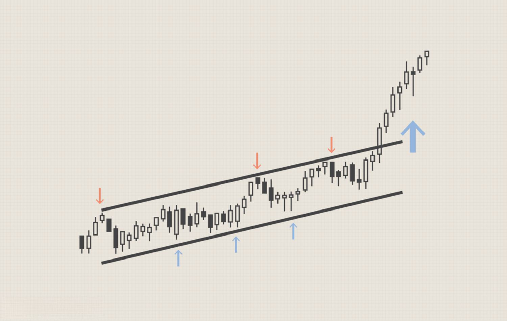

## Table of Contents

## What is a price channel in trading?

A price channel in trading is a tool that traders use to understand how a stock or other financial asset is moving. It is made up of two parallel lines on a chart. The top line is called the resistance line, and it shows the highest price the asset usually reaches before it starts to go down again. The bottom line is called the support line, and it shows the lowest price the asset usually reaches before it starts to go up again. Traders draw these lines by looking at past price data and connecting the highs and lows.

Traders use price channels to make decisions about when to buy or sell an asset. If the price of the asset gets close to the top of the channel, it might be a good time to sell because the price might soon start to go down. If the price gets close to the bottom of the channel, it might be a good time to buy because the price might soon start to go up. However, price channels are not perfect and the price can sometimes break out of the channel, which can signal a big change in the trend.

## How is a price channel identified on a chart?

To find a price channel on a chart, you need to look at the price history of the asset. Start by finding the highest points the price reached over time. Connect these high points with a straight line. This line is called the resistance line. Then, find the lowest points the price reached and connect them with another straight line. This line is called the support line. Make sure these two lines are parallel to each other. This creates the price channel.

Once you have drawn the price channel, you can use it to see how the price moves within it. If the price gets close to the top line (resistance), it might be a good time to sell because the price could start going down soon. If the price gets close to the bottom line (support), it might be a good time to buy because the price could start going up soon. But remember, the price doesn't always stay within the channel. Sometimes it breaks out, which can mean a big change in the trend.

## What are the different types of price channels?

There are mainly three types of price channels that traders use: ascending, descending, and horizontal. An ascending channel is when the price is going up over time. You draw the bottom line by connecting the higher lows and the top line by connecting the higher highs. Traders might see this as a good time to buy because the price keeps getting higher. A descending channel is the opposite. It's when the price is going down over time. You draw the top line by connecting the lower highs and the bottom line by connecting the lower lows. Traders might see this as a good time to sell because the price keeps getting lower.

The third type is a horizontal channel, also called a trading range. This happens when the price stays between two flat lines. The top line is where the price stops going up, and the bottom line is where the price stops going down. Traders can use this to buy near the bottom and sell near the top. Each type of channel helps traders understand how the price is moving and make decisions about buying or selling. But remember, the price can sometimes break out of the channel, which can mean a big change in the trend.

## What is the significance of the upper and lower boundaries of a price channel?

The upper boundary of a price channel, called the resistance line, is important because it shows the highest price that an asset usually reaches before it starts to go down again. Traders watch this line closely. When the price gets close to the resistance line, it might be a good time to sell because the price could soon start dropping. If the price goes above the resistance line, it might mean that the price is going to keep going up, and this could be a signal for traders to buy.

The lower boundary of a price channel, called the support line, is also very important. It shows the lowest price that an asset usually reaches before it starts to go up again. Traders pay attention to this line too. When the price gets close to the support line, it might be a good time to buy because the price could soon start rising. If the price goes below the support line, it might mean that the price is going to keep going down, and this could be a signal for traders to sell. Both boundaries help traders make decisions about when to buy or sell an asset.

## How can traders use price channels to make trading decisions?

Traders can use price channels to help them decide when to buy or sell an asset. When the price of an asset gets close to the top of the channel, which is called the resistance line, it might be a good time to sell. This is because the price often goes down after it hits the resistance line. If the price goes above the resistance line, it could mean the price will keep going up, so traders might want to buy.

On the other hand, when the price gets close to the bottom of the channel, which is called the support line, it might be a good time to buy. This is because the price often goes up after it hits the support line. If the price goes below the support line, it could mean the price will keep going down, so traders might want to sell. By watching how the price moves within the channel, traders can make better decisions about when to trade.

## What are the common strategies for trading within a price channel?

One common strategy for trading within a price channel is called the "bounce" strategy. Traders using this strategy watch the price as it moves up and down within the channel. When the price gets close to the bottom of the channel, which is the support line, traders might buy the asset. They expect the price to bounce back up towards the top of the channel. When the price gets close to the top of the channel, which is the resistance line, traders might sell the asset. They expect the price to bounce back down towards the bottom of the channel. This strategy works well when the price stays within the channel and keeps bouncing between the support and resistance lines.

Another strategy is called the "breakout" strategy. Traders using this strategy watch for the price to break out of the channel. If the price goes above the resistance line, it might mean the price will keep going up. Traders might buy the asset when they see this breakout, hoping to make money as the price rises. If the price goes below the support line, it might mean the price will keep going down. Traders might sell the asset when they see this breakout, hoping to avoid losing money as the price falls. This strategy can be riskier because breakouts don't always lead to big price changes, but they can also lead to big profits if the trader is right.

## How does a breakout from a price channel signal potential trading opportunities?

When the price of an asset breaks out of a price channel, it can signal a big change in the trend. If the price goes above the top line of the channel, called the resistance line, it might mean the price will keep going up. Traders see this as a chance to buy the asset. They hope to make money as the price rises. This is called a bullish breakout. It's like the price is breaking free from the channel and starting a new upward trend.

On the other hand, if the price goes below the bottom line of the channel, called the support line, it might mean the price will keep going down. Traders see this as a chance to sell the asset. They want to avoid losing money as the price falls. This is called a bearish breakout. It's like the price is breaking free from the channel and starting a new downward trend. Both types of breakouts can give traders a chance to make money if they act quickly and correctly.

## What are the key indicators used in conjunction with price channels for better analysis?

Traders often use other indicators along with price channels to get a better understanding of the market. One common indicator is the moving average. This is a line on the chart that shows the average price of the asset over a certain time. Traders can use a moving average to see if the price is trending up or down. If the price is above the moving average, it might be a good sign that the price will keep going up. If the price is below the moving average, it might be a good sign that the price will keep going down. By looking at the moving average along with the price channel, traders can make better decisions about when to buy or sell.

Another useful indicator is the Relative Strength Index (RSI). The RSI measures how fast the price is going up or down and tells traders if the asset is overbought or oversold. If the RSI is above 70, it means the asset might be overbought and the price could soon go down. If the RSI is below 30, it means the asset might be oversold and the price could soon go up. Traders can use the RSI to confirm what they see in the price channel. For example, if the price is near the top of the channel and the RSI is over 70, it might be a good time to sell. If the price is near the bottom of the channel and the RSI is under 30, it might be a good time to buy. Using the RSI with the price channel can help traders make more accurate predictions about the market.

## How can historical price channel data be used to predict future market movements?

Traders can use historical price channel data to help predict future market movements by looking at how the price moved in the past. They draw price channels on historical charts and see how the price bounced between the support and resistance lines. If the price stayed within the channel for a long time, it might mean that the price will keep doing the same thing in the future. Traders can use this information to decide when to buy or sell. For example, if the price always went up after hitting the support line in the past, traders might expect it to do the same thing again and buy when the price gets close to the support line.

Another way to use historical price channel data is to look for patterns in breakouts. If the price broke out of the channel in the past and started a new trend, traders might expect the same thing to happen again. They can look at how often breakouts happened and what happened after them. If breakouts usually led to big price changes, traders might be more confident in trading on a breakout. By studying historical data, traders can get a better idea of what might happen in the future and make more informed trading decisions.

## What are the limitations and potential pitfalls of relying on price channels for trading?

Price channels can be useful for trading, but they have some limitations. One big problem is that they are based on past prices, and the future might not be the same. Just because the price stayed in the channel before doesn't mean it will keep doing that. Sometimes the price can break out of the channel in a way that surprises traders, and they might lose money if they're not ready for it. Also, drawing the lines for the channel can be a bit tricky. Different traders might draw the lines in different places, and this can lead to different predictions about what the price will do next.

Another issue is that price channels don't take into account other things that can affect the price, like news or big events. For example, if a company announces something important, the price might jump out of the channel even if it looked like it was going to stay inside. Traders who only look at the price channel might miss these other factors and make bad decisions. So, while price channels can be helpful, it's important for traders to use them along with other tools and information to get a fuller picture of what might happen next.

## How do different market conditions affect the reliability of price channels?

Different market conditions can change how well price channels work. In a market that's moving up and down a lot, called a volatile market, price channels might not be very reliable. The price can jump out of the channel more often, making it hard for traders to predict what will happen next. On the other hand, in a market that's not moving much, called a stable market, price channels can be more useful. The price is more likely to stay inside the channel, so traders can use it to make better guesses about when to buy or sell.

Another thing that can affect price channels is how much trading is happening, called market volume. If there's a lot of trading, the price might break out of the channel more easily because there are more people buying and selling. This can make the channel less reliable. But if there's not much trading, the price might stay inside the channel more often, making the channel a better tool for traders. So, traders need to think about the market conditions and how much trading is happening when they use price channels to make decisions.

## What advanced techniques can be applied to enhance the effectiveness of price channel analysis?

One advanced technique to make price channel analysis better is to use multiple time frames. Traders can look at the price channel on different charts, like a daily chart and a weekly chart. This can help them see the bigger picture and smaller details at the same time. If the price is moving in the same direction on both charts, it might be a stronger sign that the trend will continue. This can help traders feel more confident about their decisions.

Another technique is to combine price channels with other technical indicators, like the Moving Average Convergence Divergence (MACD) or the Bollinger Bands. The MACD can help traders see if the price is gaining or losing momentum, which can confirm what the price channel is showing. Bollinger Bands can show how much the price is moving around, and if it's getting too high or too low. By using these other indicators along with the price channel, traders can get a fuller picture of what's happening in the market and make better trading decisions.

## References & Further Reading

[1]: Bergstra, J., Bardenet, R., Bengio, Y., & Kégl, B. (2011). ["Algorithms for Hyper-Parameter Optimization."](https://dl.acm.org/doi/10.5555/2986459.2986743) Advances in Neural Information Processing Systems 24.

[2]: ["Advances in Financial Machine Learning"](https://www.amazon.com/Advances-Financial-Machine-Learning-Marcos/dp/1119482089) by Marcos Lopez de Prado

[3]: ["Evidence-Based Technical Analysis: Applying the Scientific Method and Statistical Inference to Trading Signals"](https://www.amazon.com/Evidence-Based-Technical-Analysis-Scientific-Statistical/dp/0470008741) by David Aronson

[4]: ["Machine Learning for Algorithmic Trading"](https://github.com/stefan-jansen/machine-learning-for-trading) by Stefan Jansen

[5]: ["Quantitative Trading: How to Build Your Own Algorithmic Trading Business"](https://www.amazon.com/Quantitative-Trading-Build-Algorithmic-Business/dp/1119800064) by Ernest P. Chan