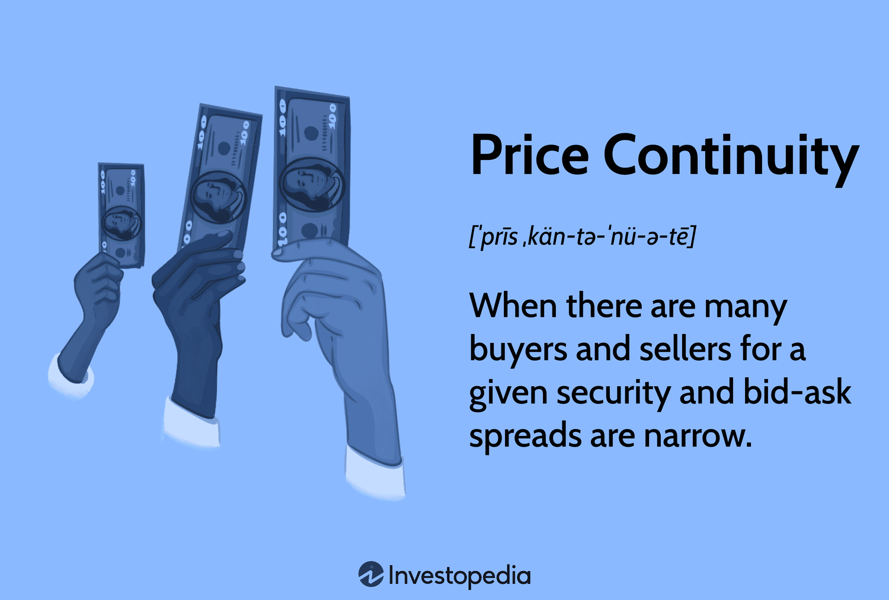

## Table of Contents

## What is price continuity in financial markets?

Price continuity in financial markets refers to the smooth and orderly movement of prices over time. It means that the price of a financial asset, like a stock or a bond, changes in a way that makes sense and doesn't jump around too much. For example, if a stock was trading at $100 yesterday, you would expect it to be around that price today, maybe a little higher or lower, but not suddenly at $150 without a good reason.

This concept is important because it helps investors feel confident in the market. If prices were to change wildly and unpredictably, it would be hard for people to make decisions about buying and selling. Price continuity helps create a stable environment where people can plan their investments better. It's like driving on a smooth road instead of a bumpy one; it's easier and more predictable.

## Why is price continuity important for traders and investors?

Price continuity is important for traders and investors because it helps them make better decisions. When prices move smoothly and predictably, it's easier for people to understand what's happening in the market. If a stock's price is jumping around a lot, it can be confusing and scary. But if the price is moving in a steady way, traders and investors can feel more confident about when to buy or sell. This makes it easier to plan and manage their money.

Another reason price continuity matters is that it helps keep the market fair. If prices were to change wildly, it could give some people an unfair advantage. For example, if someone knew that a stock's price was about to jump suddenly, they could make a lot of money quickly, while others might lose money because they didn't know about the jump. But when prices move smoothly, everyone has a better chance to react and make decisions based on the same information. This helps create a level playing field where everyone can participate fairly.

## How does price continuity affect market liquidity?

Price continuity helps make the market more liquid. Liquidity means how easy it is to buy or sell something without the price changing a lot. When prices move smoothly, more people feel comfortable trading. They know they can buy or sell at a price that makes sense, so they are more likely to do it. This means more people are trading, which makes the market more liquid.

If prices were jumping around a lot, it could scare people away from trading. They might be afraid to buy or sell because they don't know what the price will be in the next moment. When fewer people are trading, it's harder to find someone to buy or sell to, which makes the market less liquid. So, price continuity helps keep the market active and easy to trade in.

## What are the common indicators used to measure price continuity?

One common indicator used to measure price continuity is the bid-ask spread. This is the difference between the highest price someone is willing to pay for a stock (the bid) and the lowest price someone is willing to sell it for (the ask). When the bid-ask spread is small, it means the price is moving smoothly and there is good price continuity. A big spread can mean the price is jumping around more, which shows less price continuity.

Another indicator is the [volatility](/wiki/volatility-trading-strategies) of the stock. Volatility measures how much the price of a stock goes up and down over time. If a stock's price is moving a lot, it has high volatility, which can mean less price continuity. If the price is staying pretty steady, it has low volatility, which shows good price continuity. Traders and investors often look at these indicators to understand how smoothly prices are moving in the market.

## Can you explain the concept of a continuous market versus a call market?

A continuous market is like a busy store that's always open. In this kind of market, you can buy and sell things whenever you want. The prices can change all the time because people are always trading. It's like a big, ongoing auction where the price of a stock can go up or down based on what people are willing to pay or sell for at any moment. This is what most people think of when they think about stock markets, like the New York Stock Exchange or NASDAQ.

A call market, on the other hand, is like a special event where everyone comes together at a set time to trade. Instead of trading all day, people only trade at specific times, like once a day or once a week. During these times, everyone puts in their orders to buy or sell, and then a single price is set that works for everyone. This price is called the "call price." After the call, trading stops until the next call time. Call markets are less common but can be used for things like opening and closing auctions on some stock exchanges.

## How do different types of orders (market, limit, stop) impact price continuity?

Different types of orders can affect how smoothly prices move in the market. A market order is when someone wants to buy or sell a stock right away at the best price available. This can cause the price to jump if there aren't enough people on the other side of the trade. For example, if a lot of people suddenly want to sell a stock using market orders, the price can drop quickly because there might not be enough buyers at the current price. This can make the price less smooth and more jumpy.

Limit orders and stop orders can help keep prices more steady. A limit order is when someone says they want to buy or sell a stock, but only at a certain price or better. This can help keep the price from moving too much because it sets a limit on how far the price can go before the trade happens. A stop order is when someone wants to buy or sell a stock if it reaches a certain price. This can help stop big price jumps by making sure people can get out of a trade if the price starts moving too much in one direction. Both types of orders can help make the market more stable and keep prices moving smoothly.

## What role do market makers play in maintaining price continuity?

Market makers are like helpers in the stock market. Their job is to make sure there are always people ready to buy or sell stocks. When someone wants to buy or sell a stock, market makers step in to make the trade happen smoothly. They do this by always showing prices at which they are willing to buy (the bid) and sell (the ask) stocks. This helps keep the market moving smoothly because there's always someone ready to trade.

By doing this, market makers help keep prices from jumping around too much. If the price of a stock starts to move too quickly, market makers can step in to buy or sell and help bring the price back to a more normal level. This makes the market feel more stable and predictable for everyone. So, market makers play a big role in making sure prices move in a smooth and orderly way.

## How do high-frequency trading and algorithmic trading influence price continuity?

High-frequency trading ([HFT](/wiki/high-frequency-trading-strategies)) and [algorithmic trading](/wiki/algorithmic-trading) can affect how smoothly prices move in the market. These types of trading use computers to buy and sell stocks very quickly, sometimes in just a few seconds. Because they trade so fast, they can cause prices to change a lot in a short time. If many high-frequency traders are buying or selling at the same time, it can make the price of a stock jump up or down quickly. This can make the market feel less smooth and more unpredictable for other traders and investors.

On the other hand, high-frequency and algorithmic trading can also help keep prices moving smoothly. These traders often use their fast computers to watch the market closely and step in to buy or sell when prices start to move too much. By doing this, they can help keep the price from jumping around too much. So, while these types of trading can sometimes make prices less smooth, they can also help keep things steady if they are used the right way.

## What are the regulatory measures in place to ensure price continuity?

Regulators have rules to help keep prices moving smoothly in the market. One important rule is about the bid-ask spread. They make sure that the difference between the price someone is willing to buy a stock for and the price someone is willing to sell it for isn't too big. This helps keep the price from jumping around too much. Another rule is about circuit breakers. These are like emergency stops that kick in if the price of a stock starts moving too fast. They give everyone a chance to take a break and think before trading starts again, which can help keep the market calm.

Regulators also keep an eye on high-frequency trading and algorithmic trading. They have rules to make sure these fast traders don't cause too much trouble. For example, they might require these traders to wait a little bit before they can cancel their orders. This helps stop them from making the price jump around too much. By watching over these kinds of trading, regulators can help make sure the market stays smooth and fair for everyone.

## How does price continuity vary across different financial instruments like stocks, bonds, and commodities?

Price continuity can be different for stocks, bonds, and commodities because each of these things has its own way of trading. Stocks usually have a lot of people buying and selling them all the time, which helps keep their prices moving smoothly. But sometimes, if there's big news or a lot of people want to buy or sell at the same time, the price of a stock can jump around. Bonds are a bit different because they don't trade as often as stocks. This can make their prices less smooth because there might not be as many people ready to buy or sell at any given time. When someone does want to trade a bond, the price might have to move a lot to find someone on the other side of the trade.

Commodities, like gold or oil, can also have different levels of price continuity. Some commodities are traded a lot, so their prices can be pretty smooth. But others might not be traded as often, which can make their prices jump around more. Also, things like weather or big news can cause the price of commodities to change quickly. So, while stocks might have smoother prices because they're traded a lot, bonds and commodities can be less smooth because they might not have as many people trading them all the time.

## What are the challenges in maintaining price continuity during market stress or volatility?

Keeping prices moving smoothly during times when the market is stressed or very jumpy can be hard. When a lot of people are worried or excited about something, they might all want to buy or sell at the same time. This can make the price of a stock, bond, or commodity go up or down a lot very quickly. It's like trying to drive smoothly on a road full of potholes. The more people trying to trade at the same time, the harder it is to keep the price from jumping around.

To help with this, market makers and regulators try their best to keep things calm. Market makers step in to buy or sell when the price starts moving too much, trying to bring it back to a normal level. Regulators have rules like circuit breakers that can stop trading for a little bit if the price is moving too fast. But even with these helpers, it can still be tough to keep prices smooth when everyone is trying to trade at once. It's like trying to keep a boat steady in a storm; it's not easy, but they do their best to make sure the market stays fair and orderly.

## How can advanced statistical models be used to predict and analyze price continuity?

Advanced statistical models can help predict and understand how smoothly prices move in the market. These models look at a lot of data, like past prices and how much people are trading, to guess what might happen next. They can find patterns that are hard for people to see just by looking at the numbers. For example, a model might notice that the price of a stock usually moves smoothly unless there's big news, and then it can predict how the price might react to new information. By using these models, traders and investors can get a better idea of when prices might jump around and when they might stay steady.

These models can also help figure out what's causing prices to move smoothly or not. They can look at things like how many people are trading, what kind of orders they're using, and even what's happening in the world that might affect the market. By understanding these things, the models can help explain why prices are moving the way they are. This can be really useful for people who want to make smart decisions about buying and selling. It's like having a smart friend who can look at a lot of information and help you understand what's going on in the market.

## References & Further Reading

[1]: Bergstra, J., Bardenet, R., Bengio, Y., & Kégl, B. (2011). ["Algorithms for Hyper-Parameter Optimization."](https://dl.acm.org/doi/10.5555/2986459.2986743) Advances in Neural Information Processing Systems 24.

[2]: ["Advances in Financial Machine Learning"](https://www.amazon.com/Advances-Financial-Machine-Learning-Marcos/dp/1119482089) by Marcos Lopez de Prado

[3]: ["Evidence-Based Technical Analysis: Applying the Scientific Method and Statistical Inference to Trading Signals"](https://www.amazon.com/Evidence-Based-Technical-Analysis-Scientific-Statistical/dp/0470008741) by David Aronson

[4]: ["Machine Learning for Algorithmic Trading"](https://github.com/stefan-jansen/machine-learning-for-trading) by Stefan Jansen

[5]: ["Quantitative Trading: How to Build Your Own Algorithmic Trading Business"](https://www.amazon.com/Quantitative-Trading-Build-Algorithmic-Business/dp/1119800064) by Ernest P. Chan