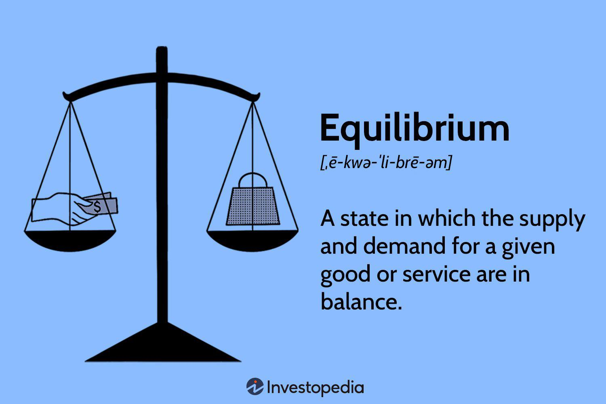

The world of financial markets is vast and complex, characterized by numerous elements that influence their operation. Key amongst these is price continuity, a crucial factor ensuring the efficient functionality of markets. Price continuity refers to the smooth transition from one price to another, minimizing the degree of sudden changes and thus reducing trading risks. This stability is vital for market participants, as it enables informed decision-making and enhances trader confidence. 

In stock trading and algorithmic trading (often referred to as algo trading), price continuity plays an integral role. Stock trading relies heavily on price continuity to maintain liquidity and market stability. It ensures that stocks can be traded at prices that accurately reflect market conditions, even amidst the potential for drastic economic events. Meanwhile, algorithmic trading employs computer algorithms to execute trades rapidly and accurately, thereby supporting price continuity. It helps maintain narrow bid-ask spreads by adjusting trades in real-time according to market conditions. This synergy between technological advancement and trading practices promises enhanced efficiency and effectiveness within financial markets.

The continuous evolution of financial technology and algorithms has fundamentally transformed trading practices, offering tools and methods to maintain market stability more efficiently. Keeping pace with these technological advancements is not just beneficial but essential for those involved in trading or investing. A clear understanding of the dynamics of price continuity and the application of advanced algorithms is crucial for navigating today's sophisticated and fast-paced financial markets. The interplay between these elements defines much of the contemporary financial landscape, underscoring the need for continued learning and adaptation to succeed.

## Table of Contents

## Understanding Price Continuity

Price continuity is a fundamental characteristic of an efficient financial market, indicating a relatively small bid-ask spread. This narrow spread is emblematic of a liquid market where assets can be traded quickly with minimal impact on their prices. In such markets, there is a sufficient number of buyers and sellers to uphold stable pricing over time, thereby facilitating seamless and efficient trading practices.

Price continuity plays a vital role in enabling quick transactions by matching buyers and sellers without resulting in substantial price changes. This feature is integral to efficient price discovery, which in turn helps maintain the overall integrity of the market and bolsters confidence among participants. For example, when traders know they can enter or exit positions without causing significant price movements, they are more likely to engage actively in the market.

Various factors can influence the bid-ask spread and consequently the level of price continuity. Liquidity levels, for instance, can cause spreads to widen or narrow; higher liquidity typically correlates with narrower spreads. Conversely, systemic events such as government defaults or significant announcements by major corporations can disrupt price continuity, leading to temporarily wider spreads. During such events, market participants may become uncertain about the asset's future value, prompting a reevaluation of their positions and potentially causing volatility.

Understanding the dynamics of price continuity is crucial for participants who aim to navigate financial markets effectively. It highlights the importance of [liquidity](/wiki/liquidity-risk-premium) and the potential market movements associated with external influences, which can temporarily disrupt even the most stable markets.

## The Importance of Price Continuity in Stock Trading

Price continuity serves as a linchpin for effective stock trading, fostering conditions that allow trades to occur at prices reflective of current market conditions. This characteristic is key for enabling traders to make informed choices without the anxiety of unpredictable and abrupt price swings. In an environment with robust price continuity, the bid and ask prices do not display large discrepancies, ensuring a more predictable and stable market operation.

The assurance of price continuity enhances trading volumes and liquidity within the stock market. When market participants are confident that their trades will execute at predictable prices, their willingness to trade increases. This scenario creates a positive feedback loop where increased trading activity further enhances liquidity, making it easier to execute larger trades without causing significant price movements.

During periods of financial instability, the role of price continuity becomes even more pronounced. Markets with strong price continuity can better absorb shocks, preventing extreme [volatility](/wiki/volatility-trading-strategies) that could lead to investor panic and irrational decision-making. For instance, during economic downturns or in the aftermath of unexpected geopolitical events, the presence of price continuity can mitigate adverse impacts by allowing markets to adjust gradually rather than in erratic leaps.

For traders, identifying stocks that exhibit good price continuity is a critical aspect of risk management and strategy optimization. Stocks with narrow bid-ask spreads and consistent trading patterns offer a degree of predictability and lower transaction costs, crucial for both short-term and long-term trading strategies. This predictability helps traders avoid the risks associated with price gaps, reducing the likelihood of entering or exiting positions at unfavorable prices.

In summary, price continuity is indispensable in stock trading, ensuring smoother market operations and creating an environment conducive to higher liquidity and trading volumes. By minimizing sudden price changes, it supports market stability, especially during turbulent periods, and helps traders refine their trading strategies to manage risks effectively.

## Algorithmic Trading and its Role in Price Continuity

Algorithmic trading, commonly referred to as algo trading, utilizes sophisticated algorithms to execute trades based on predetermined conditions. The automation inherent in algo trading significantly reduces the need for human intervention, allowing for trades to be conducted at a greater speed and precision. This optimizes market efficiencies by ensuring that trades are executed at optimal times, leveraging micro-second decisions that are typically beyond human capability. 

One of the primary ways algo trading aids in maintaining price continuity is through its ability to automatically adapt to market conditions. By consistently monitoring market data, algorithms can adjust trading strategies in real-time, thus helping to keep bid-ask spreads stable and mitigate abrupt price jumps. This capability is crucial for minimizing manual errors and bias, thereby enhancing the overall reliability and stability of the market.

Furthermore, algorithms can backtest trading strategies against historical data, enabling a predictive model of market trends. This [backtesting](/wiki/backtesting) function helps traders to verify the effectiveness of their strategies and refine them as needed to maintain price continuity. By ensuring that trades are executed under the most favorable conditions, algo trading supports the efficient functioning of financial markets.

However, while algo trading brings significant benefits in terms of speed and efficiency, it does not come without its challenges. The system requires diligent monitoring and governance to prevent and mitigate systemic risks, particularly during unforeseen events that can induce market volatility. In instances where market conditions change rapidly, algorithms might contribute to erratic behavior or flash crashes if not properly regulated and supervised.

Therefore, while [algorithmic trading](/wiki/algorithmic-trading) plays an essential role in supporting price continuity, it relies on a balance between technological advantages and prudent oversight. This ensures that the market benefits from the efficiency and accuracy of algo trading while minimizing potential disruptions.

## Challenges and Regulations in Maintaining Price Continuity

Maintaining price continuity in financial markets presents several challenges, particularly during periods of market disruption. Regulatory measures are crucial in addressing these challenges to prevent extreme volatilities that can disrupt market stability.

One of the key regulatory tools for preserving price continuity is the implementation of circuit breakers. Circuit breakers temporarily halt trading on an exchange when prices move too quickly in either direction within a short period. For instance, if a stock's price moves beyond a pre-determined threshold, trading may be paused to allow investors time to reassess information and curb panic selling or buying. This mechanism can help maintain orderly market conditions and protect against sharp declines or spikes that could impair price continuity.

Exchanges commonly enforce daily price limits to restrict how much a security's price can change in a single day. These limits are designed to prevent excessive volatility that might hinder price continuity. By capping price movements, these rules aim to create a buffer against irrational market behavior and ensure that price changes remain within reasonable bounds. For example, futures markets may impose upper and lower limits on price changes that, when breached, trigger a temporary halt until the next trading session.

The introduction of such regulations is a proactive step to stabilize markets, especially during periods of considerable volatility. By pausing trading during unusually turbulent times, these mechanisms provide a cooling-off period for market participants, allowing for more measured decision-making. Understanding these regulatory frameworks is crucial for traders and institutions. Compliance not only ensures adherence to legal standards but also aids in strategic planning, preserving the stability essential for efficient trading.

For traders and market participants, staying informed about the types of regulations and how they operate is critical. Adapting trading strategies to incorporate these rules can help mitigate risks associated with price discontinuities. Moreover, maintaining a robust awareness of potential market-moving events and their potential impact on price continuity is vital for long-term trading success. By balancing technological advancements in trading with appropriate regulatory measures, market stability can be safeguarded, fostering confidence among market participants.

## Conclusion

Price continuity is a fundamental aspect of efficient financial markets, ensuring that trading occurs under smooth and fair conditions. It reflects a market's ability to facilitate transactions with minimal interruptions, thereby promoting stability and confidence among market participants. Algorithmic trading plays a pivotal role in reinforcing this continuity. By harnessing advanced technology, it allows for the swift and precise execution of trades, minimizing the risks of disparities in pricing and enhancing overall market efficiency.

Understanding the dynamic relationship between price continuity and algorithmic trading is essential for traders and financial institutions. This knowledge enables them to optimize their strategies and maintain competitiveness. As technological innovations in trading continue to evolve, they offer increased efficiency but also present new challenges. Therefore, maintaining a balance with proper regulatory oversight is imperative to preserve market integrity and prevent systemic risks.

Staying educated about these dynamics is critical for success in the modern trading landscape. The continuous advancement in trading technologies and strategies necessitates that market participants remain informed and adaptive. By doing so, they can effectively navigate the complexities of today's financial markets and secure their positions in this highly competitive environment.

## Frequently Asked Questions (FAQs)

### What is the key difference between price continuity and volatility?

Price continuity and volatility are distinct concepts in financial markets. Price continuity refers to the market's ability to have minimal bid-ask spreads and stable prices, indicating a liquid and efficient market. It ensures that trades are executed with minimal price gaps. In contrast, volatility measures the extent of price fluctuations within a market over time. High volatility indicates large price changes, while low volatility suggests smaller, more gradual price movements. Therefore, a market with high price continuity typically experiences lower volatility, enhancing market stability and investor confidence.

### How does algorithmic trading contribute to price continuity?

Algorithmic trading plays a significant role in supporting price continuity by executing trades according to pre-defined algorithms, thereby minimizing human intervention and errors. Its key contribution lies in its ability to quickly adapt to market conditions, ensuring that trades are executed efficiently and in response to changes. Algorithms can monitor vast amounts of market data in real-time, maintaining tight bid-ask spreads and optimizing price discovery. By doing so, algorithmic trading aids in sustaining a stable trading environment that reflects true market conditions, thus enhancing price continuity.

### What are circuit breakers and how do they help maintain price continuity?

Circuit breakers are regulatory mechanisms employed by stock exchanges to temporarily halt trading during excessive volatility. Activated during significant market downturns, these mechanisms provide a "cooling-off" period, allowing market participants to assess information and make informed decisions without panic. For instance, in the U.S., the NYSE employs circuit breakers that pause trading at specific percentage drops in the S&P 500 index. By stabilizing short-term volatility spikes, circuit breakers play a crucial role in maintaining price continuity, reducing the likelihood of erratic trading and sudden price swings.

### Is algo trading suitable for all types of markets?

Algorithmic trading is highly effective in high-liquidity and well-regulated markets like major stock exchanges, where large volumes and fast executions are typical. However, its suitability diminishes in markets with low liquidity or irregular trading patterns, such as certain emerging or over-the-counter (OTC) markets. In these environments, algorithmic trading may exacerbate price discontinuities due to limited data and unpredictable market participant behaviors. Therefore, while valuable, algo trading must be employed with caution and adapted to the specific characteristics of the market in which it operates.

### What measures can traders take to minimize risks related to price discontinuities?

To mitigate risks associated with price discontinuities, traders can implement several strategies:

- **Diversification**: By holding a diversified portfolio, traders can reduce exposure to single-asset volatility.
- **Stop-Loss Orders**: These orders automatically sell a security when it reaches a certain price, limiting potential losses.
- **Liquid Instruments**: Focusing on trading highly liquid assets can minimize the impact of price gaps and ensure smoother execution.
- **Volatility Monitoring**: Using tools and indicators to monitor market volatility can help traders anticipate and react to potential disruptions.
- **Market Regulations**: Staying informed about regulatory frameworks, such as circuit breakers, assists in understanding how and when market interventions may occur.

Through these measures, traders can better navigate periods of instability and maintain more consistent trading outcomes.

## References & Further Reading

[1]: Bergstra, J., Bardenet, R., Bengio, Y., & Kégl, B. (2011). ["Algorithms for Hyper-Parameter Optimization."](https://dl.acm.org/doi/10.5555/2986459.2986743) Advances in Neural Information Processing Systems 24.

[2]: ["Advances in Financial Machine Learning"](https://www.amazon.com/Advances-Financial-Machine-Learning-Marcos/dp/1119482089) by Marcos Lopez de Prado

[3]: ["Evidence-Based Technical Analysis: Applying the Scientific Method and Statistical Inference to Trading Signals"](https://www.amazon.com/Evidence-Based-Technical-Analysis-Scientific-Statistical/dp/0470008741) by David Aronson

[4]: ["Machine Learning for Algorithmic Trading"](https://github.com/stefan-jansen/machine-learning-for-trading) by Stefan Jansen

[5]: ["Quantitative Trading: How to Build Your Own Algorithmic Trading Business"](https://www.amazon.com/Quantitative-Trading-Build-Algorithmic-Business/dp/1119800064) by Ernest P. Chan