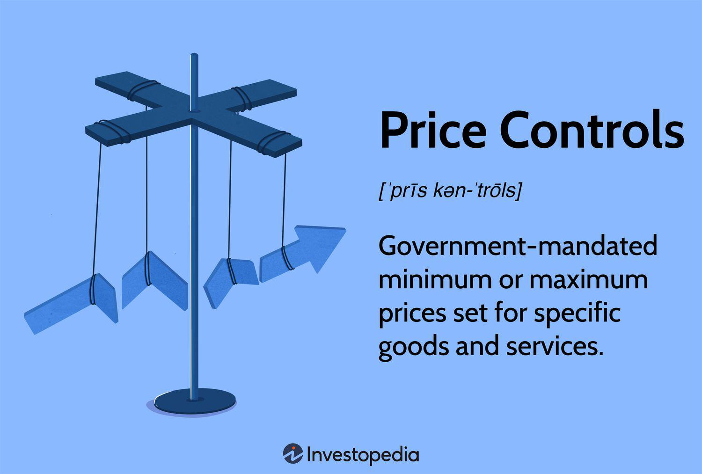

## Table of Contents

## What are price controls?

Price controls are rules set by the government to limit how much a product or service can cost. They can set a maximum price, called a price ceiling, to keep things affordable for people. Or they can set a minimum price, called a price floor, to make sure sellers get enough money for what they sell. Governments use price controls to help people during tough times, like when prices go up a lot or when there's not enough of something to go around.

But price controls can also cause problems. If the government sets a price ceiling too low, sellers might not want to sell as much because they can't make enough money. This can lead to shortages, where there's not enough of the product for everyone who wants it. On the other hand, if the government sets a price floor too high, it might be hard for buyers to afford the product, and there could be a surplus, where there's too much of the product and it doesn't all get sold. So, while price controls can help in some ways, they need to be used carefully to avoid creating new problems.

## What are the main types of price controls?

The main types of price controls are price ceilings and price floors. A price ceiling is when the government sets a maximum price that sellers can charge for a product or service. This is often done to make sure that important things, like food or medicine, stay affordable for everyone, especially during emergencies or when prices are going up a lot.

A price floor, on the other hand, is when the government sets a minimum price that sellers must charge. This is usually done to protect sellers, like farmers, by making sure they get paid enough for what they produce. It helps to keep their businesses going even when the market price might be too low.

Both types of price controls can have good and bad effects. Price ceilings can help people afford things they need, but if set too low, they can lead to shortages because sellers might not want to sell at that price. Price floors can help sellers make enough money, but if set too high, they can lead to surpluses because buyers might not be able to afford the product at that price.

## Can you provide examples of price ceilings?

One example of a price ceiling is rent control. Some cities have laws that say landlords can't charge more than a certain amount for rent. This is to help people afford a place to live, especially in big cities where rent can be very high. But if the rent is too low, landlords might not want to fix up their buildings or might even sell them, which can make it hard to find a good place to rent.

Another example is during a big storm or a crisis, like a hurricane. The government might set a price ceiling on things like water or gas. They do this so people can still buy these important things without paying too much. But if the price is too low, stores might run out of water or gas quickly because everyone wants to buy it, and it can be hard to get more in time.

## Can you provide examples of price floors?

One example of a price floor is the minimum wage. Governments set a minimum amount that employers have to pay workers. This is to make sure people earn enough money to live on. But if the minimum wage is too high, some businesses might not be able to afford to hire as many workers, which can lead to fewer jobs.

Another example is in farming, where the government might set a price floor for crops like wheat or milk. This helps farmers by making sure they get paid enough for what they grow. But if the price is too high, people might not want to buy as much, and there could be a lot of leftover wheat or milk that doesn't get sold.

## How do price ceilings affect the market?

Price ceilings set a limit on how high the price of something can go. When the government puts a price ceiling in place, it's usually trying to keep things affordable for people. For example, if there's a big storm and the price of water goes up a lot, a price ceiling can stop people from having to pay too much. But if the price ceiling is set too low, sellers might not want to sell as much because they can't make enough money. This can lead to shortages, where there's not enough of the product for everyone who wants it.

For instance, if the government says the most someone can charge for rent is $1,000 a month, but it costs more to keep the building running, landlords might not want to rent out their places. They might even sell their buildings or not fix them up. This means fewer places for people to live, and the ones that are available might not be in good shape. So, while price ceilings can help people afford things, they can also cause problems like not having enough of what people need.

## How do price floors impact the market?

Price floors set a minimum price that sellers can charge for their products. Governments use price floors to help sellers make enough money, especially when prices are too low. For example, the minimum wage is a price floor that makes sure workers earn enough to live on. But if the minimum wage is too high, some businesses might not be able to afford to hire as many workers. This can lead to fewer jobs, which means some people might not be able to find work.

Another example of a price floor is in farming. The government might set a minimum price for crops like wheat or milk to help farmers. This makes sure farmers get paid enough for what they grow. But if the price is too high, people might not want to buy as much. This can lead to a surplus, where there's too much wheat or milk that doesn't get sold. So, while price floors can help sellers, they can also cause problems like having too much of a product that no one wants to buy.

## What are the advantages of implementing price controls?

Price controls can help people during tough times. When prices go up a lot, like during a big storm or when there's not enough of something, the government can set a price ceiling to keep things affordable. This means people can still buy what they need without spending too much money. For example, if the price of gas goes up a lot, a price ceiling can help people keep driving to work or school.

Price controls can also help sellers, like farmers, by setting a price floor. This makes sure they get paid enough for what they grow, even when prices are low. This can help them keep their farms running and take care of their families. So, price controls can be good for both buyers and sellers by making sure important things stay affordable and that people who sell them can make a living.

## What are the disadvantages of price controls?

Price controls can cause problems in the market. If the government sets a price ceiling too low, sellers might not want to sell as much because they can't make enough money. This can lead to shortages, where there's not enough of the product for everyone who wants it. For example, if the price of rent is too low, landlords might not want to fix up their buildings or might even sell them, making it hard for people to find a good place to live.

On the other hand, if the government sets a price floor too high, it can be hard for buyers to afford the product. This can lead to a surplus, where there's too much of the product and it doesn't all get sold. For instance, if the price of wheat is too high, people might not want to buy as much, and farmers might end up with a lot of wheat that goes to waste. So, while price controls can help in some ways, they can also create new problems if they're not used carefully.

## How do price controls influence consumer behavior?

Price controls can change how people buy things. When the government sets a price ceiling, it means the price of something can't go above a certain amount. This makes things cheaper for people, so they might buy more of it. For example, if the price of gas is kept low, people might drive more because it's cheaper to fill up their cars. But if the price is too low, there might not be enough gas for everyone, and people might have to wait in long lines or go without.

On the other hand, when the government sets a price floor, it means the price of something can't go below a certain amount. This makes things more expensive for people, so they might buy less of it. For example, if the price of milk is kept high, people might not buy as much milk or might switch to cheaper options like water. This can lead to a lot of milk that doesn't get sold, and farmers might have to throw it away. So, price controls can make people change what they buy and how much they buy.

## What are the long-term economic effects of price controls?

Price controls can have big effects on the economy over a long time. If the government keeps prices low with a price ceiling, it might seem good at first because people can afford things. But if prices stay too low, sellers might not want to sell as much. This can lead to not having enough of what people need, like food or medicine. Over time, this can make it hard for businesses to make money, and they might close down or stop making the product. This can hurt the economy because fewer things are being made and sold.

On the other hand, if the government keeps prices high with a price floor, it can help sellers make enough money. But if prices stay too high, people might not want to buy as much. This can lead to having too much of something, like extra crops that farmers can't sell. Over time, this can make it hard for people to afford what they need, and it can waste resources. This can also hurt the economy because money and goods are not being used in the best way. So, while price controls can help in the short term, they can cause big problems in the long run if they're not used carefully.

## How do governments enforce price controls?

Governments use different ways to make sure price controls work. They might make rules that say how much someone can charge for something. They can check stores and businesses to see if they are following these rules. If a store charges too much, the government might give them a fine or even take them to court. They can also tell people about the price controls through the news or on the internet, so everyone knows what the rules are.

Sometimes, governments work with businesses to make sure they follow the price controls. They might talk to big companies and ask them to keep their prices at the right level. If a lot of people are not following the rules, the government might change the laws to make them stricter. This helps make sure that the price controls do what they are supposed to do, like keeping things affordable for people or making sure sellers get paid enough.

## What are some historical case studies of price controls and their outcomes?

During World War II, the United States used price controls to stop prices from going up too much. The government set price ceilings on things like food, gas, and rent. This helped people afford what they needed during the war. But it also caused problems. Some sellers didn't want to sell at the low prices, so there were shortages. People had to wait in long lines to buy things like sugar and meat. After the war, the government slowly took away the price controls, and prices went back to normal.

In Venezuela, the government started using price controls in the early 2000s to help people afford things. They set price ceilings on many things like food and medicine. At first, it seemed to help because things were cheaper. But over time, it caused big problems. Sellers didn't want to sell at the low prices, so there were huge shortages. Stores ran out of food and medicine, and people had to wait in long lines or go without. The economy got worse, and many businesses closed down. This shows that price controls can help in the short term but can cause big problems if they last too long.

## References & Further Reading

[1]: Lipsey, R. G., & Lancaster, K. (1956). ["The General Theory of Second Best."](https://www.jstor.org/stable/2296233) The Review of Economic Studies, 24(1), 11-32.

[2]: Friedman, M. (1974). ["A Theoretical Framework for Monetary Analysis"](https://www.jstor.org/stable/1830684). National Bureau of Economic Research.

[3]: ["Price Ceilings and Floors: Economics in Context"](https://pressbooks-dev.oer.hawaii.edu/principlesofeconomics/chapter/3-4-price-ceilings-and-price-floors/) by Neva Goodwin (Journal of Economic Education)

[4]: Shiller, R. J. (2000). ["Irrational Exuberance."](https://press.princeton.edu/books/paperback/9780691173122/irrational-exuberance) Princeton University Press.

[5]: Farmer, J. D., & Geanakoplos, J. (2008). ["The Virtues and Vices of Equilibrium and the Future of Financial Economics."](https://onlinelibrary.wiley.com/doi/abs/10.1002/cplx.20261) Cowles Foundation Discussion Paper No. 1665.

[6]: Harris, L. (2003). ["Trading and Exchanges: Market Microstructure for Practitioners."](https://academic.oup.com/book/52292) Oxford University Press.

[7]: Ticknor, J. L. (2013). ["A Bayesian Regularized Artificial Neural Network for Stock Market Forecasting."](https://www.sciencedirect.com/science/article/pii/S0957417413002509) IEEE Transactions on Neural Networks and Learning Systems, 24(4), 578-584.