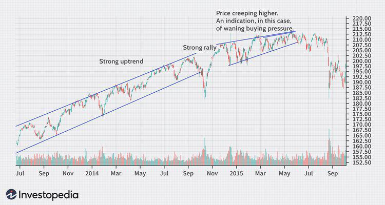

Inflation, economic trends, price creep, and algorithmic trading are increasingly interconnected influences shaping the modern financial landscape. Understanding these dynamics is essential for investors and traders aiming to optimize their strategies and manage risks effectively. Inflation, representing the rate at which the general level of prices for goods and services rises, directly impacts purchasing power and can significantly alter financial markets. For instance, as inflation rates rise, central banks may adjust interest rates, affecting asset prices and currency valuations.

Economic trends, including shifts in demand and supply, technological advances, and geopolitical developments, further complicate the financial milieu. These trends can instigate price creep— a gradual and steady increase in asset prices. While sometimes indicative of a healthy market, price creep can also result in overvaluation and subsequent market corrections if not closely monitored.



Algorithmic trading emerges as a pivotal tool, leveraging computational algorithms to execute trades based on predefined criteria and comprehensive economic data analysis. This trading method hinges on sophisticated models that often incorporate macroeconomic variables, including inflation indices, to make informed trading decisions. The integration of real-time data, machine learning models, and backtesting processes empowers traders to enhance their decision-making capabilities in rapidly changing environments.

This article explores how these elements interact and the implications for financial markets, providing readers with insights into improving trading efficacy. By understanding these concepts and their relationships, investors and traders can better navigate the complexities of the financial world, optimize their strategies, and ultimately achieve superior financial outcomes.

## Table of Contents

## Understanding Inflation and Its Economic Impact

Inflation represents the rate at which the general level of prices for goods and services rises over time, leading to a decrease in the purchasing power of money. This fundamental economic concept impacts both consumers and policymakers. By eroding purchasing power, inflation influences consumer behavior, savings, investments, and can ultimately shape economic growth. Central banks, such as the Federal Reserve in the United States or the European Central Bank in the Eurozone, strive to control inflation levels to maintain economic stability and prevent deflation, which can lead to reduced consumer spending and hinder economic progress.

There are three primary types of inflation that economists typically reference: demand-pull inflation, cost-push inflation, and built-in inflation. Demand-pull inflation occurs when aggregate demand in an economy outpaces aggregate supply, leading to upward pressure on prices. This can result from factors like increased consumer spending or expansive fiscal policies. Cost-push inflation, on the other hand, arises when the costs of production rise, causing producers to pass on these higher costs to consumers in the form of increased prices. This can be due to rising wages or expensive raw materials. Built-in inflation, also known as wage-price inflation, is where higher wages lead to increased production costs, which in turn contribute to higher prices, perpetuating a cycle.

Several factors contribute to inflationary pressures, including an increased supply of money, which can occur when central banks set lower interest rates or implement quantitative easing policies. A surge in demand, often driven by economic growth or governmental stimulus, can also contribute to inflation. Additionally, rising production costs, such as wages and commodity prices, exert upward pressure on prices across an economy.

Inflation directly affects financial markets through its influence on asset prices, interest rates, and currency values. Higher inflation usually leads to an increase in interest rates as central banks attempt to curb inflationary trends, thus affecting the cost of borrowing and the return on savings. This, in turn, can lead to [volatility](/wiki/volatility-trading-strategies) in bond and equity markets as investors adjust their expectations for future earnings and [interest rate](/wiki/interest-rate-trading-strategies) changes. Additionally, inflation can depreciate a country's currency, affecting exchange rates and international trade competitiveness.

Understanding inflation and its multifaceted impact on economic systems is crucial for investors, policymakers, and businesses as they navigate the complexities of financial markets and strive to mitigate the risks associated with inflationary pressures.

## What is Price Creep?

Price creep is characterized by the gradual and steady increase in the valuation or market price of an asset over time. This phenomenon is often propelled by the acceptance of higher prices by both consumers and investors. Such tolerance can manifest in various sectors, impacting both consumer goods and financial markets alike.

In consumer goods, price creep occurs when consumers gradually adapt to paying higher prices, often due to inflationary pressures or an increase in production costs. As manufacturers and retailers adjust prices upward, consumers' readiness to accept these increments can validate and sustain higher price levels over time.

In financial markets, price creep is observed as the persistent increase in the valuations of stocks and other financial assets. This can be advantageous in driving asset appraisals upward. However, it poses the risk of overvaluation, where asset prices exceed their intrinsic value, creating potential for future market corrections. Such corrections can occur when investors recognize that prices have surpassed justifiable levels, prompting a sell-off that reverts valuations to more realistic levels.

Price creep in the financial sector could also reflect waning buying pressure. When asset prices increase slowly, it can indicate that while buyers are still present, their enthusiasm may be diminishing. This scenario can foreshadow potential market reversals if staying power deteriorates further, leading to reduced demand and possible price declines.

Understanding price creep's implications is essential for market participants, as it requires vigilance in evaluating whether rising prices genuinely reflect underlying value or signal a disproportion leading to future volatility. Analyzing consumer behavior, market conditions, and economic indicators becomes pivotal in discerning the sustainability of price trends and preparing for potential market adjustments.

## Algorithmic Trading: A Game Changer

Algorithmic trading utilizes computational algorithms to execute trades based on predefined criteria, leveraging economic data to optimize trading decisions. This method is transforming financial markets by enabling rapid execution and minimizing human error. A crucial component of successful [algorithmic trading](/wiki/algorithmic-trading) strategies is understanding the impact of inflation, which can influence asset prices and market volatility.

Inflation metrics, such as Consumer Price Index (CPI) and Producer Price Index (PPI), often serve as essential macroeconomic variables within algorithmic models. By incorporating these indices, traders can anticipate market movements and adjust their strategies accordingly. This approach allows for informed decision-making, reflecting broader economic conditions.

The effectiveness of algorithmic trading hinges on the integration of real-time and historical data, enabling models to react swiftly to market changes. Historical data provides a foundation for understanding market dynamics, while real-time data ensures responsiveness to current conditions. Advanced [machine learning](/wiki/machine-learning) models enhance these processes by identifying patterns and making predictions beyond traditional statistical methods.

Backtesting is critical for validating algorithmic strategies. It involves simulating the algorithm on historical data to assess its performance before deployment in live markets. This step helps in understanding potential risks and refining the strategy to avoid overfitting, where a model performs well on training data but lacks generalizability to new data.

For instance, a simple Python algorithm could involve using the Moving Average Convergence Divergence (MACD) indicator alongside CPI data to make trading decisions:

```python
import pandas as pd
import numpy as np

# Load historical market and CPI data
market_data = pd.read_csv('market_data.csv')
cpi_data = pd.read_csv('cpi_data.csv')

# Calculate MACD
short_window = 12
long_window = 26
signal_window = 9

market_data['EMA12'] = market_data['Close'].ewm(span=short_window, adjust=False).mean()
market_data['EMA26'] = market_data['Close'].ewm(span=long_window, adjust=False).mean()
market_data['MACD'] = market_data['EMA12'] - market_data['EMA26']
market_data['Signal'] = market_data['MACD'].ewm(span=signal_window, adjust=False).mean()

# Incorporate CPI data to adjust strategy
market_data = market_data.merge(cpi_data, on='Date', how='left')

def trading_signal(row):
    if row['MACD'] > row['Signal'] and row['CPI'] < row['CPI'].shift(1):
        return 'buy'
    elif row['MACD'] < row['Signal'] and row['CPI'] > row['CPI'].shift(1):
        return 'sell'
    return 'hold'

market_data['Signal'] = market_data.apply(trading_signal, axis=1)

# Iterate over signals to simulate trading actions
for index, row in market_data.iterrows():
    if row['Signal'] == 'buy':
        print(f"Buying on {row['Date']} at {row['Close']}")
    elif row['Signal'] == 'sell':
        print(f"Selling on {row['Date']} at {row['Close']}")
```

This code snippet demonstrates the basic structure for integrating economic data into a trading algorithm. By continuously refining these models with updated data and advanced learning techniques, traders can enhance their ability to navigate market complexities effectively.

## Incorporating Inflation Data into Algo Trading Strategies

Algorithmic traders leverage inflation metrics, such as the Consumer Price Index (CPI), to strategically position themselves in anticipation of market shifts. The CPI is a key indicator that reflects the average change in prices paid by consumers for goods and services and is widely used to gauge inflationary trends in an economy. By meticulously analyzing CPI data, traders can develop strategies that optimize their responses to these economic signals.

One common approach is pre-release positioning. In this strategy, traders analyze historical CPI announcements and their subsequent market impacts to establish positions before the official release of new CPI data. This approach requires an in-depth understanding of market patterns and potential reactions to predicted CPI values. For example, if historical data suggests that a higher-than-expected CPI leads to market sell-offs, traders may choose to short certain assets in anticipation of a similar outcome.

Immediate execution post-announcement is another strategy, where trades are executed right after the CPI figures are made public. This requires high-frequency trading algorithms capable of processing complex data in milliseconds. The goal is to capitalize on the immediate volatility that typically follows CPI announcements. These algorithms need to be equipped not only to interpret the raw CPI data but also to integrate it with other concurrent market signals.

Risk management adjustments based on CPI surprises are crucial for maintaining a robust trading strategy. CPI surprises occur when actual numbers differ significantly from market expectations, leading to abrupt market movements. To navigate this volatility, traders must incorporate dynamic risk management protocols that adjust leverage, stop-loss limits, and take-profit levels instantaneously. This adaptive approach ensures that potential losses are minimized while maximizing profit opportunities during sudden market shifts.

Backtesting is an essential component of algorithmic trading strategies that incorporate CPI data. By simulating historic market conditions and CPI-based trades using past data, traders can determine the viability and effectiveness of their strategies over time. This process involves adjusting parameters and refining models to improve accuracy and performance, ensuring that they remain effective under various market conditions. Backtesting reduces the risk of overfitting by exposing potential pitfalls and validating the strategy's robustness.

Consider the following simplified Python example to illustrate [backtesting](/wiki/backtesting) a CPI-based trading strategy:

```python
import numpy as np
import pandas as pd

# Simulated CPI data and a simple trading function
cpi_data = pd.Series(np.random.normal(0.3, 0.1, 100))  # Simulated monthly CPI changes
market_returns = pd.Series(np.random.normal(0.01, 0.05, 100))  # Simulated market returns

def trade_strategy(cpi_change):
    if cpi_change > 0.4:  # Threshold for triggering a sell-off
        return -1  # Short position
    elif cpi_change < 0.2:  # Threshold for triggering a rally
        return 1  # Long position
    else:
        return 0  # No action

# Backtest the strategy
positions = cpi_data.apply(trade_strategy)
strategy_returns = positions.shift(1) * market_returns

# Evaluate strategy performance
cumulative_returns = (1 + strategy_returns).cumprod() - 1
print("Cumulative Returns:", cumulative_returns[-1])
```

This example creates a hypothetical scenario where CPI changes influence market positioning. The strategy is then backtested to compute returns, showcasing the importance of data-driven decision-making in algorithmic trading. Continual refinement of such strategies is necessary to ensure they adapt to evolving market conditions and maintain their effectiveness.

## The Role of AI and Machine Learning in Trading

AI and machine learning have significantly reshaped trading methodologies. Advanced algorithms enable AI-driven trading systems to analyze vast arrays of inflation data and market reactions with remarkable precision and speed, bridging the gap between human analysis and automated trading executions.

AI bots employ data acquisition techniques to gather both historical and real-time data, which serves as a foundation for sophisticated sentiment analysis. This involves parsing financial news, social media discussions, and economic reports to gauge market sentiment. By interpreting shifts in sentiment, trading systems can anticipate market movements and react accordingly, thus enhancing strategic decision-making.

Machine learning models play a pivotal role in AI trading systems by adapting to evolving market conditions. By training models on diverse datasets, these systems can identify patterns and correlations that may not be immediately evident. For instance, regression models or neural networks can predict price movements based on input variables such as inflation rates, interest rates, and other macroeconomic indicators. Below is an example of a simple linear regression model in Python that illustrates how a trading system might predict asset prices based on inflation data:

```python
from sklearn.linear_model import LinearRegression
import numpy as np

# Example data: inflation rates and corresponding asset prices
inflation_rates = np.array([[1.5], [2.0], [2.5], [3.0], [3.5]])
asset_prices = np.array([100, 102, 104, 107, 110])

# Initialize and train the linear regression model
model = LinearRegression().fit(inflation_rates, asset_prices)

# Predict asset price for a given inflation rate
predicted_price = model.predict(np.array([[2.8]]))
print(f"Predicted asset price for 2.8% inflation: {predicted_price[0]}")
```

Risk management and backtesting are crucial to ensuring AI trading systems remain effective. Risk management involves implementing measures such as stop-loss orders and dynamic asset allocation to mitigate potential losses. Backtesting, on the other hand, involves assessing trading strategies against historical data to evaluate performance and adjust strategies for future application. By rigorously testing and refining models, traders can avoid overfitting, which occurs when a model excessively tailors itself to historical data and loses predictive accuracy in new scenarios.

Incorporating AI and machine learning into trading strategies enables a responsive system capable of making informed decisions instantaneously, adapting to market changes, and consistently optimizing performance. As financial markets continue to evolve, the integration of these technologies is set to become even more integral to trading frameworks.

## Practical Implications and Case Studies

The Consumer Price Index (CPI) serves as a valuable metric for algorithmic trading strategies, particularly through the identification and exploitation of market trends, pairs trading, and mean reversion strategies. CPI-based algo trading leverages the predictable patterns associated with inflation data releases to optimize trade decisions. This section outlines practical examples and case studies that emphasize the effectiveness of incorporating inflation data into algorithmic trading and the necessity for adaptability in strategy execution.

### Exploiting Market Trends

One approach to CPI-based algo trading involves using inflation data to anticipate interest rate changes, which can significantly influence market trends. For example, if the CPI indicates a higher-than-expected inflation rate, traders might anticipate an interest rate hike by central banks, leading to a potential increase in bond yields and a decrease in stock valuations. By programming algorithms to respond to these CPI-based signals, traders can capitalize on expected bullish or bearish market movements.

### Pairs Trading and Mean Reversion Strategies

Pairs trading involves taking long and short positions in a pair of highly correlated financial instruments, expecting them to return to their mean price difference. CPI announcements can lead to temporary deviations in correlated asset prices, thus presenting an opportunity for pairs trading. For instance, if a CPI surprise affects the [forex](/wiki/forex-system) market, one might trade pairs like EUR/USD versus GBP/USD, leveraging the transient volatility to realize profits.

Mean reversion strategies similarly benefit from CPI data by assuming that prices will return to their average levels after an inflation-driven shock. Traders can employ mean reversion strategies by identifying assets that diverge from historical CPI-adjusted price patterns and executing trades to capture the subsequent corrective movement.

### Adapting to Market Conditions

Algorithmic trading strategies must dynamically adjust to factors such as market volatility, [liquidity](/wiki/liquidity-risk-premium), and regulatory changes to remain effective. 

#### Example: Handling Volatility

An algorithm designed to trade on CPI data must incorporate volatility indicators to manage risk during extreme market fluctuations. This could involve setting adaptive stop-loss orders or using volatility-adjusted position sizing techniques to mitigate potential losses.

#### Python Example: Volatility Adjustment

```python
def adjust_position_size(capital, volatility, risk_factor):
    base_size = capital * risk_factor
    adjusted_size = base_size / volatility
    return max(adjusted_size, min_position_size)

capital = 100000
volatility = calculate_volatility(market_data)
risk_factor = 0.02
min_position_size = 100

position_size = adjust_position_size(capital, volatility, risk_factor)
print("Adjusted Position Size:", position_size)
```

### Case Studies and Continuous Evaluation

Historical case studies underscore the need for continuous evaluation and refinement of algorithmic strategies. For instance, the 2013 "taper tantrum" in the U.S. highlighted how unexpected economic news can disrupt algorithmic models reliant on consistent market conditions. Following such events, successful traders reassessed and modified their algorithms to better account for unforeseen macroeconomic shifts.

Continuous learning through backtesting and adaptive modeling ensures that trading algorithms can navigate changing financial landscapes effectively. By regularly integrating new data and refining models, algorithmic systems remain robust against the evolving nature of global markets.

In conclusion, utilizing CPI data in algorithmic trading offers significant strategic advantages. However, the ability to adapt to market volatility and regulatory developments remains critical for maintaining competitiveness and achieving consistent trading success.

## Conclusion

Inflation, price creep, and algorithmic trading are pivotal in shaping the current financial market dynamics. Understanding and integrating these elements into trading strategies offer distinct advantages. Incorporating Consumer Price Index (CPI) data, a key inflation metric, into trading frameworks enables traders to anticipate market movements and make informed decisions. By aligning strategies with CPI data, traders can better predict inflationary trends and adjust their positions accordingly to exploit potential opportunities or mitigate risks.

Continuous learning and adaptation are crucial to thriving in the evolving economic landscape. Market conditions change rapidly, influenced by various factors such as geopolitical events, economic policies, and technological advancements. Systems that adapt to these changes through continuous optimization and integration of new data will maintain resilience. For instance, algorithmic trading models must be consistently backtested and refined to prevent inefficiencies and overfitting.

Traders can enhance their decision-making processes and improve financial outcomes by effectively leveraging insights from inflation trends, monitoring price creep tendencies, and utilizing algorithmic trading tools. This strategic approach provides a framework for navigating the complex and volatile nature of global financial markets, ensuring robust performance and sustainable growth in the long term.

## References & Further Reading

[1]: ["Advances in Financial Machine Learning"](https://www.amazon.com/Advances-Financial-Machine-Learning-Marcos/dp/1119482089) by Marcos Lopez de Prado

[2]: ["Machine Learning for Algorithmic Trading"](https://github.com/stefan-jansen/machine-learning-for-trading) by Stefan Jansen

[3]: ["Quantitative Trading: How to Build Your Own Algorithmic Trading Business"](https://www.amazon.com/Quantitative-Trading-Build-Algorithmic-Business/dp/1119800064) by Ernest P. Chan

[4]: ["Algorithmic and High-Frequency Trading"](https://www.cambridge.org/us/universitypress/subjects/mathematics/mathematical-finance/algorithmic-and-high-frequency-trading) by Álvaro Cartea, Sebastian Jaimungal, and José Penalva

[5]: Taylor, A. M., & Cunado, J. (2000). ["The Predictive Content of the CPI for Industrial Output: Evidence from a Panel of European Economies."](https://pmc.ncbi.nlm.nih.gov/articles/PMC8326922/) Journal of Macroeconomics, 22(4), 679-705.