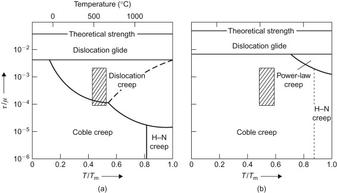

## Table of Contents

## What is price creep?

Price creep is when the price of something slowly goes up over time. It's like when you keep adding a little more money to the cost of an item or a service, but you do it so slowly that people might not notice right away. For example, if a magazine subscription starts at $10 a month and goes up by $1 every year, that's price creep.

This can happen with things like cable bills, gym memberships, or even the cost of your favorite snack at the grocery store. Companies might do this to make more money without making big changes that would upset their customers. It's a way for them to increase their prices without people getting too mad about it.

## How does price creep differ from inflation?

Price creep and inflation are different but can seem similar. Price creep happens when a company slowly raises the price of something over time. It's like adding a little more money to the cost bit by bit. This can happen with things like your phone bill or the price of a candy bar. The company does this to make more money without making big changes that might upset people.

Inflation, on the other hand, is when the prices of most things in an economy go up over time. It's not just one company doing it; it's happening everywhere. Inflation can make the money you have worth less because you need more of it to buy the same things. It's like if everything in the store costs a bit more each year. So, while price creep is about one company or product, inflation is about the whole economy.

## What are the common causes of price creep?

Price creep often happens because companies want to make more money. They might slowly raise the price of their product or service so that customers don't notice right away. This can be easier than making a big price jump all at once, which might make people upset and stop buying. For example, a streaming service might add a small fee each year, hoping that people will keep paying without thinking too much about it.

Another reason for price creep is the cost of making things going up. If it costs more for a company to make their product, they might slowly raise the price to cover those costs. This can happen with things like raw materials getting more expensive or wages going up. Instead of raising the price all at once, the company might do it little by little so that customers get used to the new price over time.

## Can you provide examples of price creep in everyday products?

Price creep can happen with things you buy every day, like snacks. Imagine you like a certain brand of chips. At first, the bag costs $2. Over time, the price goes up a little bit each year. One year it's $2.10, then $2.20, and so on. You might not notice right away because the change is small, but after a few years, you're paying a lot more for the same bag of chips.

Another example is your monthly subscription services, like a music streaming app. You start with a plan that costs $10 a month. Each year, the company adds a small fee, maybe $0.50 or $1. They might say it's to cover new features or costs. Over time, you're paying $12 or $13 a month without really thinking about it. This slow increase is price creep, and it's how companies can make more money without making big changes that might upset you.

## How do businesses implement price creep without losing customers?

Businesses use price creep by making small price increases over time. They do this so that customers don't notice the change right away. For example, if a gym membership goes up by $1 every year, people might not think much about it. They keep going to the gym because the increase is small, and they're used to paying the old price. This way, the business can make more money without making a big change that might make people leave.

Another way businesses do this is by adding small fees to services. Think about a streaming service that adds a small fee each year for "improved features." They might say it's to cover the cost of new movies or better quality. Customers might not mind paying a little more if they feel they're getting something extra. This slow increase helps the business make more money without losing customers who might be upset by a big price jump all at once.

## What psychological factors contribute to the success of price creep?

One big reason price creep works is because people get used to things slowly changing. If the price of something goes up a little bit at a time, people might not notice right away. They keep buying the product or using the service because the change is small. It's like if you slowly turn up the heat in a room, people might not feel it right away and will stay comfortable. This slow change helps businesses raise prices without making customers upset.

Another reason is that people often focus on the value they get from a product or service, not just the price. If a company adds a small fee but also says they're adding new features or improving quality, people might think it's worth it. They feel like they're getting more for their money, even if the price is going up. This makes them less likely to stop using the product or service, which helps the business keep making more money over time.

## How can consumers detect price creep?

Consumers can detect price creep by keeping an eye on their regular expenses. If you buy the same things every month, like groceries or subscriptions, you can compare the prices over time. For example, if you notice that your favorite cereal has gone up by a few cents every few months, that's price creep. You can do this by saving receipts or using apps that track your spending.

Another way to spot price creep is by being aware of small fee increases in services you use. If your phone bill or streaming service goes up by a dollar or two each year, that's a sign of price creep. Companies might say it's for new features or better service, but it's still a slow increase in price. By staying alert and checking your bills regularly, you can catch these small changes before they add up to a lot more money.

## What are the long-term effects of price creep on the economy?

Price creep can have big effects on the economy over time. When companies slowly raise prices, it can make things more expensive for everyone. If lots of businesses do this, it can lead to higher costs for everyday things like food and services. This can make people feel like they have less money to spend because they need more of it to buy the same things. Over time, this can slow down the economy because people might not buy as much, which can hurt businesses and lead to less growth.

On the other hand, price creep can also help businesses stay profitable without making big changes that might upset customers. If companies can slowly raise prices to cover their costs, they might be able to keep making their products or offering their services. This can help keep the economy stable because businesses can keep running and people can keep their jobs. But if price creep gets too high, it can still cause problems by making things too expensive for people to afford, which can lead to bigger economic issues.

## How do regulatory bodies address or monitor price creep?

Regulatory bodies keep an eye on price creep to make sure companies aren't doing anything unfair. They look at how prices change over time and check if companies are raising prices too much or too often. If they find that a company is using price creep in a way that hurts customers, they might step in. They can do things like make the company lower its prices or pay a fine. This helps keep prices fair and stops companies from taking advantage of people.

Sometimes, regulatory bodies also work with other groups to study how price creep affects the economy. They might do research to see if slow price increases are making things too expensive for people. If they find that price creep is causing big problems, they can suggest new rules or laws to help control it. This way, they can protect consumers and make sure the economy stays healthy.

## What strategies can businesses use to manage price creep ethically?

Businesses can manage price creep ethically by being open with their customers about why prices are going up. If they need to raise prices because it costs more to make their product or offer their service, they should explain this clearly. They can tell customers about the small price increases ahead of time and give them a good reason for it, like better quality or new features. This way, customers feel respected and understand the changes, which can help keep them happy and loyal.

Another way businesses can handle price creep ethically is by making sure the price increases are fair and not too big. They should only raise prices a little bit at a time and make sure it's not more than what's needed to cover their costs. If they can, they might also offer different price options or discounts to help customers who might find the new prices hard to afford. By being fair and thoughtful, businesses can keep their customers and still make a profit without causing problems.

## How does price creep affect different market segments?

Price creep can affect different groups of people in different ways. For people who don't have a lot of money, even small price increases can make a big difference. They might have to spend less on other things they need, like food or bills, just to keep buying the same products or services. This can make life harder for them because they have less money to go around. On the other hand, people with more money might not notice these small price changes as much. They can still afford to buy the things they want without having to change their spending habits.

Different types of businesses also feel the effects of price creep differently. Big companies might use price creep to slowly make more money without losing customers. They can do this because they have a lot of customers and can spread out the small price increases over many people. Smaller businesses, though, might find it harder to use price creep. If they raise their prices, even a little bit, they might lose customers to bigger companies that can keep their prices lower. This can make it tough for small businesses to stay competitive and make enough money to keep going.

## What are the global variations in the application and impact of price creep?

Price creep happens all over the world, but it can be different in each country. In places where people have more money, like in rich countries, businesses might use price creep more because people can still afford to buy things even if the price goes up a little. But in poorer countries, even small price increases can make a big difference. People might have to stop buying certain things if they get too expensive, which can hurt businesses and the economy.

The way governments and rules work also changes how price creep happens around the world. In some countries, there are strict rules about how much prices can go up and how often. This can stop companies from using price creep too much. In other places, there might not be many rules, so businesses can raise prices more easily. This can lead to bigger problems if prices keep going up and people can't afford things anymore.

## References & Further Reading

[1]: ["Advances in Financial Machine Learning"](https://www.amazon.com/Advances-Financial-Machine-Learning-Marcos/dp/1119482089) by Marcos Lopez de Prado

[2]: ["Machine Learning for Algorithmic Trading"](https://github.com/stefan-jansen/machine-learning-for-trading) by Stefan Jansen

[3]: ["Quantitative Trading: How to Build Your Own Algorithmic Trading Business"](https://www.amazon.com/Quantitative-Trading-Build-Algorithmic-Business/dp/1119800064) by Ernest P. Chan

[4]: ["Algorithmic and High-Frequency Trading"](https://www.cambridge.org/us/universitypress/subjects/mathematics/mathematical-finance/algorithmic-and-high-frequency-trading) by Álvaro Cartea, Sebastian Jaimungal, and José Penalva

[5]: Taylor, A. M., & Cunado, J. (2000). ["The Predictive Content of the CPI for Industrial Output: Evidence from a Panel of European Economies."](https://pmc.ncbi.nlm.nih.gov/articles/PMC8326922/) Journal of Macroeconomics, 22(4), 679-705.