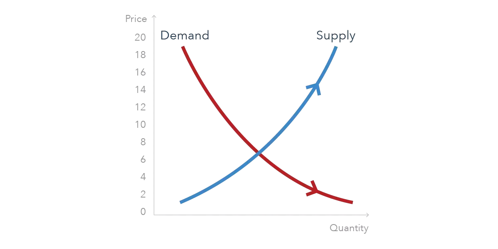

## Table of Contents

## What is the price discovery process?

The price discovery process is how markets figure out what something should cost. It happens when buyers and sellers come together and agree on a price. For example, if you want to sell your old bike, you might start by asking for a high price. If no one wants to buy it at that price, you might lower it until someone agrees to buy it. This back-and-forth helps find the right price that both the buyer and seller are happy with.

In bigger markets, like the stock market, price discovery works the same way but with many more people. Lots of buyers and sellers are trading stocks all the time. The price of a stock goes up when more people want to buy it than sell it, and it goes down when more people want to sell. All these trades help the market find the best price for the stock at that moment. This process keeps happening all the time, making sure the prices stay fair and up-to-date.

## How does the price discovery process work in financial markets?

In financial markets, the price discovery process is how the value of stocks, bonds, and other financial products is figured out. It happens when lots of people want to buy and sell these things. Imagine a big marketplace where everyone is shouting out what they're willing to pay or accept for a stock. If more people want to buy a stock than sell it, the price goes up because buyers have to offer more money to get it. If more people want to sell, the price goes down because sellers have to lower their price to find a buyer. This back-and-forth between buyers and sellers helps find the right price that everyone agrees on.

This process is always happening, every second of the trading day. It's like a never-ending auction where the price keeps changing based on what people are willing to do. The price you see on your screen at any moment is the result of all these people trying to buy and sell. It's important because it makes sure the prices are fair and reflect what's really going on in the market. If something big happens, like a company doing really well or really badly, the price discovery process will quickly adjust the price to match the new information.

## What are the key factors that influence price discovery?

The price discovery process in financial markets is influenced by many things. One big [factor](/wiki/factor-investing) is supply and demand. If more people want to buy something than sell it, the price goes up. If more people want to sell than buy, the price goes down. Another factor is information. When new news comes out about a company, like good earnings or a new product, it can make people want to buy or sell, which changes the price. Also, the overall mood of the market, or market sentiment, can affect prices. If everyone feels good about the economy, prices might go up. If people are worried, prices might go down.

Another important factor is how easy it is to buy and sell, or [liquidity](/wiki/liquidity-risk-premium). If there are lots of buyers and sellers, it's easier to find someone to trade with, and prices can change quickly. If there aren't many people trading, it can be harder to find a good price. Economic indicators, like interest rates and inflation, also play a role. If interest rates go up, borrowing money becomes more expensive, which can affect what people are willing to pay for stocks. Finally, big investors, like hedge funds and institutional investors, can move prices a lot because they trade in large amounts. All these factors together help decide what something is worth in the market.

## How does price discovery differ from valuation?

Price discovery and valuation are two different things, but they are connected. Price discovery is what happens in the market when buyers and sellers come together and agree on a price for something, like a stock. It's like a big auction where everyone is shouting out what they're willing to pay or accept. The price keeps changing until it finds a level where enough people are happy to buy and sell. This process is always happening and helps make sure the price is fair and up-to-date.

Valuation, on the other hand, is when someone tries to figure out what something is really worth, often using math and special formulas. It's like trying to guess the price of a house before you put it on the market. People look at things like how much money a company makes, how fast it's growing, and what similar companies are worth. Valuation is more about using numbers and analysis to come up with a price, while price discovery is about what people in the market actually agree to pay. Even though they're different, valuation can help guide the price discovery process by giving people an idea of what a fair price might be.

## What are the main methods used for valuation?

Valuation is all about figuring out what something is worth, like a company or a stock. One common way to do this is called the Discounted Cash Flow (DCF) method. This method looks at how much money a company is expected to make in the future and then figures out what that money is worth today. It's like saying, "If I know this company will make a lot of money in the future, how much should I pay for it now?" Another method is the Comparable Company Analysis, where you look at similar companies and see what they are worth. If a similar company is worth a certain amount, you might think the company you're looking at should be worth about the same.

Another popular method is the Price-to-Earnings (P/E) ratio. This method compares the price of a stock to how much money the company makes. If a company makes a lot of money and its stock price is low, the P/E ratio will be low, which might mean the stock is a good deal. On the other hand, if the stock price is high compared to the company's earnings, the P/E ratio will be high, which might mean the stock is expensive. Each of these methods helps people come up with a number that they think is a fair price for a company or a stock, but they all have their own way of doing it.

## Can you explain the role of supply and demand in price discovery?

Supply and demand are like the heartbeat of price discovery. Imagine you're at a market trying to sell apples. If you have a lot of apples and not many people want to buy them, you might have to lower your price to sell them all. This is because there's a big supply of apples but not much demand. On the other hand, if you have only a few apples and lots of people want them, you can charge more because the demand is high but the supply is low. In financial markets, it works the same way. If lots of people want to buy a stock (high demand) and not many people want to sell it (low supply), the price of the stock goes up. If more people want to sell a stock than buy it, the price goes down.

This back-and-forth between supply and demand is always happening in the market. It's like a dance where the price keeps moving until it finds a spot where enough people are happy to buy and sell. This spot is called the equilibrium price, and it's where the market thinks the stock is worth at that moment. If something changes, like a company doing really well or really badly, it can shift the supply and demand, and the price will move to a new equilibrium. So, supply and demand are the main forces that help the market figure out what something should cost.

## How do market participants contribute to the price discovery process?

Market participants, like buyers and sellers, are the ones who make price discovery happen. They do this by trading with each other. When someone wants to buy a stock, they might offer a certain price. If someone else wants to sell that stock, they might accept that price or ask for more. This back-and-forth between buyers and sellers helps find a price that everyone agrees on. The more people there are trading, the better the price discovery works because there's more information and more chances for people to agree on a price.

Big investors, like hedge funds and institutional investors, can also have a big impact on price discovery. They trade in large amounts, so when they buy or sell, it can move the price a lot. For example, if a big investor decides to buy a lot of a certain stock, the price might go up because there's more demand. On the other hand, if they decide to sell a lot, the price might go down because there's more supply. All these actions by market participants help the market figure out what something is worth at any given time.

## What are the challenges faced in the price discovery process?

One of the main challenges in the price discovery process is having enough people trading. If there aren't many buyers and sellers, it can be hard to find a fair price. This is called low liquidity. When there's low liquidity, even small trades can move the price a lot, which can make the price discovery process less accurate. Another challenge is getting good information. If people don't know the true value of what they're trading, they might buy or sell at the wrong price. This can happen if there's not enough information or if the information is wrong.

Another issue is when big investors, like hedge funds, can move the market a lot. If they buy or sell a lot of something, it can change the price quickly. This can make it hard for smaller investors to figure out what the fair price should be. Also, sometimes the market can get too excited or too worried, which can push prices away from what they should be. This is called market sentiment, and it can make price discovery harder because it's based more on feelings than on facts.

## How do different market structures affect price discovery?

Different market structures can change how price discovery works. In a centralized market, like a stock exchange, everyone comes together in one place to trade. This makes it easier for buyers and sellers to find each other and agree on a price. Because there are lots of people trading, the price can change quickly to match what everyone thinks something is worth. But in a decentralized market, like a real estate market, it's harder to find a fair price because people are spread out and don't trade as often. This can make price discovery slower and less accurate because there's less information to go on.

Another type of market structure is an over-the-counter (OTC) market, where people trade directly with each other without a central place. In OTC markets, price discovery can be tricky because there might not be as many people trading, so it's harder to find a fair price. Also, electronic markets, where trading happens on computers, can make price discovery faster and more accurate because computers can handle lots of trades quickly. But if the computers mess up or if there's not enough trading, it can still be hard to find the right price. So, the way a market is set up can make a big difference in how well it can figure out what something should cost.

## What advanced techniques are used to enhance price discovery?

One advanced technique to help with price discovery is using algorithms and high-frequency trading. These are like super smart computer programs that can buy and sell things really fast. They look at lots of information and try to find the best price to trade at. This can make the price discovery process faster and more accurate because the computers can handle more trades and information than people can. But sometimes, if too many computers are trading at once, it can make the market move in weird ways, which can make price discovery harder.

Another technique is using data analytics and [machine learning](/wiki/machine-learning). These tools help people look at lots of information about what's happening in the market and what people are doing. They can find patterns and make guesses about what prices might do next. This can help make price discovery better because it gives people more information to work with. But it's important to remember that these tools are not perfect, and they can sometimes make mistakes, so people still need to be careful when using them to figure out prices.

## How can discrepancies between price discovery and valuation be analyzed?

When the price of something in the market doesn't match what people think it should be worth, it's called a discrepancy between price discovery and valuation. This can happen for many reasons. For example, if there's not much trading going on, the market might not have enough information to set the right price. Or, if people are feeling really excited or worried about the market, they might buy or sell at prices that don't make sense based on the numbers. To figure out why this is happening, people can look at how much trading is going on, what news is coming out about the company, and what big investors are doing. They can also use special tools like data analytics to see if there are any patterns that explain the difference.

Another way to analyze these discrepancies is by comparing the market price to different valuation methods. For instance, if the market price is much higher than what the Discounted Cash Flow (DCF) method says it should be, it might mean that people are expecting the company to do better in the future than the numbers suggest. On the other hand, if the market price is lower than what the Price-to-Earnings (P/E) ratio suggests, it could mean that people are worried about the company's future. By looking at these different methods and comparing them to the market price, people can get a better idea of why there's a difference and whether the market price is likely to change to match the valuation.

## What are the implications of efficient price discovery for market stability and investor confidence?

Efficient price discovery is really important for keeping the market stable and making investors feel confident. When prices in the market quickly and accurately show what things are worth, it helps keep everything calm. If prices are fair and based on good information, people are less likely to panic and start selling everything at once, which can cause big problems in the market. This stability makes investors feel safer because they know the prices they see are a good reflection of what's really going on.

On the other hand, when price discovery works well, it also helps investors trust the market more. If they see that prices are moving in a way that makes sense and matches the information they have, they're more likely to keep investing. This trust is important because it keeps money flowing into the market, which helps it grow and stay healthy. So, efficient price discovery is key for both keeping the market steady and making sure investors feel good about putting their money in.

## References & Further Reading

[1]: Fama, E. F. (1970). ["Efficient Capital Markets: A Review of Theory and Empirical Work."](https://www.jstor.org/stable/2325486) Journal of Finance, 25(2), 383-417.

[2]: Harris, L. (2003). ["Trading and Exchanges: Market Microstructure for Practitioners."](https://www.amazon.com/Trading-Exchanges-Market-Microstructure-Practitioners/dp/0195144708) Oxford University Press.

[3]: Hasbrouck, J. (1995). ["One Security, Many Markets: Determining the Contributions to Price Discovery."](https://www.bauer.uh.edu/rsusmel/phd/hasbrouck95.pdf) Journal of Finance, 50(4), 1175-1199.

[4]: Aldridge, I. (2010). ["High-Frequency Trading: A Practical Guide to Algorithmic Strategies and Trading Systems."](https://onlinelibrary.wiley.com/doi/pdf/10.1002/9781119203803.fmatter) Wiley.

[5]: Declerck, F. (2000). ["An Empirical Analysis of the Price Discovery Process in the Regular Session for French Shares."](https://www.semanticscholar.org/paper/Conditionals%3A-A-Comprehensive-Empirical-Analysis-Declerck-Reed/c551d89b2d9188eb956f6d06c2223e4fb812c124) The European Journal of Finance, 6(3), 231-248.