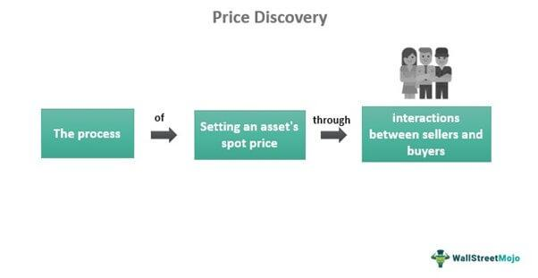

The financial world is complex and dynamic, relying on a multitude of processes to facilitate the valuation and trading of assets. Key among these processes are valuation, price discovery, and algorithmic trading, each serving a distinct yet complementary function within the financial ecosystem.

Valuation serves as the foundation of asset pricing, providing a theoretical framework through which the intrinsic or fair value of an asset is determined. This process often employs established economic models and considers a variety of factors such as earnings, industry conditions, and macroeconomic indicators.



Conversely, price discovery is the mechanism through which the market arrives at an asset's trading price. This is achieved through the interactions of buyers and sellers, who negotiate prices based on real-time supply and demand dynamics.

Algorithmic trading acts as a catalyst within this framework, leveraging sophisticated computer programs to automate and execute trades at speeds and frequencies beyond human capability. By doing so, algorithmic trading enhances market efficiency, swiftly integrating new information into prices and facilitating more rapid price discovery.

Understanding the interaction between these elements is essential for comprehending the complexities of financial markets. Valuation provides the theoretical underpinning upon which trading prices are assessed, price discovery translates theoretical values into actionable price points, and algorithmic trading ensures these processes occur efficiently within an increasingly digitized market landscape. Collectively, they form the backbone of modern financial systems, shaping the way assets are valued and traded globally.

## Table of Contents

## Understanding Valuation and Price Discovery

Valuation and price discovery are essential components in determining how assets are priced within financial markets. Each plays a distinct role in assessing and establishing the value of an asset, contributing to the overall market dynamics.

Valuation is a process that aims to determine the intrinsic or fair value of an asset. This is often done through established economic models and analysis of key indicators. These indicators typically include earnings, which provide insight into a company's profitability and operational efficiency. Additionally, industry conditions are scrutinized to understand competitive positioning and market trends, which can impact future growth prospects. Broader economic factors, such as interest rates, inflation, and GDP growth, are also considered as they can influence discount rates and, consequently, the present value of future cash flows. A common method used in valuation is the Discounted Cash Flow (DCF) approach, which involves forecasting the future cash flows of an asset and discounting them to present value using an appropriate discount rate.

In contrast, price discovery refers to the mechanism through which the market determines the trading price of an asset based on real-time interactions between buyers and sellers. It is inherently dynamic and reflects immediate market sentiment and supply-demand dynamics. Price discovery takes place in various market structures, including stock exchanges and over-the-counter markets, where transactions occur continuously. Key drivers of price discovery include not only tangible factors like [liquidity](/wiki/liquidity-risk-premium) and [volume](/wiki/volume-trading-strategy) but also intangible elements such as investor psychology and risk appetite.

The interplay between valuation and price discovery is vital for market efficiency. While valuation provides a theoretical framework for an asset's value, price discovery incorporates the latest market information and sentiment to determine the actual trading price. Discrepancies between the intrinsic value and market prices can present opportunities for investors to capitalize on mispriced assets. Nevertheless, the effectiveness of price discovery can be influenced by market conditions, trading volume, and the presence of information asymmetry among market participants. 

By understanding both valuation and price discovery, stakeholders can better assess market conditions and make informed investment decisions, which is crucial for maintaining balanced and efficient financial markets.

## The Dynamics of Price Discovery

Price discovery is a crucial process in financial markets, combining an array of factors that collectively determine the trading price of assets. This intricate mechanism involves both tangible elements, such as supply and demand, and intangible factors, like market sentiment and investor risk appetite. The alignment of these variables enables markets to arrive at prices that reflect the underlying value and expectations for an asset.

The process of price discovery is dynamic and varies across different markets and asset types. Factors such as liquidity, transaction costs, and regulatory frameworks play significant roles in shaping how prices are discovered. Liquidity refers to the ease with which assets can be bought or sold in the market without causing significant price changes. High liquidity usually implies more participants and tighter bid-ask spreads, facilitating more efficient price discovery.

Transaction costs, which encompass brokerage fees, taxes, and other expenses associated with trading, also impact price discovery. They can deter trading frequency and influence market participants' decisions, affecting how quickly and efficiently prices are discovered. Regulatory environments further influence price discovery by setting rules that ensure transparency, fairness, and competitiveness in trading activities. Regulations can introduce restrictions or mandates that affect the flow of information and the behavior of market participants.

Historically, price discovery was rooted in physical marketplace transactions where buyers and sellers negotiated prices face-to-face. However, the advent of technology has significantly transformed this process. Electronic trading platforms have replaced traditional open-outcry exchanges, allowing for continuous and instantaneous interaction between market participants over electronic networks. This development has enhanced the speed and efficiency of price discovery, allowing for more rapid incorporation of new information into asset prices.

Algorithmic trading has further revolutionized price discovery by deploying complex algorithms to execute trades at speeds and volumes beyond human capability. These algorithms analyze vast amounts of data, including historical patterns, market trends, and macroeconomic indicators, to make informed trading decisions. By doing so, they enhance market liquidity and reduce price inefficiencies, contributing to a more accurate and swift price discovery process.

In summary, price discovery is a multifaceted process influenced by a broad spectrum of factors, both tangible and intangible. The evolution from traditional market transactions to sophisticated electronic and [algorithmic trading](/wiki/algorithmic-trading) systems has greatly enhanced the efficiency and speed of price discovery, reflecting the ongoing interplay between market forces and technological advances.

## Role of Algorithmic Trading

Algorithmic trading, known as algo trading, involves the utilization of computer programs to execute pre-defined trading strategies at speeds and frequencies that exceed human capability. These strategies often include complex algorithms that can incorporate a variety of inputs, such as historical data patterns, real-time market data, and predictive analytics, to make efficient trading decisions.

The core advantage of algorithmic trading lies in its capacity to enhance market efficiency. Algorithms aid in rapid price discovery by reacting almost instantaneously to fluctuating market conditions, thereby adapting to new information with minimal latency. This capability reduces the time gap between information dissemination and market reaction, thus acting as a key facilitator in the price discovery process.

Algorithms are capable of processing vast quantities of data to detect patterns and trends that may not be immediately evident to human traders. For example, using [machine learning](/wiki/machine-learning) models, algorithms can predict asset price movements based on historical price data, sentiment analysis from news sources, and other relevant market indicators. These predictions then inform buy or sell decisions, which are executed automatically.

Algorithmic trading also significantly influences liquidity and price formation. By executing trades rapidly, algorithms increase the volume of transactions in the market, which enhances liquidity. This heightened liquidity can contribute to narrower bid-ask spreads and more resilient price levels. For instance, market-making algorithms are designed to continuously buy and sell securities to provide liquidity, maintaining tight spreads that facilitate smoother transactions for other market participants.

Moreover, algorithmic trading strategies are diversified, ranging from simple moving averages to complex statistical models. Consider a simple moving average crossover strategy that involves buying when a short-term moving average crosses above a long-term moving average, indicating an upward trend, and selling when the opposite occurs. These types of strategies can be coded in Python as follows:

```python
# Example of a simple moving average crossover strategy
import pandas as pd

def moving_average_crossover(data, short_window=40, long_window=100):
    signals = pd.DataFrame(index=data.index)
    signals['price'] = data['Close']
    signals['short_mavg'] = data['Close'].rolling(window=short_window, min_periods=1).mean()
    signals['long_mavg'] = data['Close'].rolling(window=long_window, min_periods=1).mean()

    # Generate buy signals (1) when short MA crosses above long MA
    signals['signal'] = 0
    signals['signal'][short_window:] = np.where(signals['short_mavg'][short_window:] > signals['long_mavg'][short_window:], 1, 0)

    # Generate trading orders
    signals['positions'] = signals['signal'].diff()

    return signals

# Example data loading and usage of the function would be required to run this
```

Such strategies can be further refined by integrating advanced techniques such as regression analysis, time-series forecasting, or neural networks to construct more sophisticated predictive models that can adapt to evolving market dynamics.

In conclusion, algorithmic trading plays a crucial role in modern financial markets by enhancing efficiency, supporting liquidity, and aiding in precise price discovery. Its implementation across various segments of the market continues to evolve, profoundly impacting how trading is conducted globally.

## Challenges and Considerations

Algorithmic trading, while advancing the efficiency of financial markets, presents several challenges. One major concern is the potential for market manipulation. Algorithmic strategies can be designed to create misleading appearances of trading activity, influencing other market participants to act on false signals. This manipulation can take various forms, such as spoofing, where traders place large orders they do not intend to execute, creating a deceptive impression of supply and demand dynamics.

Another significant challenge is the increased market [volatility](/wiki/volatility-trading-strategies) that algorithmic trading can induce. Algorithms operate at high speeds and frequencies, reacting to market movements in milliseconds. This rapid execution can lead to flash crashes, where sudden, extreme price changes occur within a very short time span. An example includes the Flash Crash of May 6, 2010, which saw the Dow Jones Industrial Average plunge nearly 1,000 points in minutes, mainly attributed to algorithmic trading programs amplifying normal market fluctuations.

Technological risks are inherent in algorithmic trading systems, often due to complex and evolving software environments. System errors or failures can lead to unintended trades or market disruption. For instance, a programming error can introduce flaws in trading strategies, potentially translating into substantial financial losses or operational risks for trading firms.

Price discovery processes are subject to transparency issues, significantly influenced by liquidity and information asymmetry. In scenarios where trading data is not evenly distributed among market participants, the price determination mechanism may reflect inaccuracies, benefiting those with privileged access to information. This asymmetry undermines the equity and transparency crucial to effective price discovery, as some traders might exploit informational advantages.

Regulatory frameworks play a vital role in mitigating these challenges, seeking a balance between nurturing innovation and ensuring market integrity. Regulations aim to curtail manipulation and ensure transparency, often through initiatives such as circuit breakers to prevent extreme volatility and rules on order-to-trade ratios to manage market abuse risks. Policies also enforce stringent reporting and testing requirements for algorithmic trading systems, aiming to protect market participants and maintain trust in financial systems.

In summary, algorithmic trading, while contributing to market efficiency and speed, necessitates careful oversight and management to address concerns related to market manipulation, volatility, technological reliability, and transparency in price discovery. The role of regulation is crucial in maintaining fair and orderly markets, balancing technological advancement with the need for integrity and robustness in financial trading environments.

## Conclusion

Valuation, price discovery, and algorithmic trading form the backbone of today’s financial markets, each with its unique function in asset pricing and trading. Valuation provides a theoretical foundation for understanding an asset's fair value based on economic models and indicators, while price discovery brings this theory into practice, allowing the market to establish an asset's price through interactions of supply and demand and various other market dynamics.

Algorithmic trading, on the other hand, has revolutionized the speed and efficiency with which price discovery can occur. By deploying complex algorithms and leveraging historical data and predictive models, algorithmic trading enables rapid reaction to market conditions, thus significantly influencing liquidity and price formation.

Understanding the interplay between valuation, price discovery, and algorithmic trading is crucial for investors, traders, and regulators. For investors, this knowledge supports more informed investment decisions and risk management strategies. Traders benefit from an enhanced capability to devise strategies that capitalize on market inefficiencies and price movements. Regulators, meanwhile, can better appreciate the need for balanced regulatory frameworks that protect the market's integrity while encouraging technological advancement and market efficiency.

In conclusion, a comprehensive grasp of how valuation, price discovery, and algorithmic trading interact is essential for navigating the complexities of modern financial markets. These elements are intrinsically linked, forming a dynamic framework that ultimately governs asset pricing and trading behavior.

## References & Further Reading

[1]: Fama, E. F. (1970). ["Efficient Capital Markets: A Review of Theory and Empirical Work."](https://www.jstor.org/stable/2325486) Journal of Finance, 25(2), 383-417.

[2]: Harris, L. (2003). ["Trading and Exchanges: Market Microstructure for Practitioners."](https://www.amazon.com/Trading-Exchanges-Market-Microstructure-Practitioners/dp/0195144708) Oxford University Press.

[3]: Hasbrouck, J. (1995). ["One Security, Many Markets: Determining the Contributions to Price Discovery."](https://www.bauer.uh.edu/rsusmel/phd/hasbrouck95.pdf) Journal of Finance, 50(4), 1175-1199.

[4]: Aldridge, I. (2010). ["High-Frequency Trading: A Practical Guide to Algorithmic Strategies and Trading Systems."](https://onlinelibrary.wiley.com/doi/pdf/10.1002/9781119203803.fmatter) Wiley.

[5]: Declerck, F. (2000). ["An Empirical Analysis of the Price Discovery Process in the Regular Session for French Shares."](https://www.semanticscholar.org/paper/Conditionals%3A-A-Comprehensive-Empirical-Analysis-Declerck-Reed/c551d89b2d9188eb956f6d06c2223e4fb812c124) The European Journal of Finance, 6(3), 231-248.