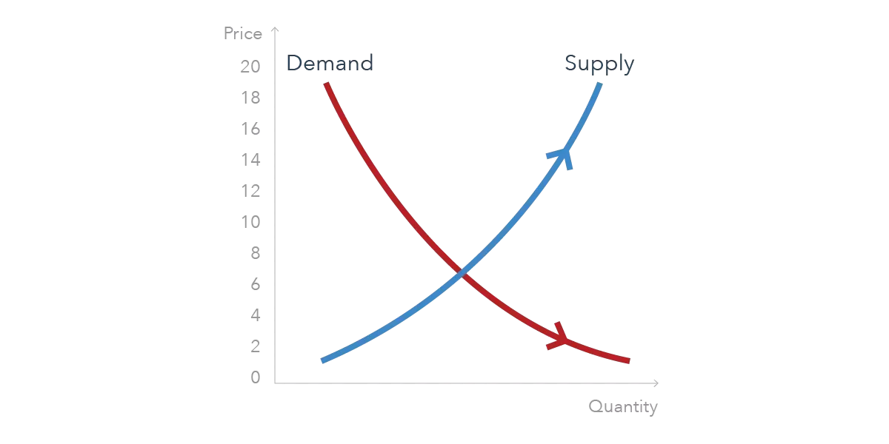

## Table of Contents

## What is price discovery?

Price discovery is the process of figuring out how much something should cost in a market. It happens when buyers and sellers come together and agree on a price through trading. This process is important because it helps set a fair price that reflects what people are willing to pay and what sellers are willing to accept.

In a market, price discovery can be influenced by many things, like how much of the product is available, how much people want it, and even news or events that affect the market. For example, if a lot of people suddenly want to buy a certain toy, its price might go up because of the high demand. On the other hand, if there's too much of a product and not enough buyers, the price might go down. This constant back-and-forth helps keep prices balanced over time.

## Why is price discovery important in financial markets?

Price discovery is really important in financial markets because it helps everyone know the true value of things like stocks, bonds, or commodities. When buyers and sellers trade, they figure out a price that both sides agree on. This price shows what the market thinks something is worth at that moment. If prices weren't discovered properly, it would be hard for people to make good choices about buying or selling, and the market wouldn't work well.

Also, price discovery helps keep markets fair and open. When lots of people can see and take part in the trading, it makes sure that prices are set by what everyone thinks, not just a few people. This openness helps stop one person or group from controlling prices and makes the market more trustworthy. So, good price discovery is key for a healthy and fair financial market where everyone can make smart decisions.

## How does price discovery occur in a market?

Price discovery happens when buyers and sellers in a market come together and agree on a price for something. It's like a big conversation where everyone is trying to figure out how much a stock, a bond, or even a piece of fruit should cost. When someone wants to buy something, they offer a price. If the seller thinks that price is too low, they might say no or ask for a higher price. This back-and-forth continues until both the buyer and seller agree on a price that works for them. All these trades happening over and over again help set the price that everyone sees in the market.

The more people that join in this conversation, the better the price discovery works. If lots of people are buying and selling, it means the price is more likely to be fair and accurate. Things like how much of the item is available, how much people want it, and even news or events can change what people are willing to pay. For example, if a new report says a company is doing really well, more people might want to buy its stock, which can push the price up. On the other hand, if there's bad news, people might sell, and the price could go down. This constant adjusting helps the market find the right price over time.

## What are the main mechanisms of price discovery?

The main way price discovery happens is through trading. When buyers and sellers come together and trade, they figure out a price that both sides agree on. This happens in markets like stock exchanges where lots of people are buying and selling all the time. The more trades that happen, the better the price discovery works because it shows what most people think something is worth. If there are lots of buyers but not many sellers, the price might go up because people really want to buy it. If there are lots of sellers but not many buyers, the price might go down because there's too much of it.

Another important mechanism is through auctions. In an auction, people bid on something until the highest bidder wins, and that's the price everyone agrees on. This can happen quickly, like in a stock market auction at the start of the trading day, or it can take longer, like at an art auction. Auctions help find a price by letting people compete and show how much they're willing to pay. Both trading and auctions help the market find the right price by letting lots of people take part and show what they think something is worth.

## Can you explain the role of supply and demand in price discovery?

Supply and demand are really important for figuring out prices in a market. Supply means how much of something is available to buy. Demand means how much people want to buy it. When there's a lot of something but not many people want it, the price usually goes down. This is because sellers might lower the price to get people to buy it. On the other hand, if there's not much of something but a lot of people want it, the price usually goes up. This is because people are willing to pay more to get it when it's hard to find.

These changes in supply and demand help the market find the right price. Imagine a new toy comes out and everyone wants it, but there aren't many in stores. The price might go up because people are willing to pay more to get it. But if the toy company makes a lot more toys and suddenly there are too many, the price might go down because people don't have to pay as much to get one. This back-and-forth between how much is available and how much people want it is what helps set the price everyone sees in the market.

## How do auctions contribute to price discovery?

Auctions help find the right price for something by letting people compete to buy it. When people bid on an item, they show how much they're willing to pay. The highest bidder wins, and that's the price everyone agrees on. This way, the price is set by what people think the item is worth, not just what the seller wants. Auctions can happen quickly, like at the start of a trading day on a stock market, or they can take longer, like at an art auction where people have time to think about their bids.

Because auctions let lots of people take part, they help make sure the price is fair and accurate. If only a few people were bidding, the price might not show what most people think. But when many people can bid, it's more likely that the price will be close to what everyone thinks the item is worth. This is important for things like stocks, where the price needs to show what the market thinks the company is worth. So, auctions are a big part of how markets figure out the right price for things.

## What is the impact of market transparency on price discovery?

Market transparency means that everyone can see what's happening in the market. When there's a lot of transparency, it helps with price discovery because people can see all the trades and know what prices others are paying. This makes it easier for everyone to agree on a fair price. If people can see that lots of others are buying something at a certain price, they might be more willing to pay that price too. This openness helps the market find the right price faster and makes sure it's based on what most people think, not just a few.

On the other hand, if the market isn't very transparent, it can be harder to figure out the right price. When people can't see all the trades or don't know what prices others are paying, they might not trust the prices they see. This can lead to prices that don't really show what most people think something is worth. Without transparency, some people might try to set prices that are too high or too low, which can make the market less fair and less efficient. So, transparency is really important for good price discovery.

## How do different types of orders affect the price discovery process?

Different types of orders can change how prices are figured out in a market. When people use market orders, they want to buy or sell something right away at the best price available. This can make the price move quickly because it shows what people are willing to pay or accept right now. On the other hand, limit orders let people set a specific price they're willing to buy or sell at. These orders can help keep prices steady because they show what people think something is worth over time, not just at one moment.

Another type of order is a stop order, which turns into a market order when the price reaches a certain level. This can cause big changes in price if lots of stop orders are triggered at the same time. For example, if many people set stop orders to sell a stock if it drops to a certain price, and it does drop to that price, all those orders might make the price fall even more. Each type of order adds different information to the market, helping everyone figure out the right price together.

## What role do market makers play in price discovery?

Market makers help with price discovery by always being ready to buy and sell things in the market. They make sure there's always someone to trade with, which helps keep the market running smoothly. When people want to buy or sell something, market makers give them a price. This price is based on what they think the thing is worth at that moment. By doing this, market makers help show what the market thinks something is worth.

Market makers also help keep prices from changing too much all of a sudden. They do this by buying when there are a lot of sellers and selling when there are a lot of buyers. This balance helps the market find a fair price. Without market makers, prices might jump around a lot more, making it harder for everyone to agree on what something is worth. So, market makers play a big part in making sure prices are set in a way that's fair and makes sense.

## How does high-frequency trading influence price discovery?

High-frequency trading ([HFT](/wiki/high-frequency-trading-strategies)) is when computers trade very quickly, often in just a few seconds or less. This kind of trading can help with price discovery because it makes the market more active. When lots of trades happen fast, it can show what people think something is worth right now. HFT traders use special computer programs to look at lots of information and make trades based on that. This can help the market find the right price faster because there are always people trading.

But high-frequency trading can also make prices move around a lot. Sometimes, HFT can cause prices to change quickly because the computers are trading so fast. This can make it hard for other people to know what the real price should be. If prices are jumping around a lot, it might not show what most people think something is worth. So, while HFT can help with price discovery by making the market more active, it can also make it harder by causing big, quick changes in prices.

## What are the challenges in measuring the efficiency of price discovery?

Measuring how well a market finds the right price can be tricky. One big challenge is that there's no perfect way to know what the "true" price should be. Since price discovery is about what people think something is worth, it can change a lot based on what's happening in the market. If there's a lot of news or events that affect what people think, it can be hard to tell if the price is right or if it's just reacting to the news. Also, different people might have different information, so they might not agree on what the price should be.

Another challenge is that markets can be affected by things that aren't easy to measure. For example, if some people have more information than others, it can make the price discovery process less fair. This is called information asymmetry, and it can make it hard to know if the price is really showing what most people think. Plus, things like high-frequency trading can make prices move around a lot, which can make it hard to see if the market is finding the right price or if it's just reacting to fast trades. All these things make it tough to figure out how well a market is doing at finding the right price.

## How do regulatory changes affect the mechanisms of price discovery?

Regulatory changes can have a big impact on how prices are figured out in a market. When rules change, it can change how people trade and what information they have. For example, if new rules make it easier for everyone to see what's happening in the market, it can help prices be more fair and accurate. But if new rules make it harder for people to trade or share information, it might make it harder for the market to find the right price. So, the rules that govern trading can really change how well the market works at figuring out prices.

Sometimes, regulatory changes can also affect who is trading and how they trade. For instance, if new rules make it more expensive or harder for some people to trade, like high-frequency traders, it can change how active the market is. Less trading can make it harder for the market to find the right price because there are fewer people showing what they think something is worth. On the other hand, if rules encourage more people to trade, it can help the market find the right price faster. So, the way rules are set up can really shape how prices are discovered in a market.

## References & Further Reading

[1]: Harris, L. (2003). ["Trading and Exchanges: Market Microstructure for Practitioners."](https://www.amazon.com/Trading-Exchanges-Market-Microstructure-Practitioners/dp/0195144708) Oxford University Press.

[2]: Aldridge, I. (2013). ["High-Frequency Trading: A Practical Guide to Algorithmic Strategies and Trading Systems."](https://www.wiley.com/en-us/High+Frequency+Trading%3A+A+Practical+Guide+to+Algorithmic+Strategies+and+Trading+Systems%2C+2nd+Edition-p-9781118343500) Wiley.

[3]: Hasbrouck, J. (2007). ["Empirical Market Microstructure: The Institutions, Economics, and Econometrics of Securities Trading."](https://academic.oup.com/book/52241) Oxford University Press.

[4]: Gomber, P., Arndt, B., Lutat, M., & Uhle, T. (2011). ["High-Frequency Trading."](https://papers.ssrn.com/sol3/papers.cfm?abstract_id=1858626) Business & Information Systems Engineering, 3(2), 160–165.

[5]: Menkveld, A.J. (2013). ["High-frequency trading and the new market makers."](https://www.sciencedirect.com/science/article/pii/S1386418113000281) Journal of Financial Markets, 16(4), 712-740.

[6]: Cartea, Á., & Penalva, J. (2012). ["Where is the value in high frequency trading?"](https://papers.ssrn.com/sol3/papers.cfm?abstract_id=1712765) Quarterly Journal of Finance, 2(3), 1250014.

[7]: Madhavan, A. (2000). ["Market microstructure: A survey."](https://www.sciencedirect.com/science/article/pii/S1386418100000070) Journal of Financial Markets, 3(3), 205-258.