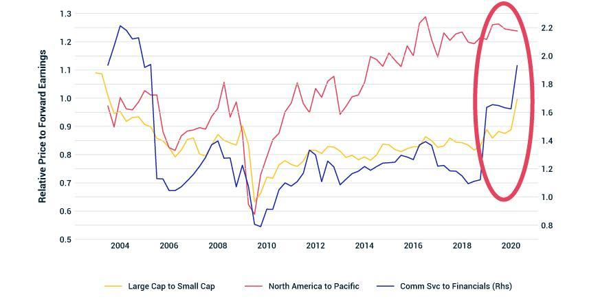

## Table of Contents

## What is price dislocation in financial markets?

Price dislocation in financial markets happens when the price of an asset moves away from its true value. This can happen because of many reasons like sudden news, panic selling, or when there are not enough buyers or sellers. When this happens, the price can go much higher or lower than what it should be, creating opportunities for investors who can spot the difference.

For example, if a company's stock suddenly drops a lot because of a rumor, but the rumor turns out to be false, the stock price might be lower than its real value. This is a price dislocation. Smart investors might buy the stock at the lower price, expecting it to go back up when the truth comes out. Price dislocations can be risky, but they can also lead to big profits if you know what you're doing.

## Why is detecting price dislocation important for investors?

Detecting price dislocation is important for investors because it can help them find good deals. When an asset's price moves away from its true value, it might be cheaper than it should be. If an investor can spot this, they can buy the asset at a lower price and then sell it later when the price goes back to normal. This can lead to big profits if they get it right.

It's also important because it helps investors avoid big losses. If an asset's price is much higher than its true value, it might be a bad time to buy. By understanding price dislocations, investors can wait for a better time to invest or even sell their assets before the price drops. This way, they can protect their money and make smarter choices in the market.

## What are the common causes of price dislocation?

Price dislocation can happen because of sudden news or events. For example, if a company announces bad news like a big loss or a scandal, its stock price might drop a lot very quickly. This can make the stock price lower than what it's really worth. On the other hand, good news can make a stock's price go up too much, higher than its true value. This kind of sudden change can cause a price dislocation.

Another common cause is when there are not enough buyers or sellers in the market. If everyone wants to sell a certain stock at the same time but no one wants to buy, the price can drop a lot. This often happens during times of panic, like a financial crisis. If there are more buyers than sellers, the price can go up a lot too. These imbalances can make the price move far away from what it should be.

Sometimes, price dislocation can also be caused by mistakes or misunderstandings. For example, if people think a rumor is true and they all start buying or selling based on it, the price can move a lot. When the truth comes out, the price might go back to normal, but in the meantime, it can be very different from the asset's real value.

## How can price dislocation be identified in stock markets?

To spot price dislocation in stock markets, you need to compare the current price of a stock with what you think its true value is. This true value can be figured out by looking at things like the company's earnings, how much it's growing, and what other similar companies are worth. If the stock's price is a lot lower or higher than this true value, there might be a price dislocation. For example, if a company's stock suddenly drops a lot because of a rumor, but the rumor turns out to be false, the stock might be cheaper than it should be.

Another way to identify price dislocation is by watching the market closely for big changes in price that don't seem to match what's happening with the company. If a stock's price goes up or down a lot in a short time without any clear reason, it could be a sign of price dislocation. This often happens when there's a lot of panic or excitement in the market, like during a financial crisis or when there's big news. By keeping an eye on these sudden changes and understanding the reasons behind them, investors can spot when a stock's price might not be right.

## What tools or software can be used to detect price dislocation?

To find price dislocation, investors can use different tools and software. One common tool is a stock screener. A stock screener lets you look at lots of stocks at once and find ones that seem to be priced too low or too high compared to their true value. You can set up the screener to show you stocks based on things like price-to-earnings ratio, which helps you see if a stock is cheaper or more expensive than it should be. Another useful tool is a financial analysis platform like Bloomberg Terminal or Morningstar. These platforms give you lots of data about companies, including their earnings and how they're doing compared to others in the same industry. By looking at this data, you can figure out if a stock's price is out of line with its real value.

Another way to spot price dislocation is by using charting software. Charting software helps you see how a stock's price has moved over time. You can look for big jumps or drops in the price that don't seem to match what's going on with the company. Tools like TradingView or MetaTrader can show you these price movements and even let you set up alerts for when prices change a lot. By watching these charts and understanding the reasons behind the price changes, you can find times when a stock's price might not be right.

## Can you explain the role of market inefficiencies in price dislocation?

Market inefficiencies play a big role in causing price dislocation. When a market is not working perfectly, it can lead to prices that don't match an asset's real value. This can happen because of things like not enough information, people making emotional decisions, or rules that make it hard to buy or sell. For example, if a lot of people start selling a stock because they're scared, even if the company is doing well, the price can drop a lot. This is a market inefficiency because the price is not showing the true value of the company.

These inefficiencies create chances for price dislocation. When the market is not efficient, it can take time for prices to go back to where they should be. This gives smart investors a chance to find assets that are priced too low or too high. By understanding these inefficiencies, they can buy when prices are low and sell when they go back up. This is why knowing about market inefficiencies is important for spotting and using price dislocation to make money.

## What are the differences between short-term and long-term price dislocations?

Short-term price dislocations happen quickly and don't last long. They are often caused by sudden news or events that make people panic and buy or sell a lot. For example, if a company's stock drops a lot because of a rumor, but the rumor is not true, the price might go back to normal soon. These dislocations can be good for quick trades because if you buy when the price is low and sell when it goes back up, you can make a profit. But they can also be risky because it's hard to know when the price will change.

Long-term price dislocations take more time to fix and can last for months or even years. They often happen because of bigger problems like changes in the economy or big shifts in how people see certain industries. For example, if a whole industry starts to do badly, the prices of stocks in that industry might stay low for a long time. These dislocations need a lot of patience because it can take a while for the price to go back to what it should be. But if you can wait, you might be able to buy at a low price and sell later for a big profit.

## How do arbitrage opportunities relate to price dislocation?

Arbitrage opportunities are closely linked to price dislocation. When a price dislocation happens, it means that the price of an asset is different from what it should be. This difference creates a chance for arbitrage. Arbitrage is when someone buys an asset where it's cheap and sells it where it's more expensive, making a profit from the price difference. For example, if a stock is priced lower on one exchange than another, an arbitrageur can buy it on the cheaper exchange and sell it on the more expensive one, making money from the price dislocation.

These opportunities can be short-lived because once people start doing arbitrage, the prices usually start to even out. But if the price dislocation is big enough, there can be a lot of money to be made before the prices go back to normal. Arbitrageurs need to be quick and smart to spot these chances and act on them before they disappear. So, price dislocations are important because they create the conditions for arbitrage, which can lead to profits for those who can find and use them.

## What advanced statistical methods are used to detect price dislocations?

To find price dislocations, people use fancy math methods like cointegration and mean reversion. Cointegration helps see if two things that should move together are not. For example, if a stock and its industry are supposed to go up and down together but they don't, it might mean there's a price dislocation. Mean reversion looks at how prices move over time and tries to guess when they'll go back to normal. If a stock's price is way off from where it usually is, mean reversion can help spot that and say it might be time to buy or sell.

Another method is using something called the Kalman filter. This tool is good at figuring out the true value of a stock even when the market is noisy and hard to read. By using the Kalman filter, you can see if a stock's price is too high or too low compared to what it should be. These advanced methods need a lot of math and computer power, but they can help find price dislocations that are not easy to see with just simple tools.

## How does machine learning enhance the detection of price dislocations?

Machine learning helps find price dislocations by looking at a lot of data very quickly. It can see patterns and changes in prices that are hard for people to spot. For example, machine learning can use past data to predict when a stock's price might be too high or too low. It does this by learning from lots of examples and figuring out what signs to look for. This way, it can help investors find good deals faster and with less work.

Also, machine learning can keep learning and getting better over time. As it sees more data, it can adjust its predictions to be more accurate. This is really helpful because markets change a lot, and what worked before might not work now. By using machine learning, investors can stay ahead of the game and spot price dislocations before others do. This can lead to better decisions and more profits.

## What are the risks associated with trading based on detected price dislocations?

Trading based on price dislocations can be risky because the market might not go back to normal as quickly as you think. If you buy a stock because you think it's too cheap, it might stay cheap for a long time. This means you could lose money if you need to sell it before the price goes up. Also, other people might see the same price dislocation and start buying or selling, which can make the price move even more in the wrong direction before it fixes itself.

Another risk is that you might be wrong about the true value of the stock. Just because the price looks off doesn't mean it is. Sometimes, the market knows something you don't, and the price might be right where it should be. If you trade based on a wrong guess, you could end up losing money. So, it's important to do a lot of research and be ready for things not to go as planned.

## How can price dislocation detection be integrated into a comprehensive trading strategy?

Price dislocation detection can be a big part of a smart trading plan. First, you need to use tools like stock screeners and financial analysis platforms to find stocks that look too cheap or too expensive. When you see a price dislocation, you can decide to buy the stock if it's too cheap, hoping to sell it later when the price goes back to normal. Or, if the stock is too expensive, you might decide to sell it or even short sell it, betting that the price will go down. By adding price dislocation detection to your trading plan, you can find good deals that other people might miss.

But, it's important to mix price dislocation detection with other ways of picking stocks. You should also look at a company's earnings, how it's growing, and what's happening in its industry. This helps make sure you're not just guessing about the stock's true value. Also, think about how long you can wait for the price to fix itself. If you need to sell quickly, price dislocations might not be the best choice. By using price dislocation detection along with other methods, you can make a strong trading plan that helps you make smart choices and manage risks better.

## What are the techniques for detecting price dislocation?

Price dislocation detection employs various techniques to identify and respond to abnormal deviations in asset prices compared to their expected values. This section explores several methods, including moving averages, candlestick patterns, [breakout](/wiki/breakout-trading) points, advanced statistical approaches, and the utilization of real-time data analytics.

### Moving Averages and Their Role in Identifying Price Deviations

Moving averages are among the most popular tools to detect price dislocations. They smooth out price data by creating a constantly updated average price, which traders use to identify trends and signal potential deviations. The Simple Moving Average (SMA) is calculated by averaging the closing prices over a specific number of periods. The formula for an SMA over $n$ periods is:

$$
\text{SMA} = \frac{P_1 + P_2 + \dots + P_n}{n}
$$

Where $P_1, P_2, \ldots, P_n$ are the closing prices of the asset. A significant deviation of the current price from the moving average may indicate a price dislocation.

The Exponential Moving Average (EMA) gives more weight to recent prices, thus reacting more quickly to price changes. This is calculated as:

$$
\text{EMA}_{\text{today}} = P_{\text{today}} \times k + \text{EMA}_{\text{yesterday}} \times (1-k)
$$

Where $k = \frac{2}{n+1}$ and $n$ is the number of periods.

### Utilizing Candlestick Patterns and Breakout Points

Candlestick patterns and breakout points provide visual indicators of potential price dislocations. Candlestick patterns, such as dojis, hammers, and shooting stars, represent short-term market sentiment that might indicate a market reversal or continuation, offering clues about pending price movements. Breakout points occur when the asset price moves through a previously established support or resistance level, often resulting in significant price dislocations. Traders use these breakouts as signals for potential trend changes.

### Advanced Statistical Methods: Markov Regime-Switching Models

Markov regime-switching models are a sophisticated statistical tool used for modeling price dynamics that shift between different regimes or states, each characterized by distinct statistical properties. These models are particularly useful for detecting price dislocations by identifying changes in the market structure. A regime-switching model can be expressed as:

$$
Y_t = \mu_{s_t} + \epsilon_{t}
$$

Where $Y_t$ is the observed time series, $\mu_{s_t}$ represents the regime-dependent mean, and $\epsilon_{t}$ is the error term. The regime indicator $s_t$ follows a discrete-state Markov chain. The ability to switch between different regimes allows traders to better capture the transitional nature of financial markets, thereby identifying potential price dislocations more accurately.

### Role of Real-Time Data and Analytics

Real-time data and analytics play a crucial role in detecting price dislocations. With the advent of advanced technology, traders now have access to high-frequency data streams that allow for instant analysis and decision-making. Tools equipped with real-time analytics can flag price anomalies as they occur, providing traders with opportunities to react quickly before the market adjusts.

Utilizing programming languages such as Python, traders often implement algorithms for real-time monitoring. For instance, Python libraries like `pandas` and `numpy` facilitate the analysis of large datasets to identify dislocations, while `matplotlib` can be used to visualize these patterns efficiently.

In conclusion, a combination of moving averages, technical chart patterns, advanced statistical models, and real-time data analytics provide a comprehensive toolkit for detecting and interpreting price dislocations, enhancing the efficacy of trading strategies in dynamic financial markets.

## References & Further Reading

[1]: Lopez de Prado, M. (2018). ["Advances in Financial Machine Learning."](https://www.amazon.com/Advances-Financial-Machine-Learning-Marcos/dp/1119482089) Wiley.

[2]: Chan, E. P. (2009). ["Quantitative Trading: How to Build Your Own Algorithmic Trading Business."](https://github.com/egorpe/EPChan-QuantitativeTrading/blob/master/example7_6.m) Wiley.

[3]: Aronson, D. (2007). ["Evidence-Based Technical Analysis: Applying the Scientific Method and Statistical Inference to Trading Signals."](https://www.amazon.com/Evidence-Based-Technical-Analysis-Scientific-Statistical/dp/0470008741) Wiley.

[4]: Jansen, S. (2020). ["Machine Learning for Algorithmic Trading: Second Edition."](https://github.com/stefan-jansen/machine-learning-for-trading) Packt Publishing.

[5]: Bishop, C. M. (2006). ["Pattern Recognition and Machine Learning."](https://link.springer.com/book/9780387310732) Springer.

[6]: Hull, J. C. (2014). ["Options, Futures, and Other Derivatives."](https://www.amazon.com/Options-Futures-Other-Derivatives-9th/dp/0133456315) Pearson.