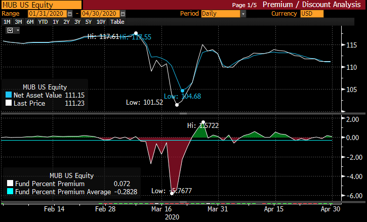

Algorithmic trading, the use of computer algorithms to automate trading processes, has become a cornerstone of modern financial markets. Leveraging computational power, these algorithms can analyze vast amounts of data at speeds unattainable by human traders, making it possible to execute orders with exceptional precision and timing. This transformation has significantly influenced how markets operate, contributing to increased liquidity, narrower spreads, and enhanced market efficiency.

One critical concept in trading is price dislocation, which refers to the temporary disruption of price equilibrium in the markets. Price dislocation occurs when the price of a security deviates from its intrinsic or expected value due to various catalysts such as market inefficiencies, abrupt news events, or liquidity constraints. Recognizing these anomalies is vital for traders, as they often present lucrative opportunities to buy undervalued assets or sell overvalued ones before the market corrects itself.



Detecting price dislocation is crucial for enhancing trading strategies, as it allows traders to capitalize on mispriced assets. Traditional methods of identifying these opportunities are often manual, time-consuming, and subjective. In contrast, algorithmic approaches leverage computational techniques to systematically and rapidly detect anomalies, offering traders a significant edge in the market. By employing sophisticated algorithms, traders can analyze patterns and statistics across vast datasets, enabling them to respond quickly to dislocations and optimize their trading strategies for better profitability.

This article outlines the concept of price dislocation in the financial markets and how it impacts both traders and market dynamics. It explores the role of algorithmic trading in detecting price dislocations, including the various techniques and tools employed to achieve this. Additionally, the article addresses the challenges and considerations associated with these methods and discusses future trends and advancements in this domain.

## Table of Contents

## Understanding Price Dislocation

Price dislocation in financial markets refers to a significant deviation of a security's market price from its perceived intrinsic value. This phenomenon typically arises due to an imbalance between supply and demand, resulting in an asset being overvalued or undervalued. Price dislocation can present opportunities or risks for traders and investors as they seek to capitalize on the mispricing relative to other comparable securities or market expectations.

Several factors contribute to price dislocation in the financial markets:

1. **Market Inefficiencies**: Market inefficiencies occur when the securities market does not perfectly reflect all available information in the pricing of assets. Such inefficiencies can be attributed to an inadequate dissemination of information or the market participants' inability to process the available data effectively. This mispricing can result in a temporary dislocation until the market corrects itself.

2. **News Events**: Sudden news events, including economic reports, political announcements, or corporate earnings, can lead to swift price movements. If the information is unexpected or contrary to market predictions, it can cause a significant shift in supply and demand dynamics, thus creating price dislocations. Traders need to swiftly adapt to such events to optimize their strategies.

3. **Liquidity Issues**: Limited liquidity can exacerbate price dislocations as a lack of buyers or sellers in the market makes it difficult for participants to execute large orders without influencing the asset's price. This is particularly prevalent in smaller or less popular markets where trading volumes are low, causing more pronounced price swings.

The impact of price dislocations on traders and the market is manifold:

- **Opportunities and Risks for Traders**: Traders often view price dislocations as opportunities to profit by buying undervalued assets or selling overvalued ones. However, identifying true dislocations versus market noise is challenging, and traders face the risk of incurring losses if the market fails to correct as anticipated. Skilled traders employ various strategies to exploit these periods of mispricing, often utilizing fast and dynamic decision-making processes.

- **Market Stability**: Extended periods of price dislocation can threaten market stability, potentially leading to increased volatility. This is especially concerning for institutional investors managing large portfolios, as it can affect portfolio valuation and risk management strategies. Consequently, the ability to detect and respond to price dislocations is crucial for maintaining market equilibrium and investor confidence.

Understanding the factors leading to price dislocations and their implications is essential for traders aiming to enhance their trading strategies and mitigate potential risks associated with such market anomalies.

## Algorithmic Trading and Price Dislocation Detection

Algorithmic trading has assumed a pivotal role in modern financial markets due to its ability to process vast amounts of data and execute trades at unprecedented speeds and with precision. Algorithms, essentially sequences of instructions for problem-solving and task execution, are integral to the detection of price dislocations—anomalies where an asset's market price deviates from its expected level, often indicative of market inefficiencies. 

Algorithms in trading perform two critical functions: they analyze market data to identify price dislocations and execute trades to capitalize on these anomalies. Price dislocation detection typically uses quantitative models and analytical techniques to discern variances between an asset's market price and its intrinsic value. 

Various algorithms are employed for this purpose, each with specific strengths. Statistical [arbitrage](/wiki/arbitrage) models leverage market inefficiencies based on statistical techniques; mean reversion algorithms identify discrepancies by assuming prices will revert to long-term means, and [machine learning](/wiki/machine-learning) approaches enhance pattern recognition in complex datasets. 

Among the algorithms used, moving averages help indicate buy or sell signals, while machine learning models learn from historical data to forecast future price movements. The Kalman filter, a recursive algorithm, refines predictions about current and future states, making it invaluable in tracking and predicting price movements.

The benefits of algorithmic methods over traditional techniques are significant. Human traders often struggle to process information as swiftly and accurately as algorithms, which can analyze data and react to price changes within milliseconds. Additionally, algorithmic methods reduce emotional biases and execution errors, enhancing decision-making accuracy. They also enable simultaneous monitoring of multiple assets and markets, a feat impractical with manual trading. 

There's also the advantage of scalability; algorithms can be deployed to various assets and market conditions, adapting to different trading strategies. They allow for [backtesting](/wiki/backtesting) strategies on historical data, providing insights into potential future performance without risking capital. 

Hence, employing algorithmic methods for detecting price dislocations enhances the reliability and efficiency of trading strategies, ultimately benefiting traders' and investors' profitability and market efficiency.

## Techniques for Detecting Price Dislocation

Price dislocation detection employs various techniques to identify and respond to abnormal deviations in asset prices compared to their expected values. This section explores several methods, including moving averages, candlestick patterns, [breakout](/wiki/breakout-trading) points, advanced statistical approaches, and the utilization of real-time data analytics.

### Moving Averages and Their Role in Identifying Price Deviations

Moving averages are among the most popular tools to detect price dislocations. They smooth out price data by creating a constantly updated average price, which traders use to identify trends and signal potential deviations. The Simple Moving Average (SMA) is calculated by averaging the closing prices over a specific number of periods. The formula for an SMA over $n$ periods is:

$$
\text{SMA} = \frac{P_1 + P_2 + \dots + P_n}{n}
$$

Where $P_1, P_2, \ldots, P_n$ are the closing prices of the asset. A significant deviation of the current price from the moving average may indicate a price dislocation.

The Exponential Moving Average (EMA) gives more weight to recent prices, thus reacting more quickly to price changes. This is calculated as:

$$
\text{EMA}_{\text{today}} = P_{\text{today}} \times k + \text{EMA}_{\text{yesterday}} \times (1-k)
$$

Where $k = \frac{2}{n+1}$ and $n$ is the number of periods.

### Utilizing Candlestick Patterns and Breakout Points

Candlestick patterns and breakout points provide visual indicators of potential price dislocations. Candlestick patterns, such as dojis, hammers, and shooting stars, represent short-term market sentiment that might indicate a market reversal or continuation, offering clues about pending price movements. Breakout points occur when the asset price moves through a previously established support or resistance level, often resulting in significant price dislocations. Traders use these breakouts as signals for potential trend changes.

### Advanced Statistical Methods: Markov Regime-Switching Models

Markov regime-switching models are a sophisticated statistical tool used for modeling price dynamics that shift between different regimes or states, each characterized by distinct statistical properties. These models are particularly useful for detecting price dislocations by identifying changes in the market structure. A regime-switching model can be expressed as:

$$
Y_t = \mu_{s_t} + \epsilon_{t}
$$

Where $Y_t$ is the observed time series, $\mu_{s_t}$ represents the regime-dependent mean, and $\epsilon_{t}$ is the error term. The regime indicator $s_t$ follows a discrete-state Markov chain. The ability to switch between different regimes allows traders to better capture the transitional nature of financial markets, thereby identifying potential price dislocations more accurately.

### Role of Real-Time Data and Analytics

Real-time data and analytics play a crucial role in detecting price dislocations. With the advent of advanced technology, traders now have access to high-frequency data streams that allow for instant analysis and decision-making. Tools equipped with real-time analytics can flag price anomalies as they occur, providing traders with opportunities to react quickly before the market adjusts.

Utilizing programming languages such as Python, traders often implement algorithms for real-time monitoring. For instance, Python libraries like `pandas` and `numpy` facilitate the analysis of large datasets to identify dislocations, while `matplotlib` can be used to visualize these patterns efficiently.

In conclusion, a combination of moving averages, technical chart patterns, advanced statistical models, and real-time data analytics provide a comprehensive toolkit for detecting and interpreting price dislocations, enhancing the efficacy of trading strategies in dynamic financial markets.

## Tools and Technologies

Stolgo is a sophisticated platform designed for price action trading, emphasizing the detection of price dislocations. It leverages advanced algorithms to analyze vast datasets, identifying anomalies that can signal trading opportunities. Stolgo provides traders with customizable indicators and alerts, allowing for real-time adjustments to trading strategies based on detected dislocations. The platform supports numerous asset classes, making it versatile for diverse market environments.

Beyond Stolgo, several other tools and libraries are crucial for [algorithmic trading](/wiki/algorithmic-trading) focused on price dislocation detection. The QuantLib library is widely used for quantitative finance, offering a range of tools for modeling, trading, and risk management. It supports the development of custom algorithms needed for detecting price anomalies. PyAlgoTrade and Backtrader are Python libraries that facilitate the creation of event-driven algorithms, including those targeting price dislocations. These libraries allow users to backtest strategies on historical data, ensuring robustness before deploying algorithms in live trading.

Real-time data integration is a critical component of effective price dislocation detection. Services like bandl.io provide continuous data feeds that are essential for algorithms operating in dynamic markets. Bandl.io offers APIs that seamlessly integrate with trading platforms, supplying timely market data necessary for the accurate identification of price inefficiencies. By ensuring access to up-to-the-minute information, these data feed services enhance the performance of detection algorithms, enabling traders to respond swiftly to emerging opportunities.

Incorporating these tools and technologies into algorithmic strategies enhances the precision and efficiency of price dislocation detection, enabling traders to optimize their market interactions.

## Challenges and Considerations

Implementing algorithms for price dislocation detection presents several challenges that traders and financial analysts need to carefully address. One of the primary challenges is the complexity inherent in accurately modeling market behavior, which is often subject to sudden and unpredictable changes. Financial markets are influenced by a multitude of factors, including macroeconomic news, geopolitical events, and sudden shifts in investor sentiment, making it difficult to create algorithms that can consistently detect dislocations with high precision.

Another significant challenge lies in the quality and reliability of data. Algorithms for detecting price dislocations are heavily data-dependent; thus, inaccuracies in data or delays in real-time feeds can lead to suboptimal performance or false signals. This necessitates the integration of high-quality and timely data sources to enhance the reliability of the algorithms.

The potential risks of relying solely on algorithms for detecting price dislocations include the possibility of overfitting, where the algorithm is too tailored to historical data and fails to adapt to new market conditions. Moreover, excessive reliance on algorithmic detection can result in a neglect of qualitative analysis, which might overlook context-specific insights that are not easily quantifiable.

To improve accuracy and efficiency, it is vital to incorporate machine learning techniques that allow algorithms to learn from new data and adjust to evolving market conditions. Techniques such as ensemble learning, which combines multiple models to improve prediction accuracy, can be particularly effective. Additionally, implementing robust backtesting frameworks is essential to ensure that the algorithms perform optimally across a range of market scenarios before deployment. 

Moreover, adopting hybrid systems that integrate both algorithmic and human insights could prove beneficial. This approach involves using algorithms to process large volumes of data and identify potential dislocations, while also incorporating expert judgment to interpret results and make final trading decisions. By considering these factors, traders can enhance the effectiveness of their price dislocation detection strategies, minimizing risks while maximizing potential trading advantages.

## Future Trends in Price Dislocation Detection

As algorithmic trading technologies continue to evolve, their role in detecting price dislocation is expected to become more sophisticated. The integration of [artificial intelligence](/wiki/ai-artificial-intelligence) (AI) and machine learning (ML) is at the forefront of these advancements, offering refined techniques for identifying anomalous price movements in financial markets.

AI and ML have the potential to improve detection accuracy by incorporating vast amounts of historical and real-time data to recognize patterns and infer correlations. Advanced algorithms can learn from data, making predictions and adjustments without explicit programming. Supervised learning models, such as linear regression and neural networks, as well as unsupervised models, like clustering algorithms, can be employed to identify price dislocations more effectively:

```python
from sklearn.linear_model import LinearRegression
import numpy as np

# Example dataset: features and target
X = np.array([[10, 15], [12, 18], [15, 20], [18, 25]])
y = np.array([500, 600, 650, 700])

# Linear regression model
model = LinearRegression()
model.fit(X, y)

# Predicting price based on new data
new_data = np.array([[20, 30]])
predicted_price = model.predict(new_data)
print(predicted_price)
```

Such models are capable of factoring in an extensive range of variables that influence price movements, thus enabling a more nuanced understanding of market dynamics and potential price dislocations.

Additionally, [deep learning](/wiki/deep-learning) techniques, particularly through the use of convolutional neural networks (CNNs) and recurrent neural networks (RNNs), can process and interpret complex data structures like time series data, which is essential for making reliable forecasts in volatile market environments. These models can identify subtle dislocations that may be overlooked by traditional methods.

As AI and ML technologies improve, they also make it possible to implement real-time adaptation strategies. Algorithms can dynamically update their parameters based on new market conditions and continuously improve through ongoing learning processes. This adaptability is crucial in markets characterized by rapid changes and unpredictability.

In the future, traders and market analysts might expect an increased reliance on AI-driven solutions for price dislocation detection, which could significantly enhance predictive accuracy and response agility. These technologies may also allow for more decentralized trading strategies, reducing the dependency on centralized exchanges and enhancing the capabilities for trading cryptocurrencies and other digital assets.

Moreover, the integration of blockchain technology is likely to contribute to the transparency and security of trading operations, presenting a more trustworthy environment for executing complex algorithmic strategies.

Overall, advancements in AI and machine learning are set to transform how price dislocation is detected, analyzed, and acted upon, heralding a new era of efficiency and sophistication in algorithmic trading.

## Conclusion

Price dislocation detection plays a critical role in modern trading environments by providing traders with the ability to identify and exploit anomalies in asset pricing. Such detections are crucial because they allow market participants to capitalize on temporary inefficiencies, ultimately contributing to market efficiency and the correction of mispriced assets.

Throughout this article, we have explored various aspects of price dislocation, from understanding its causes, such as market inefficiencies, news events, and [liquidity](/wiki/liquidity-risk-premium) challenges, to the impact these dislocations have on traders and overall market behavior. Importantly, algorithmic trading has emerged as a powerful tool in addressing this challenge. Algorithms provide a systematic, fast, and accurate means of identifying price dislocations, surpassing traditional methods that often lag in speed and precision.

Additionally, a range of techniques is utilized to detect price dislocations. These include moving averages, candlestick patterns, breakout points, and advanced statistical models like Markov regime-switching models. The integration of real-time data and analytics further enhances the accuracy and timeliness of dislocation detection.

Tools and technologies such as Stolgo and Bandl.io are pivotal in supporting traders within this landscape, offering specialized capabilities for price action trading and real-time data analysis.

Despite the advantages, challenges persist in implementing such algorithms, including the risk of over-reliance on automated systems and the need for continual algorithm refinement to improve accuracy and efficiency. Nonetheless, advancements in AI and machine learning show promise in evolving price dislocation detection techniques, paving the way for more sophisticated and responsive systems in the future.

The evolution of algorithmic trading, facilitated by technological advancements, is reshaping the financial markets, fostering greater efficiency and precision in trading activities. As these technologies continue to advance, traders and market analysts are poised to benefit from more accurate detection and better strategies, ultimately enhancing the stability and functionality of financial markets globally.

## References & Further Reading

[1]: Lopez de Prado, M. (2018). ["Advances in Financial Machine Learning."](https://www.amazon.com/Advances-Financial-Machine-Learning-Marcos/dp/1119482089) Wiley.

[2]: Chan, E. P. (2009). ["Quantitative Trading: How to Build Your Own Algorithmic Trading Business."](https://github.com/egorpe/EPChan-QuantitativeTrading/blob/master/example7_6.m) Wiley.

[3]: Aronson, D. (2007). ["Evidence-Based Technical Analysis: Applying the Scientific Method and Statistical Inference to Trading Signals."](https://www.amazon.com/Evidence-Based-Technical-Analysis-Scientific-Statistical/dp/0470008741) Wiley.

[4]: Jansen, S. (2020). ["Machine Learning for Algorithmic Trading: Second Edition."](https://github.com/stefan-jansen/machine-learning-for-trading) Packt Publishing.

[5]: Bishop, C. M. (2006). ["Pattern Recognition and Machine Learning."](https://link.springer.com/book/9780387310732) Springer.

[6]: Hull, J. C. (2014). ["Options, Futures, and Other Derivatives."](https://www.amazon.com/Options-Futures-Other-Derivatives-9th/dp/0133456315) Pearson.