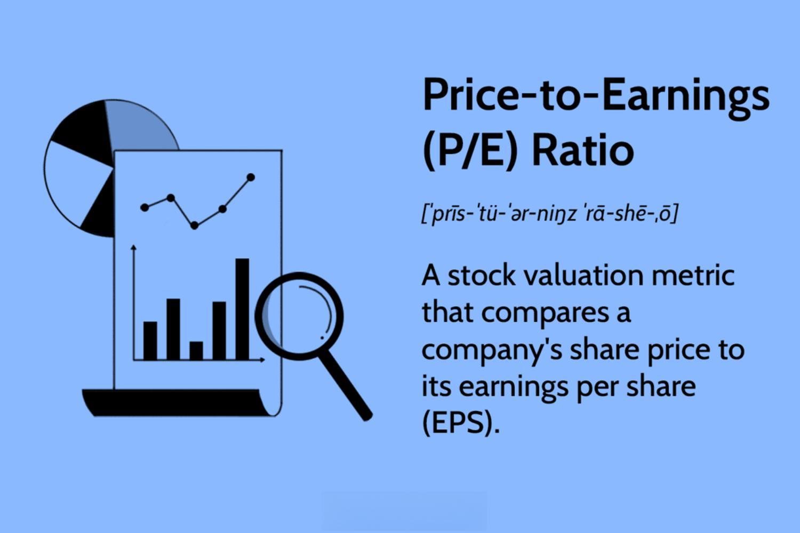

Understanding stock valuation is essential for investors aiming to make informed decisions in the financial markets. Among the myriad of tools available, the Price-to-Earnings (P/E) ratio and the Price/Earnings-to-Growth (PEG) ratio stand out as fundamental metrics for evaluating stocks. The P/E ratio, a measure of how much investors are willing to pay for a dollar of a company's earnings, is calculated by dividing the market value per share by the earnings per share (EPS). This simple yet powerful tool provides insights into market perceptions of future growth and profitability.

On the other hand, the PEG ratio adds a layer of depth to the P/E ratio by factoring in expected earnings growth, thus offering a more nuanced picture of stock valuation. It is calculated by dividing the P/E ratio by the annual earnings per share growth rate. A PEG ratio of 1 is typically considered fair value, with values above or below suggesting overvaluation or undervaluation, respectively, though these interpretations can vary across industries and market conditions.



In recent years, algorithmic trading has increasingly integrated these valuation metrics, enhancing trading strategies through automation. Algorithms can process vast amounts of financial data rapidly, optimizing trade execution based on predefined rules. By incorporating metrics such as the P/E and PEG ratios, algorithmic strategies can evaluate and react to market opportunities with speed and precision that are beyond human capability. This evolution in trading methods aims to minimize emotional decision-making, relying instead on objective, data-driven strategies.

This article explores these valuation metrics, their role in investment analysis, and their application in algorithmic trading. By understanding these tools and their integration into automated trading systems, investors can better navigate the complexities of the financial markets and refine their investment strategies.

## Table of Contents

## Understanding the Price-to-Earnings (P/E) Ratio

The Price-to-Earnings (P/E) ratio is a fundamental metric in stock valuation, providing insights into what investors are willing to pay today for a company's earnings in the future. This ratio is calculated by dividing the market value per share by the earnings per share (EPS). Mathematically, it is expressed as:

$$
\text{P/E Ratio} = \frac{\text{Market Value per Share}}{\text{Earnings per Share (EPS)}}
$$

A higher P/E ratio can suggest that the market anticipates significant growth in the company’s earnings. Conversely, a lower P/E might indicate that the stock is undervalued or that the company is experiencing difficulties. However, it’s essential to understand that the P/E ratio alone may not provide a complete picture of a company's financial health.

The P/E ratio is also a useful tool for comparing companies within the same industry. By evaluating the P/E ratios of competing companies, investors can identify market leaders who maintain high expectations and possibly pinpoint laggards, whose lower P/E ratios could either suggest undervaluation or underlying issues.

It's crucial to use the P/E ratio within the context of industry standards, given that different sectors have various typical P/E benchmarks. For example, technology companies often have higher P/E ratios due to expected growth, while more stable, less dynamic industries like utilities might have lower P/E values. Therefore, understanding the specific industry context is important to interpret the P/E ratio effectively. 

In summary, the P/E ratio offers a snapshot of market sentiment concerning a company's earnings potential, but when scrutinizing a company's stock, it's prudent to supplement this metric with other financial indicators and comparative analyses to draw more holistic conclusions.

## Limitations and Comparisons

The Price-to-Earnings (P/E) ratio is a widely used financial metric that offers insights into what investors are willing to pay for a company's earnings. However, it does have limitations that can impact its effectiveness in valuation analysis. One of the primary limitations is that the P/E ratio does not account for future earnings growth. This omission can lead to distortions, particularly in evaluating companies with high growth potential. A company with a high P/E ratio might appear overvalued at first glance, but if it is on a trajectory of rapid growth, the earnings may eventually justify the higher price. Conversely, a low P/E ratio might suggest undervaluation, but it could also point to a plateau in earnings growth or even a decline.

Industries exhibit a wide range of standard P/E benchmarks, complicating cross-sector comparisons. For instance, technology companies might have higher P/E ratios due to anticipated growth and innovation, whereas utility companies might exhibit lower P/E ratios due to stable but slow-growing earnings. Therefore, comparing P/E ratios across different industries can be misleading. Instead, investors should focus on comparing companies within the same industry to identify market leaders or laggards.

To obtain a more comprehensive valuation, it is beneficial to supplement the P/E ratio with other metrics, such as the Price/Earnings-to-Growth (PEG) ratio. The PEG ratio adjusts the P/E ratio by taking into account a company's earnings growth rate, providing a more nuanced picture of valuation. It is calculated as follows:

$$
\text{PEG Ratio} = \frac{\text{P/E Ratio}}{\text{Earnings Growth Rate}}
$$

A PEG ratio below 1 can indicate that a stock is undervalued relative to its growth potential, while a PEG above 1 might suggest overvaluation. However, like all metrics, the PEG ratio also has its limitations, particularly in accurately estimating future growth rates.

Considering industry-specific factors is crucial for performing a sensible financial analysis. Factors such as regulatory changes, competitive landscape, and technological advancements can significantly affect earnings and growth prospects, influencing the interpretation of P/E and PEG ratios. For a well-rounded investment analysis, it is essential to integrate these ratios with other financial metrics and qualitative assessments of the company and its environment. By doing so, investors can avoid misleading conclusions and develop a more informed investment strategy.

## Incorporating Algorithmic Trading

Algorithmic trading utilizes computational power to automate the execution of trades, guided by predefined rules that often incorporate valuation metrics like the Price-to-Earnings (P/E) ratio. This approach markedly enhances trading speed and precision, as algorithms can process vast amounts of data in real-time. By leveraging high-frequency data, these systems identify and act on market opportunities within fractions of a second, which is far beyond human capability.

One of the critical advantages of [algorithmic trading](/wiki/algorithmic-trading) is its ability to eliminate emotional biases. Traders are often influenced by psychological factors such as fear and greed, which can lead to inconsistent decision-making. Algorithms, however, follow established criteria without deviation, thereby promoting objective and consistent investment strategies. This objectivity is particularly beneficial when employing quantitative metrics such as the P/E ratio, ensuring that trading decisions remain data-driven.

The democratization of algorithmic trading has been accelerated by advances in financial technology (fintech). Traditionally, sophisticated trading algorithms were the domain of large financial institutions with substantial resources for R&D. However, fintech innovations have made algorithmic trading tools more accessible to individual investors and smaller firms. Platforms that offer user-friendly interfaces and customizable algorithms have emerged, enabling a wider range of market participants to harness these powerful tools.

To illustrate the implementation of algorithmic trading with P/E ratios, consider a simple Python script that screens stocks based on their P/E ratio and executes trades when specified conditions are met. The following example highlights the basic steps:

```python
import yfinance as yf  # For more datasets, visit: https://paperswithbacktest.com/datasets

# Define a list of stock symbols to analyze
stocks = ['AAPL', 'MSFT', 'GOOG']

# Desired P/E ratio threshold
pe_threshold = 20

for stock in stocks:
    data = yf.Ticker(stock)
    pe_ratio = data.info['forwardPE']

    if pe_ratio and pe_ratio < pe_threshold:
        # Execute buy order logic here
        print(f"Buying {stock}, P/E Ratio: {pe_ratio}")
    else:
        print(f"Skipping {stock}, P/E Ratio: {pe_ratio}")
```

This script uses the `yfinance` library to retrieve stock data and evaluates each stock based on its forward P/E ratio. If a stock's P/E ratio is below the specified threshold, the script would proceed to execute a buy order, suggesting that the stock may be undervalued.

In conclusion, the integration of algorithmic trading with valuation ratios such as the P/E offers compelling benefits, including rapid trade execution and minimized psychological biases. As fintech continues to evolve, its innovations are expected to further democratize the power of algorithmic trading, allowing a broader audience to optimize their investment strategies.

## Case Study: Algorithmic Trading with P/E Ratios

To demonstrate the application of the Price-to-Earnings (P/E) ratio in algorithmic trading, consider a systematic approach that incorporates this metric within a trading model. The implementation involves several key steps: data collection, screening, execution, and performance analysis.

### Data Collection and Screening
The first step involves gathering financial data, focusing particularly on the P/E ratios of companies within a specific market or industry. This data can be acquired from financial databases such as Bloomberg or Yahoo Finance. The primary objective is to create a filtered list of stocks that exhibit P/E ratios falling within a certain threshold, which could suggest potential undervaluation or overvaluation.

Here's a sample Python script using the `pandas` and `yfinance` libraries to collect and filter stocks based on P/E ratios:

```python
import pandas as pd
import yfinance as yf  # For more datasets, visit: https://paperswithbacktest.com/datasets

# Define a list of stock tickers
tickers = ["AAPL", "MSFT", "GOOGL", "AMZN", "TSLA"]

# Fetch stock data
data = yf.download(tickers, period="1d", fields="eps",
                   actions='auto', progress=False)

# Calculate P/E ratios
market_prices = data['Close'].iloc[-1]
eps = {ticker: yf.Ticker(ticker).info['earnings'][-1] for ticker in tickers}
pe_ratios = market_prices / pd.Series(eps)

# Filter stocks with a P/E ratio below a threshold
filtered_stocks = pe_ratios[pe_ratios < 20]
```

### Execution Strategy
Once stocks are screened based on P/E ratios, the algorithm executes trades. A typical strategy might involve buying stocks with low P/E ratios, betting on their potential for future appreciation. Sell signals could be triggered when the P/E exceeds a predefined level, indicating possible overvaluation.

Automated trading platforms, with pre-defined rules, can efficiently handle real-time decision-making, allowing for instant trade execution without human intervention. This helps capitalize on transient market opportunities.

### Performance Analysis
Evaluating the performance of a P/E-based algorithmic strategy involves [backtesting](/wiki/backtesting) the portfolio over historical data to assess profitability, risk, and [volatility](/wiki/volatility-trading-strategies). This step requires simulating past trades with the model and comparing returns against benchmarks such as the S&P 500.

Here's a simplified view of the backtesting process:

```python
# Assuming filtered_stocks contains a historic pricing dataset
initial_capital = 100000
portfolio = {ticker: 0 for ticker in filtered_stocks.index}

for date, prices in data['Close'].iterrows():
    for ticker, price in prices.items():
        if price < filtered_stocks[ticker]:  # Example buy condition
            shares = initial_capital // price
            portfolio[ticker] += shares
            initial_capital -= shares * price

# Calculate portfolio returns
final_value = sum(portfolio[ticker] * data['Close'][ticker][-1]
                  for ticker in portfolio)
returns = (final_value - initial_capital) / initial_capital
```

### Strengths and Pitfalls
The P/E ratio provides a straightforward mechanism for identifying valuation opportunities. However, its application in isolation can be misleading. Market anomalies, economic shifts, or company-specific factors like managerial changes may influence price movements, escaping the purview of P/E-centric models. For instance, growth companies often exhibit high P/E due to anticipated future earnings, which might mislead simplistic P/E-based evaluations.

### Integrating Additional Metrics
The robustness of algorithmic strategies can be enhanced by integrating other financial metrics, such as the PEG ratio or free cash flow. This not only compensates for the P/E ratio's limitations but also delivers a more nuanced financial outlook. Moreover, incorporating sentiment analysis or [machine learning](/wiki/machine-learning) models can further refine decision-making processes, adapting dynamically to market conditions.

In conclusion, employing a P/E-based algorithmic trading strategy entails meticulous data management, disciplined trading execution, and rigorous performance evaluation. While effective, its optimal deployment demands a comprehensive approach, embracing a multitude of financial indicators.

## Conclusion

The Price-to-Earnings (P/E) and Price/Earnings-to-Growth (PEG) ratios are indispensable tools in stock valuation, providing investors with critical insights into the relationship between a company's stock price, earnings, and expected growth. These metrics are essential for understanding how the market values a company's earnings potential and growth prospects, offering a foundational aspect of investment analysis. The P/E ratio helps determine the amount investors are willing to pay for each unit of earnings, while the PEG ratio adjusts this for growth, providing a more holistic view.

Algorithmic trading capitalizes on these valuation metrics by integrating them into automated trading strategies. This integration allows for the rapid processing of market data and efficient execution of trades based on predefined algorithms, minimizing human error and emotional bias. The use of algorithms enables traders to operate at speeds and scales that would be unfeasible manually, thus enhancing the effectiveness of investment strategies.

However, relying solely on P/E and PEG ratios can be limiting. These metrics should be complemented with other financial indicators to achieve a more nuanced view of a company's value and potential. By incorporating multiple financial metrics, investors can develop more robust investment strategies that account for various market conditions and company-specific factors.

The ever-evolving landscape of financial technology demands continuous learning and adaptation. As new methods and tools emerge, investors and traders must be proactive in updating their knowledge and techniques. This not only optimizes investment outcomes but also ensures resilience in a dynamic market environment where technological advancements continuously reshape the playing field.

## References & Further Reading

### References & Further Reading

**Foundational Texts and Investment Metrics:**

For a comprehensive understanding of investment valuation, consider "Security Analysis" by Benjamin Graham and David Dodd. This seminal work laid the foundation for modern value investing and provides in-depth coverage of investment evaluation. Another key text is "The Intelligent Investor" by Benjamin Graham, which emphasizes principles of value investing and provides practical advice for investors.

**Algorithmic Trading Resources:**

For those interested in integrating algorithmic strategies, "Algorithmic Trading: Winning Strategies and Their Rationale" by Ernest P. Chan offers insights into creating and implementing automated trading systems. Additionally, "Quantitative Trading: How to Build Your Own Algorithmic Trading Business" by the same author guides readers through the process of developing trading algorithms, from initial conception to execution.

**Investment Metrics and P/E Ratios:**

To deepen your understanding of P/E ratios and their implications, explore "Valuation: Measuring and Managing the Value of Companies" by McKinsey & Company Inc. This book provides insights into corporate valuation techniques, including P/E ratios, and outlines methods for accurate equity assessment.

Furthermore, online resources such as Investopedia offer articles like "How to Use the Price-to-Earnings Ratio" and "Understanding the PEG Ratio for Stock Valuation," which explain the applications and limitations of P/E and PEG ratios.

**Algorithmic Trading Strategies:**

The paper "Algorithmic Trading and DMA: An Introduction to Direct Access Trading Strategies" by Barry Johnson details advanced algorithmic trading strategies with a focus on direct market access. Additionally, "Python for Finance" by Yves Hilpisch provides a practical introduction to using Python for financial analysis and algorithmic trading, including code examples and case studies.

**Online Learning Platforms:**

Platforms like Coursera and edX offer courses such as "Machine Learning for Trading" by Georgia Tech and "Algorithmic Trading" by the Indian School of Business, which cover various aspects of stock valuation, statistical models, and execution strategies useful for algorithmic trading.

These resources collectively provide a strong foundation for understanding both traditional valuation metrics and their applications within algorithmic trading, enabling investors to make more informed and strategic decisions.

