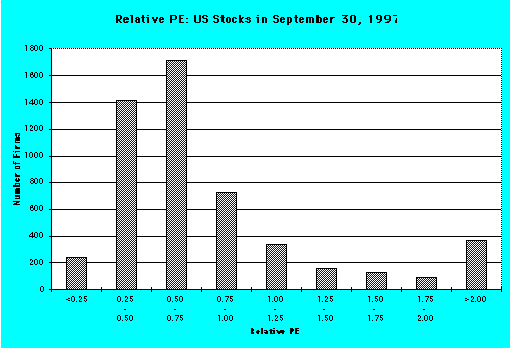

## Table of Contents

## What is the Price-Earnings Relative (P/E Relative) and why is it important?

The Price-Earnings Relative (P/E Relative) is a financial ratio that compares a company's current P/E ratio to the average P/E ratio of its industry or a broader market index. It helps investors understand if a stock is overpriced or underpriced compared to similar companies or the overall market. If the P/E Relative is above 1, it means the stock's P/E ratio is higher than the industry or market average, suggesting it might be overvalued. If it's below 1, the stock might be undervalued.

This ratio is important because it gives investors a quick way to see how a stock is valued in relation to others. By using P/E Relative, investors can make better decisions about whether to buy, hold, or sell a stock. It helps them see if they are paying too much for a stock compared to its peers, or if they are getting a good deal. This can be especially useful when looking at companies in the same industry, where comparing P/E ratios directly can provide insights into relative value.

## How is the P/E Relative calculated?

The P/E Relative is calculated by dividing a company's Price-Earnings (P/E) ratio by the P/E ratio of its industry or a market index. The P/E ratio of a company is found by dividing its current stock price by its earnings per share (EPS). The industry or market P/E ratio is the average P/E ratio of all the companies in that industry or index.

For example, if a company has a P/E ratio of 20 and the industry average P/E ratio is 15, the P/E Relative would be 20 divided by 15, which equals 1.33. This means the company's stock is priced higher compared to the industry average. If the P/E Relative is less than 1, like if the company's P/E ratio is 10 and the industry average is 15, the P/E Relative would be 10 divided by 15, which equals 0.67, indicating the stock might be undervalued compared to the industry.

## What does a high P/E Relative indicate about a company?

A high P/E Relative means that a company's stock is more expensive compared to other companies in its industry or to the overall market. If the P/E Relative is above 1, it shows that people are willing to pay more for each dollar of the company's earnings than they are for other companies. This could mean that investors think the company will grow faster or be more profitable in the future.

However, a high P/E Relative can also be a warning sign. It might mean that the stock is overvalued and could be overpriced. If the company does not meet the high expectations set by investors, the stock price could drop, and people who bought it might lose money. So, it's important for investors to look at other information too, not just the P/E Relative, to make smart choices about buying or selling stocks.

## What does a low P/E Relative suggest about a company's valuation?

A low P/E Relative means that a company's stock is cheaper compared to other companies in its industry or to the overall market. If the P/E Relative is below 1, it shows that people are not willing to pay as much for each dollar of the company's earnings as they are for other companies. This could mean that the company is seen as less likely to grow or be profitable in the future.

However, a low P/E Relative can also be a good sign. It might mean that the stock is undervalued and could be a good deal. If the company does better than people expect, the stock price could go up, and people who bought it might make money. So, a low P/E Relative could be a chance for investors to find a bargain, but they should also look at other information to make sure it's a smart choice.

## How does the P/E Relative differ from the traditional P/E ratio?

The P/E Relative and the traditional P/E ratio both help investors understand how much they are paying for a company's earnings, but they do it in different ways. The traditional P/E ratio is just the price of a stock divided by its earnings per share. It shows how much investors are willing to pay for each dollar of the company's earnings. A high P/E ratio means investors think the company will do well in the future, while a low P/E ratio might mean the company is not expected to grow much.

The P/E Relative goes a step further by comparing a company's P/E ratio to the average P/E ratio of its industry or the whole market. This comparison helps investors see if a stock is priced higher or lower than similar companies. If the P/E Relative is above 1, the stock is more expensive than the average. If it's below 1, the stock might be a good deal. This makes it easier to see if a stock is overvalued or undervalued compared to others.

## Can you explain the significance of comparing P/E Relative across different industries?

Comparing P/E Relative across different industries helps investors see if a company is priced fairly compared to other companies in its own industry. Each industry can have different average P/E ratios because of things like how fast they grow or how risky they are. For example, tech companies might have higher P/E ratios because people expect them to grow a lot, while utility companies might have lower P/E ratios because they grow more slowly. By using P/E Relative, investors can see if a company's stock is priced higher or lower than the average for its industry, which can help them decide if it's a good buy.

It's important not to compare P/E Relative across different industries directly because what's normal in one industry might not be normal in another. For example, a P/E Relative of 1.5 might mean a stock is expensive in the utility industry but could be seen as a good deal in the tech industry. So, investors should compare P/E Relative within the same industry to get a better idea of whether a stock is overvalued or undervalued. This helps them make smarter choices about where to put their money.

## What are the limitations of using P/E Relative as an investment tool?

Using P/E Relative to decide on investments has some problems. One big problem is that it depends a lot on the P/E ratio of the whole industry or market. If the industry average P/E ratio is not right, then the P/E Relative won't be right either. Also, P/E Relative doesn't tell you everything about a company. It doesn't look at things like how much debt the company has, how fast it's growing, or if it's making money. So, if you only use P/E Relative, you might miss important stuff that could affect your investment.

Another problem is that P/E Relative can be tricky to use across different industries. What's normal in one industry might not be normal in another. For example, a P/E Relative of 1.5 might mean a stock is expensive in the utility industry but could be a good deal in the tech industry. This makes it hard to compare companies from different industries just by looking at their P/E Relative. So, while P/E Relative can be helpful, it's best to use it with other tools and information to get a full picture of a company before deciding to invest.

## How can P/E Relative be used to assess market sentiment towards a company?

P/E Relative can help you understand how people feel about a company's stock compared to other companies in the same industry or the whole market. If a company's P/E Relative is high, it means people are willing to pay more for its earnings than for other companies. This could mean that people think the company will do better in the future or that it's a popular choice among investors. On the other hand, if the P/E Relative is low, it might mean people are not as excited about the company's future, and they don't want to pay as much for its earnings.

But, it's important to remember that P/E Relative is just one piece of the puzzle. It doesn't tell you everything about how people feel about a company. Other things like news about the company, how it's doing compared to what people expected, and what's happening in the economy can also affect how people feel about a stock. So, while P/E Relative can give you a quick idea about market sentiment, it's best to look at other information too to get a full picture.

## What role does P/E Relative play in value investing strategies?

P/E Relative is a helpful tool for people who use value investing strategies. Value investing is all about finding stocks that are priced lower than they should be. When investors look at a company's P/E Relative, they can see if it's cheaper or more expensive compared to other companies in the same industry. If the P/E Relative is below 1, it means the stock might be undervalued, which is what value investors look for. They want to buy stocks that are a good deal and hope they will go up in price later.

But, P/E Relative isn't perfect. It only gives part of the story. Value investors also need to look at other things like how much debt the company has, how fast it's growing, and if it's making money. If they only use P/E Relative, they might miss important details that could affect their investment. So, while P/E Relative can help find undervalued stocks, it's best to use it along with other tools to make smart investment choices.

## How can changes in P/E Relative over time inform investment decisions?

Watching how a company's P/E Relative changes over time can give investors important clues about whether to buy, hold, or sell a stock. If the P/E Relative keeps getting lower, it might mean the stock is becoming a better deal compared to other companies in its industry. This could be a good time for investors to buy the stock because it might be undervalued. On the other hand, if the P/E Relative is going up, it could mean the stock is getting more expensive compared to others. Investors might want to sell the stock if they think it's becoming overvalued.

However, investors shouldn't just look at P/E Relative by itself. It's important to think about why the P/E Relative is changing. Maybe the whole industry is doing better or worse, or maybe something special happened to the company. Also, other things like the company's debt, growth, and profits matter too. So, while changes in P/E Relative can help guide investment decisions, it's best to use it with other information to get the full picture.

## What advanced techniques can be used to refine the interpretation of P/E Relative?

To get a better understanding of P/E Relative, investors can use something called sector-specific benchmarks. This means they compare a company's P/E Relative to the average of just its own industry, not the whole market. This helps because different industries have different normal P/E ratios. For example, tech companies often have higher P/E ratios than utility companies. By focusing on the right industry, investors can see if a stock is really a good deal or if it's just normal for that industry.

Another way to refine the interpretation of P/E Relative is by looking at the company's growth prospects. If a company is expected to grow a lot, it might be okay if its P/E Relative is high. Investors might be willing to pay more for the stock because they think the company will do well in the future. On the other hand, if a company's growth is slowing down, a high P/E Relative might be a warning sign. So, by thinking about the company's future, investors can make better decisions about whether the P/E Relative makes sense.

Lastly, using other financial ratios along with P/E Relative can give a fuller picture. Ratios like the price-to-book (P/B) ratio or the debt-to-equity ratio can help investors understand if a company is undervalued or overvalued in other ways. For example, a low P/E Relative might look good, but if the company has a lot of debt, it might not be as good a deal as it seems. By combining P/E Relative with other tools, investors can make smarter choices about where to put their money.

## How do macroeconomic factors influence the P/E Relative and its interpretation?

Macroeconomic factors like interest rates, inflation, and overall economic growth can change how investors see a company's P/E Relative. When interest rates go up, borrowing money becomes more expensive, which can slow down the economy. This might make investors less willing to pay high prices for stocks, so P/E Relatives could go down across the board. On the other hand, if the economy is growing fast and people feel good about the future, they might be okay with paying more for stocks, which could push P/E Relatives up. Also, inflation can make people want to invest in stocks to keep up with rising prices, which might affect how they view P/E Relatives.

Understanding how these big economic changes affect P/E Relative helps investors make better choices. For example, if the economy is in a downturn, a high P/E Relative might not be as worrying because everyone's P/E Relatives are lower. But in a strong economy, a high P/E Relative could mean a stock is overvalued. Investors need to think about the bigger picture and not just look at P/E Relative by itself. By considering what's happening in the economy, they can get a clearer idea of whether a stock's P/E Relative makes sense.

## What is the Price-to-Earnings (P/E) Ratio and how do we understand it?

The Price-to-Earnings (P/E) ratio is a fundamental metric in stock valuation, providing insights into what investors are willing to pay today for a company's earnings in the future. This ratio is calculated by dividing the market value per share by the earnings per share (EPS). Mathematically, it is expressed as:

$$
\text{P/E Ratio} = \frac{\text{Market Value per Share}}{\text{Earnings per Share (EPS)}}
$$

A higher P/E ratio can suggest that the market anticipates significant growth in the company’s earnings. Conversely, a lower P/E might indicate that the stock is undervalued or that the company is experiencing difficulties. However, it’s essential to understand that the P/E ratio alone may not provide a complete picture of a company's financial health.

The P/E ratio is also a useful tool for comparing companies within the same industry. By evaluating the P/E ratios of competing companies, investors can identify market leaders who maintain high expectations and possibly pinpoint laggards, whose lower P/E ratios could either suggest undervaluation or underlying issues.

It's crucial to use the P/E ratio within the context of industry standards, given that different sectors have various typical P/E benchmarks. For example, technology companies often have higher P/E ratios due to expected growth, while more stable, less dynamic industries like utilities might have lower P/E values. Therefore, understanding the specific industry context is important to interpret the P/E ratio effectively. 

In summary, the P/E ratio offers a snapshot of market sentiment concerning a company's earnings potential, but when scrutinizing a company's stock, it's prudent to supplement this metric with other financial indicators and comparative analyses to draw more holistic conclusions.

## What are the limitations and how do they compare?

The Price-to-Earnings (P/E) ratio is a widely used financial metric that offers insights into what investors are willing to pay for a company's earnings. However, it does have limitations that can impact its effectiveness in valuation analysis. One of the primary limitations is that the P/E ratio does not account for future earnings growth. This omission can lead to distortions, particularly in evaluating companies with high growth potential. A company with a high P/E ratio might appear overvalued at first glance, but if it is on a trajectory of rapid growth, the earnings may eventually justify the higher price. Conversely, a low P/E ratio might suggest undervaluation, but it could also point to a plateau in earnings growth or even a decline.

Industries exhibit a wide range of standard P/E benchmarks, complicating cross-sector comparisons. For instance, technology companies might have higher P/E ratios due to anticipated growth and innovation, whereas utility companies might exhibit lower P/E ratios due to stable but slow-growing earnings. Therefore, comparing P/E ratios across different industries can be misleading. Instead, investors should focus on comparing companies within the same industry to identify market leaders or laggards.

To obtain a more comprehensive valuation, it is beneficial to supplement the P/E ratio with other metrics, such as the Price/Earnings-to-Growth (PEG) ratio. The PEG ratio adjusts the P/E ratio by taking into account a company's earnings growth rate, providing a more nuanced picture of valuation. It is calculated as follows:

$$
\text{PEG Ratio} = \frac{\text{P/E Ratio}}{\text{Earnings Growth Rate}}
$$

A PEG ratio below 1 can indicate that a stock is undervalued relative to its growth potential, while a PEG above 1 might suggest overvaluation. However, like all metrics, the PEG ratio also has its limitations, particularly in accurately estimating future growth rates.

Considering industry-specific factors is crucial for performing a sensible financial analysis. Factors such as regulatory changes, competitive landscape, and technological advancements can significantly affect earnings and growth prospects, influencing the interpretation of P/E and PEG ratios. For a well-rounded investment analysis, it is essential to integrate these ratios with other financial metrics and qualitative assessments of the company and its environment. By doing so, investors can avoid misleading conclusions and develop a more informed investment strategy.

## References & Further Reading

#