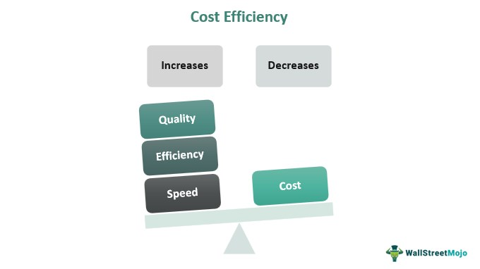

In today's rapidly evolving financial markets, comprehending the concepts of economic analysis, market efficiency, and price efficiency is crucial for investors and market participants. As markets become increasingly complex, understanding these principles aids in making informed investment decisions and navigating the global financial landscape.

Algorithmic trading has emerged as a transformative force, reshaping market dynamics and the notion of efficiency. Utilizing complex algorithms and high-speed computing, algorithmic trading has enhanced the ability of traders to respond swiftly to market changes. This technological advancement has significant implications for how efficiently markets and prices reflect information, altering traditional perceptions of market operations.

The concept of market efficiency is based on the efficient market hypothesis (EMH), which posits that asset prices incorporate and reflect all available information. This theory suggests that consistently achieving returns above the market level is exceptionally challenging. Market efficiency can be categorized into three forms: weak, semi-strong, and strong, each describing the extent to which information is reflected in asset prices.

Price efficiency, a central component of EMH, similarly suggests that markets process information rapidly, leading to fair asset valuations. For investors, this implies that beating the market through individual strategies is intrinsically difficult without access to new, non-public information.

This article explores the intricacies of market and price efficiency, evaluating how algorithmic trading, with its capability to process vast amounts of data at unprecedented speeds, has impacted market quality. By examining these elements, the article seeks to provide a comprehensive understanding of modern financial markets and how technological advancements, particularly algorithmic trading, influence them.

## Table of Contents

## Understanding Economic Analysis in Market Efficiency

Economic analysis is fundamental to understanding market efficiency by focusing on how market structures and participant behaviors impact asset pricing. The efficient markets theory (EMT) serves as the cornerstone of this analysis, positing that asset prices fully reflect all available information. This comprehensive incorporation of information suggests that it is challenging, if not impossible, for investors to consistently achieve excess returns above the market average through stock selection or market timing.

The theory of market efficiency is categorically divided into three forms: weak, semi-strong, and strong, each differing in the level of information considered by the market to reflect in asset prices:

1. **Weak Form Efficiency**: In its most basic form, weak market efficiency asserts that past trading information, such as historical prices and volumes, is already included in current asset prices. According to this form, technical analysis, which relies on historical price data and trends, cannot reliably predict future asset prices or enable consistent excess returns.

2. **Semi-Strong Form Efficiency**: The semi-strong form of market efficiency expands on the weak form by incorporating all publicly available information into asset prices. This includes financial statements, news releases, economic indicators, and other publicly disclosed information. As a result, neither technical analysis nor fundamental analysis, which evaluates a firm’s financial health to estimate its intrinsic value, should systematically outperform the market after the information becomes public.

3. **Strong Form Efficiency**: The strong form takes market efficiency to its theoretical extreme, where all information, both public and private (or insider information), is fully reflected in asset prices. Under this form, even insiders with confidential access to firm-specific information cannot consistently achieve returns greater than those predicted by the market's average returns.

These distinctions serve not only as a framework for understanding information processing in financial markets but also as a foundation for various investment strategies and market regulation efforts. Analyzing how well different markets adhere to these forms of efficiency can offer insights into their robustness and the potential influence of market participants on asset prices. Researchers and practitioners continue to explore the implications of market efficiency, assessing the role that information dissemination and technological advancements, such as [algorithmic trading](/wiki/algorithmic-trading), have on maintaining or disrupting efficient market conditions.

## Demystifying Price Efficiency

Price efficiency is a critical concept within financial markets, positing that asset prices integrate all available information, thereby reflecting their true value. This concept forms a core tenet of the Efficient Market Hypothesis (EMH), which asserts that it is challenging for investors to consistently achieve returns exceeding the market average because all known information is already factored into asset prices.

Central to understanding price efficiency is the EMH, which can be categorized into three forms: weak, semi-strong, and strong. Each form reflects a different level of information integration into asset prices:

1. **Weak-form efficiency** suggests that current asset prices reflect all historical price information. In a weak-form efficient market, technical analysis—using past price data to predict future prices—is unlikely to yield consistently superior returns.

2. **Semi-strong form efficiency** posits that asset prices incorporate all publicly available information, including historical data and new public disclosures such as earnings reports or economic indicators. In such markets, attempting to outperform the market using public information would be futile since it is already embedded in stock prices.

3. **Strong-form efficiency** asserts that asset prices incorporate all information, both public and private, meaning that even insider information cannot give an investor an edge. While most practical markets do not entirely exhibit strong-form efficiency due to the impact of insider trading, this form represents the theoretical pinnacle of market efficiency.

Price efficiency influences investment decision-making and asset valuation in several ways. For example, if markets are fully efficient, the role of active managers and analysts is diminished, as they cannot leverage information to gain excess returns. Instead, investors might gravitate towards passive investment strategies, which aim to replicate market indices rather than forecast price movements.

Moreover, in an efficient market, the fair value of an asset is always apparent, as all known factors affecting its price are continuously assessed by market participants and reflected in its current trading price. This reduces the chance of significant mispricing and ensures that capital is allocated efficiently across the economy.

Mathematically, the concept of price efficiency can be represented by the equation:

$$
P_t = E(P_{t+1} | \mathcal{I}_t)
$$

Where $P_t$ is the price of the asset at time $t$, $E(P_{t+1} | \mathcal{I}_t)$ is the expected future price based on the information set $\mathcal{I}_t$ available at time $t$. This equation highlights the notion that the price today reflects an unbiased expectation of future prices given current information.

In practice, the pursuit of price efficiency also encounters challenges, including behavioral biases and market anomalies that may cause deviations from theoretically efficient prices. While these inconsistencies occur, the overarching framework of price efficiency remains integral, guiding investment philosophies and shaping financial markets' structure and function.

## Algorithmic Trading: A Modern Influence on Market Efficiency

Algorithmic trading, often referred to as algo trading, utilizes computer algorithms to automate trading decisions and execute orders at speeds and frequencies that are impossible for human traders. These algorithms can analyze a vast array of data points, execute trades based on pre-defined strategies, and adapt to evolving market conditions. They operate with minimal human intervention, allowing for rapid execution of trades, which can be completed in fractions of a second.

Despite skepticism, algorithmic trading has shown potential improvements in market quality. One key area where this can be observed is in the reduction of bid-ask spreads, leading to decreased transaction costs for traders. The increased [liquidity](/wiki/liquidity-risk-premium) provided by algorithmic traders can also benefit the market by allowing for smoother transactions and reducing [volatility](/wiki/volatility-trading-strategies). Contrarily, there are concerns about its role in exacerbating market volatility, particularly during events like flash crashes. However, empirical evidence suggests that with proper regulation, algorithmic trading can enhance market stability and liquidity.

In the Indian Stock Market, studies indicate that algorithmic trading has significantly influenced market efficiency metrics, such as the Order-to-Trade Ratio (OTR). The OTR is a measure of the number of orders placed to the number of trades executed. A higher ratio suggests a greater degree of order cancellations and modifications relative to completed trades, a characteristic often associated with algorithmic strategies. These strategies are implemented to optimize the trading process, seeking better pricing and minimizing market impact. Consequently, the presence of algorithmic trading in the Indian markets has been linked with increased efficiency, as reflected by tighter bid-ask spreads and improved price discovery.

Algorithmic trading continues to shape market behavior, with its capacity to process complex data sets and execute trades swiftly. It remains a focal point of market efficiency discussions, posing both challenges and opportunities for participants and regulators alike. As technology evolves, so too will the role of algorithms in financial markets, necessitating continuous research and adaptive regulatory frameworks to harness their benefits while mitigating risks.

## Impact of Algorithmic Trading on Market and Price Efficiency

Algorithmic trading has significantly influenced both market liquidity and price efficiency, primarily through its capability to execute trades at unprecedented speeds and volumes. By employing sophisticated algorithms, traders can swiftly analyze vast datasets and execute multiple orders, thereby narrowing bid-ask spreads— the difference between the highest price a buyer is willing to pay and the lowest price a seller is willing to accept. This reduction in spreads is indicative of increased liquidity, as assets can be bought and sold more efficiently without causing substantial price changes.

The implementation of algorithmic trading leads to higher trade volumes, as it automates the process and reduces the latency associated with human execution. This increase in [volume](/wiki/volume-trading-strategy) can enhance the overall efficiency of price discovery processes in financial markets. When prices reflect available information more accurately, the market performance improves, and investors can make more informed decisions.

However, the rapid nature of algorithmic trading has sparked concerns about its role in market disturbances, particularly flash crashes. A flash crash refers to an extremely rapid and deep price decline within a short time frame, often followed by a swift recovery. These events raise questions about the stability of markets heavily reliant on algorithmic trading, highlighting the urgency for robust regulatory frameworks. For example, the 2010 Flash Crash saw the Dow Jones Industrial Average plummet by about 1,000 points within minutes, underscoring the potential risks associated with high-frequency trading algorithms. Regulatory developments aim to introduce circuit breakers and other mechanisms to prevent such abrupt market dislocations.

Statistical research supports the notion that algorithmic trading can positively impact market quality if adequately regulated. By incorporating measures to control excessive short-term volatility and ensuring transparency, regulators can maximize the benefits of algorithmic trading while mitigating associated risks. A study from the Indian Stock Market exemplifies this, indicating that algorithmic trading's Order-to-Trade Ratio— the proportion of executed trades to the total number of orders— correlates with improved market efficiency. Thus, when regulation actively monitors algorithms to ensure fair play and market integrity, the advantages of increased liquidity, narrower spreads, and improved price efficiency can be fully realized.

Overall, algorithmic trading has the potential to enhance market and price efficiency significantly. Its success, however, hinges on comprehensive regulatory oversight to protect market stability and integrity.

## Challenges and Limitations of Price and Market Efficiency

Market and price efficiency, while central to modern financial theory, encounter several challenges and limitations in practice. These challenges arise from both intrinsic market behaviors and external disturbances, impacting the theoretically pristine principles of market efficiency.

A primary challenge to market efficiency is insider trading. When individuals or entities engage in trading based on non-public, material information, they undermine the fundamental premise of market efficiency, which posits that all available information is already reflected in asset prices. Insider trading can lead to information asymmetry, where informed traders garner profits at the expense of uninformed investors, ultimately questioning the fair valuation of assets and suggesting that prices may not always reflect all available information.

Behavioral biases and market anomalies further contest the applicability of efficient market hypotheses (EMH). Anomalies, such as [momentum](/wiki/momentum), calendar effects, and the book-to-market effect, suggest that prices sometimes deviate systematically from what traditional models would predict. Behavioral biases like overconfidence, loss aversion, and herd behavior can lead to persistent deviations from efficiency. For instance, investors may overreact to new information or exhibit reluctance to adjust their beliefs, leading to mispriced assets. These biases and anomalies imply that markets are sometimes inefficient, with prices not fully reflective of underlying values.

The impact of external shocks, including economic crises, is another area of concern for market efficiency. Crises can lead to rapid changes in market conditions, often causing price dislocations as market participants reassess risk and adjust their portfolios. During such periods, the volatility and uncertainty potentially exacerbate market inefficiencies, challenging the assumption that market prices always incorporate all relevant information. Research continues to explore how systemic risks and shocks affect market efficiency and to what extent these impacts can be mitigated or predicted.

Despite these challenges, the notion of market and price efficiency remains a crucial concept in understanding financial markets. Ongoing research seeks to refine and adapt efficiency theories to account for behavioral dynamics and systemic risks, aiming to reconcile these limitations with the foundational tenets of EMH.

## Future Outlook and Conclusion

The future of economic analysis, market efficiency, and algorithmic trading is poised for substantial transformation. As technology advances, there are expectations of increased sophistication in algorithmic trading mechanisms. Technologies such as [machine learning](/wiki/machine-learning) and [artificial intelligence](/wiki/ai-artificial-intelligence) are likely to play pivotal roles in enhancing the precision and adaptability of trading algorithms. These technologies could facilitate the development of systems capable of processing vast quantities of financial data in real-time, thus improving decision-making and potentially leading to a more efficient allocation of resources.

Regulation will be a key aspect in shaping the future of algorithmic trading. Policymakers are tasked with balancing the benefits of high-frequency trading and advanced algorithms with the need to protect markets from the potential destabilizing effects such as flash crashes. Future regulatory frameworks may focus on ensuring transparency, implementing robust risk management practices, and maintaining market integrity. For instance, circuit breakers and real-time monitoring tools could be refined or introduced to mitigate risks associated with highly automated trading environments.

Market and price efficiency continue to serve as cornerstones of modern financial theories. The efficient market hypothesis (EMH) posits that asset prices reflect all available information, providing a baseline for evaluating investment strategies. Despite the challenges posed by behavioral biases and market anomalies, this concept remains integral to understanding financial markets.

Algorithmic trading, while presenting challenges including increased market volatility and ethical concerns, also offers significant opportunities. It has the potential to increase liquidity, reduce transaction costs, and narrow bid-ask spreads, thus contributing positively to market efficiency. Moreover, as algorithms become more adept at handling complex market conditions, they may lead to enhanced price discovery mechanisms.

In conclusion, the interplay between economic analysis, market efficiency, and algorithmic trading is dynamic and evolving. While algorithmic trading stands as both a challenge and an opportunity, ongoing advancements in technology and thoughtful regulation are critical to harnessing its benefits while mitigating risks. The continued exploration and adaptation in these areas will likely shape the future landscape of financial markets, maintaining the foundational relevance of market and price efficiency.

## References & Further Reading

[1]: Fama, E. F. (1970). ["Efficient Capital Markets: A Review of Theory and Empirical Work."](https://www.jstor.org/stable/2325486) Journal of Finance, 25(2), 383-417.

[2]: Lo, A. W. (2004). ["The Adaptive Markets Hypothesis: Market Efficiency from an Evolutionary Perspective."](https://papers.ssrn.com/sol3/papers.cfm?abstract_id=602222) Journal of Portfolio Management, 30(5), 15-29.

[3]: Carhart, M. M. (1997). ["On Persistence in Mutual Fund Performance."](https://onlinelibrary.wiley.com/doi/full/10.1111/j.1540-6261.1997.tb03808.x) Journal of Finance, 52(1), 57-82.

[4]: Hendershott, T., Jones, C. M., & Menkveld, A. J. (2011). ["Does Algorithmic Trading Improve Liquidity?"](https://onlinelibrary.wiley.com/doi/full/10.1111/j.1540-6261.2010.01624.x) Journal of Finance, 66(1), 1-33.

[5]: Barker, G., & Pomerantz, D. (2006). ["Market Efficiency and Behavioral Finance."](https://www.researchgate.net/publication/247504649_Market_Efficiency_or_Behavioral_Finance_The_Nature_of_the_Debate) Financial Management, 35(4), 5-16.