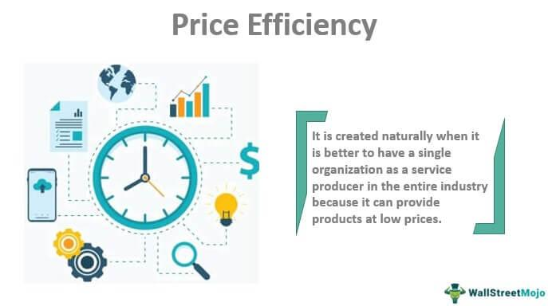

## Table of Contents

## What is price efficiency?

Price efficiency is when the price of something, like a stock or a product, shows all the information that people know about it. This means that the price is fair because it includes everything everyone knows. For example, if a company is doing well, the price of its stock will go up because people know it's doing well. If the company is not doing well, the price will go down.

In a market that is price efficient, it's hard to make a lot of money quickly by guessing the price will go up or down. This is because the price already shows all the information. So, if you want to make money, you need to look at other things, like how the company is run or what new products it might make. This makes investing more about understanding the business and less about trying to guess the next price change.

## Why is price efficiency important in markets?

Price efficiency is important in markets because it helps make sure that prices are fair. When prices are efficient, they show all the information that people know about a product or a stock. This means that if a company is doing well, its stock price will be higher because everyone knows it's doing well. If the company is not doing well, the price will be lower. This fairness helps people trust the market more because they know the prices are based on real information.

Another reason price efficiency is important is that it makes the market work better. When prices show all the information, it's harder for people to make quick money by guessing if the price will go up or down. Instead, people need to think more about the business itself, like how it's run or what new products it might make. This makes investing more about understanding the business and less about trying to guess the next price change. In the end, this can lead to a more stable and reliable market where people can make better decisions.

## How is price efficiency measured?

Price efficiency is measured by looking at how well the prices of stocks or products show all the information that people know. One way to do this is by checking if prices change quickly when new information comes out. If prices go up or down right after new news, it means the market is good at using new information, which is a sign of price efficiency.

Another way to measure price efficiency is by seeing if it's hard to make money by guessing the next price change. If people can't easily make money by predicting prices, it means the prices already show all the information, so they are efficient. Researchers often use special tests and studies to see if the market is efficient, looking at lots of data over time to make sure their findings are correct.

## Can you give examples of price efficiency in different markets?

In the stock market, price efficiency can be seen when a company announces good news, like a new product that people want. If the stock price goes up right away, it shows that the market is using the new information quickly. For example, if a tech company like Apple announces a new iPhone, and the stock price jumps up the same day, it means the market is efficient because the price shows what people know about the new product.

In the housing market, price efficiency can be seen when house prices change based on what's happening in the area. If a new school or shopping center is built nearby, and house prices go up because of it, that's a sign of price efficiency. The prices are showing that people know about the new things that make the area better to live in. For example, if a new subway line is built near some houses, and the prices of those houses go up quickly, it means the market is using the new information well.

In the commodity market, like oil or gold, price efficiency can be seen when prices change based on news about supply and demand. If there's news about a big new oil find, and the price of oil goes down because there will be more oil, that's a sign of price efficiency. The price is showing what people know about the new oil. For example, if a new gold mine is discovered, and the price of gold drops because there will be more gold, it means the market is efficient because the price is showing the new information about supply.

## What factors contribute to price efficiency?

Many things help make prices efficient in markets. One big thing is how fast and well information spreads. When everyone knows about something new quickly, like a company doing well or a new product coming out, the price can change fast to show that new information. Also, lots of people buying and selling helps. When many people are trading, it's harder for one person to change the price too much, so the price stays fair and shows what everyone knows.

Another thing that helps is how easy it is to trade. When it's easy to buy and sell things, like stocks or houses, the price can change quickly to show new information. Rules and laws also help. When there are good rules that stop people from cheating or hiding information, the market can be more fair. This makes sure that prices show all the information that people know, so they are more efficient.

## What are the common misconceptions about price efficiency?

Some people think that price efficiency means you can never make money in the market. This is not true. Price efficiency means that prices show all the information that people know, but it does not mean that prices never change. You can still make money if you understand the business well and make smart choices about buying and selling.

Another common mistake is thinking that price efficiency means the market is always right. While prices do show a lot of information, they can still be wrong sometimes. For example, if everyone gets excited about a new product but it turns out to be bad, the price might go down later. So, price efficiency does not mean the market is perfect, but it does mean that prices are usually fair based on what people know at the time.

## How does technology impact price efficiency?

Technology helps make prices more efficient by making information spread faster. With the internet and smartphones, people can know about new things, like a company doing well or a new product, almost right away. This means that prices can change quickly to show what everyone knows. For example, if a company announces good news after the market closes, people can see it on their phones and the price can change when the market opens the next day.

Also, technology makes it easier to buy and sell things. With online trading and apps, more people can trade, which helps keep prices fair. When lots of people are buying and selling, it's harder for one person to change the price too much. This means the price stays fair and shows what everyone knows. So, technology helps make the market work better and prices more efficient.

## What are the limitations of price efficiency in real-world scenarios?

Price efficiency is a good idea, but it has some problems in real life. One big problem is that not everyone knows everything at the same time. Some people might have special information that others do not, and this can make prices not fair. For example, if someone knows a company is going to do badly before everyone else, they can sell their stock before the price goes down. This means the price does not show what everyone knows, so it's not as efficient.

Another problem is that people can get too excited or too worried about things. This can make prices go up or down too much, even if the information is not that important. For example, if everyone gets excited about a new product but it turns out to be bad, the price might go up a lot and then go down a lot. This means the price is not always fair because it can be affected by how people feel, not just by what they know.

## How do regulatory frameworks affect price efficiency?

Regulatory frameworks help make prices more efficient by setting rules that everyone has to follow. These rules stop people from cheating or hiding information. When everyone plays fair, the prices can show what everyone knows. For example, if a company has to tell everyone about its money problems, the price of its stock can go down right away. This means the price is fair because it shows what people know.

But sometimes, too many rules can make things harder. If it's too hard to buy and sell things because of lots of rules, prices might not change as fast as they should. This can make the market less efficient. For example, if it takes a long time to approve a new product, the price might not show the new information quickly. So, while rules help keep things fair, they need to be balanced so they don't slow down the market too much.

## What role do market participants play in achieving price efficiency?

Market participants, like buyers and sellers, help make prices efficient by sharing information and trading a lot. When lots of people are buying and selling, it's hard for one person to change the price too much. This means the price stays fair and shows what everyone knows. For example, if many people think a company is doing well, they will buy its stock, and the price will go up to show that.

But sometimes, market participants can make prices less efficient. If some people have special information that others do not, they can buy or sell before everyone else knows. This can make the price not fair because it does not show what everyone knows. Also, if people get too excited or too worried, they can make prices go up or down too much, even if the information is not that important. So, while market participants help make prices efficient, they can also make them less efficient if they do not play fair or get too emotional.

## How can price efficiency be improved in less efficient markets?

To make prices more efficient in markets that are not doing well, we need to make sure information spreads quickly and fairly. This means using technology like the internet and smartphones to tell everyone about new things fast. If people know about a company doing well or a new product right away, the price can change to show what everyone knows. Also, having more people buy and sell helps. When lots of people are trading, it's harder for one person to change the price too much, so the price stays fair and shows what everyone knows.

Rules and laws can also help make prices more efficient. When there are good rules that stop people from cheating or hiding information, the market can be more fair. This makes sure that prices show all the information that people know, so they are more efficient. But, we need to be careful not to have too many rules because they can make it hard to buy and sell things quickly. So, finding the right balance is important to make the market work better and prices more efficient.

## What advanced theories or models explain the dynamics of price efficiency?

One advanced theory that helps explain how prices become efficient is called the Efficient Market Hypothesis (EMH). This theory says that the price of a stock or product shows all the information that people know about it. There are three types of EMH: weak, semi-strong, and strong. Weak EMH says that past prices cannot help predict future prices because all past information is already in the price. Semi-strong EMH says that prices change quickly when new public information comes out, so you cannot make money by acting on new news. Strong EMH says that even private information is quickly shown in the price, so no one can make money by knowing secret things. This theory helps us understand why it's hard to make quick money in the market.

Another model that explains price efficiency is called the Adaptive Market Hypothesis (AMH). This model says that markets are not always perfect and can change over time. It mixes ideas from economics and biology to say that people learn and adapt to new information, which affects how prices change. Unlike the EMH, which says markets are always efficient, the AMH says that markets can be more or less efficient depending on what's happening. This means that sometimes it's easier to make money in the market, and sometimes it's harder. The AMH helps us see that price efficiency is not always the same and can change based on how people behave and what they know.

## What is Demystifying Price Efficiency?

Price efficiency is a critical concept within financial markets, positing that asset prices integrate all available information, thereby reflecting their true value. This concept forms a core tenet of the Efficient Market Hypothesis (EMH), which asserts that it is challenging for investors to consistently achieve returns exceeding the market average because all known information is already factored into asset prices.

Central to understanding price efficiency is the EMH, which can be categorized into three forms: weak, semi-strong, and strong. Each form reflects a different level of information integration into asset prices:

1. **Weak-form efficiency** suggests that current asset prices reflect all historical price information. In a weak-form efficient market, technical analysis—using past price data to predict future prices—is unlikely to yield consistently superior returns.

2. **Semi-strong form efficiency** posits that asset prices incorporate all publicly available information, including historical data and new public disclosures such as earnings reports or economic indicators. In such markets, attempting to outperform the market using public information would be futile since it is already embedded in stock prices.

3. **Strong-form efficiency** asserts that asset prices incorporate all information, both public and private, meaning that even insider information cannot give an investor an edge. While most practical markets do not entirely exhibit strong-form efficiency due to the impact of insider trading, this form represents the theoretical pinnacle of market efficiency.

Price efficiency influences investment decision-making and asset valuation in several ways. For example, if markets are fully efficient, the role of active managers and analysts is diminished, as they cannot leverage information to gain excess returns. Instead, investors might gravitate towards passive investment strategies, which aim to replicate market indices rather than forecast price movements.

Moreover, in an efficient market, the fair value of an asset is always apparent, as all known factors affecting its price are continuously assessed by market participants and reflected in its current trading price. This reduces the chance of significant mispricing and ensures that capital is allocated efficiently across the economy.

Mathematically, the concept of price efficiency can be represented by the equation:

$$
P_t = E(P_{t+1} | \mathcal{I}_t)
$$

Where $P_t$ is the price of the asset at time $t$, $E(P_{t+1} | \mathcal{I}_t)$ is the expected future price based on the information set $\mathcal{I}_t$ available at time $t$. This equation highlights the notion that the price today reflects an unbiased expectation of future prices given current information.

In practice, the pursuit of price efficiency also encounters challenges, including behavioral biases and market anomalies that may cause deviations from theoretically efficient prices. While these inconsistencies occur, the overarching framework of price efficiency remains integral, guiding investment philosophies and shaping financial markets' structure and function.

## References & Further Reading

[1]: Fama, E. F. (1970). ["Efficient Capital Markets: A Review of Theory and Empirical Work."](https://www.jstor.org/stable/2325486) Journal of Finance, 25(2), 383-417.

[2]: Lo, A. W. (2004). ["The Adaptive Markets Hypothesis: Market Efficiency from an Evolutionary Perspective."](https://papers.ssrn.com/sol3/papers.cfm?abstract_id=602222) Journal of Portfolio Management, 30(5), 15-29.

[3]: Carhart, M. M. (1997). ["On Persistence in Mutual Fund Performance."](https://onlinelibrary.wiley.com/doi/full/10.1111/j.1540-6261.1997.tb03808.x) Journal of Finance, 52(1), 57-82.

[4]: Hendershott, T., Jones, C. M., & Menkveld, A. J. (2011). ["Does Algorithmic Trading Improve Liquidity?"](https://onlinelibrary.wiley.com/doi/full/10.1111/j.1540-6261.2010.01624.x) Journal of Finance, 66(1), 1-33.

[5]: Barker, G., & Pomerantz, D. (2006). ["Market Efficiency and Behavioral Finance."](https://www.researchgate.net/publication/247504649_Market_Efficiency_or_Behavioral_Finance_The_Nature_of_the_Debate) Financial Management, 35(4), 5-16.