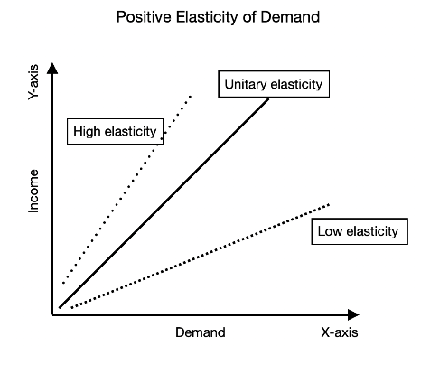

In the rapidly evolving landscape of financial markets, understanding economic principles such as price elasticity is crucial for developing successful trading strategies. Price elasticity measures how the quantity demanded or supplied of a commodity responds to price changes, offering insights into consumer behavior and market dynamics. Algorithmic trading, which employs pre-programmed instructions to execute trades at high speed, stands to benefit significantly from the integration of elasticity measures.

Algorithmic trading has transformed financial markets by enabling faster decision-making and execution than traditional human trading. With algorithms controlling a significant portion of market volume, their effectiveness depends heavily on the quality of data and economic models they employ. Incorporating price elasticity into these models can improve market responsiveness and trading performance. Given that price elasticity reflects how demand and supply respond to price fluctuations, it serves as a powerful tool for anticipating market movements and aligning trading strategies accordingly.



This article examines how concepts like price elasticity, supply and demand economics, and algorithmic trading can be harmonized to enhance trading efficacy. By understanding the sensitivities of goods and services to price changes, traders can optimize their algorithms for more strategic decision-making, potentially improving stop-loss adjustments, profit targeting, and investment timing. As technology and data analytics continue to advance, the integration of elasticity measures into trading systems will become increasingly critical for maintaining a competitive edge in financial markets.

## Table of Contents

## Understanding Price Elasticity in Economics

Price elasticity in economics is a quantitative measure that assesses how the quantity demanded or supplied of a good responds to changes in price. Understanding this concept is essential for analyzing market behaviors and guiding strategic decisions within various economic and trading frameworks.

### Types of Elasticity

1. **Price Elasticity of Demand (PED)**:
   - **Definition**: Measures the responsiveness of the quantity demanded of a good to a change in its price.
   - **Formula**: $\text{PED} = \frac{\%\ \text{Change in Quantity Demanded}}{\%\ \text{Change in Price}}$
   - **Interpretation**: If PED > 1, demand is elastic (sensitive to price changes). If PED < 1, demand is inelastic (insensitive to price changes).

2. **Price Elasticity of Supply (PES)**:
   - **Definition**: Assesses the responsiveness of the quantity supplied of a good to changes in its price.
   - **Formula**: $\text{PES} = \frac{\%\ \text{Change in Quantity Supplied}}{\%\ \text{Change in Price}}$
   - **Interpretation**: Similar to PED, supply is elastic if PES > 1, and inelastic if PES < 1.

3. **Income Elasticity of Demand (YED)**:
   - **Definition**: Captures how the quantity demanded of a good responds to changes in consumer income.
   - **Formula**: $\text{YED} = \frac{\%\ \text{Change in Quantity Demanded}}{\%\ \text{Change in Income}}$
   - **Interpretation**: Goods can be normal (YED > 0), inferior (YED < 0), or luxury (YED > 1).

4. **Cross-Price Elasticity of Demand (XED)**:
   - **Definition**: Measures how the quantity demanded of one good changes in response to a price change of another good.
   - **Formula**: $\text{XED} = \frac{\%\ \text{Change in Quantity Demanded of Good A}}{\%\ \text{Change in Price of Good B}}$
   - **Interpretation**: If XED > 0, the goods are substitutes; if XED < 0, they are complements.

### Importance in Market Analysis

Analyzing elasticity is crucial for understanding consumer behavior and market dynamics. Economists and traders use these measures to:

- **Predict Consumer Reactions**: By determining how price changes affect demand and supply, businesses can forecast how consumers might react to changes in market conditions or policy implementations.
- **Optimize Pricing Strategies**: Knowing the elasticity allows firms to set prices that maximize revenue. In markets with elastic demand, a price decrease might lead to higher revenue, whereas in inelastic markets, price increases can be strategically advantageous.
- **Assess Market Dynamics**: Changes in income levels or related goods' prices can significantly influence demand and supply. Understanding these relationships helps firms anticipate market shifts and adjust strategies accordingly.

These elasticity measures form the backbone of strategic economic analysis, equipping businesses with the insights necessary to navigate competitive markets effectively.

## Supply and Demand: The Backbone of Price Elasticity

Supply and demand are fundamental concepts in market economics, serving as the primary mechanism for determining the prices of goods and services in a competitive environment. The interactions between supply, demand, and price elasticity are critical in understanding how markets function.

Supply refers to the quantity of a good or service that producers are willing and able to offer for sale at various price levels. Conversely, demand represents the quantity that consumers are willing and able to purchase at different prices. The relationship between these two forces determines the market equilibrium, where the quantity supplied equals the quantity demanded.

Price elasticity of demand is a measure of how sensitive the quantity demanded is to a change in price. It is quantitatively expressed as:

$$
E_d = \frac{\%\ \Delta \text{{Quantity Demanded}}}{\%\ \Delta \text{{Price}}}
$$

where $E_d$ is the elasticity of demand. If $E_d > 1$, the demand is considered elastic, meaning consumers are responsive to price changes. If $E_d < 1$, demand is inelastic, indicating consumers are less responsive to price shifts.

Similarly, price elasticity of supply measures how much the quantity supplied changes in response to a change in price:

$$
E_s = \frac{\%\ \Delta \text{{Quantity Supplied}}}{\%\ \Delta \text{{Price}}}
$$

Understanding elasticity is crucial for traders and market analysts, as it influences how they interpret market signals and price movements. A highly elastic market indicates that small changes in price can lead to significant changes in the quantity demanded or supplied, which may signal opportunities for strategic trading. Conversely, in markets with inelastic supply or demand, prices might remain relatively stable despite changes in quantity.

The elasticity of supply and demand directly affects the market equilibrium. For instance, if a product experiences a sudden increase in demand, firms with elastic supply can increase production quickly to meet new demand, minimizing price changes. On the other hand, if supply is inelastic, prices are likely to rise until the market reaches a new equilibrium.

Traders must grasp these concepts thoroughly as they provide essential insights into market dynamics. Accurately predicting how changes in external factors, such as consumer preferences or production costs, can impact supply and demand is instrumental in identifying potential market fluctuations and creating effective trading strategies.

Incorporating elasticity into economic models aids in forecasting these fluctuations, thereby equipping traders with the tools to react strategically to market changes. Understanding the interplay of supply, demand, and elasticity allows for more informed decision-making and the development of robust trading strategies that can withstand the [volatility](/wiki/volatility-trading-strategies) of the financial markets.

## Algorithmic Trading: Integrating Elasticity Measures

Algorithmic trading leverages computer algorithms to perform trading activities at speeds and frequencies impractical for human traders. These algorithms use a variety of inputs, including historical and real-time market data, to inform their decision-making. Integrating measures of economic elasticity into these algorithms can enhance their capability to anticipate how markets might react to price changes.

Economic elasticity measures the responsiveness of one variable to a change in another variable, typically focusing on price changes' impact on supply or demand. For [algorithmic trading](/wiki/algorithmic-trading), incorporating elasticity measures allows for more sophisticated modeling of market behavior, helping to anticipate how variations in price could affect supply and demand dynamics.

One of the principal benefits of elasticity-informed algorithms is in refining stop-loss adjustments. A stop-loss order is a predetermined point at which a trader will sell a security to limit losses. By integrating price elasticity into trading algorithms, these stop-loss orders can dynamically adjust based on anticipated market movements. For instance, algorithms can predict increased volatility or shifts in demand elasticity, allowing for real-time adaptation of stop-loss levels.

Profit targeting can also be significantly improved. Elasticity measures provide insights into the potential range of price adjustments that can occur in response to various stimuli. With this information, algorithms can set more accurate profit targets that reflect expected price movements. This adaptability increases the likelihood of securing profits without premature exits.

Trade timing is another area where elasticity measures can optimize execution. Understanding how quickly the demand or supply reacts to price changes enables algorithms to determine optimal entry and [exit](/wiki/exit-strategy) points. For example, if an algorithm identifies that a stock's price elasticity indicates a slower response to price drops than price increases, it might delay selling until it detects a rebound.

Incorporating elasticity into algorithmic trading strategies involves mathematical modeling, often utilizing formulas for price elasticity of demand and supply. For instance, the price elasticity of demand ($E_d$) is calculated as:

$$
E_d = \frac{\text{% change in quantity demanded}}{\text{% change in price}}
$$

In practice, such calculations can be integrated into trading systems using programming languages like Python. Here's a simplistic example of how this calculation might be coded:

```python
def calculate_price_elasticity(change_in_quantity, change_in_price):
    return (change_in_quantity / change_in_price)

# Example values
change_in_quantity = -10  # Example: -10% change
change_in_price = 5       # Example: 5% change

elasticity = calculate_price_elasticity(change_in_quantity, change_in_price)
print("Price Elasticity of Demand:", elasticity)
```

By continuously updating and integrating these calculations into trading algorithms, traders can create systems that nimbly respond to market changes, enhancing both risk management and profit opportunities.

## Mathematical Formulations of Elasticity in Trading

Quantitative expressions of elasticity serve as essential tools in algorithmic trading. The price elasticity of demand is mathematically expressed as:

$$
E_d = \frac{\% \text{ change in quantity demanded}}{\% \text{ change in price}} = \frac{\Delta Q_d / Q_d}{\Delta P / P}
$$

Where $E_d$ represents the price elasticity of demand, $\Delta Q_d$ is the change in quantity demanded, and $\Delta P$ denotes the change in price. This formulation indicates how responsive the quantity demanded is to changes in price. Similarly, the price elasticity of supply is given by:

$$
E_s = \frac{\% \text{ change in quantity supplied}}{\% \text{ change in price}} = \frac{\Delta Q_s / Q_s}{\Delta P / P}
$$

These elasticity measurements are pivotal in predicting how supply and demand dynamics may shift in response to pricing changes, enabling more adaptive trading strategies.

In the context of algorithmic trading, these formulas can be efficiently implemented to refine trading models. By understanding potential supply and demand fluctuations, algorithms can adjust trading parameters such as order sizes and timing, optimizing entry and exit points. For instance, in a basic algorithm, one might use Python to calculate and utilize these elasticities:

```python
def calculate_elasticity(change_in_quantity, original_quantity, change_in_price, original_price):
    return (change_in_quantity / original_quantity) / (change_in_price / original_price)

quantity_demanded = 100  # example data
price = 50
new_quantity_demanded = 110
new_price = 45

elasticity = calculate_elasticity(new_quantity_demanded - quantity_demanded, quantity_demanded, new_price - price, price)
```

Implementation of such elasticity calculations in trading systems allows for better anticipation of market dynamics and enhances the automation of strategies. This optimization can lead programs to automatically adjust stop-loss levels, set profit-taking targets, or even time the execution of trades to align with predicted market responses, thereby refining the overall trading model.

## Practical Applications and Benefits

Incorporating elasticity measures into trading strategies significantly enhances the precision of predicting market movements and improving risk management. By understanding the responsiveness of demand and supply to price changes, traders can effectively harness real-time elasticity insights to make informed decisions that optimize their portfolios. For instance, if the price elasticity of demand for a certain asset is high, substantial price changes can lead to significant variances in demand, suggesting a greater potential for price-driven trading opportunities.

Algorithmic trading systems benefit greatly from these insights. By programmatically integrating elasticity measures, such systems can execute trades in alignment with the market's anticipated behaviors, thus enhancing profitability. For example, an algorithm could incorporate the formula for price elasticity of demand ($E_d = \frac{\% \Delta Q_d}{\% \Delta P}$) to assess the potential impact of price changes on demand and adjust trading parameters accordingly.

Furthermore, algorithms equipped with elasticity data can dynamically adjust stop-loss orders, profit targets, and re-entry points, improving the overall timing and execution of trades. This capability allows traders to react swiftly to market shifts and adjust their exposure to risk in real-time, ensuring their strategies remain aligned with current market conditions. Using Python, traders could implement the following code snippet to calculate elasticity:

```python
def calculate_price_elasticity(demand_initial, demand_final, price_initial, price_final):
    percent_change_quantity = (demand_final - demand_initial) / demand_initial
    percent_change_price = (price_final - price_initial) / price_initial
    elasticity = percent_change_quantity / percent_change_price
    return elasticity

# Example usage
initial_demand = 500
final_demand = 450
initial_price = 100
final_price = 90

elasticity = calculate_price_elasticity(initial_demand, final_demand, initial_price, final_price)
print(f'Price Elasticity of Demand: {elasticity:.2f}')
```

This approach not only ensures a responsive and agile trading strategy but also provides a substantial edge in maximizing investment returns while managing risks. By continuously updating algorithmic models with elasticity data, traders can enhance their predictive accuracy and maintain robust risk management frameworks.

## Challenges and Considerations

Accurate calculation of elasticity in the context of algorithmic trading requires access to comprehensive datasets and continuous adaptation to dynamic market conditions. This complexity arises from the intricate nature of financial markets where variables influencing price elasticity, such as consumer preferences, income levels, and related goods, must be constantly analyzed and updated. High-frequency data collection and robust data storage solutions are essential to ensure that the trading algorithms have sufficient information to process and make informed decisions.

Algorithmic trading systems that aim to incorporate elasticity measures demand significant computational power and advanced technological infrastructure. These systems need to execute complex algorithms that can adjust trading parameters in real time based on elasticity insights. For example, evaluating the price elasticity of demand requires comparing percentage changes in quantity demanded with percentage changes in price, often using the formula:

$$
E_d = \frac{\Delta Q_d / Q_d}{\Delta P / P}
$$

where $E_d$ is the price elasticity of demand, $\Delta Q_d$ is the change in quantity demanded, $Q_d$ is the original quantity demanded, $\Delta P$ is the change in price, and $P$ is the original price. Efficient calculation and integration of such metrics necessitate powerful computational resources and sophisticated software capable of handling complex real-time computations.

Traders must also contend with the need to continuously update and refine their models to keep pace with fluctuating economic factors and evolving market dynamics. This involves not only recalibrating elasticity models in response to new data but also reassessing the underlying assumptions of these models. For instance, shifts in macroeconomic indicators, regulatory changes, or emerging market trends can all influence elasticity metrics, thereby affecting trading strategies.

Python, with its array of libraries such as Pandas for data manipulation, NumPy for numerical calculations, and SciPy for scientific computing, provides a suitable environment for implementing and testing these models. An example snippet for calculating elasticity in Python is as follows:

```python
import pandas as pd

def calculate_price_elasticity(price_series, quantity_series):
    percentage_change_quantity = quantity_series.pct_change()
    percentage_change_price = price_series.pct_change()
    elasticity = percentage_change_quantity / percentage_change_price
    return elasticity

price_data = pd.Series([100, 105, 110])
quantity_data = pd.Series([50, 47, 45])

elasticity = calculate_price_elasticity(price_data, quantity_data)
print(elasticity)
```

Ultimately, a successful integration of price elasticity into algorithmic trading systems hinges on the ability of traders and their technologies to swiftly adapt to ongoing changes, leveraging insights effectively to enhance trading performance and manage risks.

## Conclusion

Elasticity is a pivotal concept that, when integrated into algorithmic trading, offers a substantial advantage in predicting and reacting to market changes. It enables traders to understand how sensitive the quantity demanded or supplied of an asset is to changes in price, providing crucial insights for making informed trading decisions. By employing elasticity measures, algorithmic trading systems can enhance their performance by adapting to price fluctuations more effectively.

The integration of advanced technology and data analytics into trading strategies continues to refine the application of elasticity in the financial markets. High-frequency data and sophisticated algorithms allow traders to compute elasticity measures with greater accuracy and in real-time. This technological progress facilitates the implementation of dynamic trading strategies that can swiftly respond to evolving market conditions.

Traders who adeptly incorporate elasticity into their models can optimize strategies by aligning trading decisions with anticipated market behavior. Such integration not only aids in managing risk through improved stop-loss and profit-targeting mechanisms but also uncovers trading opportunities that might otherwise remain unexploited. By leveraging elasticity-informed algorithms, traders can achieve a more precise calibration of their trading actions, thereby enhancing their potential for profitability in the competitive financial markets.

In summary, the thoughtful application of elasticity in algorithmic trading is a crucial [factor](/wiki/factor-investing) that empowers traders to optimize their strategies and manage risks efficiently. As technology and data analytics continue to advance, traders equipped with elasticity insights stand to gain a significant competitive edge in capturing market opportunities.

## References & Further Reading

Varian, H. R. "Microeconomic Analysis" – This book provides an in-depth examination of microeconomic principles, including the concept of elasticity. It offers valuable insights into how elasticity influences various economic behaviors and market outcomes.

Perloff, J. M. "Microeconomics" – Perloff's work is an authoritative resource that highlights the interactions within markets, emphasizing the role of elasticity in understanding consumer choices and market dynamics.

Mankiw, N. G. "Principles of Economics" – A fundamental guide to economic principles, Mankiw's textbook covers elasticity extensively, presenting its importance in the broader context of economics and decision-making processes.

InvestingAnswers.com – This online platform offers comprehensive resources for understanding the fundamentals of price elasticity. It provides practical examples and explanations that are useful for both beginners and seasoned investors seeking to comprehend how elasticity affects financial markets.

