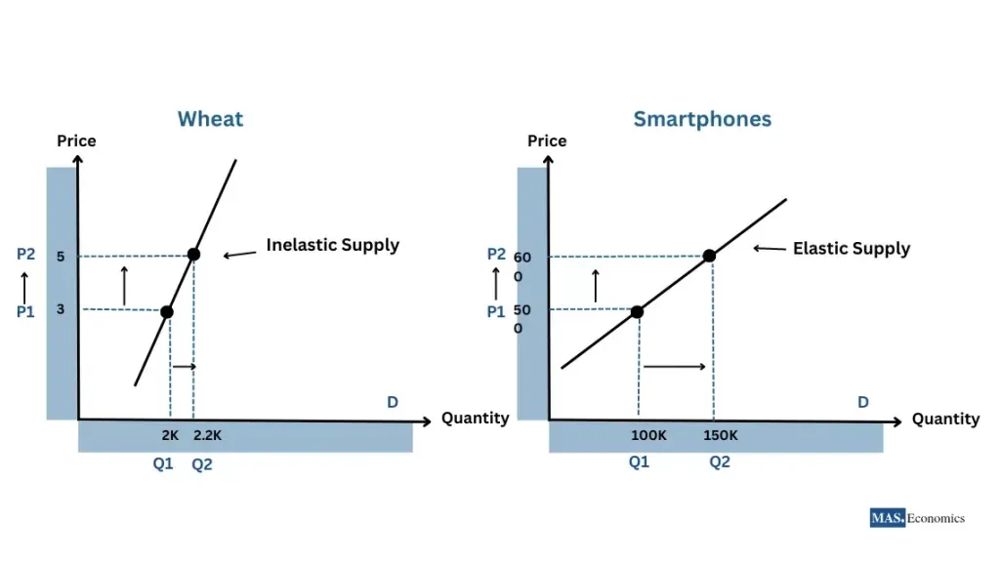

## Table of Contents

## What is price elasticity of demand?

Price elasticity of demand is a measure that shows how much the quantity demanded of a product changes when its price changes. It helps businesses understand how sensitive their customers are to price changes. If the price of a product goes up and people still buy a lot of it, the demand is said to be inelastic. On the other hand, if a small increase in price causes people to buy much less of the product, the demand is elastic.

This concept is important for companies when they are deciding on pricing strategies. For example, if a product has elastic demand, a company might be careful about raising prices because it could lose a lot of customers. If a product has inelastic demand, the company might feel more comfortable raising prices because it knows people will still buy it. Understanding price elasticity helps businesses make smarter decisions about pricing and can affect their overall profitability.

## How is price elasticity of demand calculated?

Price elasticity of demand is calculated by dividing the percentage change in the quantity demanded of a product by the percentage change in its price. The formula looks like this: Price Elasticity of Demand = (% Change in Quantity Demanded) / (% Change in Price). For example, if the price of a chocolate bar goes up by 10% and the quantity demanded drops by 20%, the price elasticity of demand would be 20% / 10% = 2.

This number tells us how sensitive people are to changes in the price of the product. If the result is greater than 1, it means the demand is elastic, and people are very sensitive to price changes. If it's less than 1, the demand is inelastic, and people are not very sensitive to price changes. If the result is exactly 1, the demand is called unit elastic, meaning the percentage change in quantity demanded is equal to the percentage change in price.

## What does it mean if a product has elastic demand?

If a product has elastic demand, it means that people will buy a lot more or a lot less of it when the price changes even a little bit. For example, if the price goes up just a bit, people might stop buying it because they can easily find something else to buy instead. This kind of product is usually one where people can choose from many similar options or where it's not something they absolutely need.

Understanding that a product has elastic demand is important for businesses. If they raise the price of a product with elastic demand, they might lose a lot of customers because those customers will just go and buy something else. So, companies need to be careful with pricing these kinds of products. They might even lower the price a bit to sell more and make more money overall.

## What does it mean if a product has inelastic demand?

If a product has inelastic demand, it means that people will keep buying it even if the price goes up a lot. This happens because the product is something people really need or want, and they don't have many other choices. For example, medicine or gasoline often have inelastic demand because people need them no matter what the price is.

Understanding that a product has inelastic demand can help businesses make decisions. If a company knows its product is inelastic, it might raise the price a bit to make more money because people will still buy it. But they have to be careful not to raise it too much, or people might start looking for other options or use less of the product.

## How does price elasticity affect a company's pricing strategy?

Price elasticity of demand helps a company decide how to set prices for its products. If a product has elastic demand, it means people are very sensitive to price changes. So, if the company raises the price even a little, it might lose a lot of customers. In this case, the company might choose to keep prices low or even lower them to sell more products and make more money overall. This is important for things like snacks or clothes where people can easily choose something else if the price goes up.

On the other hand, if a product has inelastic demand, it means people will keep buying it even if the price goes up. This is common for things like medicine or gas, which people need no matter what. In this situation, a company might decide to raise the price a bit to make more money because people will still buy the product. But they need to be careful not to raise it too much, or people might start looking for other options or use less of the product.

Understanding price elasticity helps companies make smart choices about pricing. It can help them find the right balance between making more money and keeping their customers happy. By knowing how sensitive their customers are to price changes, companies can set prices that help them stay profitable and competitive in the market.

## Can you explain the concept of cross-price elasticity?

Cross-price elasticity is a way to see how the price of one product can affect how much people buy of another product. It helps businesses understand if two products are related. For example, if the price of coffee goes up, people might start buying more tea instead. This would mean that coffee and tea are substitutes, and their cross-price elasticity is positive. On the other hand, if the price of coffee goes up and people buy less cream, it shows that coffee and cream are complements, and their cross-price elasticity is negative.

To calculate cross-price elasticity, you divide the percentage change in the quantity demanded of one product by the percentage change in the price of the other product. If the result is a positive number, it means the two products are substitutes. If it's a negative number, they are complements. Knowing the cross-price elasticity helps companies make smart decisions about pricing and marketing. For example, if a company knows that raising the price of one of its products might make people buy more of a competitor's product, it might decide to keep the price the same or even lower it to keep its customers.

## How does income elasticity of demand relate to price elasticity?

Income elasticity of demand and price elasticity of demand both help businesses understand how people buy things, but they look at different things. Price elasticity of demand tells us how much the amount people buy of a product changes when its price changes. If the price goes up and people still buy a lot, the demand is inelastic. If a small price increase makes people buy a lot less, the demand is elastic. This helps companies decide how to price their products.

Income elasticity of demand, on the other hand, tells us how much the amount people buy of a product changes when their income changes. If people's income goes up and they buy a lot more of a product, it's called a normal good and has a positive income elasticity. If people's income goes up and they buy less of a product, it's called an inferior good and has a negative income elasticity. While price elasticity focuses on price changes, income elasticity focuses on income changes. Both are important for businesses to understand because they help predict how sales might change with different economic conditions.

## What role does price elasticity play in the supply curve?

Price elasticity affects how much a company wants to make and sell of a product, which is shown by the supply curve. The supply curve usually goes up and to the right, meaning that if the price of a product goes up, companies will want to make and sell more of it. But how much they want to make can change depending on how sensitive people are to the price of the product. If the demand for a product is elastic, meaning people will buy a lot less if the price goes up, companies might not want to make as much because they know they won't sell as much at a higher price.

On the other hand, if the demand for a product is inelastic, meaning people will still buy it even if the price goes up, companies might want to make more of it. They know they can sell it at a higher price and still have customers. So, understanding price elasticity helps companies decide how much to make and at what price to sell it, which is important for drawing the supply curve.

## How does the elasticity of demand influence market equilibrium?

Elasticity of demand affects where the market finds its balance, or equilibrium. Market equilibrium is the point where how much people want to buy (demand) matches how much companies want to make and sell (supply). If demand is elastic, meaning people are very sensitive to price changes, a small increase in price can make them buy a lot less. This makes the demand curve flatter. When the demand curve is flatter, the equilibrium price and quantity will be more affected by changes in supply. For example, if something happens to make it easier for companies to make more of the product, they might lower the price a bit to sell more, and the new equilibrium will have a lower price and higher quantity.

On the other hand, if demand is inelastic, meaning people will still buy the product even if the price goes up, the demand curve is steeper. When the demand curve is steeper, changes in supply don't affect the equilibrium price and quantity as much. For example, if it becomes easier for companies to make more of the product, they might not lower the price much because people will still buy it at the higher price. So, the new equilibrium will have a price that stays about the same and a higher quantity. Understanding how elastic or inelastic demand is helps predict where the market will find its balance.

## What are the long-term vs. short-term effects of price elasticity on supply and demand?

In the short term, price elasticity can have quick effects on supply and demand. If the demand for a product is elastic, a small increase in price might make people buy a lot less of it right away. Companies might then decide to lower the price quickly to sell more. If the demand is inelastic, people will keep buying the product even if the price goes up a bit, so companies might raise the price to make more money in the short term. On the supply side, if it's easy to change how much of a product is made, companies can quickly adjust their production based on the price and demand.

In the long term, the effects of price elasticity can be different. If demand is elastic, companies might need to find ways to make their products more attractive or find new markets to sell in, because people will keep looking for cheaper options. If demand is inelastic, companies might keep raising prices slowly over time, knowing people will still buy the product. On the supply side, companies might invest in new technology or expand their production to meet the demand more efficiently. Over time, understanding price elasticity helps companies make better decisions about pricing and production to stay profitable and meet customer needs.

## How do government policies affect price elasticity and market dynamics?

Government policies can change how people react to price changes, which is called price elasticity. For example, if the government puts a tax on something like cigarettes, it makes them more expensive. If people still buy a lot of cigarettes even with the higher price, the demand is inelastic. But if people start buying a lot less because of the higher price, the demand is elastic. Governments can use taxes and subsidies to try to change how much people buy of certain things. If they want people to buy less of something bad for them, like sugary drinks, they might tax it to make it more expensive and hope the demand is elastic.

Government policies can also change the supply side of the market. For example, if the government gives money to farmers to grow more food, it can make the supply of food go up. This might make food prices go down if the demand doesn't change much. On the other hand, if the government puts rules on how much of something can be made, like limiting how much oil companies can produce, it can make the supply go down and prices go up. These policies can move the market to a new balance, or equilibrium, where the new price and amount of the product match what people want to buy and what companies want to sell.

## Can you discuss advanced econometric models used to estimate price elasticity in complex markets?

In complex markets, economists use advanced econometric models to figure out price elasticity. These models help them understand how people react to price changes in a more detailed way. One common model is the regression analysis, which looks at data to see how changes in price affect how much people buy. Economists can use different types of regression, like linear regression or more complex ones like logistic regression, depending on the data and what they want to learn. Another useful model is the time series analysis, which looks at how prices and sales change over time. This can help economists see if there are patterns or trends that affect price elasticity.

Another advanced model is the panel data model, which looks at data from different groups or places over time. This can help economists see how price elasticity might be different in different areas or for different groups of people. For example, they might find that people in one city are more sensitive to price changes than people in another city. Economists also use structural models, which try to understand the deeper reasons behind how people react to prices. These models can include things like how people's income or other products' prices affect their buying decisions. By using these advanced models, economists can get a better picture of how price changes affect what people buy in complex markets.

## What is the relationship between supply and demand and how does it serve as the backbone of price elasticity?

Supply and demand are fundamental concepts in market economics, serving as the primary mechanism for determining the prices of goods and services in a competitive environment. The interactions between supply, demand, and price elasticity are critical in understanding how markets function.

Supply refers to the quantity of a good or service that producers are willing and able to offer for sale at various price levels. Conversely, demand represents the quantity that consumers are willing and able to purchase at different prices. The relationship between these two forces determines the market equilibrium, where the quantity supplied equals the quantity demanded.

Price elasticity of demand is a measure of how sensitive the quantity demanded is to a change in price. It is quantitatively expressed as:

$$
E_d = \frac{\%\ \Delta \text{{Quantity Demanded}}}{\%\ \Delta \text{{Price}}}
$$

where $E_d$ is the elasticity of demand. If $E_d > 1$, the demand is considered elastic, meaning consumers are responsive to price changes. If $E_d < 1$, demand is inelastic, indicating consumers are less responsive to price shifts.

Similarly, price elasticity of supply measures how much the quantity supplied changes in response to a change in price:

$$
E_s = \frac{\%\ \Delta \text{{Quantity Supplied}}}{\%\ \Delta \text{{Price}}}
$$

Understanding elasticity is crucial for traders and market analysts, as it influences how they interpret market signals and price movements. A highly elastic market indicates that small changes in price can lead to significant changes in the quantity demanded or supplied, which may signal opportunities for strategic trading. Conversely, in markets with inelastic supply or demand, prices might remain relatively stable despite changes in quantity.

The elasticity of supply and demand directly affects the market equilibrium. For instance, if a product experiences a sudden increase in demand, firms with elastic supply can increase production quickly to meet new demand, minimizing price changes. On the other hand, if supply is inelastic, prices are likely to rise until the market reaches a new equilibrium.

Traders must grasp these concepts thoroughly as they provide essential insights into market dynamics. Accurately predicting how changes in external factors, such as consumer preferences or production costs, can impact supply and demand is instrumental in identifying potential market fluctuations and creating effective trading strategies.

Incorporating elasticity into economic models aids in forecasting these fluctuations, thereby equipping traders with the tools to react strategically to market changes. Understanding the interplay of supply, demand, and elasticity allows for more informed decision-making and the development of robust trading strategies that can withstand the [volatility](/wiki/volatility-trading-strategies) of the financial markets.

## How can Algorithmic Trading be integrated with Elasticity Measures?

Algorithmic trading leverages computer algorithms to perform trading activities at speeds and frequencies impractical for human traders. These algorithms use a variety of inputs, including historical and real-time market data, to inform their decision-making. Integrating measures of economic elasticity into these algorithms can enhance their capability to anticipate how markets might react to price changes.

Economic elasticity measures the responsiveness of one variable to a change in another variable, typically focusing on price changes' impact on supply or demand. For [algorithmic trading](/wiki/algorithmic-trading), incorporating elasticity measures allows for more sophisticated modeling of market behavior, helping to anticipate how variations in price could affect supply and demand dynamics.

One of the principal benefits of elasticity-informed algorithms is in refining stop-loss adjustments. A stop-loss order is a predetermined point at which a trader will sell a security to limit losses. By integrating price elasticity into trading algorithms, these stop-loss orders can dynamically adjust based on anticipated market movements. For instance, algorithms can predict increased volatility or shifts in demand elasticity, allowing for real-time adaptation of stop-loss levels.

Profit targeting can also be significantly improved. Elasticity measures provide insights into the potential range of price adjustments that can occur in response to various stimuli. With this information, algorithms can set more accurate profit targets that reflect expected price movements. This adaptability increases the likelihood of securing profits without premature exits.

Trade timing is another area where elasticity measures can optimize execution. Understanding how quickly the demand or supply reacts to price changes enables algorithms to determine optimal entry and [exit](/wiki/exit-strategy) points. For example, if an algorithm identifies that a stock's price elasticity indicates a slower response to price drops than price increases, it might delay selling until it detects a rebound.

Incorporating elasticity into algorithmic trading strategies involves mathematical modeling, often utilizing formulas for price elasticity of demand and supply. For instance, the price elasticity of demand ($E_d$) is calculated as:

$$
E_d = \frac{\text{% change in quantity demanded}}{\text{% change in price}}
$$

In practice, such calculations can be integrated into trading systems using programming languages like Python. Here's a simplistic example of how this calculation might be coded:

```python
def calculate_price_elasticity(change_in_quantity, change_in_price):
    return (change_in_quantity / change_in_price)

# Example values
change_in_quantity = -10  # Example: -10% change
change_in_price = 5       # Example: 5% change

elasticity = calculate_price_elasticity(change_in_quantity, change_in_price)
print("Price Elasticity of Demand:", elasticity)
```

By continuously updating and integrating these calculations into trading algorithms, traders can create systems that nimbly respond to market changes, enhancing both risk management and profit opportunities.

## What are the Mathematical Formulations of Elasticity in Trading?

Quantitative expressions of elasticity serve as essential tools in algorithmic trading. The price elasticity of demand is mathematically expressed as:

$$
E_d = \frac{\% \text{ change in quantity demanded}}{\% \text{ change in price}} = \frac{\Delta Q_d / Q_d}{\Delta P / P}
$$

Where $E_d$ represents the price elasticity of demand, $\Delta Q_d$ is the change in quantity demanded, and $\Delta P$ denotes the change in price. This formulation indicates how responsive the quantity demanded is to changes in price. Similarly, the price elasticity of supply is given by:

$$
E_s = \frac{\% \text{ change in quantity supplied}}{\% \text{ change in price}} = \frac{\Delta Q_s / Q_s}{\Delta P / P}
$$

These elasticity measurements are pivotal in predicting how supply and demand dynamics may shift in response to pricing changes, enabling more adaptive trading strategies.

In the context of algorithmic trading, these formulas can be efficiently implemented to refine trading models. By understanding potential supply and demand fluctuations, algorithms can adjust trading parameters such as order sizes and timing, optimizing entry and exit points. For instance, in a basic algorithm, one might use Python to calculate and utilize these elasticities:

```python
def calculate_elasticity(change_in_quantity, original_quantity, change_in_price, original_price):
    return (change_in_quantity / original_quantity) / (change_in_price / original_price)

quantity_demanded = 100  # example data
price = 50
new_quantity_demanded = 110
new_price = 45

elasticity = calculate_elasticity(new_quantity_demanded - quantity_demanded, quantity_demanded, new_price - price, price)
```

Implementation of such elasticity calculations in trading systems allows for better anticipation of market dynamics and enhances the automation of strategies. This optimization can lead programs to automatically adjust stop-loss levels, set profit-taking targets, or even time the execution of trades to align with predicted market responses, thereby refining the overall trading model.

## What are the challenges and considerations?

Accurate calculation of elasticity in the context of algorithmic trading requires access to comprehensive datasets and continuous adaptation to dynamic market conditions. This complexity arises from the intricate nature of financial markets where variables influencing price elasticity, such as consumer preferences, income levels, and related goods, must be constantly analyzed and updated. High-frequency data collection and robust data storage solutions are essential to ensure that the trading algorithms have sufficient information to process and make informed decisions.

Algorithmic trading systems that aim to incorporate elasticity measures demand significant computational power and advanced technological infrastructure. These systems need to execute complex algorithms that can adjust trading parameters in real time based on elasticity insights. For example, evaluating the price elasticity of demand requires comparing percentage changes in quantity demanded with percentage changes in price, often using the formula:

$$
E_d = \frac{\Delta Q_d / Q_d}{\Delta P / P}
$$

where $E_d$ is the price elasticity of demand, $\Delta Q_d$ is the change in quantity demanded, $Q_d$ is the original quantity demanded, $\Delta P$ is the change in price, and $P$ is the original price. Efficient calculation and integration of such metrics necessitate powerful computational resources and sophisticated software capable of handling complex real-time computations.

Traders must also contend with the need to continuously update and refine their models to keep pace with fluctuating economic factors and evolving market dynamics. This involves not only recalibrating elasticity models in response to new data but also reassessing the underlying assumptions of these models. For instance, shifts in macroeconomic indicators, regulatory changes, or emerging market trends can all influence elasticity metrics, thereby affecting trading strategies.

Python, with its array of libraries such as Pandas for data manipulation, NumPy for numerical calculations, and SciPy for scientific computing, provides a suitable environment for implementing and testing these models. An example snippet for calculating elasticity in Python is as follows:

```python
import pandas as pd

def calculate_price_elasticity(price_series, quantity_series):
    percentage_change_quantity = quantity_series.pct_change()
    percentage_change_price = price_series.pct_change()
    elasticity = percentage_change_quantity / percentage_change_price
    return elasticity

price_data = pd.Series([100, 105, 110])
quantity_data = pd.Series([50, 47, 45])

elasticity = calculate_price_elasticity(price_data, quantity_data)
print(elasticity)
```

Ultimately, a successful integration of price elasticity into algorithmic trading systems hinges on the ability of traders and their technologies to swiftly adapt to ongoing changes, leveraging insights effectively to enhance trading performance and manage risks.

## References & Further Reading

Varian, H. R. "Microeconomic Analysis" – This book provides an in-depth examination of microeconomic principles, including the concept of elasticity. It offers valuable insights into how elasticity influences various economic behaviors and market outcomes.

Perloff, J. M. "Microeconomics" – Perloff's work is an authoritative resource that highlights the interactions within markets, emphasizing the role of elasticity in understanding consumer choices and market dynamics.

Mankiw, N. G. "Principles of Economics" – A fundamental guide to economic principles, Mankiw's textbook covers elasticity extensively, presenting its importance in the broader context of economics and decision-making processes.

InvestingAnswers.com – This online platform offers comprehensive resources for understanding the fundamentals of price elasticity. It provides practical examples and explanations that are useful for both beginners and seasoned investors seeking to comprehend how elasticity affects financial markets.

