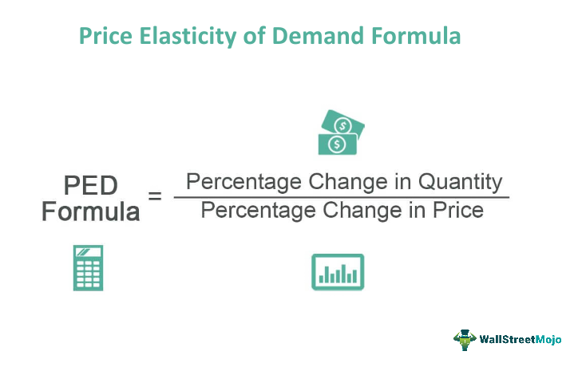

In today's dynamic economic environment, grasping the connections between price elasticity, economic modeling, demand forecasting, and algorithmic trading is vital for both businesses and investors. These concepts, though distinct in their primary focus and application, collectively shape strategies that navigate the complexities of modern financial markets.

Price elasticity of demand is the measure of how the quantity demanded of a good or service responds to changes in its price, offering insights into consumer behavior. Understanding this elasticity is fundamental for businesses aiming to optimize pricing strategies and forecast demand accurately. Price elasticity impacts market supply and demand dynamics, playing a crucial role in economic modeling, which uses mathematical frameworks to project future economic trends based on various variables, including past and present data. Accurate demand forecasting relies heavily on these models, integrating elasticity to predict consumer responses more precisely.



Economic modeling and demand forecasting are indispensable in forming the backbone of trading strategies, especially in algorithmic trading. This form of trading relies on complex algorithms to make buying or selling decisions based on quantitative data analyses. By incorporating principles of price elasticity and robust demand forecasting models, algorithmic trading systems can enhance decision-making processes, optimize trading outcomes, and contribute to enhanced market efficiency.

The convergence of these concepts embodies a comprehensive approach towards interpreting and responding to market signals. Businesses and investors leverage this understanding to design strategies that are resilient to market volatility and sensitive to shifts in consumer demand. As financial markets continue to evolve, staying attuned to the interplay between economic forces and technological advancements in trading remains critical for effective participation in the global economy.

## Table of Contents

## Understanding Price Elasticity of Demand

Price elasticity of demand is a crucial economic concept that quantifies how sensitive the quantity demanded of a good or service is to a change in its price. Mathematically, it is expressed as the percentage change in quantity demanded divided by the percentage change in price. The formula for price elasticity of demand ($E_d$) can be represented as:

$$

E_d = \frac{\%\ \text{change in quantity demanded}}{\%\ \text{change in price}}
$$

The value of $E_d$ determines the elasticity type, which can provide insights into consumer behavior and aid in strategic business decisions. Understanding the different types of elasticity is vital for economists and businesses aiming to predict market reactions and optimize pricing strategies.

### Types of Elasticity

1. **Perfectly Elastic Demand**: This occurs when a minimal change in price leads to an infinitely large change in quantity demanded. Graphically, the demand curve is a horizontal line, indicating that consumers will only buy at one price. Perfectly elastic demand is rare in real-world markets but can occur in perfect competition where products are homogenous.

2. **Relatively Elastic Demand**: In this scenario, the demand is considered relatively elastic if a small change in price leads to a significant change in quantity demanded. The absolute value of $E_d > 1$. A real-world example includes luxury goods or products with readily available substitutes; consumers can swiftly shift to alternatives if prices increase.

3. **Perfectly Inelastic Demand**: Here, quantity demanded remains constant regardless of price changes, and the demand curve is vertical. Essential goods, such as life-saving medications, can sometimes exhibit perfectly inelastic demand because consumers need them despite price fluctuations.

4. **Relatively Inelastic Demand**: Demand is relatively inelastic when changes in price result in proportionately smaller changes in quantity demanded. This typical scenario occurs when $0 < E_d < 1$. Necessities like basic food items or fuel often fall into this category, where consumers continue purchasing even if prices rise.

### Application in Predicting Consumer Behavior

Understanding these different elasticity types enables businesses to forecast how changes in price might affect sales [volume](/wiki/volume-trading-strategy) and revenue. For instance, if a company knows its product has relatively elastic demand, it may opt for competitive pricing strategies to avoid losing customers to competitors. Conversely, if a product is inelastic, businesses might increase prices to boost revenue without significantly impacting demand.

Economists utilize price elasticity of demand to anticipate market dynamics and inform policy-making. For example, when assessing the potential economic impact of tax changes, policymakers consider the elasticity of the affected goods and services. Tax authorities often impose higher taxes on inelastic goods since demand remains relatively stable despite price hikes, ensuring consistent tax revenue.

In summary, understanding price elasticity of demand helps businesses and economists predict consumer behavior in response to price changes, enabling informed decision-making and strategic planning. This concept is integral to economic modeling and forms the foundation for analyzing market trends and optimizing pricing strategies.

## Economic Modeling for Demand Forecasting

Economic modeling for demand forecasting utilizes mathematical and statistical techniques to predict future demand by analyzing both current and historical data. This process aids businesses and investors in making informed decisions by providing a clearer understanding of potential market trends and consumer behavior. Price elasticity of demand is a critical component of these models, serving to enhance the accuracy of predictions.

Price elasticity of demand quantifies how sensitive the quantity demanded of a good is to changes in its price. By incorporating elasticity into forecasting models, analysts are able to adjust predictions based on anticipated price variations, thus improving the relevance and precision of the models. For instance, a product with high price elasticity will experience significant changes in demand with small price changes, necessitating more dynamic modeling approaches to capture this variability.

Several techniques are prevalent in creating robust demand forecasting models. Linear regression is a foundational statistical method used to identify the relationship between a dependent variable, such as product demand, and one or more independent variables, including price and other market influencers. The general formula for a simple linear regression model is:

$$

Y = \beta_0 + \beta_1X_1 + \epsilon 
$$

where $Y$ is the dependent variable (demand), $X_1$ represents the independent variable (price), $\beta_0$ is the y-intercept, $\beta_1$ is the slope, and $\epsilon$ captures the error term.

Beyond traditional methods, [machine learning](/wiki/machine-learning) techniques have increasingly been adopted to build more sophisticated models. Algorithms such as decision trees, random forests, and neural networks can capture non-linear relationships and interactions between variables that traditional regression methods might miss. These advanced techniques leverage large datasets to improve forecast accuracy and adapt to changing market conditions more effectively.

For example, a machine learning model could utilize Python's Scikit-learn library to implement a random forest for demand forecasting. Here is a basic code snippet illustrating how this could be achieved:

```python
from sklearn.ensemble import RandomForestRegressor
from sklearn.model_selection import train_test_split
from sklearn.metrics import mean_squared_error
import pandas as pd

# Load and prepare your data
data = pd.read_csv('demand_data.csv')
X = data[['price', 'marketing_spend', 'seasonality']]
y = data['demand']

# Split the data into training and testing sets
X_train, X_test, y_train, y_test = train_test_split(X, y, test_size=0.2, random_state=42)

# Train the Random Forest model
rf_model = RandomForestRegressor(n_estimators=100, random_state=42)
rf_model.fit(X_train, y_train)

# Predict and evaluate the model
predictions = rf_model.predict(X_test)
mse = mean_squared_error(y_test, predictions)
print(f'Mean Squared Error: {mse}')
```

This example illustrates how machine learning models can handle multiple input variables to provide a more nuanced and comprehensive forecast. By leveraging both linear and non-linear methodologies, economic modeling provides powerful tools for anticipating demand and understanding the factors that drive it.

## The Role of Algorithmic Trading

Algorithmic trading involves the use of computer algorithms to execute trading decisions based on precise mathematical models and market data analysis. This approach allows for the rapid execution of trades that can exploit minimal price discrepancies in a highly competitive market environment. When integrated with economic prediction methodologies like demand forecasting and price elasticity, [algorithmic trading](/wiki/algorithmic-trading) can lead to more nuanced and effective trading strategies.

Understanding demand forecasting provides traders with essential insights into consumer demand patterns and potential price movements. By incorporating forecasts, algorithms can adjust trading parameters to align with expected shifts in market demand. For example, if demand forecasting data predicts an increase in the price of a commodity due to anticipated higher consumption, trading algorithms might adjust to take advantage of this movement by purchasing early.

Price elasticity of demand adds another layer of sophistication to algorithmic trading strategies. Price elasticity quantifies how sensitive the quantity demanded of a good or service is relative to a change in its price. Algorithmic systems use this elasticity to simulate various pricing scenarios and their potential impacts on trade volume. For instance, a highly elastic product implies significant changes in demand with small price variations, allowing algorithms to identify optimal trading points that maximize returns.

The integration of these economic predictions into trading algorithms is clearly beneficial. Algorithms leveraging economic modeling can optimize trading outcomes by selecting prices that contribute not only to immediate gains but also to the broader efficiency of the market. This is achieved by reducing market [volatility](/wiki/volatility-trading-strategies) through consistent, data-informed decision making. 

Furthermore, the synergy between economic forecasts and trading algorithms can lead to enhanced adaptability in dynamic markets. Algorithms can be programmed to continuously update their parameters based on real-time data, optimizing execution strategies to the present market conditions, ensuring that the traders remain competitive and informed.

Python, with libraries such as `pandas` for data manipulation, `scikit-learn` for machine learning, and `NumPy` for numerical computations, is commonly used in developing these algorithms. Here is an example of how demand forecasting can be integrated into a basic algorithmic trading strategy using Python:

```python
import pandas as pd
from sklearn.linear_model import LinearRegression
import numpy as np

# Sample data: past prices and volumes
data = {'Price': [100, 102, 104, 103, 105],
        'Volume': [200, 220, 215, 210, 230]}
df = pd.DataFrame(data)

# Define model
model = LinearRegression()

# Prepare data for modeling
X = df[['Price']].values  # Features
y = df['Volume'].values  # Target variable

# Fit the model
model.fit(X, y)

# Predict future volume based on an expected price
future_price = np.array([[106]])
predicted_volume = model.predict(future_price)

print(f"Predicted volume for price 106: {predicted_volume[0]}")
```

This simple model demonstrates how historical price and volume data can be used to forecast future demand, which can then be integrated into a trading algorithm to make smarter, data-backed decisions. Through such technologies, algorithmic trading continues to transform financial markets, making them more efficient and responsive to economic signals.

## Integrating Elasticity, Modeling, and Trading

Price elasticity, economic modeling, and algorithmic trading, when integrated, form a powerful framework for navigating the complexities of modern financial markets. Each component contributes uniquely to enhancing trading strategies and improving decision-making.

Price elasticity provides crucial insights into consumer behavior by quantifying how demand responds to changes in price. This understanding allows businesses and traders to anticipate shifts in the market and adjust their strategies accordingly. For instance, if a product is highly elastic, a small price reduction could significantly increase demand, whereas for inelastic products, price changes might have minimal impact on demand volume.

Economic modeling builds on this understanding by employing mathematical and statistical techniques to forecast demand. By incorporating price elasticity into these models, traders can more accurately predict market behavior under various scenarios. A common approach is using linear regression, where demand is a dependent variable, and price, along with other factors, serves as independent variables. For example:

```python
import numpy as np
import statsmodels.api as sm

# Sample data
price = np.array([10, 12, 15, 20])  # Prices
demand = np.array([100, 85, 65, 50])  # Corresponding demand

# Adding a constant for the intercept
price = sm.add_constant(price)

# OLS regression
model = sm.OLS(demand, price)
results = model.fit()

# Summary of the regression model
print(results.summary())
```

This Python code demonstrates how an Ordinary Least Squares (OLS) regression model can be set up to analyze the relationship between product price and customer demand, providing a basis for forecasting future trends. By integrating elasticity measures, these models can refine predictions and offer strategic insights for pricing.

Algorithmic trading leverages these forecasts to automate trading decisions, using pre-defined criteria embedded in complex algorithms. Incorporating elasticity and economic models into these algorithms enables traders to adapt swiftly to market fluctuations, optimizing their entry and [exit](/wiki/exit-strategy) points for trades. For instance, an algorithm might be set to increase buy orders when the predicted demand for a specific asset rises relative to its current price, maximizing potential returns.

The synergy between these concepts can lead to more informed trading strategies, as traders can base their decisions on robust empirical data rather than instinct alone. For example, a retailer might use elasticity data to dynamically price their inventory, feeding this information into an economic model to predict future sales volumes. This data is then utilized in algorithmic trading systems to adjust their investment in futures tied to the retail sector, anticipating shifts in profitability.

Such integration enables businesses and traders to navigate uncertainties, making informed decisions that align with real-time market dynamics. As markets continue to evolve, the ability to synthesize these various elements becomes increasingly valuable, offering a competitive edge in financial decision-making.

## Challenges and Considerations

Integrating price elasticity and demand forecasting into algorithmic trading algorithms presents several challenges that require careful consideration. The primary difficulty lies in the inherent complexity and unpredictability of financial markets, which can limit the reliability of economic models. These models often depend on assumptions about market conditions, consumer behavior, and the constancy of other variables, which may not hold true in dynamic environments.

One of the core limitations of economic models is their reliance on historical data to predict future outcomes. While past performance can offer guidance, it often fails to account for sudden market shifts, geopolitical events, or changes in consumer preferences. For example, an economic model might predict an increase in demand based on historical price elasticity; however, an unexpected crisis or a technological innovation could drastically alter demand dynamics, rendering predictions inaccurate.

Accurate integration of demand forecasts requires considering external factors such as regulatory changes, macroeconomic indicators, and consumer sentiment. These external factors can have significant impacts on market behavior, and models that fail to account for them might produce misleading results. Moreover, the interdependence of global markets means that local economic changes can have far-reaching effects, complicating predictive efforts.

Continuous learning and adaptation to new information and technologies are crucial for maintaining effective algorithmic trading strategies. This involves the regular updating and refining of models to incorporate new data, as well as adapting algorithms to integrate novel techniques such as machine learning. Machine learning, in particular, offers potential for enhancing model accuracy by identifying complex patterns in data that traditional models might overlook.

Here is a simple example of how Python can be used to update a demand forecasting model using machine learning techniques:

```python
import pandas as pd
from sklearn.model_selection import train_test_split
from sklearn.ensemble import RandomForestRegressor

# Load historical data
data = pd.read_csv('historical_demand.csv')

# Feature selection
features = data[['price', 'advertising', 'seasonality']]
target = data['demand']

# Split data into training and testing sets
X_train, X_test, y_train, y_test = train_test_split(features, target, test_size=0.2, random_state=42)

# Initialize and train a random forest regressor
model = RandomForestRegressor(n_estimators=100, random_state=42)
model.fit(X_train, y_train)

# Predict demand on the testing set
predictions = model.predict(X_test)

# Evaluate model performance
performance = model.score(X_test, y_test)
print(f'Model performance: {performance:.2f}')
```

This example demonstrates how a machine learning model can be constructed and utilized to improve the predictive capacity of demand forecasts. By adopting a flexible approach that leverages both economic theories and advanced computational techniques, businesses and investors can better navigate the complexities of financial markets.

In summary, while integrating elasticity and demand forecasts into trading algorithms holds substantial promise, it requires a nuanced approach that acknowledges the limitations of existing models, accommodates external influences, and embraces ongoing technological advancement. As the financial landscape continues to evolve, fostering a mindset geared towards learning and adaptation will be paramount for achieving sustained success.

## Conclusion

The interplay between price elasticity, economic modeling, demand forecasting, and algorithmic trading offers a comprehensive framework for understanding and influencing financial markets. Price elasticity of demand provides crucial insights into how consumers react to changes in price, thereby helping businesses and economists predict consumer behavior and make informed decisions. This understanding is foundational in economic modeling, which uses quantitative methods to forecast demand under various scenarios. Incorporating price elasticity into these models enhances their accuracy, providing a more reliable basis for predicting market trends.

Algorithmic trading further exemplifies the application of these concepts by automating trading decisions using sophisticated computer algorithms. By integrating demand forecasts and elasticity measures, traders can improve the efficacy of their trading strategies, optimizing outcomes and contributing to market efficiency. This integration ensures that market actions are responsive to the underlying economic indicators in real time, thereby offering a significant advantage in navigating financial complexities.

The synthesis of price elasticity, economic modeling, and algorithmic trading points to more informed and strategic financial decision-making. Traders and businesses can leverage these interconnected concepts to address market volatility, capitalize on new opportunities, and mitigate risks. As such, engaging with these theories and practices both practically and theoretically can significantly enhance one's ability to succeed in the financial domain.

Ongoing research and development in this field remain vital to keeping pace with rapid advancements and market innovations. Continuous exploration and adaptation are essential for realizing the full potential of these tools and methods, supporting more robust and dynamic financial systems. Consequently, stakeholders in finance—whether they are traders, analysts, or policy makers—are encouraged to embrace this evolving body of knowledge to achieve more effective and sustainable economic outcomes.

## References & Further Reading

[1]: Bergstra, J., Bardenet, R., Bengio, Y., & Kégl, B. (2011). ["Algorithms for Hyper-Parameter Optimization."](https://proceedings.neurips.cc/paper/2011/file/86e8f7ab32cfd12577bc2619bc635690-Paper.pdf) Advances in Neural Information Processing Systems 24.

[2]: ["Advances in Financial Machine Learning"](https://www.amazon.com/Advances-Financial-Machine-Learning-Marcos/dp/1119482089) by Marcos Lopez de Prado

[3]: ["Evidence-Based Technical Analysis: Applying the Scientific Method and Statistical Inference to Trading Signals"](https://www.amazon.com/Evidence-Based-Technical-Analysis-Scientific-Statistical/dp/0470008741) by David Aronson

[4]: ["Machine Learning for Algorithmic Trading"](https://github.com/PacktPublishing/Machine-Learning-for-Algorithmic-Trading-Second-Edition) by Stefan Jansen

[5]: ["Quantitative Trading: How to Build Your Own Algorithmic Trading Business"](https://books.google.com/books/about/Quantitative_Trading.html?id=j70yEAAAQBAJ) by Ernest P. Chan