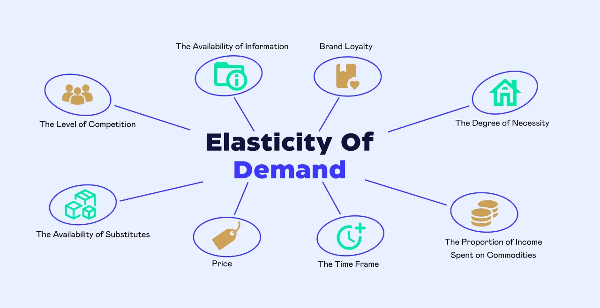

## Table of Contents

## What is price elasticity of demand?

Price elasticity of demand is a measure that shows how much the quantity demanded of a product changes when its price changes. It helps businesses and economists understand how sensitive people are to price changes. If the price of a product goes up, will people still buy it, or will they buy less? If the price goes down, will more people buy it? The answer to these questions depends on the price elasticity of demand.

The formula for price elasticity of demand is the percentage change in quantity demanded divided by the percentage change in price. If the result is greater than 1, the demand is considered elastic, meaning people are very sensitive to price changes. For example, if the price of a luxury item goes up, people might stop buying it. If the result is less than 1, the demand is inelastic, meaning people will keep buying the product even if the price changes. For example, if the price of a necessary medicine goes up, people will still buy it because they need it.

## How is price elasticity of demand calculated?

Price elasticity of demand is calculated by dividing the percentage change in the quantity demanded by the percentage change in the price. First, you find out how much the quantity demanded changes when the price changes. You express this change as a percentage. Then, you find out how much the price changes and express that as a percentage too. Finally, you divide the percentage change in quantity demanded by the percentage change in price.

For example, if the price of a product goes up by 10% and the quantity demanded goes down by 20%, the price elasticity of demand would be -20% divided by 10%, which equals -2. The negative sign just shows that price and quantity demanded move in opposite directions. If the result is more than 1, it means demand is elastic, and people are sensitive to price changes. If it's less than 1, demand is inelastic, and people are not very sensitive to price changes.

## What does it mean if a product has elastic demand?

If a product has elastic demand, it means that people are very sensitive to changes in the price of that product. When the price goes up even a little bit, people will buy a lot less of it. On the other hand, if the price goes down, people will buy a lot more of it. This is because there are usually other similar products that people can choose instead, or they might not need the product that much.

For example, if the price of a certain brand of chocolate goes up, people might switch to a different brand or decide not to buy chocolate at all. This makes it hard for companies to raise the price of products with elastic demand because they could lose a lot of customers. So, understanding that a product has elastic demand helps businesses know that they need to be careful with their pricing strategies.

## What does it mean if a product has inelastic demand?

If a product has inelastic demand, it means that people will keep buying it even if the price changes. They are not very sensitive to price changes. This happens because the product is something people really need or there are no good substitutes for it. For example, if the price of medicine goes up, people will still buy it because they need it to stay healthy. Or if the price of gas goes up, people will still buy it because they need it to drive their cars.

Understanding that a product has inelastic demand can help businesses. They know they can raise the price a little bit and people will still buy it. This can help them make more money. But they have to be careful not to raise the price too much, or people might start looking for other options or use less of the product. So, knowing a product's demand is inelastic helps businesses make smart decisions about pricing.

## What are the different types of price elasticity of demand?

There are a few different types of price elasticity of demand. The first one is called elastic demand. This means that if the price of a product goes up, people will buy a lot less of it. If the price goes down, they will buy a lot more. For example, if the price of a certain type of candy goes up, people might switch to a different candy or not buy any candy at all. The second type is inelastic demand. This means that if the price of a product goes up or down, people will still buy about the same amount. For example, if the price of a medicine goes up, people will still buy it because they need it.

Another type is called unitary elastic demand. This is when the change in the price of a product makes the same change in how much people buy. So if the price goes up by 10%, people will buy 10% less. If the price goes down by 10%, people will buy 10% more. This is kind of rare, but it can happen with some products. There are also two special cases: perfectly elastic demand and perfectly inelastic demand. Perfectly elastic demand means that if the price goes up even a tiny bit, no one will buy the product. Perfectly inelastic demand means that no matter how much the price changes, people will always buy the same amount. These cases are more theoretical and don't happen often in real life.

## Can you explain the concept of unitary elasticity?

Unitary elasticity is a special type of price elasticity of demand. It means that when the price of a product changes, the amount people buy changes by the same percentage. For example, if the price goes up by 10%, people will buy 10% less of the product. If the price goes down by 10%, people will buy 10% more. This balance makes the total money spent on the product stay the same, even when the price changes.

In real life, finding products with exactly unitary elasticity is pretty rare. It's more of an idea that helps us understand how price changes can affect what people buy. When a product has unitary elasticity, it means that the price and the amount people buy are perfectly balanced. This can be useful for businesses to know because it helps them predict how changing the price will affect their sales and overall revenue.

## What factors influence the price elasticity of demand?

Several things can affect how much the price of a product changes how much people buy it. One important thing is whether people need the product a lot or if they can easily find something else to use instead. If it's something people really need, like medicine, they will keep buying it even if the price goes up. But if it's something they don't need that much, like a certain brand of soda, they might switch to a different brand or not buy it at all if the price goes up. Another thing that matters is how much of their money people spend on the product. If it's a big part of what they spend, like buying a car, they will be more sensitive to price changes. But if it's a small part, like buying a candy bar, they might not care as much if the price changes a little.

Time also plays a big role in how sensitive people are to price changes. If the price of something goes up, people might not be able to change what they buy right away. For example, if gas prices go up, people still need to drive to work, so they will keep buying gas. But over time, they might start using public transportation or buying a more fuel-efficient car. This shows that in the short term, demand might be inelastic, but in the long term, it can become more elastic as people find other options. Understanding these factors helps businesses and economists predict how people will react to price changes and make better decisions about pricing their products.

## How does the availability of substitutes affect price elasticity?

The availability of substitutes is a big [factor](/wiki/factor-investing) in how much the price of a product affects how much people buy it. If there are a lot of other products that people can use instead, then the demand for the product will be more elastic. This means that if the price goes up, people will easily switch to a different product. For example, if the price of one brand of soda goes up, people can just buy a different brand of soda instead. So, companies have to be careful about raising prices when there are many substitutes available because they might lose customers.

On the other hand, if there are no good substitutes for a product, then the demand will be more inelastic. This means that even if the price goes up, people will still buy the product because they don't have other options. For example, if the price of a certain medicine goes up, people will still buy it because they need it and there's no other medicine that works the same way. So, companies might be able to raise the price a little bit without losing many customers when there are few or no substitutes available.

## In what ways does the proportion of income spent on a good impact its elasticity?

The amount of money people spend on a product compared to their total income can affect how sensitive they are to price changes. If a product takes up a big part of someone's income, like buying a car or paying for rent, people will pay close attention to its price. If the price goes up even a little, they might decide not to buy it because it's a big expense. This makes the demand for these products more elastic. People are more likely to look for cheaper options or delay buying the product if it's a large part of their budget.

On the other hand, if a product only takes up a small part of someone's income, like buying a candy bar or a cup of coffee, people might not care as much if the price changes a little. They might still buy it even if the price goes up because it doesn't affect their budget that much. This makes the demand for these products more inelastic. People are less likely to change their buying habits for small price changes when the product is a small part of their overall spending.

## How do time periods affect the elasticity of demand for a product?

Time can change how people react to price changes for a product. In the short term, people might not be able to change what they buy right away. For example, if the price of gas goes up, people still need to drive to work, so they will keep buying gas even though it's more expensive. This makes the demand for gas inelastic in the short term. They don't have time to find other ways to get around or buy a different car.

But over time, people can start to make changes. If gas prices stay high, people might start using public transportation, carpooling, or buying a car that uses less gas. This means that in the long term, the demand for gas can become more elastic. People have more time to find other options and change their habits. So, the time people have to react to a price change can make a big difference in how sensitive they are to that change.

## What role does the necessity of a product play in its price elasticity?

If a product is something people really need, like medicine or food, they will keep buying it even if the price goes up. This makes the demand for these products inelastic. People can't easily stop using them or find something else to use instead. For example, if the price of insulin goes up, people who need it to manage their diabetes will still buy it because they have no other choice.

On the other hand, if a product is not something people need that much, like a certain type of candy or a luxury item, they will be more sensitive to price changes. If the price goes up, people might decide not to buy it or look for a cheaper alternative. This makes the demand for these products more elastic. For example, if the price of a specific brand of chocolate goes up, people might switch to a different brand or decide not to buy chocolate at all.

## How can businesses use knowledge of price elasticity to optimize pricing strategies?

Businesses can use what they know about price elasticity to make smart choices about how much to charge for their products. If they know a product has elastic demand, like a luxury item, they will be careful not to raise the price too much. If they do, people might stop buying it and choose something else instead. So, they might lower the price a bit to sell more and make more money overall. On the other hand, if a product has inelastic demand, like medicine, businesses might raise the price a little because people will still buy it even if it costs more. This can help them make more money without losing many customers.

Understanding the time it takes for people to react to price changes is also important. In the short term, people might not change what they buy right away, so businesses could raise prices a bit without losing sales. But they need to think about the long term too. If prices stay high, people might start looking for other options or change their habits. So, businesses need to balance short-term gains with long-term customer loyalty. By carefully looking at all these factors, businesses can set prices that help them make the most money while keeping their customers happy.

## What is the understanding of Price Elasticity of Demand?

Price elasticity of demand is a key economic concept that quantifies how the quantity demanded of a good or service reacts to changes in its price. This measure of responsiveness provides insights into consumer sensitivity to price variations. In essence, elasticity indicates the extent to which demand shifts when prices adjust.

Mathematically, price elasticity of demand is expressed as:

$$
E_d = \frac{\%\ \text{change in quantity demanded}}{\%\ \text{change in price}}
$$

Where:
- $E_d$ is the price elasticity of demand.

A high elasticity (absolute value greater than 1) suggests that consumers are responsive to price changes, resulting in considerable shifts in demand when prices fluctuate. For instance, if the price of a non-essential good rises, and consumers significantly reduce their purchases, the demand for that good is considered elastic. On the other hand, inelastic demand (absolute value less than 1) occurs when the quantity demanded doesn't change substantially with price variations. Essential goods, such as basic food items, often exhibit inelastic demand since consumers need them regardless of price changes.

Economists harness elasticity to predict the outcomes of pricing strategies and understand the potential effects of economic dynamics on consumer behavior. For businesses, knowing the elasticity of their products can influence pricing decisions and marketing strategies. For instance, if a product is identified as having high elasticity, a price reduction might lead to a substantial increase in sales [volume](/wiki/volume-trading-strategy), potentially increasing overall revenue.

Understanding price elasticity helps in forecasting how different market segments might react to price alterations. It also aids in assessing the potential impacts of economic policy changes, such as indirect taxation, on consumer demand patterns. This makes elasticity a vital tool for shaping economic strategies and business decisions in an ever-changing market landscape.

## References & Further Reading

[1]: ["The Theory of Industrial Organization"](https://books.google.com/books/about/The_Theory_of_Industrial_Organization.html?id=HIjsF0XONF8C) by Jean Tirole

[2]: ["Intermediate Microeconomics: A Modern Approach"](https://www.amazon.com/Intermediate-Microeconomics-Approach-Hal-Varian/dp/1324034297) by Hal R. Varian

[3]: ["Principles of Economics"](https://open.umn.edu/opentextbooks/textbooks/32) by N. Gregory Mankiw

[4]: Train, K. E. (2009). ["Discrete Choice Methods with Simulation"](https://eml.berkeley.edu/books/choice2.html). MIT Press.

[5]: ["Algorithmic Trading: Winning Strategies and Their Rationale"](https://www.wiley.com/en-us/Algorithmic+Trading%3A+Winning+Strategies+and+Their+Rationale-p-9781118460146) by Ernie Chan

[6]: Shiller, R. J. (2015). ["Irrational Exuberance"](https://www.jstor.org/stable/j.ctt1287kz5). Princeton University Press.