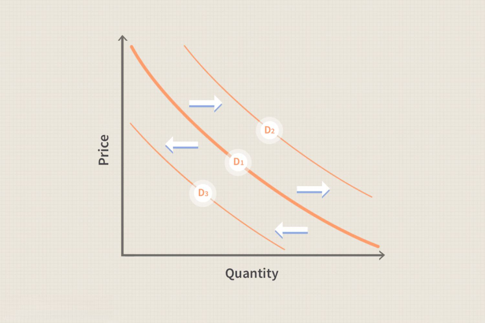

In the fast-evolving world of trading, understanding the dynamics of supply and demand is crucial. These dynamics form the backbone of market behavior, influencing everything from asset pricing to trade volumes. Among the intricate web of economic theories that shed light on these dynamics, price elasticity stands out as a fundamental concept, drawing the connection between changes in price and variations in supply and demand.

Price elasticity measures how responsive the quantity demanded or supplied of a good is to a change in its price. This concept is pivotal in predicting how markets react to various economic stimuli, such as policy shifts, market news, or sudden changes in supply. It functions as a lens through which traders can perceive and anticipate potential market movements, enabling them to formulate strategies that are proactive rather than reactive.



Incorporating these economic insights into algorithmic trading—where pre-programmed instructions execute trades automatically—can vastly optimize market predictions and trading strategies. Algorithmic trading, renowned for its speed and precision, thrives on robust data analysis and predictive insights. Thus, integrating price elasticity into these algorithms enhances their capacity to predict market behavior, offering traders an edge in timing their trades and managing risk.

Moreover, understanding price elasticity allows traders to craft more resilient strategies that are adaptable in the face of fluctuating market conditions. By accommodating elasticity insights, trading algorithms can adjust their parameters dynamically and respond to market changes more effectively, which is crucial for maintaining profitability and minimizing losses.

This article explores the integration of price elasticity concepts into trading algorithms, illustrating how these economic fundamentals can enhance decision-making processes, refine risk management, and ultimately, boost trading performance.

## Table of Contents

## Understanding Price Elasticity in Economics

Price elasticity is a fundamental concept in economics, reflecting how sensitive the quantity demanded or supplied of a good is to a change in its price. This measurement is crucial for understanding how variations in price levels impact consumer behavior and market supply.

Price elasticity of demand (PED) is a specific type of elasticity that quantifies the change in the quantity demanded of a good or service as a result of a change in its price. It's calculated using the formula:

$$
\text{PED} = \frac{\%\ \text{change in quantity demanded}}{\%\ \text{change in price}}
$$

A high elasticity, or elastic demand, means that a small change in price leads to a significant change in quantity demanded. This typically occurs with non-essential goods or those with readily available substitutes. Conversely, inelastic demand indicates that price changes produce minimal effects on the quantity demanded, often seen in essential goods with fewer substitutes.

Price elasticity of supply (PES) measures how the quantity of a good supplied responds to price changes. It is similar in formulation to PED:

$$
\text{PES} = \frac{\%\ \text{change in quantity supplied}}{\%\ \text{change in price}}
$$

Supply elasticity is influenced by factors such as production flexibility, time, and storage costs. High elasticity in supply suggests producers can easily adjust the amount they produce when prices fluctuate, often due to the ease of switching production processes or the ability to stockpile inputs.

Both PED and PES are crucial for businesses and policymakers. Understanding these elasticity concepts helps in anticipating the effects of pricing strategies, taxation, and other market interventions. Additionally, they provide insights into consumer behavior and producer responses, informing decisions that aim to optimize market performance and efficiency.

## Role of Price Elasticity in Supply and Demand Theory

Supply and demand curves are essential for understanding price dynamics in economics, fundamentally shaped by the concept of price elasticity. Price elasticity measures how much the quantity demanded or supplied responds to changes in price. This measurement is crucial in defining supply and demand curves as it illustrates the degree to which prices can influence consumer and producer behavior.

Price elasticity is categorized into two main types: Price Elasticity of Demand (PED) and Price Elasticity of Supply (PES). PED measures how the quantity demanded of a good reacts to changes in its price, calculated as:

$$
\text{PED} = \frac{\% \, \text{change in quantity demanded}}{\% \, \text{change in price}}
$$

A high PED indicates that consumers are sensitive to price changes. For instance, luxury goods tend to have high elasticity because a slight price increase might lead to a significant decrease in quantity demanded. Conversely, necessities usually exhibit low elasticity as they are less sensitive to price changes.

Similarly, the Price Elasticity of Supply (PES) gauges how the quantity supplied of a good reacts to price changes, computed using a similar formula:

$$
\text{PES} = \frac{\% \, \text{change in quantity supplied}}{\% \, \text{change in price}}
$$

High PES implies that producers can quickly adjust production levels to price changes, commonly seen in industries where goods are easy to produce and store. In contrast, in sectors where production is time-consuming or resource-intensive, PES is lower.

Elasticity significantly impacts market equilibrium, where the quantity supplied equals the quantity demanded. Changes in price elasticity can shift demand and supply curves, altering equilibrium prices and quantities. For example, if a product becomes more elastic due to increased availability of substitutes, the demand curve will be more responsive to price changes, potentially leading to lower equilibrium prices if a supply increase occurs.

Understanding elasticity enables economists and traders to predict how price changes affect market equilibrium, aiding in resource allocation. As prices adjust to reflect elasticity, resources are reallocated to produce goods and services where demand is more responsive, ensuring economic efficiency.

This predictive capability is beneficial for both producers and consumers. Producers can anticipate changes in consumer preferences due to price fluctuations, allowing them to adjust supply either to maximize profit or minimize losses. Consumers, on the other hand, can make informed purchasing decisions based on expected price changes, optimizing their utility.

Overall, price elasticity is a pivotal element in supply and demand theory. It informs the dynamic interactions of market forces, guiding strategic decisions in production, pricing, and consumption.

## Integration of Elasticity in Algorithmic Trading

Algorithmic trading leverages pre-programmed instructions to execute trades, and the integration of economic concepts such as price elasticity significantly enhances its effectiveness. By incorporating elasticity, trading algorithms can more accurately predict market responses to changes in prices, thereby refining their decision-making processes.

Price elasticity, which measures the responsiveness of quantity demanded or supplied to changes in price, is pivotal in understanding market dynamics. Algorithmic trading systems that incorporate elasticity are programmed to detect variations in elasticity across different assets or markets. This capability allows the algorithms to forecast how sensitive the market is to price changes, informing better trade execution strategies.

For instance, high elasticity suggests that a small change in price can lead to substantial changes in the quantity demanded or supplied. Algorithms utilizing this information can adjust their trading strategies to capitalize on expected large market moves. Conversely, low elasticity indicates that price changes are less likely to affect [volume](/wiki/volume-trading-strategy) significantly, suggesting a need for different trading tactics.

The integration of elasticity into trading algorithms enables dynamic adaptation to shifting market conditions. When price elasticity is high, algorithms may adopt aggressive trading strategies to exploit potential profit opportunities. In contrast, when elasticity is low, they might focus on stability and risk management, minimizing exposure to price fluctuations.

One practical application of elasticity in [algorithmic trading](/wiki/algorithmic-trading) involves adjusting strategies based on real-time elasticity measurements. For instance, if an algorithm detects an increase in elasticity, it might increase the frequency and volume of trades to capture the resulting market movement. This flexibility is crucial in enhancing the profitability of algorithmic trading systems.

Python, a preferred language for developing algorithmic trading models, can be used to incorporate elasticity into trading algorithms. The following Python snippet demonstrates how to calculate and use price elasticity in a trading strategy:

```python
def calculate_elasticity(price_change, quantity_change):
    return (quantity_change / price_change)

# Example usage
price_initial = 100
quantity_initial = 50
price_final = 110
quantity_final = 60

price_change = (price_final - price_initial) / price_initial
quantity_change = (quantity_final - quantity_initial) / quantity_initial

elasticity = calculate_elasticity(price_change, quantity_change)

if elasticity > 1:
    # High elasticity: market is sensitive to price changes
    # Adopt more aggressive trading strategy
    execute_trades(strategy='aggressive')
else:
    # Low elasticity: market is less sensitive
    # Focus on risk management
    execute_trades(strategy='conservative')
```

This code calculates the price elasticity and decides on an aggressive or conservative trading strategy based on the elasticity value. Such an adaptive approach, informed by elasticity measurements, optimizes trade execution and enhances the overall effectiveness of algorithmic trading systems.

## Mathematical Formulations and Examples

Price elasticity is a fundamental concept in economics, crucial for understanding how changes in price can affect demand and supply. For algorithmic trading, accurately calculating price elasticity can significantly enhance trading strategies. 

The Price Elasticity of Demand (PED) is defined mathematically as:

$$
\text{PED} = \frac{\% \text{ Change in Quantity Demanded}}{\% \text{ Change in Price}} = \frac{\Delta Q_d / Q_d}{\Delta P / P}
$$

Similarly, the Price Elasticity of Supply (PES) measures the responsiveness of the quantity supplied to a change in price:

$$
\text{PES} = \frac{\% \text{ Change in Quantity Supplied}}{\% \text{ Change in Price}} = \frac{\Delta Q_s / Q_s}{\Delta P / P}
$$

These elasticity measures can be directly applied to algorithmic trading environments using Python. Here is a Python code snippet demonstrating how to calculate PED and use this measure to inform trading decisions:

```python
def price_elasticity_of_demand(initial_price, final_price, initial_quantity, final_quantity):
    price_change_percentage = (final_price - initial_price) / initial_price
    quantity_change_percentage = (final_quantity - initial_quantity) / initial_quantity
    return quantity_change_percentage / price_change_percentage

# Example scenario
initial_price = 100
final_price = 105
initial_quantity = 500
final_quantity = 480

ped = price_elasticity_of_demand(initial_price, final_price, initial_quantity, final_quantity)
print(f"Price Elasticity of Demand: {ped}")

# Using elasticity to adjust trading strategies
if ped > 1:
    print("The product is elastic. Consider dynamic pricing or quick market adaptation strategies.")
elif ped < 1:
    print("The product is inelastic. Price changes have less impact on quantity demanded.")
else:
    print("Unitary elasticity. Adjust strategies cautiously.")
```

Incorporating elasticity into trading algorithms enables traders to refine stop-loss orders. A dynamic stop-loss model can be adjusted based on real-time elasticity data, thereby improving risk management. For example, if a product is found to be highly elastic, a trader might opt for tighter stop-loss margins to quickly respond to market shifts that significantly affect price and demand:

```python
def adjust_stop_loss(current_price, elasticity, base_stop_loss=0.02):
    """ Adjust stop loss based on calculated elasticity """
    if elasticity > 1:  # Elastic demand
        return current_price * (1 - base_stop_loss * 2)  # tighter stop-loss
    elif elasticity < 1:  # Inelastic demand
        return current_price * (1 - base_stop_loss)  # regular stop-loss
    else:
        return current_price * (1 - base_stop_loss * 1.5)  # intermediate adjustment

# Example usage
current_stock_price = 200
adjusted_stop_loss = adjust_stop_loss(current_stock_price, ped)
print(f"Adjusted Stop Loss: {adjusted_stop_loss}")
```

Such algorithm adjustments, based on elasticity calculations, facilitate better timing in trades and enhanced portfolio management, offering a balance between potential returns and associated risks. Understanding and applying price elasticity empowers traders to optimize strategies and enhance decision-making in volatile markets.

## Practical Applications and Benefits

Elasticity metrics play a crucial role in enhancing the efficiency and effectiveness of algorithmic trading systems. By assessing how sensitive the demand and supply are to changes in price, traders can better anticipate market shifts and adjust their strategies accordingly. This foresight is pivotal in optimizing trade timing and order execution, ensuring that trades are conducted under conditions that maximize potential returns.

Incorporating elasticity insights allows algorithms to predict market reactions to various economic events, aiding in portfolio management. For instance, if a significant economic announcement is expected, understanding how prices might react can help in adjusting positions before the event triggers market [volatility](/wiki/volatility-trading-strategies). This predictive capability enables traders to manage portfolios dynamically, aligning them with potential price movements to avoid unwarranted exposure.

Moreover, elasticity provides a balanced approach to managing risk and reward. By understanding the potential impact of price changes, traders can set more precise stop-loss orders and take-profit levels. For instance, an asset with high price elasticity might require tighter stop-loss parameters to mitigate risk, while a less elastic asset might allow for a wider margin. Here's a basic Python code snippet illustrating how elasticity can aid in setting stop-loss levels:

```python
def calculate_stop_loss(current_price, elasticity, risk_tolerance):
    # The formula can vary; this is a simple illustrative example
    stop_loss_margin = (1 / elasticity) * risk_tolerance
    stop_loss_price = current_price - stop_loss_margin
    return stop_loss_price

# Example usage
current_price = 100  # Current asset price
elasticity = 1.5     # Assumed elasticity value
risk_tolerance = 2   # Percentage of risk the trader is willing to take

stop_loss = calculate_stop_loss(current_price, elasticity, risk_tolerance)
print(f"The stop-loss price should be set at: {stop_loss}")
```
In volatile markets, having accurate elasticity metrics helps traders make strategic decisions by predicting price changes with greater accuracy. This proactive approach allows for strategic adjustments in trading strategies, helping maintain a balance between potential losses and gains. By leveraging elasticity insights, traders can enhance the adaptability of their algorithms, ultimately leading to improved profitability and reduced risk exposure.

## Challenges and Considerations

Accurate calculation of price elasticity in algorithmic trading presents several challenges that must be addressed to ensure effective strategy implementation. A paramount requirement is the access to comprehensive and high-quality market data. Price elasticity calculations depend on the availability of relevant data sets that accurately reflect market trends over time. Incomplete or outdated data can lead to incorrect elasticity estimates, undermining trading strategies that rely on these calculations.

The estimation of elasticity is further complicated by the influence of numerous external factors on market dynamics. Economic events, geopolitical developments, and changes in consumer behavior can all impact supply and demand, thereby affecting price elasticity. These external variables introduce a level of uncertainty and variability that must be accounted for in trading algorithms. For example, sudden political unrest or unexpected economic policies can shift market sentiments, causing deviations from previously calculated elasticity figures.

To mitigate these challenges, ongoing refinement of trading models is required. Integrating [machine learning](/wiki/machine-learning) techniques into algorithmic trading provides a path toward enhancing precision and adaptability. Machine learning algorithms can analyze patterns within data, adjust to new information, and continually learn to improve predictions of market responses to price changes. Techniques such as neural networks and decision trees can be employed to model complex relationships between variables affecting elasticity.

For example, a basic Python code snippet implementing a linear regression model using the popular library `scikit-learn` could look like this:

```python
from sklearn.linear_model import LinearRegression
import numpy as np

# Sample data: price changes and corresponding changes in quantity demanded
price_changes = np.array([0.01, -0.02, 0.03, -0.01, 0.02]).reshape(-1, 1)
quantity_changes = np.array([100, -150, 200, -100, 110])

# Create and fit the Linear Regression model
model = LinearRegression()
model.fit(price_changes, quantity_changes)

# Predict elasticity
predicted_elasticity = model.coef_
print(f"Estimated Price Elasticity: {predicted_elasticity}")
```

Continuous monitoring and validation against real-world market scenarios are crucial for maintaining the effectiveness of these models. As markets evolve, the integration of advanced economic theories and data-driven insights ensures that trading algorithms remain robust and capable of navigating the inherent unpredictability of financial markets.

## Conclusion

Elasticity integrates vital economic insights into the fabric of algorithmic trading by providing a quantitative measure of how sensitive the supply and demand are to price changes. This measurement allows traders to anticipate market movements more accurately, thus enabling them to make informed decisions. By incorporating elasticity into trading algorithms, traders can optimize their strategies to respond effectively to anticipated market shifts, aligning their actions with potential changes in consumer behavior and supply chain dynamics.

The empowerment that elasticity grants to traders manifests in optimized strategy formulation, enhanced risk management, and improved profitability. With elasticity measurements, traders can assess the potential impact of price changes on market equilibrium, allowing them to dynamically adjust their trading parameters such as entry and [exit](/wiki/exit-strategy) points, stop-loss orders, and position sizing. This adaptability is crucial for maintaining a balanced risk-reward profile, particularly in volatile markets where quick shifts in supply and demand can lead to significant price changes.

Looking ahead, the evolution of algorithmic trading will increasingly rely on advancements in the precision and application of economic theories like elasticity. As machine learning and [artificial intelligence](/wiki/ai-artificial-intelligence) continue to improve, these technologies will enhance the accuracy of elasticity estimates and predictions, providing deeper insights into market behavior. Algorithms will become more sophisticated, capable of accounting for a broader range of variables and external influences that impact elasticity, such as geopolitical events, changes in consumer preferences, and shifts in global supply chains.

Moreover, as algorithmic trading systems evolve, traders will benefit from more robust models that can incorporate nuanced elasticity insights, leading to better predictions and more consistent trading outcomes. The continuous refinement of these models will be vital for maintaining a competitive edge in the rapidly changing financial markets. Ultimately, embracing the integration of economic theories such as elasticity with cutting-edge technology will define the future trajectory of algorithmic trading, driving significant improvements in strategic decision-making and market performance.

## References & Further Reading

[1]: ["Advances in Financial Machine Learning"](https://www.amazon.com/Advances-Financial-Machine-Learning-Marcos/dp/1119482089) by Marcos Lopez de Prado

[2]: ["Introduction to Econometrics"](https://www.pearson.com/en-us/subject-catalog/p/introduction-to-econometrics/P200000006421/9780136879787) by Christopher Dougherty

[3]: ["Algorithmic Trading: Winning Strategies and Their Rationale"](https://books.google.com/books/about/Algorithmic_Trading.html?id=WAlFDwAAQBAJ) by Ernie Chan

[4]: Bergstra, J., Bardenet, R., Bengio, Y., & Kégl, B. (2011). ["Algorithms for Hyper-Parameter Optimization."](https://dl.acm.org/doi/10.5555/2986459.2986743) Advances in Neural Information Processing Systems 24.

[5]: ["Evidence-Based Technical Analysis: Applying the Scientific Method and Statistical Inference to Trading Signals"](https://www.amazon.com/Evidence-Based-Technical-Analysis-Scientific-Statistical/dp/0470008741) by David Aronson