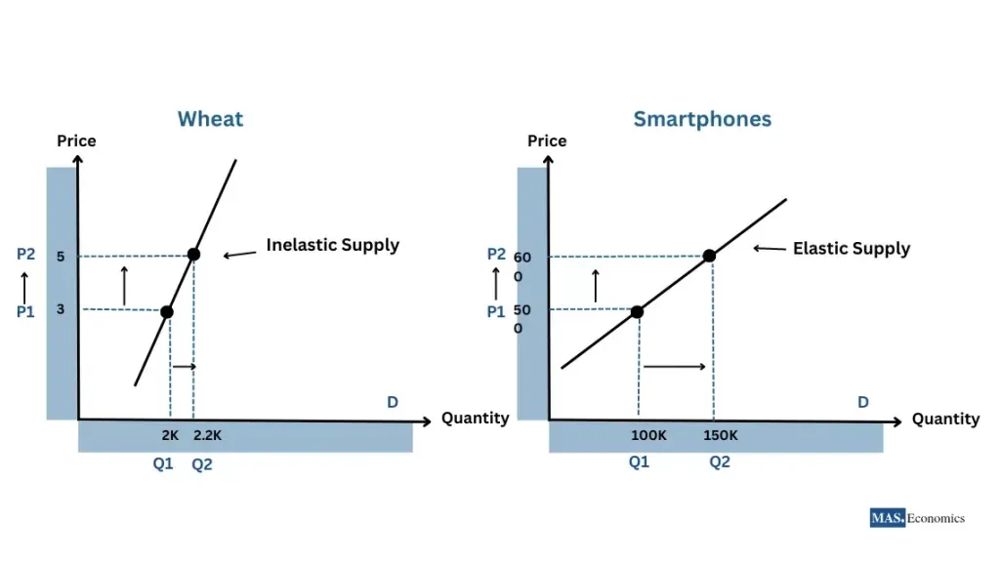

## Table of Contents

## What is price elasticity of demand?

Price elasticity of demand is a measure that shows how much the quantity of a product people want to buy changes when its price changes. It helps businesses and economists understand how sensitive consumers are to price changes. If a small change in price leads to a big change in the amount people buy, the product is said to have high price elasticity. On the other hand, if the quantity demanded doesn't change much with a price change, the product has low price elasticity.

This concept is important for businesses because it helps them set prices that maximize their profits. For example, if a product has high price elasticity, a company might lower the price to sell more units and increase total revenue. If a product has low price elasticity, a company might raise the price without losing many sales, which could also increase revenue. Understanding price elasticity helps businesses make better pricing decisions and plan their marketing strategies more effectively.

## How does price elasticity affect consumer behavior?

Price elasticity of demand shows how much people change what they buy when the price changes. If a product has high price elasticity, it means that even a small change in price can make people buy a lot more or a lot less of it. For example, if the price of a certain brand of soda goes up a little, people might stop buying it and choose a cheaper brand instead. This shows that consumers are sensitive to the price changes of this product.

On the other hand, if a product has low price elasticity, people will keep buying about the same amount even if the price changes. This often happens with things like medicine or gasoline, where people need them and don't have many other choices. So, even if the price goes up, people will still buy it because they need it. This shows that consumers are not very sensitive to the price changes of these products.

## What is the difference between elastic and inelastic demand?

Elastic demand means that when the price of something changes, people will change how much they buy a lot. For example, if the price of a candy bar goes up by just a little bit, people might decide not to buy it anymore and choose a different snack instead. This happens because there are a lot of other choices for snacks, so people can easily switch to something else if the price goes up. When demand is elastic, businesses need to be careful about raising prices because they might lose a lot of customers.

Inelastic demand is the opposite. It means that even if the price of something changes, people will still buy about the same amount. This often happens with things that people really need, like medicine or gas for their cars. If the price of gas goes up, people still need to drive to work or school, so they keep buying it. When demand is inelastic, businesses might be able to raise prices without losing many customers, because people need the product and don't have many other options.

Understanding whether demand is elastic or inelastic helps businesses make decisions about pricing and marketing. If they know their product has elastic demand, they might keep prices low to keep customers happy. If their product has inelastic demand, they might feel safer about raising prices to make more money.

## How is price elasticity of demand calculated?

Price elasticity of demand is calculated by dividing the percentage change in the quantity demanded by the percentage change in price. If you want to know how sensitive people are to a change in the price of a product, you first find out how much the amount they buy changes when the price changes. For example, if the price of a candy bar goes up by 10% and people buy 20% less of it, you would divide the 20% decrease in quantity by the 10% increase in price. This gives you a price elasticity of demand of 2, which means the demand is elastic.

The formula for calculating price elasticity of demand is: Price Elasticity of Demand = (% Change in Quantity Demanded) / (% Change in Price). To find the percentage change in quantity demanded, you subtract the old quantity from the new quantity, divide by the old quantity, and then multiply by 100. To find the percentage change in price, you do the same thing but with the old and new prices. If the result is more than 1, demand is elastic. If it's less than 1, demand is inelastic. If it's exactly 1, demand is called unit elastic, meaning the percentage change in quantity demanded is exactly the same as the percentage change in price.

## What factors influence the price elasticity of demand?

Several things can affect how much people change what they buy when prices change. One big [factor](/wiki/factor-investing) is whether there are other choices available. If there are lots of similar products to choose from, like different brands of soda, people can easily switch to a cheaper option if one brand raises its price. This makes demand more elastic. Another factor is how necessary the product is. If it's something people really need, like medicine or gas, they will keep buying it even if the price goes up. This makes demand more inelastic.

The time people have to react to price changes also matters. If prices go up, people might not change their buying habits right away, especially for things they need regularly. But over time, they might find cheaper alternatives or change their habits, making demand more elastic. Also, how much of their income people spend on the product can influence elasticity. If a product takes up a big part of their budget, like a car, people will be more sensitive to price changes, making demand more elastic. But if it's a small part of their budget, like a candy bar, they might not care as much about price changes, making demand more inelastic.

## How does price elasticity relate to the supply curve?

Price elasticity of demand and the supply curve are connected because they both help us understand how prices and quantities work in the market. The supply curve shows how much of a product businesses are willing to sell at different prices. When the price goes up, businesses usually want to sell more because they can make more money. But the supply curve itself doesn't tell us about price elasticity of demand; it just shows what sellers are doing.

However, the price elasticity of demand affects how the supply curve works in the market. If demand for a product is elastic, meaning people change how much they buy a lot when the price changes, businesses need to be careful about raising prices. If they raise prices too much, people will buy less, and the supply curve might not shift up as much as expected because fewer products will be sold. On the other hand, if demand is inelastic, meaning people keep buying about the same amount even if the price changes, businesses can raise prices without losing many customers. This might make the supply curve shift up more easily because businesses can sell more at higher prices without worrying about losing sales.

## What is cross-price elasticity and how does it impact market dynamics?

Cross-price elasticity of demand measures how the quantity of one product that people buy changes when the price of another product changes. If the price of one product goes up and people start buying more of another product, these two products are called substitutes. For example, if the price of coffee goes up, people might buy more tea instead. On the other hand, if the price of one product goes up and people buy less of another product, these two products are called complements. For example, if the price of printers goes up, people might buy fewer ink cartridges because they are used together.

Cross-price elasticity can affect market dynamics in big ways. If two products are strong substitutes, a change in the price of one can cause a big shift in demand for the other. This means businesses need to watch the prices of their competitors closely because a price change by one company can affect the sales of others. If two products are complements, a price change in one can also impact the market for the other. For example, if the price of smartphones goes down, more people might buy them, which could increase the demand for phone cases and other accessories. Understanding cross-price elasticity helps businesses make better decisions about pricing and marketing to stay competitive in the market.

## How does income elasticity of demand interact with price elasticity?

Income elasticity of demand looks at how much the amount of a product people buy changes when their income changes. If people's income goes up and they buy a lot more of a product, that product has high income elasticity. This often happens with things like luxury goods, like fancy cars or expensive vacations. If people's income goes up but they don't buy much more of a product, that product has low income elasticity. This is common with things people need every day, like bread or milk.

Price elasticity of demand, on the other hand, looks at how much the amount of a product people buy changes when its price changes. If the price goes up and people buy a lot less of it, the product has high price elasticity. If the price goes up but people keep buying about the same amount, the product has low price elasticity. Both types of elasticity help businesses understand how sensitive people are to changes in price and income, but they look at different things. Income elasticity helps businesses see how their sales might change if people get richer or poorer, while price elasticity helps them see how their sales might change if they raise or lower prices. Together, these two measures give a fuller picture of how demand for a product might change in different situations.

## Can you explain the concept of elasticity of supply and its importance?

Elasticity of supply is about how much the amount of a product businesses want to sell changes when the price changes. If the price of something goes up and businesses quickly start selling a lot more of it, that product has high elasticity of supply. This can happen with things like fruits and vegetables, where farmers can plant more if the price is good. But if the price goes up and businesses can't sell much more because it's hard to make more of the product quickly, like with cars or houses, the supply is less elastic.

Understanding elasticity of supply is important for businesses and the economy. If a product has high elasticity of supply, businesses can make more of it when prices go up, which can help meet demand and keep prices from going too high. But if a product has low elasticity of supply, even a small increase in demand can push prices up a lot because businesses can't make more of it quickly. Knowing about elasticity of supply helps businesses plan how much to produce and helps governments understand how changes in the market might affect prices and the economy.

## How do shifts in demand and supply affect price elasticity?

When the demand for a product changes, it can affect how sensitive people are to price changes. If more people suddenly want to buy a product, like when a new popular toy comes out, the demand goes up. This can make the demand less elastic because people are willing to pay more to get it. But if something makes people want to buy less of a product, like a safety scare, the demand goes down. This can make the demand more elastic because people are more likely to stop buying it if the price goes up.

Changes in supply can also affect price elasticity. If it becomes easier for businesses to make more of a product, like if a new technology makes it cheaper to produce, the supply goes up. This can make the demand more elastic because there are more products available, so people can switch to other options if the price goes up. But if it becomes harder to make the product, like if there's a shortage of materials, the supply goes down. This can make the demand less elastic because there are fewer products to choose from, so people might keep buying it even if the price goes up.

## What are some real-world examples where price elasticity has significantly influenced market outcomes?

One real-world example where price elasticity has significantly influenced market outcomes is in the airline industry. Airlines often change their ticket prices based on how many people want to fly and how many seats they have. If there are a lot of empty seats and not many people want to fly, airlines might lower their prices to fill the plane. This shows high price elasticity because a small change in price can make a big difference in how many tickets they sell. On the other hand, if it's a busy travel time like holidays, airlines might raise prices because people will still buy tickets even if they cost more. This shows low price elasticity because people need to travel and are willing to pay more.

Another example is with gasoline. Gasoline usually has low price elasticity because people need it to drive their cars and don't have many other choices. Even if the price of gas goes up, people will still buy it because they need to get to work or school. This means that when there's a big event that affects the supply of gas, like a hurricane that stops oil production, the price can go up a lot without people buying much less. Understanding this helps gas companies know they can raise prices without losing many customers, which can affect how they plan their business and how much they charge.

## How can businesses use price elasticity data to optimize pricing strategies?

Businesses can use price elasticity data to figure out the best prices for their products. If they know that people will buy a lot more of something when the price goes down a little, they might choose to lower the price to sell more. This can help them make more money overall, even if they make less on each item. For example, if a store finds out that lowering the price of a popular snack by 10% makes people buy 30% more, they might decide to do that to increase their sales and profits.

On the other hand, if a business learns that people will keep buying about the same amount of a product even if the price goes up, they might raise the price to make more money. This often happens with things people need, like medicine or electricity. If a company knows that raising the price of a needed medicine by 5% won't make people buy much less, they might do that to increase their profits. Understanding price elasticity helps businesses make smart choices about pricing that can help them do better in the market.

## What is the concept of price elasticity in economics and how can it be understood?

Price elasticity is a fundamental concept in economics, reflecting how sensitive the quantity demanded or supplied of a good is to a change in its price. This measurement is crucial for understanding how variations in price levels impact consumer behavior and market supply.

Price elasticity of demand (PED) is a specific type of elasticity that quantifies the change in the quantity demanded of a good or service as a result of a change in its price. It's calculated using the formula:

$$
\text{PED} = \frac{\%\ \text{change in quantity demanded}}{\%\ \text{change in price}}
$$

A high elasticity, or elastic demand, means that a small change in price leads to a significant change in quantity demanded. This typically occurs with non-essential goods or those with readily available substitutes. Conversely, inelastic demand indicates that price changes produce minimal effects on the quantity demanded, often seen in essential goods with fewer substitutes.

Price elasticity of supply (PES) measures how the quantity of a good supplied responds to price changes. It is similar in formulation to PED:

$$
\text{PES} = \frac{\%\ \text{change in quantity supplied}}{\%\ \text{change in price}}
$$

Supply elasticity is influenced by factors such as production flexibility, time, and storage costs. High elasticity in supply suggests producers can easily adjust the amount they produce when prices fluctuate, often due to the ease of switching production processes or the ability to stockpile inputs.

Both PED and PES are crucial for businesses and policymakers. Understanding these elasticity concepts helps in anticipating the effects of pricing strategies, taxation, and other market interventions. Additionally, they provide insights into consumer behavior and producer responses, informing decisions that aim to optimize market performance and efficiency.

## What is the role of price elasticity in supply and demand theory?

Supply and demand curves are essential for understanding price dynamics in economics, fundamentally shaped by the concept of price elasticity. Price elasticity measures how much the quantity demanded or supplied responds to changes in price. This measurement is crucial in defining supply and demand curves as it illustrates the degree to which prices can influence consumer and producer behavior.

Price elasticity is categorized into two main types: Price Elasticity of Demand (PED) and Price Elasticity of Supply (PES). PED measures how the quantity demanded of a good reacts to changes in its price, calculated as:

$$
\text{PED} = \frac{\% \, \text{change in quantity demanded}}{\% \, \text{change in price}}
$$

A high PED indicates that consumers are sensitive to price changes. For instance, luxury goods tend to have high elasticity because a slight price increase might lead to a significant decrease in quantity demanded. Conversely, necessities usually exhibit low elasticity as they are less sensitive to price changes.

Similarly, the Price Elasticity of Supply (PES) gauges how the quantity supplied of a good reacts to price changes, computed using a similar formula:

$$
\text{PES} = \frac{\% \, \text{change in quantity supplied}}{\% \, \text{change in price}}
$$

High PES implies that producers can quickly adjust production levels to price changes, commonly seen in industries where goods are easy to produce and store. In contrast, in sectors where production is time-consuming or resource-intensive, PES is lower.

Elasticity significantly impacts market equilibrium, where the quantity supplied equals the quantity demanded. Changes in price elasticity can shift demand and supply curves, altering equilibrium prices and quantities. For example, if a product becomes more elastic due to increased availability of substitutes, the demand curve will be more responsive to price changes, potentially leading to lower equilibrium prices if a supply increase occurs.

Understanding elasticity enables economists and traders to predict how price changes affect market equilibrium, aiding in resource allocation. As prices adjust to reflect elasticity, resources are reallocated to produce goods and services where demand is more responsive, ensuring economic efficiency.

This predictive capability is beneficial for both producers and consumers. Producers can anticipate changes in consumer preferences due to price fluctuations, allowing them to adjust supply either to maximize profit or minimize losses. Consumers, on the other hand, can make informed purchasing decisions based on expected price changes, optimizing their utility.

Overall, price elasticity is a pivotal element in supply and demand theory. It informs the dynamic interactions of market forces, guiding strategic decisions in production, pricing, and consumption.

## What are Mathematical Formulations and Examples?

Price elasticity is a fundamental concept in economics, crucial for understanding how changes in price can affect demand and supply. For [algorithmic trading](/wiki/algorithmic-trading), accurately calculating price elasticity can significantly enhance trading strategies. 

The Price Elasticity of Demand (PED) is defined mathematically as:

$$
\text{PED} = \frac{\% \text{ Change in Quantity Demanded}}{\% \text{ Change in Price}} = \frac{\Delta Q_d / Q_d}{\Delta P / P}
$$

Similarly, the Price Elasticity of Supply (PES) measures the responsiveness of the quantity supplied to a change in price:

$$
\text{PES} = \frac{\% \text{ Change in Quantity Supplied}}{\% \text{ Change in Price}} = \frac{\Delta Q_s / Q_s}{\Delta P / P}
$$

These elasticity measures can be directly applied to algorithmic trading environments using Python. Here is a Python code snippet demonstrating how to calculate PED and use this measure to inform trading decisions:

```python
def price_elasticity_of_demand(initial_price, final_price, initial_quantity, final_quantity):
    price_change_percentage = (final_price - initial_price) / initial_price
    quantity_change_percentage = (final_quantity - initial_quantity) / initial_quantity
    return quantity_change_percentage / price_change_percentage

# Example scenario
initial_price = 100
final_price = 105
initial_quantity = 500
final_quantity = 480

ped = price_elasticity_of_demand(initial_price, final_price, initial_quantity, final_quantity)
print(f"Price Elasticity of Demand: {ped}")

# Using elasticity to adjust trading strategies
if ped > 1:
    print("The product is elastic. Consider dynamic pricing or quick market adaptation strategies.")
elif ped < 1:
    print("The product is inelastic. Price changes have less impact on quantity demanded.")
else:
    print("Unitary elasticity. Adjust strategies cautiously.")
```

Incorporating elasticity into trading algorithms enables traders to refine stop-loss orders. A dynamic stop-loss model can be adjusted based on real-time elasticity data, thereby improving risk management. For example, if a product is found to be highly elastic, a trader might opt for tighter stop-loss margins to quickly respond to market shifts that significantly affect price and demand:

```python
def adjust_stop_loss(current_price, elasticity, base_stop_loss=0.02):
    """ Adjust stop loss based on calculated elasticity """
    if elasticity > 1:  # Elastic demand
        return current_price * (1 - base_stop_loss * 2)  # tighter stop-loss
    elif elasticity < 1:  # Inelastic demand
        return current_price * (1 - base_stop_loss)  # regular stop-loss
    else:
        return current_price * (1 - base_stop_loss * 1.5)  # intermediate adjustment

# Example usage
current_stock_price = 200
adjusted_stop_loss = adjust_stop_loss(current_stock_price, ped)
print(f"Adjusted Stop Loss: {adjusted_stop_loss}")
```

Such algorithm adjustments, based on elasticity calculations, facilitate better timing in trades and enhanced portfolio management, offering a balance between potential returns and associated risks. Understanding and applying price elasticity empowers traders to optimize strategies and enhance decision-making in volatile markets.

## References & Further Reading

[1]: ["Advances in Financial Machine Learning"](https://www.amazon.com/Advances-Financial-Machine-Learning-Marcos/dp/1119482089) by Marcos Lopez de Prado

[2]: ["Introduction to Econometrics"](https://www.pearson.com/en-us/subject-catalog/p/introduction-to-econometrics/P200000006421/9780136879787) by Christopher Dougherty

[3]: ["Algorithmic Trading: Winning Strategies and Their Rationale"](https://books.google.com/books/about/Algorithmic_Trading.html?id=WAlFDwAAQBAJ) by Ernie Chan

[4]: Bergstra, J., Bardenet, R., Bengio, Y., & Kégl, B. (2011). ["Algorithms for Hyper-Parameter Optimization."](https://dl.acm.org/doi/10.5555/2986459.2986743) Advances in Neural Information Processing Systems 24.

[5]: ["Evidence-Based Technical Analysis: Applying the Scientific Method and Statistical Inference to Trading Signals"](https://www.amazon.com/Evidence-Based-Technical-Analysis-Scientific-Statistical/dp/0470008741) by David Aronson