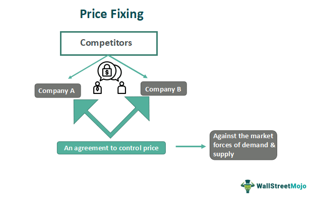

Price fixing is a pivotal topic in business economics as it directly influences market dynamics and legality. It occurs when competing businesses agree to set prices at a certain level, rather than allowing them to be determined organically by free-market forces. This manipulation of prices can severely undermine market efficiency, creating an environment where competition is stifled, and consumers are disadvantaged due to artificially inflated prices. 

The advent of algorithmic trading has introduced complex dimensions to the traditional concept of price fixing. Algorithmic trading involves the use of sophisticated algorithms to make high-speed trading decisions. This technological evolution raises significant questions about the legality and regulatory challenges associated with ensuring market fairness and competitiveness. Algorithms, by their nature, can execute thousands of transactions per second, potentially facilitating coordinated pricing strategies without overt human intervention. This capability introduces a nuanced layer to traditional price-fixing concerns, as it challenges existing regulatory frameworks that were not designed to address technologically driven market manipulation.



This article explores the concept of price fixing in depth, examining its economic implications and the evolving role of algorithmic trading within modern markets. By analyzing these aspects, the article aims to shed light on the need for adaptive regulatory measures to address the challenges posed by technology in maintaining fair market operations.

## Table of Contents

## Understanding Price Fixing

Price fixing is the practice where the price of a product or service is determined through an agreement among market participants rather than being set naturally through the forces of supply and demand. This typically involves collusion among competitors to set prices at a certain level, often higher than would be observed in a competitive market, which deprives consumers of the benefits that competition delivers, such as lower prices and increased innovation.

Usually illegal in many jurisdictions, including under U.S. antitrust laws, price fixing restricts competition and can lead to various market distortions. The primary economic harm from price fixing is that it maintains prices at an artificially high level, reducing the overall welfare of consumers who face reduced purchasing power without a corresponding improvement in product quality or innovation.

Price fixing can present itself in multiple forms, notably horizontal and vertical price fixing. Horizontal price fixing occurs when competitors at the same stage of the production process, such as manufacturers or retailers, agree to sell a product at the same price. This type of price fixing is typically seen among companies that should be market competitors, thus preventing the competitive process which typically results in more favorable prices for consumers.

Vertical price fixing, on the other hand, involves agreements between parties at different stages of the supply chain, such as manufacturers and retailers, to set fixed prices. This can mean either setting a minimum resale price or dictating the price range within which a retailer must sell a product. Although some vertical agreements may have pro-competitive justifications, they can nonetheless undermine the pricing freedom of retailers and continue to stifle competitive pricing behaviors.

Overall, price fixing undermines market dynamics by eliminating the incentives for businesses to compete on price, thereby hindering economic efficiency. It distorts the natural relationship between supply and demand, ultimately leading to misallocation of resources, suppressed innovation, and inflated prices, all to the detriment of consumer welfare and equitable market operation.

## Price-Fixing and Antitrust Laws

Antitrust laws are crucial tools in maintaining competitive markets by regulating companies' anti-competitive behaviors. These laws are structured to prevent practices like price fixing, a common antitrust violation where businesses agree on prices, thereby eliminating competition. One of the most significant pieces of legislation governing this area in the United States is the Sherman Antitrust Act. Enacted in 1890, the Sherman Act was the first federal statute to limit cartels and monopolies, aiming to prohibit activities that restrict interstate commerce and competition in the marketplace.

Under the Sherman Act, particularly Section 1, any contract, combination, or conspiracy in restraint of trade or commerce is deemed illegal. Price fixing falls squarely within this provision, as it involves collusion among competitors to set prices, rather than allowing them to be determined by the natural interplay of supply and demand. This artificial pricing can lead to higher costs for consumers and stifle innovation, as there is less incentive for businesses to compete based on price.

The enforcement of antitrust laws is a critical function of regulatory bodies like the United States Department of Justice (DOJ) and the Federal Trade Commission (FTC). These agencies have the authority to investigate alleged price-fixing activities and can bring legal action against companies and their executives. Penalties for engaging in price fixing are severe and can include substantial fines, often reaching into the hundreds of millions, as well as imprisonment for corporate leaders found guilty of participating in such conspiracies.

The repercussions for violating antitrust laws, particularly those related to price fixing, extend beyond monetary fines. Companies can face additional legal consequences, such as private lawsuits, which might result in treble damages under U.S. law. This provision allows plaintiffs to recover three times the damages incurred, serving as a powerful deterrent against anti-competitive practices.

Overall, antitrust laws like the Sherman Act play a vital role in preserving the dynamic and competitive nature of the marketplace, directly opposing price-fixing schemes that threaten to undermine economic fairness and consumer welfare. As markets evolve, especially with the rise of [algorithmic trading](/wiki/algorithmic-trading), these regulations and their enforcement mechanisms continuously adapt to address new forms of collusion and price manipulation.

## Economic Implications of Price Fixing

Price fixing disrupts the natural market equilibrium by artificially manipulating the forces of supply and demand, leading to several economic inefficiencies. In a competitive market, prices are determined through the interaction of supply and demand, reflecting the cost of production and consumers' willingness to pay. When companies engage in price fixing, this balance is disturbed, resulting in prices that are not representative of the actual market conditions.

One major inefficiency arising from price fixing is higher prices. Companies that agree on a fixed price eliminate the natural competition that would have driven prices down, allowing them to charge consumers more than what might have been possible in a competitive market. This can be represented by the formula:

$$
P_{\text{fixed}} > P_{\text{competitive}}
$$

where $P_{\text{fixed}}$ is the artificially elevated price due to fixing, and $P_{\text{competitive}}$ is the lower price that would result from free market competition.

Price fixing also reduces innovation. In a competitive market, companies strive to gain an edge over their rivals by innovating and improving their products or services. However, when a price is fixed, the incentive to innovate diminishes because all participants share the benefits of elevated prices without having to improve their offerings. This stalemate in innovation can stifle technological advancement and slow the pace of economic growth over time.

Furthermore, small businesses are disproportionately affected by price-fixing practices. Lacking the financial resources and market influence of larger corporations, smaller entities cannot compete with the artificially maintained prices set by established players. This often results in market [exit](/wiki/exit-strategy) or absorption by larger firms, reducing market diversity and consumer choice. The economic formula to describe the profit margin for small versus large firms could be simplified as:

$$
\text{Profit Margin} = \text{Revenue} - \text{Costs}
$$

In the context of price fixing, large firms can maintain higher profit margins due to controlled higher revenues ($R_{\text{large, fixed}}$), while small firms experience reduced revenues ($R_{\text{small, fixed}}$), making survival challenging.

The economic implications of price fixing extend beyond individual markets, impacting broader economic welfare. With fewer innovative products, higher consumer prices, and reduced small business competition, the overall economic growth potential is curtailed. Regulatory measures are essential to counteract these negative effects and ensure that markets remain competitive and fair.

## Algorithmic Trading and its Role in Price Fixing

Algorithmic trading is a sophisticated mechanism that leverages advanced algorithms and computational power to execute trading strategies at high speeds and volumes. This technology has transformed financial markets by enhancing efficiency and [liquidity](/wiki/liquidity-risk-premium). However, it also presents potential risks, particularly concerning price fixing.

In its core functioning, algorithmic trading uses predefined rules and complex statistical models to make trading decisions. These algorithms can analyze vast datasets and adjust trading strategies in real time. The automation involved allows for rapid transactions that are often beyond the capability of manual trading operations. While this provides numerous advantages, such as tighter bid-ask spreads and reduced transaction costs, it also opens avenues for undesirable practices like price fixing.

Price fixing traditionally involves explicit agreements among competitors to manipulate the pricing of goods or services. However, with algorithmic trading, such collusion can occur implicitly. Competitors might use similar algorithms that inadvertently lead to synchronized pricing behavior without any direct human interaction or explicit agreement. This is particularly concerning in markets where a few large players dominate and employ similar trading strategies.

The regulatory challenge lies in differentiating between competitive, adaptive pricing strategies and those that constitute collusive behavior. Since algorithms can autonomously adjust to competitor pricing, distinguishing between tacit collusion facilitated by algorithms and legitimate strategic optimization becomes complex. Legal systems and regulatory bodies worldwide are increasingly aware of this potential misuse and are investigating algorithm-driven price manipulation.

One approach regulators are considering is the development of monitoring systems capable of identifying patterns indicative of price fixing by algorithms. Machine learning techniques could be employed to analyze transactional data and spot anomalies that suggest collusion. By using historical data, these systems can be trained to recognize pricing patterns that deviate from competitive norms. Here's a simple Python illustration of how one might initiate such pattern recognition:

```python
import numpy as np
from sklearn.ensemble import IsolationForest

def detect_collusion(prices):
    # Assume prices is a numpy array of historical price data
    model = IsolationForest(contamination=0.1)
    model.fit(prices.reshape(-1, 1))
    anomalies = model.predict(prices.reshape(-1, 1))

    return np.where(anomalies == -1)[0]  # Indexes of potential collusion

# Sample usage
historical_prices = np.array([50, 50, 52, 51, 53, 50, 500, 50, 52, 53])  # Hypothetical price data
collusion_indexes = detect_collusion(historical_prices)
print("Potential collusion detected at indexes:", collusion_indexes)
```

This fictional example demonstrates using an Isolation Forest from the [machine learning](/wiki/machine-learning) library Scikit-learn to detect anomalies in pricing data. While in practice, the process is far more complex and involves vast datasets and sophisticated models, the concept illustrates how technology can aid in regulatory oversight.

The legal community and regulators are under pressure to adapt existing antitrust laws to encompass algorithm-driven price manipulation more effectively. Developing international frameworks that address these technological advances is essential for maintaining fair market practices. Therefore, balancing the benefits of algorithmic trading with the potential risks of collusion represents one of modern market regulation's key challenges.

## Legal Cases and Examples of Price Fixing

Several high-profile legal cases exemplify the profound implications of price-fixing activities in various industries. Notable among these is the lysine price-fixing conspiracy, which involved several major agribusiness companies. In this case, companies like Archer Daniels Midland (ADM) conspired to fix the price of lysine, a feed additive, through secret meetings and covert communications. This resulted in inflated prices, adversely impacting consumers and competitors. As a consequence, the companies involved faced legal repercussions, including substantial fines and enhanced regulatory supervision by the U.S. Department of Justice. Ultimately, this served as a deterrent against similar anti-competitive practices.

Another significant case is the Apple e-book pricing scandal. In this instance, Apple was found to have colluded with major book publishers to fix the prices of e-[books](/wiki/algo-trading-books). The intent was to undermine Amazon’s dominance in the e-book market by establishing a pricing model that increased e-book costs for consumers. Following investigations, Apple was held accountable under antitrust laws and was ordered to pay hefty fines. The case underscored the regulatory vigilance required to ensure fair competitive practices in the evolving digital marketplace.

The evolution of digital markets and algorithmic trading has introduced new complexities in detecting and regulating price-fixing schemes. Algorithmic collusion, which involves the use of automated software to synchronize pricing strategies without explicit human agreements, poses a unique challenge to current legal frameworks. These algorithms can self-learn and adapt to market conditions, potentially facilitating an environment where prices are manipulated subtly, thus escaping traditional detection methods.

To address these challenges, regulators are intensifying their scrutiny of such digital practices. This includes revisiting antitrust laws and updating them to effectively capture and penalize algorithmic collusion. Legal frameworks are being re-evaluated to include stringent regulations governing the use of algorithms in pricing strategies, ensuring they do not undermine market competition. As digital markets continue to expand, maintaining rigorous oversight becomes imperative to safeguard consumer interests and uphold the principles of free-market competition.

## Conclusion

Price fixing remains a significant challenge in ensuring fair market practices and fostering economic welfare. It undermines the principles of free market competition by artificially manipulating prices, thereby adversely affecting consumers and the economy as a whole. Despite existing antitrust laws aimed at curbing such practices, the rise of algorithmic trading introduces new complexities. These technologies can facilitate covert collusion among competitors, making detection and regulation more difficult. Traditional legal frameworks often struggle to address the sophisticated and rapid interactions facilitated by trading algorithms. 

To effectively combat these challenges, it is crucial to update legal responses and regulatory practices. This involves not only enhancing the capacity to detect algorithmic price fixing but also adapting existing laws to encompass technologically advanced methods of collusion. Ongoing vigilance is essential, as new strategies for price manipulation can emerge alongside technological advancements. Regulators and policymakers must continuously refine legal frameworks to address these dynamic challenges, ensuring competitive markets that protect consumer interests. By adapting to these evolutions, authorities can better promote an economic environment conducive to innovation, competitiveness, and fair pricing, thereby enhancing overall economic welfare.

## References & Further Reading

[1]: Connor, J. (2016). ["Price Fixing and the War on Cartels."](https://papers.ssrn.com/sol3/papers.cfm?abstract_id=2400780) Palgrave Macmillan.

[2]: Harrington, J. E. Jr. (2006). ["How Do Cartels Operate?"](https://joeharrington5201922.github.io/pdf/fnt06.pdf) Foundations and Trends® in Microeconomics, Vol. 2, No. 1.

[3]: Mason, R. L. (2015). ["Algorithmic Trading and the Impact on Market Microstructure."](https://www.sciencedirect.com/topics/economics-econometrics-and-finance/market-microstructure) Quantitative Finance.

[4]: Weiss, L. (1989). ["Price Theory and Our Freedoms."](https://www.semanticscholar.org/paper/Concentration-and-price-Weiss/c758eff5c0f70c8155d5c12573c471749e9af22b) Journal of Economic Perspectives, Vol. 3, No. 4.

[5]: Stigler, G. J. (1964). ["A Theory of Oligopoly."](http://walterewilliams.com/courses/articles/StiglerJPEFeb1964.pdf) Journal of Political Economy, Vol. 72, No. 1.