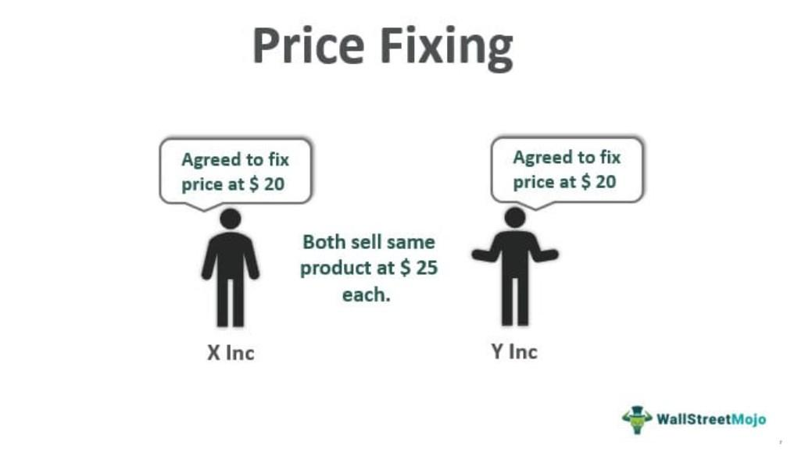

## Table of Contents

## What is price fixing?

Price fixing is when companies that sell the same thing agree to set their prices at a certain level instead of letting the market decide. This is against the law because it stops competition. When companies fix prices, they can charge more than they would if they were competing with each other. This means customers have to pay more for things like bread, electronics, or services.

For example, if three big companies that make a popular toy agree to all sell it for $50, no one will sell it for less. This keeps the price high even if it costs less to make the toy. Governments watch for price fixing and can punish companies with big fines or even jail time for the people involved. This is to protect customers and make sure companies compete fairly.

## Why is price fixing considered illegal in many countries?

Price fixing is considered illegal in many countries because it harms consumers and stops fair competition. When companies agree to set prices at a certain level, they can keep prices higher than they would be if they were competing with each other. This means that customers end up paying more for products and services. It's not fair to customers who should be able to find the best deal by choosing between different companies.

Governments make laws against price fixing to protect consumers and to keep the market working properly. When companies compete, they try to offer better prices and products to attract customers. This competition helps to keep prices down and encourages companies to improve their products. By making price fixing illegal, governments help to make sure that the market stays competitive and that customers can benefit from lower prices and better choices.

## Can you provide examples of price fixing in different industries?

In the electronics industry, a famous case of price fixing happened with LCD screens. A few big companies that made these screens got together and agreed to keep the prices high. They did this for years, and it meant that TVs, computer monitors, and laptops cost more than they should have. When people found out, the companies had to pay big fines, and some people even went to jail.

Another example is in the car industry. Some car makers in the US agreed to not compete on the prices of certain parts, like mufflers and shock absorbers. They set the prices together so that customers couldn't find cheaper options. This made car repairs more expensive for people. When the government found out, the car companies were punished, and they had to pay money back to the customers.

In the food industry, there was a case with bread in Canada. A few big bread companies agreed to raise the price of bread at the same time. They did this to make more money, and it meant that people had to pay more for their bread. When this was discovered, the companies were fined, and it showed how price fixing can affect everyday items that people need.

## How does price fixing affect consumers?

Price fixing makes things more expensive for consumers. When companies agree to set prices at a high level, people have to pay more for the products they need or want. For example, if bread companies fix prices, the cost of bread goes up, and families have to spend more money on something they eat every day. This can be tough on people, especially if they don't have a lot of money to begin with.

It also means that consumers don't get to enjoy the benefits of competition. When companies compete, they try to offer better prices and products to attract customers. But with price fixing, companies don't have to worry about lowering their prices or making their products better because they know other companies will charge the same high price. This can make life harder for consumers who want to find the best deals and have more choices.

## What are the different types of price fixing?

There are two main types of price fixing: horizontal and vertical. Horizontal price fixing happens when companies that sell the same thing, like two bread companies, agree to set their prices at the same level. They do this so they can all charge more money and not have to compete with each other. This is bad for customers because it makes things more expensive and stops companies from trying to offer better deals.

Vertical price fixing is different. It happens when a company that makes a product, like a toy maker, tells the stores that sell its toys what price they have to charge. This is called resale price maintenance. The toy maker does this to control how much the toys cost everywhere, so no store can sell them cheaper than another. This can also make things more expensive for customers and can stop stores from competing on price.

Both types of price fixing are against the law in many places because they hurt consumers and stop fair competition. Governments watch out for these practices and can punish companies with big fines or even jail time for the people involved. This helps to keep prices fair and gives customers more choices.

## How can businesses engage in price fixing without direct communication?

Businesses can engage in price fixing without direct communication through something called "tacit collusion." This happens when companies watch what other companies are doing and then set their prices the same way, without ever talking to each other. For example, if one big company raises the price of its product, other companies might see this and decide to raise their prices too, so they can all charge more money without having a secret meeting.

This kind of price fixing is hard to catch because there's no clear proof that companies talked to each other. But it still hurts customers because it means prices stay high and companies don't have to compete as hard. Governments try to watch for signs of this happening, like when prices go up at the same time across different companies, and they can still punish companies if they think this is happening, even without direct communication.

## What are the legal consequences for companies caught price fixing?

When companies get caught fixing prices, they can face big fines. These fines can be a lot of money, sometimes even millions of dollars. The government makes the companies pay these fines to punish them for breaking the law and to stop other companies from doing the same thing. The fines are meant to be so big that it's not worth it for companies to try to fix prices.

Sometimes, the people who worked at the companies and were involved in the price fixing can go to jail. This is to show that price fixing is a serious crime and to scare other people from doing it. The government wants to make sure that everyone knows that price fixing is wrong and that there will be big consequences for anyone who does it.

## How do antitrust authorities detect price fixing?

Antitrust authorities look for signs that companies might be fixing prices. They watch how prices change over time and across different companies. If prices go up at the same time for companies that sell the same thing, it could be a sign of price fixing. They also look at emails, phone calls, and meeting notes to see if companies talked about setting prices together. Sometimes, they use secret informants or whistleblowers who tell them about price fixing happening inside companies.

Another way antitrust authorities detect price fixing is by studying market patterns. They look for strange things in the market, like when prices stay the same even though costs are going down. They also check if companies are making more money than they should be, which could mean they are fixing prices. By putting all these clues together, antitrust authorities can figure out if companies are working together to keep prices high and then take action to stop it.

## What role do economic theories play in understanding price fixing?

Economic theories help us understand why price fixing happens and why it's bad for everyone. One important theory is about competition. In a good market, companies compete with each other to sell their products. They try to offer the best prices and the best products to get more customers. But when companies fix prices, they stop competing. They agree to keep prices high so they can all make more money. This goes against the idea of a free market where prices should be set by what people are willing to pay and what it costs to make things.

Another theory is about how price fixing hurts consumers. When companies fix prices, they can charge more than they would if they were competing. This means people have to pay more for things they need or want. Economic theories show that this is not fair to customers and can make life harder for them. Governments use these theories to make laws against price fixing, to protect people and keep the market working the way it should.

## How can companies defend themselves against accusations of price fixing?

When companies are accused of price fixing, they can defend themselves by showing that they did not talk to other companies about setting prices. They might say that any price changes were just because of what was happening in the market, like if costs went up or if there was more demand for their product. They could also show that they made decisions about prices on their own, without knowing what other companies were doing. This can be hard to prove, but if they can show they acted alone, it helps their case.

Another way companies can defend themselves is by showing that they followed all the rules and laws about how to set prices. They might have records of meetings and emails that show they never talked about prices with other companies. They could also point out that their prices are different from other companies, which would mean they were not fixing prices. If they can show they were always trying to follow the law and compete fairly, it can help them fight the accusations.

## What international treaties or agreements address price fixing?

The main international agreement that deals with price fixing is the World Trade Organization's (WTO) rules on competition policy. These rules say that countries should work together to stop companies from fixing prices. The idea is to make sure that trade between countries is fair and that companies compete properly. The WTO encourages countries to make laws against price fixing and to work together to catch companies that break these laws.

Another important agreement is the United Nations Set of Multilaterally Agreed Equitable Principles and Rules for the Control of Restrictive Business Practices. This set of rules, made by the UN, says that countries should stop companies from doing things like price fixing that hurt fair competition. It helps countries understand what they can do to stop these bad practices and how they can work together to make sure companies around the world play by the rules.

## How have technological advancements impacted the methods of price fixing detection and prevention?

Technology has made it easier for antitrust authorities to find price fixing. They can now use computers to look at a lot of data quickly. They use special software to see patterns in prices that might show companies are fixing prices. They can also check emails, phone calls, and messages faster than before. This helps them find secret talks between companies about setting prices. Technology also lets them keep an eye on prices in real-time, so they can see if prices change in strange ways that might mean companies are working together.

Technology also helps stop price fixing before it starts. Companies can use software to watch their own prices and make sure they are not accidentally doing something that looks like price fixing. This helps them stay out of trouble. Also, new tools like blockchain can make it harder for companies to fix prices because everything is recorded and can be checked easily. Governments and companies use these new technologies to make sure the market stays fair and that customers get the best deals.

## What are the economic implications of price fixing?

Price fixing disrupts the natural market equilibrium by artificially manipulating the forces of supply and demand, leading to several economic inefficiencies. In a competitive market, prices are determined through the interaction of supply and demand, reflecting the cost of production and consumers' willingness to pay. When companies engage in price fixing, this balance is disturbed, resulting in prices that are not representative of the actual market conditions.

One major inefficiency arising from price fixing is higher prices. Companies that agree on a fixed price eliminate the natural competition that would have driven prices down, allowing them to charge consumers more than what might have been possible in a competitive market. This can be represented by the formula:

$$
P_{\text{fixed}} > P_{\text{competitive}}
$$

where $P_{\text{fixed}}$ is the artificially elevated price due to fixing, and $P_{\text{competitive}}$ is the lower price that would result from free market competition.

Price fixing also reduces innovation. In a competitive market, companies strive to gain an edge over their rivals by innovating and improving their products or services. However, when a price is fixed, the incentive to innovate diminishes because all participants share the benefits of elevated prices without having to improve their offerings. This stalemate in innovation can stifle technological advancement and slow the pace of economic growth over time.

Furthermore, small businesses are disproportionately affected by price-fixing practices. Lacking the financial resources and market influence of larger corporations, smaller entities cannot compete with the artificially maintained prices set by established players. This often results in market [exit](/wiki/exit-strategy) or absorption by larger firms, reducing market diversity and consumer choice. The economic formula to describe the profit margin for small versus large firms could be simplified as:

$$
\text{Profit Margin} = \text{Revenue} - \text{Costs}
$$

In the context of price fixing, large firms can maintain higher profit margins due to controlled higher revenues ($R_{\text{large, fixed}}$), while small firms experience reduced revenues ($R_{\text{small, fixed}}$), making survival challenging.

The economic implications of price fixing extend beyond individual markets, impacting broader economic welfare. With fewer innovative products, higher consumer prices, and reduced small business competition, the overall economic growth potential is curtailed. Regulatory measures are essential to counteract these negative effects and ensure that markets remain competitive and fair.

## References & Further Reading

[1]: Connor, J. (2016). ["Price Fixing and the War on Cartels."](https://papers.ssrn.com/sol3/papers.cfm?abstract_id=2400780) Palgrave Macmillan.

[2]: Harrington, J. E. Jr. (2006). ["How Do Cartels Operate?"](https://joeharrington5201922.github.io/pdf/fnt06.pdf) Foundations and Trends® in Microeconomics, Vol. 2, No. 1.

[3]: Mason, R. L. (2015). ["Algorithmic Trading and the Impact on Market Microstructure."](https://www.sciencedirect.com/topics/economics-econometrics-and-finance/market-microstructure) Quantitative Finance.

[4]: Weiss, L. (1989). ["Price Theory and Our Freedoms."](https://www.semanticscholar.org/paper/Concentration-and-price-Weiss/c758eff5c0f70c8155d5c12573c471749e9af22b) Journal of Economic Perspectives, Vol. 3, No. 4.

[5]: Stigler, G. J. (1964). ["A Theory of Oligopoly."](http://walterewilliams.com/courses/articles/StiglerJPEFeb1964.pdf) Journal of Political Economy, Vol. 72, No. 1.