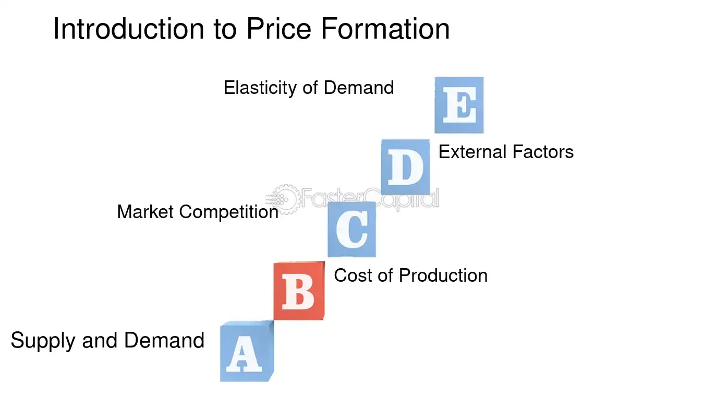

## Table of Contents

## What is price formation?

Price formation is how the price of something, like a product or a stock, is decided. It happens because of what people want and what is available. When lots of people want to buy something, but there isn't much of it, the price goes up. If nobody wants to buy it, or if there is a lot of it, the price goes down. This is called supply and demand.

In markets, buyers and sellers come together and agree on a price. If a seller thinks their item is worth a lot, but no one wants to pay that much, they might have to lower the price. On the other hand, if many people are willing to pay more, the seller can raise the price. This back-and-forth helps find the right price that both buyers and sellers are happy with.

## How does supply and demand affect price formation?

Supply and demand are like the two sides of a seesaw that help decide the price of things. When there's a lot of something, like apples at a grocery store, and not many people want to buy them, the price goes down. This is because the store wants to sell the apples before they go bad, so they make the price lower to get people to buy them. On the other hand, if there are not many apples and lots of people want them, the price goes up. The store knows people really want apples, so they can charge more.

This balance between how much of something there is and how much people want it is always changing. For example, if a new toy comes out and everyone wants it, the price might be high at first because there aren't enough toys for everyone. But as more toys are made and the excitement goes down, the price might drop. It's all about finding the right price where people are willing to buy and sellers are happy to sell.

## What role do market participants play in price formation?

Market participants, like buyers and sellers, are really important in deciding prices. Buyers want to get things for the lowest price they can, while sellers want to sell for the highest price they can. When they come together in a market, they talk and try to agree on a price that both are happy with. If a seller starts with a high price but no one wants to buy, they might have to lower it. On the other hand, if lots of people want to buy something, the seller might be able to raise the price because people are willing to pay more.

This back-and-forth between buyers and sellers helps find the right price. For example, if a farmer brings apples to the market, he might start with a certain price. If no one buys them, he might lower the price a little at a time until someone decides to buy. On the other hand, if everyone at the market wants apples and there aren't many, the farmer can keep the price high because people are willing to pay more. So, it's the actions and decisions of everyone in the market that shape what things cost.

## Can you explain the concept of equilibrium price?

The equilibrium price is like a special point where everyone in the market is happy. It's the price where the amount of something people want to buy is exactly the same as the amount sellers want to sell. Imagine you're at a lemonade stand. If you charge too much for your lemonade, no one will buy it. If you charge too little, you might sell out too fast and miss out on making more money. The equilibrium price is the perfect middle ground where you sell all your lemonade and make a good amount of money.

Finding the equilibrium price can be tricky because it's always changing. If more people suddenly want lemonade because it's a hot day, the equilibrium price might go up because sellers can charge more. But if it rains and no one wants lemonade, the price might go down. It's like a dance between what people want and what sellers have, always trying to find that sweet spot where everyone is satisfied.

## How do different market structures influence price formation?

Different market structures can change how prices are decided. In a perfect competition market, there are lots of buyers and sellers, and everyone sells the same thing. Because there are so many sellers, they can't charge much more than others, so prices stay low and close to the cost of making the product. It's like a big farmer's market where everyone is selling the same apples, so no one can charge too much or no one will buy from them.

In a monopoly, there's only one seller, and they can set the price however they want because people have no other choice. It's like if there was only one lemonade stand in town. The owner could charge a lot because if you want lemonade, you have to buy it from them. In an oligopoly, a few big companies control the market, and they might work together to keep prices high. It's like if only a few big stores sold toys, and they all agreed to keep the prices the same so they could all make more money. Each market structure changes how much power sellers have over prices.

## What are the factors that can cause price fluctuations?

Price fluctuations happen because of many things that can change how much people want to buy something and how much of it is available. One big reason is changes in what people want. For example, if a new phone comes out and everyone wants it, the price might go up because there aren't enough phones for everyone. But if people start wanting something else, like a different brand of phone, the price of the first phone might go down. Another reason is changes in how much of something there is. If a bad storm ruins a lot of the apple crop, there will be fewer apples, and the price might go up because they're harder to find.

Another [factor](/wiki/factor-investing) that can cause price changes is the cost of making things. If it suddenly costs more to make a toy because the price of plastic goes up, the price of the toy might go up too. Also, things like taxes and government rules can change prices. If the government puts a new tax on sugar, the price of candy might go up. And sometimes, what's happening in the world can affect prices. If there's a big event that makes people worried about the future, they might buy less, and prices could go down. All these things together make prices go up and down all the time.

## How does government intervention impact price formation?

Government intervention can really change how prices are decided. When the government steps in, it can set rules that affect what people pay for things. For example, they might put a tax on something like cigarettes to make them more expensive and stop people from buying them. Or they might give money to farmers to help them grow more food, which can make the price of food go down because there's more of it. The government can also set a maximum price for things, like rent, to make sure people can afford to live in their homes. This is called a price ceiling, and it stops landlords from charging too much.

Another way the government can affect prices is by controlling how much of something is available. They might limit how much of a product can be imported from other countries to help local businesses. This can make the price go up because there's less of the product around. On the other hand, the government might decide to sell things from its own stockpiles to keep prices from getting too high. For example, if there's a shortage of oil, the government might release some from its reserves to help keep the price down. All these actions show how the government can play a big role in deciding what things cost.

## What is the significance of price elasticity in price formation?

Price elasticity is a big deal when it comes to deciding prices because it tells us how much people will change what they buy if the price changes. If something is really elastic, that means if the price goes up even a little bit, people will buy a lot less of it. For example, if the price of a certain brand of soda goes up, people might just switch to a cheaper brand. On the other hand, if something is inelastic, people will keep buying it even if the price goes up. Things like medicine or gas are often inelastic because people need them no matter what.

Understanding price elasticity helps businesses and sellers decide how to set their prices. If they know their product is elastic, they might be careful not to raise the price too much because they could lose a lot of customers. But if their product is inelastic, they might feel okay about raising the price a bit because people will still buy it. This knowledge helps find the right balance in pricing to make sure they can sell their products and make money.

## How do expectations and speculation affect price formation?

Expectations and speculation can really shake up how prices are decided. When people think the price of something, like a stock or a house, is going to go up in the future, they might want to buy it now before it gets more expensive. This rush to buy can push the price up right away. For example, if everyone thinks a new tech company is going to be the next big thing, they might buy its stock, making the price go up even if the company hasn't made any money yet. On the other hand, if people think the price is going to drop, they might wait to buy or even sell what they have now, which can make the price go down.

Speculation is when people buy things not because they need them, but because they think they can sell them later for more money. This can cause big swings in prices. For instance, if a lot of people start buying gold because they think its price will go up, the price of gold can shoot up quickly. But if everyone suddenly decides to sell their gold because they think the price will fall, the price can drop just as fast. So, what people think might happen in the future can make prices go up and down a lot, even if nothing has changed about the thing itself.

## Can you discuss the role of information asymmetry in price formation?

Information asymmetry is when some people know more about something than others. This can really change how prices are decided. Imagine you're buying a used car. If the seller knows the car has a problem but you don't, they might be able to sell it to you for more money than it's worth. Because you don't know about the problem, you might pay a higher price than you would if you had all the information. This can happen in lots of markets, not just with cars. When some people have more information, they can use it to get a better deal, which can make prices go up or down in ways that might not be fair.

In financial markets, information asymmetry can be a big deal. If a company insider knows their company is going to do really well but the public doesn't know yet, they might buy more stock before the news comes out. When the good news gets out, the stock price goes up, and the insider makes money. This can make the stock price move in ways that regular people don't understand because they don't have the same information. Governments and markets try to make rules to stop this from happening too much, but it can still affect how prices are formed because not everyone knows the same things.

## How do global economic factors influence price formation in local markets?

Global economic factors can really change prices in local markets. When the value of money changes between countries, it can make things from other places more or less expensive. For example, if the dollar gets stronger compared to the euro, things made in Europe might cost less in the U.S. because you can buy more euros with your dollars. Also, if a big country like China has a lot of factories making toys, and they can make them cheaper than anyone else, the price of toys might go down everywhere because stores want to sell the cheaper ones.

Another way global factors affect local prices is through things like oil prices. If oil prices go up because there's a problem in a country that makes a lot of oil, it can make gas more expensive everywhere. This can also make other things more expensive because it costs more to move them around. And if the world economy is doing well, people might buy more stuff, which can push prices up. But if there's a big problem, like a financial crisis, people might buy less, and prices could go down. So, what happens around the world can make a big difference in what things cost at home.

## What advanced models are used to predict price formation in financial markets?

Advanced models used to predict price formation in financial markets include things like time series analysis and [machine learning](/wiki/machine-learning). Time series analysis looks at how prices have changed over time to guess what might happen next. It uses past data to find patterns and trends, like if a stock goes up every time a certain report comes out. Machine learning is a bit like teaching a computer to spot these patterns by itself. It can look at tons of data, like news articles, social media posts, and even weather reports, to figure out what might affect prices. Both of these methods help people make better guesses about where prices are headed.

Another model that's often used is the Black-Scholes model, which is especially helpful for figuring out the price of options, which are like bets on whether a stock will go up or down. This model uses math to think about things like how much the stock moves around, how long until the option expires, and what people expect the stock to do. It's a bit complicated, but it helps people decide if an option is a good deal or not. All these models try to make sense of the huge amount of information that can affect prices, but they're not perfect because the market can always surprise us.

## References & Further Reading

[1]: ["Advances in Financial Machine Learning"](https://www.amazon.com/Advances-Financial-Machine-Learning-Marcos/dp/1119482089) by Marcos Lopez de Prado

[2]: ["Quantitative Trading: How to Build Your Own Algorithmic Trading Business"](https://www.amazon.com/Quantitative-Trading-Build-Algorithmic-Business/dp/1119800064) by Ernest P. Chan

[3]: ["Machine Learning for Algorithmic Trading"](https://github.com/stefan-jansen/machine-learning-for-trading) by Stefan Jansen

[4]: Hasbrouck, J. (2007). ["Empirical Market Microstructure: The Institutions, Economics, and Econometrics of Securities Trading."](https://academic.oup.com/book/52241) Oxford University Press.

[5]: Aldridge, I. (2013). ["High-Frequency Trading: A Practical Guide to Algorithmic Strategies and Trading Systems"](https://www.amazon.com/High-Frequency-Trading-Practical-Algorithmic-Strategies/dp/1118343506) Wiley Trading.

[6]: Harris, L. (2003). ["Trading and Exchanges: Market Microstructure for Practitioners"](https://academic.oup.com/book/52292) Oxford University Press.

[7]: Bouchaud, J.P., Farmer, J.D., & Lillo, F. (2009). ["How Markets Slowly Digest Changes in Supply and Demand."](https://arxiv.org/abs/0809.0822) In: Hens, T., Schenk-Hoppe, K.R. (eds) Handbook of Financial Markets: Dynamics and Evolution. Elsevier: Academic Press.

[8]: Fabozzi, F.J., Focardi, S.M., & Kolm, P.N. (2010). ["Quantitative Equity Investing: Techniques and Strategies"](https://www.semanticscholar.org/paper/Quantitative-Equity-Investing%3A-Techniques-and-Fabozzi-Focardi/1c49a2a53919f7e65cb96f16691b8ff726fd3cd7) John Wiley & Sons.