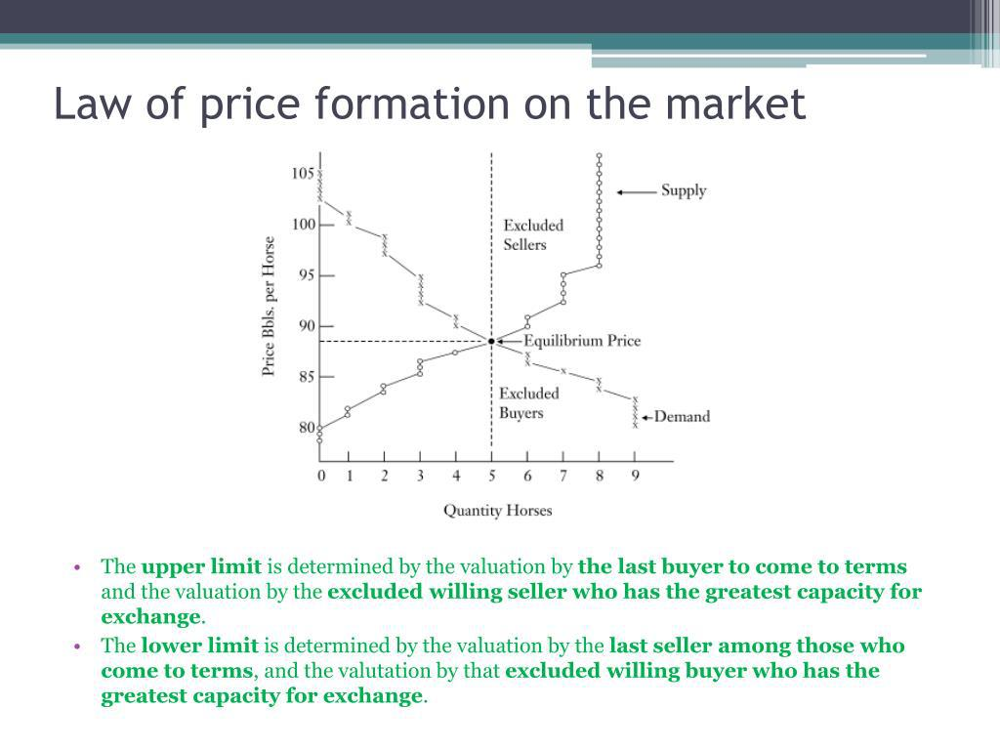

Price formation is a critical aspect of algorithmic trading, directly affecting decision-making and the efficiency of financial markets. By understanding the dynamics involved in price formation, traders can develop effective strategies and optimize their trading outcomes. Algorithmic trading relies heavily on sophisticated automated systems designed to analyze vast sets of market data, identify patterns, and make informed trading decisions based on these insights.

The process of price formation encompasses several key components, including the mechanisms that drive it, the role of order flow, and the broader impact of algorithmic trading. Order flow, which involves the submission of buy and sell orders, plays a pivotal role in influencing price movements and consequently, setting the stage for price discovery. As algorithmic systems continuously parse through both historical and real-time data, they can model price movements and predict future trends with increased accuracy.



The integration of pattern recognition techniques within these systems allows for the identification of specific price patterns that may indicate potential shifts in market trends. This capability enhances the predictive accuracy of trading algorithms, aiding traders in strategic planning and execution.

Through advancements in technology and machine learning, algorithmic trading strategies are becoming more precise, offering traders enhanced tools to navigate and react to the complexities of modern financial markets. Nonetheless, traders must remain vigilant to the challenges and limitations present in price formation analysis, adapting to changing market conditions with a balanced approach that emphasizes both analytical rigor and strategic flexibility.

## Table of Contents

## Understanding Price Formation in Algorithmic Trading

Price formation is the mechanism by which market prices are established based on the supply and demand dynamics inherent in financial markets. This concept is of paramount importance in algorithmic trading, where algorithms are designed to interpret and react to market data swiftly and accurately. At the core of price formation are the interactions between buy and sell orders, which are mediated through mechanisms such as the limit order book.

In algorithmic trading, understanding the intricacies of price formation requires comprehending how buy and sell orders interact within the market. These interactions are predominantly captured in the limit order book, a structured list of buy and sell orders organized according to their price levels. The limit order book facilitates price discovery by matching incoming market orders with existing limit orders, thereby illuminating the process through which supply meets demand. The bid-ask spread emerging within this book is a key indicator of liquidity and informs the algorithm on the possible price duly given current conditions.

Algorithmic systems utilize both historical and real-time data to model these price movements. The efficacy of these systems depends on their ability to process vast amounts of data and recognize patterns that suggest how prices are likely to move. For instance, algorithms assess historical pricing trends, seasonal patterns, and other correlative measures to make predictions about future price trends. This capability not only aids in forecasting but also enhances the timing of order execution, thereby helping to minimize market impact and reduce slippage.

Accurate modeling of price formation is vital for executing trades effectively and maximizing profitability. The algorithms must handle complex variables, such as source of information asymmetry, changes in market sentiment, and regulatory news, to adjust trading strategies in real time. Furthermore, algorithms may employ quantitative methods, such as regression analysis and [machine learning](/wiki/machine-learning) techniques, to identify subtle market signals that could inform better trading decisions.

Overall, the interplay of historical data analytics, real-time processing, and the structural setup of the order [books](/wiki/algo-trading-books) are crucial for understanding price formation in [algorithmic trading](/wiki/algorithmic-trading). This understanding directly impacts the efficacy with which trades are executed, thereby influencing potential profitability and strategic success in dynamic financial markets.

## Role of Order Flow in Price Formation

Order flow is the sequence of buy and sell orders submitted to the market that directly influences price movements. It forms the backbone of price formation in financial markets, as it dictates the balance between supply and demand for a particular asset. When high-frequency trading algorithms analyze order flow, they make rapid decisions based on prevailing market conditions. These algorithms can process vast amounts of real-time data to capture minute changes in order flow, allowing for the swift execution of trades to capitalize on short-term price discrepancies.

A crucial concept in order flow is market impact, which refers to the effect that executing a trade has on the price of an asset. When a large order is placed, it can temporarily influence the market price, especially if there is insufficient [liquidity](/wiki/liquidity-risk-premium) to absorb the trade comfortably. High-frequency trading strategies aim to minimize market impact through techniques like order splitting, where large orders are broken down into smaller, less noticeable chunks that are executed incrementally.

Simultaneously, the presence of multiple algorithmic executions can alter the quality and cost of trading, affecting price formation. For instance, when several algorithms are operating in the same market, competition for liquidity can increase, potentially leading to higher transaction costs and slippage. This further complicates the order flow landscape, as algorithms must continuously adapt to the presence and strategies of others trading in the same environment.

Understanding order flow dynamics allows traders to optimize execution strategies and manage trading costs effectively. By analyzing historical and real-time order flow data, traders can predict potential price movements and adjust their strategies accordingly. In Python, traders often use libraries like Pandas to analyze time-series data and build models to forecast order flow trends. Below is a simple Python example showing how one might begin analyzing order flow data:

```python
import pandas as pd

# Load order flow data
data = pd.read_csv('order_flow_data.csv')

# Calculate the net order flow
data['net_order_flow'] = data['buy_orders'] - data['sell_orders']

# Calculate a rolling average to smooth the data
data['rolling_net_order_flow'] = data['net_order_flow'].rolling(window=50).mean()

# Plot the results
data[['net_order_flow', 'rolling_net_order_flow']].plot()

# Identify periods of increased buy or sell pressure
buy_pressure = data[data['net_order_flow'] > 0]
sell_pressure = data[data['net_order_flow'] < 0]

print("Periods of buy pressure:")
print(buy_pressure.head())

print("Periods of sell pressure:")
print(sell_pressure.head())
```

This example demonstrates how traders analyze order flow to discern patterns, such as periods of sustained buy or sell pressure, which may indicate potential price movements. By continuously honing their understanding of order flow, traders can improve execution efficiency, achieve better pricing, and maintain a competitive edge in algorithmic trading.

## Algorithmic Trading Strategies and Price Patterns

Price patterns are essential in algorithmic trading, serving as indicators of potential shifts in market trends. Algorithms employ pattern recognition techniques to identify these patterns in price data, allowing traders to make informed decisions regarding market movements.

Reversal patterns are a type of price pattern that suggest a potential change in the current market trend. An example of a reversal pattern is the "head and shoulders" pattern, which typically indicates that an upward trend is likely to reverse into a downward trend. This pattern is characterized by three peaks: the central peak (head) is the highest, and the two outside peaks (shoulders) are lower and roughly equal in height. Detecting such patterns can help traders anticipate trend reversals and adjust their strategies accordingly.

Continuation patterns, on the other hand, suggest that the existing market trend will likely persist. Common continuation patterns include flags and triangles. Flags are small rectangular patterns that form after a strong price movement and indicate a brief consolidation before the trend resumes. Triangles, formed by converging trend lines over time, suggest that the price will continue in the same direction once the pattern is complete. Recognizing these patterns can assist traders in confirming trend continuation, which is crucial for maintaining existing positions or entering new ones in alignment with the prevailing trend.

Incorporating price patterns into trading algorithms enhances predictive accuracy and aids in strategic planning. By systematically analyzing historical price data, algorithms can learn to recognize patterns and predict future price movements. For example, a simple algorithm for detecting the head and shoulders pattern might track price movements to identify the requisite peaks and troughs, providing signals for potential reversals.

```python
def detect_head_and_shoulders(prices):
    # Sample function to detect head and shoulders pattern
    for i in range(2, len(prices)):
        if (prices[i-2] < prices[i-1] > prices[i]) and (prices[i-3] > prices[i-1] < prices[i+1]) and (prices[i] < prices[i+2]):
            return True
    return False
```

The above function is a simplified method for detecting a head and shoulders pattern within a list of prices. While it is rudimentary, more sophisticated algorithms leverage machine learning techniques to improve pattern recognition accuracy.

Integrating the detection of these price patterns within algorithmic trading strategies provides traders with robust tools for predictive modeling. As the market structure continues to evolve, continuously refining these algorithms remains paramount for maintaining an edge in trading efficiency.

## Challenges and Limitations of Price Formation

Price patterns, which play a vital role in algorithmic trading, encounter several challenges and limitations that can impede effective decision-making. One primary issue is the subjectivity involved in identifying these patterns. Traders may interpret patterns differently, leading to inconsistent trading signals. For example, two traders might perceive the same market data but identify different boundaries for a pattern like a head and shoulders, resulting in divergent trading decisions.

Moreover, false signals from price patterns can lead to unprofitable trades. These false signals underscore the necessity for corroborative analysis to verify patterns before executing trades. For instance, combining pattern recognition with other technical indicators or [fundamental analysis](/wiki/fundamental-analysis) can serve as a means to filter out misleading signals, enhancing the reliability of the decisions made.

Market [volatility](/wiki/volatility-trading-strategies) further complicates the use of price patterns. During periods of high volatility, patterns can form and dissolve quickly, reducing their predictability and reliability. This situation demands adaptive algorithmic strategies that can recalibrate in response to volatile market conditions. To adapt effectively, traders often incorporate volatility measures such as the Average True Range (ATR) to adjust their algorithm parameters dynamically.

Additionally, the complexity of algorithms designed for pattern recognition poses a significant challenge, especially in high-frequency trading environments. These algorithms require significant computational resources, which can lead to latency issues and increased operational costs. In such scenarios, optimizing algorithms to balance performance and computational efficiency is crucial.

In conclusion, while price patterns are invaluable tools in algorithmic trading, awareness of their intrinsic challenges and limitations is essential. Incorporating robust verification methods and adaptive strategies, while managing computational demands effectively, can help mitigate these challenges and improve trading outcomes.

## Conclusion

Price formation is a critical component in algorithmic trading, serving as a cornerstone for strategy design and trade execution. Within the fast-paced environment of financial markets, the ability to comprehend and utilize price patterns equips traders with the capability to make informed decisions and refine their trading outcomes. As technology advances, particularly with the integration of machine learning, the precision of algorithmic trading strategies continues to improve. Machine learning algorithms facilitate better pattern recognition and predictive analytics, thereby enhancing the adaptive capabilities of trading models.

Traders must remain vigilant to the inherent challenges involved in analyzing price formation, as market conditions can rapidly evolve. These challenges include the possibility of false signals from price patterns and the need for corroborative analysis to mitigate these risks. Therefore, a nuanced understanding of price dynamics requires integrating both qualitative insights and quantitative data.

To achieve sustained success in algorithmic trading, it is crucial to strike a balance between analytical thoroughness and strategic flexibility. This balance allows traders to adapt to market fluctuations and incorporate new technological advancements. By maintaining this equilibrium, traders can optimize trade execution, minimize risks, and capture profitable opportunities in a competitive trading landscape. The ongoing evolution of price formation analysis underscores its foundational role in developing robust and effective algorithmic trading strategies.

## References & Further Reading

[1]: ["Advances in Financial Machine Learning"](https://www.amazon.com/Advances-Financial-Machine-Learning-Marcos/dp/1119482089) by Marcos Lopez de Prado

[2]: ["Quantitative Trading: How to Build Your Own Algorithmic Trading Business"](https://www.amazon.com/Quantitative-Trading-Build-Algorithmic-Business/dp/1119800064) by Ernest P. Chan

[3]: ["Machine Learning for Algorithmic Trading"](https://github.com/stefan-jansen/machine-learning-for-trading) by Stefan Jansen

[4]: Hasbrouck, J. (2007). ["Empirical Market Microstructure: The Institutions, Economics, and Econometrics of Securities Trading."](https://academic.oup.com/book/52241) Oxford University Press.

[5]: Aldridge, I. (2013). ["High-Frequency Trading: A Practical Guide to Algorithmic Strategies and Trading Systems"](https://www.amazon.com/High-Frequency-Trading-Practical-Algorithmic-Strategies/dp/1118343506) Wiley Trading.

[6]: Harris, L. (2003). ["Trading and Exchanges: Market Microstructure for Practitioners"](https://academic.oup.com/book/52292) Oxford University Press.

[7]: Bouchaud, J.P., Farmer, J.D., & Lillo, F. (2009). ["How Markets Slowly Digest Changes in Supply and Demand."](https://arxiv.org/abs/0809.0822) In: Hens, T., Schenk-Hoppe, K.R. (eds) Handbook of Financial Markets: Dynamics and Evolution. Elsevier: Academic Press.

[8]: Fabozzi, F.J., Focardi, S.M., & Kolm, P.N. (2010). ["Quantitative Equity Investing: Techniques and Strategies"](https://www.semanticscholar.org/paper/Quantitative-Equity-Investing%3A-Techniques-and-Fabozzi-Focardi/1c49a2a53919f7e65cb96f16691b8ff726fd3cd7) John Wiley & Sons.