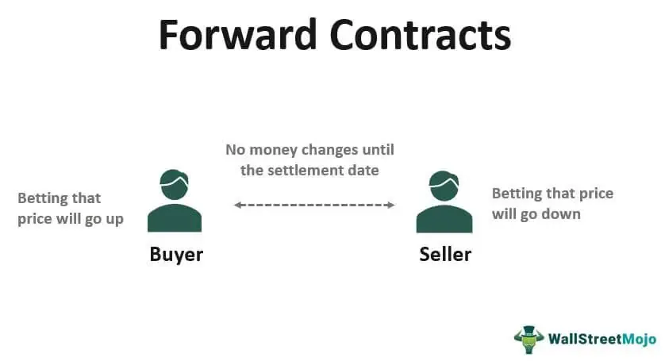

Commodities trading, financial services, investment management, and algorithmic trading are fundamental pillars of the contemporary financial markets. These components work in tandem, providing a framework for developing sophisticated investment strategies that aim to exploit market movements effectively. Commodities trading is focused on the buying and selling of raw materials and primary agricultural products, which are essential to the global economy. It provides opportunities to invest directly in the physical goods that underpin market value, from oil and gold to agricultural products like wheat and corn.

Integral to these trades are financial services, including brokerage and asset management, which facilitate liquidity, risk management, and a multitude of investment opportunities. These services ensure that the commodity markets function smoothly, allowing for efficient price discovery while providing the necessary infrastructure for investors to engage in complex trades.



Investment management strategically allocates resources to capitalize on these markets. By integrating commodities into diversified portfolios, investors can hedge against inflation and volatility, while exploring channels for potential asset growth. It forms a crucial part of broader financial planning, allowing investors to balance risk and return by incorporating these tangible assets into their strategies.

The advent of algorithmic trading has further transformed the landscape. The use of computerized systems to automate market orders based on pre-set rules represents a revolutionary advancement in trading speed, accuracy, and efficiency. This evolution supports the development of quantitative models that enhance trading strategies, leveraging data and mathematical models to make informed decisions.

Technological advancements continue to redefine the possibilities within commodities trading, driven by innovations such as artificial intelligence and real-time data processing. These technologies promise to shape future trading strategies, urging firms to adopt them to remain competitive.

Furthermore, regulatory frameworks play a critical role in maintaining market stability and fairness, with organizations like the Commodity Futures Trading Commission providing oversight. Effective risk management strategies are crucial for mitigating potential losses and safeguarding investments.

Understanding these domains collectively offers investors and firms a pathway to enhanced returns, prudent risk management, and strategic growth. As the financial markets continue to evolve, the integration of these components presents vast potential for those willing to adapt and continuously learn in response to market dynamics.

## Table of Contents

## An Overview of Commodities Trading

Commodities trading is the practice of buying and selling primary goods, which can include energy commodities like oil and gas, agricultural products such as wheat and corn, and metals like gold and silver. This sector constitutes a significant portion of global trade and has substantial impacts on economies worldwide. The dynamic nature of supply and demand coupled with geopolitical factors can lead to price [volatility](/wiki/volatility-trading-strategies), making commodities trading both an opportunity and a challenge for traders and investors.

The historical roots of commodities trading can be traced back to ancient civilizations where goods like spices, grains, and metals were exchanged based on their intrinsic value and necessity. These early forms of trade laid the groundwork for the sophisticated commodities markets we observe today. The advent of futures contracts, which emerged in the mid-19th century, marked a pivotal development by allowing traders to lock in prices for future delivery, thereby hedging against price fluctuations.

As technology has advanced, commodities trading has evolved significantly with the introduction of electronic trading platforms. These platforms have increased market accessibility and [liquidity](/wiki/liquidity-risk-premium), enabling participants ranging from individual traders to large institutions to engage in transactions more efficiently. They also facilitate real-time pricing and data analytics, which aid traders in making informed decisions.

Regulation has also played a crucial role in the evolution of commodities trading. Regulatory bodies like the Commodity Futures Trading Commission (CFTC) in the United States enforce rules to ensure transparency, prevent market manipulation, and protect market participants. These regulations are essential to maintaining the integrity of the trading environment and foster investor confidence.

Overall, commodities trading remains a fundamental component of the financial markets, influencing everything from consumer prices to international trade balances. Its continuous adaptation to technological advancements and regulatory changes reflects its enduring significance in the global economic landscape.

## Financial Services in Commodity Markets

Financial services play a pivotal role in the functioning and efficiency of commodity markets by bolstering liquidity, facilitating risk management, and creating expansive investment opportunities. These services encompass brokerage, asset management, and myriad ancillary functions crucial to market participants. By offering structured financial products and advisory services, they enable investors and businesses to engage effectively with the commodities market.

Brokerage services are central to commodities trading, providing market access to different traders ranging from individuals to institutional investors. Brokers act as intermediaries who facilitate the execution of trade orders on commodity exchanges. They offer insights, analytics, and market updates that aid clients in making informed decisions. The brokerage landscape is diverse, with firms offering both full-service and discount brokerage options depending on client needs.

Asset management within commodity markets involves the strategic selection and management of commodity-backed investments to achieve specific financial objectives. Asset managers curate investment portfolios that often include various commodities as a hedge against inflation and diversification tool. These portfolios are tailored to client risk profiles and investment horizons, thereby maximizing returns and mitigating potential risks inherent in commodity markets.

The Price Futures Group exemplifies a significant entity in this sector, providing a broad spectrum of services that cater to institutional and individual traders. The firm offers proprietary research and analytical tools that empower clients with actionable market intelligence. Additionally, The Price Futures Group provides expert consultation and execution services across numerous commodity categories, enhancing the capacity of their clients to capitalize on market opportunities.

Financial services also incorporate risk management solutions such as derivatives trading, which allows market participants to hedge against adverse price movements. Products like futures, options, and swaps are commonly used to manage exposure to price volatility in commodities. These instruments enable traders to lock in prices for future transactions, providing a safety net against fluctuating market conditions.

In conclusion, financial services are indispensable to the commodities market, offering the requisite infrastructure and expertise necessary for seamless trading and investment. Institutions like The Price Futures Group showcase how diversified service offerings can support market participants in achieving their financial objectives while navigating the complexities of commodities trading.

## Investment Management and Commodities

Investment management in commodities is a strategic process that focuses on the allocation of assets in order to maximize returns and manage risk. This involves understanding the unique characteristics of commodity markets, which can play a crucial role in diversifying investment portfolios and protecting against inflation and other financial risks.

Commodities, as tangible assets, have historically shown low correlation with traditional securities such as stocks and bonds, making them an attractive option for portfolio diversification. This characteristic allows them to act as a buffer during volatility in equity markets. Additionally, commodities like gold and oil are often utilized as hedges against inflation. Inflation erodes the real value of financial assets, but commodities, due to their intrinsic value, can retain or even increase purchasing power over time. 

Firms managing investments strategically include commodities within broader investment plans to enhance robustness and resilience. This integration involves assessing market trends and commodity cycles to determine the optimal timing and allocation of resources. For example, during periods of expected economic growth, demand for industrial metals may rise, presenting lucrative investment opportunities. Conversely, during economic downturns, precious metals like gold may offer stability and protection.

Moreover, investment managers often employ financial instruments such as futures, options, and commodity exchange-traded funds (ETFs) to gain exposure to commodity markets. These instruments allow for flexible strategies that can be adjusted quickly in response to market conditions without the need to physically store goods. 

To effectively incorporate commodities into investment strategies, managers utilize quantitative analysis and tools like mean-variance optimization, which helps in determining the best portfolio mix by minimizing risk for a given level of expected return $E(R)$. The optimization problem can be mathematically represented as:

$$
\min \sigma^2 = \mathbf{w}^T \Sigma \mathbf{w}
$$

subject to the constraint

$$
\sum_{i=1}^{n} w_i \cdot E(R_i) = E(R)
$$

where $\mathbf{w}$ is the vector of asset weights, $\Sigma$ is the covariance matrix of asset returns, and $E(R_i)$ is the expected return of asset $i$.

As investment management continues to evolve, there is increasing emphasis on using advanced technologies and data analytics to forecast commodity price movements and economic indicators. Firms that successfully integrate these technologies with traditional analytical methods can gain a competitive advantage, resulting in more informed decision-making and superior financial performance. 

In conclusion, strategic allocation in commodity investment management acts as a pivotal element in building a diversified and resilient investment portfolio, allowing firms and investors to navigate the complexities of global markets more effectively.

## Rise of Algorithmic Trading in Commodities

Algorithmic trading has revolutionized commodities markets by automating the execution of market orders through predefined algorithms. This transformation has significantly increased the speed, accuracy, and efficiency of commodities trading. By reducing the time taken to respond to market movements, [algorithmic trading](/wiki/algorithmic-trading) enables traders to capitalize on fleeting opportunities that would be impractical with manual trading methods.

The core of algorithmic trading lies in the use of quantitative models to analyze market data and generate trading signals. These models leverage historical price data, market trends, and other relevant financial indicators to predict market movements and make informed trading decisions. A typical algorithmic trading strategy might use technical analysis indicators such as moving averages to determine entry and [exit](/wiki/exit-strategy) points in the market. For example, an algorithm might be programmed to initiate a buy order when a short-term moving average crosses above a long-term moving average, and conversely, to sell when the short-term moving average drops below the long-term average. 

Furthermore, the integration of [machine learning](/wiki/machine-learning) techniques into algorithmic trading presents new possibilities for developing advanced trading strategies. Machine learning algorithms can identify complex patterns and relationships in vast datasets that are often beyond human cognitive capabilities. Techniques such as supervised learning, [reinforcement learning](/wiki/reinforcement-learning), and [deep learning](/wiki/deep-learning) are employed to enhance predictive accuracy and adapt to changing market conditions. For instance, reinforcement learning models can adjust trading strategies dynamically based on the feedback received from market outcomes, thus continuously improving decision-making processes.

The use of algorithmic trading in commodities also mitigates human errors and reduces emotional biases that can affect trading decisions. While traditional trading relies heavily on judgment calls, algorithmic trading ensures consistency by adhering strictly to preset rules and parameters. Additionally, with the ability to process large volumes of data simultaneously, algorithms facilitate high-frequency trading, enabling traders to execute thousands of trades within fractions of a second.

Despite its advantages, algorithmic trading carries its own set of challenges and risks. Systematic risks such as algorithmic glitches or network failures can lead to significant financial losses if not properly managed. Therefore, rigorous testing and validation of algorithms are crucial to ensuring their reliability and robustness. Furthermore, regulatory bodies are increasingly scrutinizing algorithmic trading practices to prevent market manipulation and ensure fair trading environments.

In summary, algorithmic trading has redefined the landscape of commodities trading by leveraging computational power and quantitative models to enhance trading efficacy. The continuing advancements in machine learning are poised to further propel the sophistication and capability of algorithmic trading strategies, presenting both opportunities and challenges for market participants.

## Technological Advances and Future Prospects

Technological advancements continue to redefine possibilities within commodities trading, profoundly impacting how transactions are conducted and analyzed. AI-driven analysis is at the forefront, enabling traders and firms to process large volumes of data swiftly to extract actionable insights. Techniques such as machine learning and deep learning support the creation of predictive models that assess market trends and price movements with increased accuracy. These models are instrumental in identifying patterns that might not be immediately apparent through traditional analysis.

Real-time data processing has also revolutionized commodities trading, providing traders with the ability to respond instantaneously to market changes. High-frequency trading systems leverage these capabilities to execute a large number of trades at speeds that exceed human abilities. For instance, algorithms can analyze live market data and make trading decisions in milliseconds, a feat unattainable without modern technological support.

Python has become a popular language for implementing these technologies due to its rich collection of libraries and frameworks such as Pandas, NumPy, and TensorFlow, which facilitate data manipulation, statistical modeling, and machine learning. An example of a simple moving average crossover strategy in Python could look like this:

```python
import pandas as pd

# Load market data
data = pd.read_csv('market_data.csv')
data['Short_MA'] = data['Close'].rolling(window=40).mean()
data['Long_MA'] = data['Close'].rolling(window=100).mean()

# Determine buy/sell signals
data['Signal'] = 0
data['Signal'][40:] = np.where(data['Short_MA'][40:] > data['Long_MA'][40:], 1, 0)
data['Position'] = data['Signal'].diff()

# Display signals
print(data[['Close', 'Short_MA', 'Long_MA', 'Signal', 'Position']])
```

Firms are increasingly urged to integrate these technological solutions to maintain a competitive edge and proactively manage the evolving complexities of the commodities markets. AI and machine learning techniques offer prospects for enhanced decision-making frameworks, while real-time analytics facilitate proactive strategy adjustments. Maintaining a technological edge is not merely advantageous; it has become an imperative for survival and success in modern commodities trading landscapes, ensuring that traders can meet both present demands and future challenges effectively.

## The Role of Regulation and Risk Management

Regulation plays a crucial role in ensuring stability and fairness in commodity markets by establishing a framework that governs trading activities. This framework is designed to foster transparency, prevent fraudulent activities, and maintain investor confidence. A key player in this regulatory landscape is the Commodity Futures Trading Commission (CFTC), which oversees the enforcement of rules and regulations to ensure market integrity and protect participants from manipulative practices.

Effective risk management is essential for mitigating potential losses and safeguarding investments in commodity markets. Risk management strategies often include diversifying investment portfolios, using hedging techniques, and implementing stop-loss orders. Diversification reduces the impact of any single commodity's volatility on the overall portfolio, thereby reducing the potential for substantial losses. Hedging involves taking positions in derivatives to offset potential losses in the physical market, allowing traders to manage their exposure to price fluctuations effectively. Stop-loss orders automatically sell a commodity when its price falls below a predetermined level, limiting the trader's losses.

Organizations such as the CFTC are integral to maintaining the integrity of commodity markets by supervising exchange activities, licensing industry participants, and prosecuting misconduct. Their efforts ensure that all market participants have access to a level playing field. For example, by enforcing position limits, regulators prevent any single entity from amassing excessive market power, thereby promoting competitive pricing and reducing the risk of market manipulation.

In summary, regulation and risk management are fundamental to the efficient functioning of commodity markets. They protect market participants from unfair practices and systemic risks while enabling traders and investors to manage their investments prudently. As commodity markets continue to evolve, these protective mechanisms will remain vital to ensuring their orderly operation and resilience.

## Conclusion

Integrating commodities trading with financial services and algorithmic strategies offers immense opportunities for both investors and firms. This multifaceted approach capitalizes on the distinct attributes of each domain to create a more robust and agile investment framework. Commodities, often seen as a hedge against inflation and a means to diversify portfolios, gain enhanced strategic value when incorporated into advanced financial services and algorithmic trading systems.

The synergy between these elements requires continuous learning and adaptation to ever-evolving market conditions. Modern financial markets are characterized by rapid technological advancements and shifting economic landscapes, which demand that all market participants remain vigilant and proactive. Investors can achieve significant returns by leveraging data-driven insights provided by algorithmic trading, which offers the speed and efficiency required in today’s competitive markets. At the same time, engaging with financial services that specialize in commodities can provide the necessary liquidity and access to diverse investment opportunities.

Strategic integration not only maximizes potential returns but also bolsters risk management capabilities. With effective algorithms and comprehensive financial services supporting commodities trading, investors can better navigate market volatilities and unexpected disruptions. This dynamic approach ensures that investments are not just reactive, but strategically positioned for sustained growth.

As the financial industry continues to advance, it is crucial for both investors and firms to evolve their strategies. Embracing new technologies, refining trading models, and adapting to regulatory changes are indispensable for remaining competitive. Continuous learning and technological adoption are not optional but essential for harnessing the full potential of commodities trading within the broader financial landscape.

## References & Further Reading

[1]: ["Algorithmic Trading and DMA: An Introduction to Direct Access Trading Strategies"](https://archive.org/details/algorithmictradi0000john) by Barry Johnson

[2]: ["Advances in Financial Machine Learning"](https://www.amazon.com/Advances-Financial-Machine-Learning-Marcos/dp/1119482089) by Marcos Lopez de Prado

[3]: ["Evidence-Based Technical Analysis: Applying the Scientific Method and Statistical Inference to Trading Signals"](https://books.google.com/books/about/Evidence_Based_Technical_Analysis.html?id=MeoJAQAAMAAJ) by David Aronson

[4]: ["Machine Learning for Algorithmic Trading"](https://github.com/stefan-jansen/machine-learning-for-trading) by Stefan Jansen

[5]: ["Quantitative Trading: How to Build Your Own Algorithmic Trading Business"](https://www.amazon.com/Quantitative-Trading-Build-Algorithmic-Business/dp/1119800064) by Ernest P. Chan

[6]: ["The Economics of Commodity Markets"](https://www.amazon.com/Economics-Commodity-Markets-Julien-Chevallier/dp/1119967910) by Julien Chevallier, Florian Ielpo, and Bertrand Maillet

[7]: U.S. Commodity Futures Trading Commission. ["Mission & Responsibilities."](https://www.cftc.gov/About/AboutTheCommission)

[8]: Hull, J. (2017). ["Options, Futures, and Other Derivatives"](https://www.amazon.com/Options-Futures-Other-Derivatives-9th/dp/0133456315) (10th Edition). Pearson.

[9]: Harris, L. (2002). ["Trading and Exchanges: Market Microstructure for Practitioners"](https://academic.oup.com/book/52292). Oxford University Press.