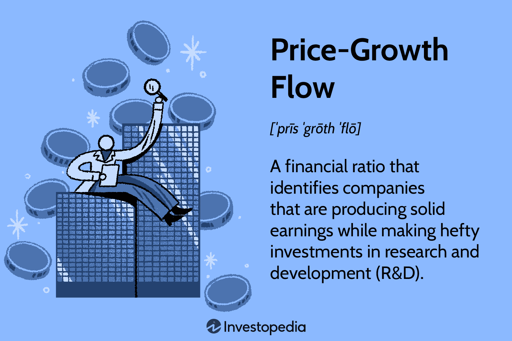

## Table of Contents

## What is Price-Growth Flow?

Price-Growth Flow is a way to understand how much a company is worth by looking at its earnings and how fast it is growing. It helps investors decide if a stock is a good buy by comparing the company's current stock price to its earnings and growth rate. This method is useful because it considers both the present value of the company and its future potential, giving a more complete picture than just looking at the price alone.

To use Price-Growth Flow, you take the company's earnings per share and multiply it by the expected growth rate. Then, you divide the current stock price by this number. If the result is low, it might mean the stock is a good value because the price is low compared to the company's earnings and growth. If the result is high, the stock might be overpriced. This tool helps investors make smarter choices by showing if a stock's price matches its growth potential.

## Why is Price-Growth Flow important in economics?

Price-Growth Flow is important in economics because it helps people make better choices about buying and selling stocks. It looks at a company's earnings and how fast it is growing, which gives a clearer picture of what the company might be worth in the future. By comparing the stock's price to these factors, investors can see if the stock is a good deal or if it's too expensive. This can help them avoid overpaying for stocks that might not grow as expected and find good opportunities in companies that are undervalued but have strong growth potential.

Understanding Price-Growth Flow also helps economists and analysts study the overall health of the market. When many companies show good Price-Growth Flow numbers, it can mean the economy is doing well and growing. On the other hand, if many companies have poor Price-Growth Flow, it might be a sign that the economy is slowing down or that investors are too optimistic about stock prices. This information can guide economic policy and investment strategies, making Price-Growth Flow a useful tool for both individual investors and those who study the economy as a whole.

## How does Price-Growth Flow differ from other economic indicators?

Price-Growth Flow is different from other economic indicators because it focuses on a company's earnings and growth rate together. Many other indicators, like the Price-Earnings (P/E) ratio, only look at a company's current earnings without considering how fast it is growing. Price-Growth Flow gives a fuller picture by showing if a company's stock price is a good value when you think about both its current earnings and its future growth.

Unlike broader economic indicators such as GDP or unemployment rates, which give a general view of the economy, Price-Growth Flow is specific to individual companies. This makes it very useful for investors who want to pick out stocks that are good buys. While GDP and unemployment rates help us understand the overall health of the economy, Price-Growth Flow helps us see the potential of a specific company within that economy.

## What are the key components of the Price-Growth Flow mechanism?

The Price-Growth Flow mechanism has two main parts: the company's earnings per share and its expected growth rate. Earnings per share is how much money the company makes for each share of its stock. The growth rate is how fast the company is expected to grow in the future. To find the Price-Growth Flow, you multiply the earnings per share by the growth rate. Then, you divide the current stock price by this number. This gives you a way to see if the stock is a good value when you think about both the company's earnings and its growth.

Price-Growth Flow is different from other ways to look at stocks because it uses both earnings and growth. For example, the Price-Earnings ratio only looks at earnings and not growth. This makes Price-Growth Flow a better tool for investors who want to know if a stock is a good buy when they think about the company's future. By using Price-Growth Flow, investors can make smarter choices about which stocks to buy or sell.

## Can you explain the basic formula used to calculate Price-Growth Flow?

The basic formula for calculating Price-Growth Flow is pretty simple. You start by multiplying the company's earnings per share by its expected growth rate. Earnings per share is the amount of money the company makes for each share of its stock. The growth rate is how fast the company is expected to grow in the future. When you multiply these two numbers together, you get what's called the "growth-adjusted earnings."

Next, you take the current stock price and divide it by the growth-adjusted earnings you just calculated. This gives you the Price-Growth Flow. If the number is low, it might mean the stock is a good deal because the price is low compared to what the company earns and how fast it's growing. If the number is high, the stock might be too expensive. This helps investors decide if a stock is worth buying based on both its current value and its future potential.

## What are the common data sources used to measure Price-Growth Flow?

To measure Price-Growth Flow, you need data on a company's earnings per share and its expected growth rate. The most common source for earnings per share is the company's financial statements, which are usually found in their quarterly or annual reports. These reports are available on the company's website or through financial databases like Bloomberg or Yahoo Finance. They show how much money the company made and how many shares they have, which helps you figure out the earnings per share.

For the expected growth rate, analysts' forecasts are a key source. These forecasts come from financial analysts who study the company and predict how fast it will grow in the future. You can find these forecasts in research reports from investment banks, financial news websites, or platforms like Morningstar and Zacks. Sometimes, companies also give their own growth estimates during earnings calls or in their investor presentations. By combining the earnings per share from financial statements with the growth rate from analysts' forecasts, you can calculate the Price-Growth Flow and see if a stock is a good buy.

## How is Price-Growth Flow used in forecasting economic trends?

Price-Growth Flow helps forecast economic trends by showing how healthy and growing companies are. When many companies have good Price-Growth Flow numbers, it means their stocks are good value when you think about their earnings and growth. This can be a sign that the economy is doing well and might keep growing. Economists and investors look at these numbers to see if businesses are strong and if people are feeling good about spending money. If a lot of companies have high Price-Growth Flow, it might mean stocks are too expensive and the economy could slow down soon.

On the other hand, if many companies have low Price-Growth Flow, it could mean their stocks are undervalued and the economy might be struggling. This helps economists predict if the economy will get better or worse. By watching Price-Growth Flow across different industries, they can see which parts of the economy are doing well and which are not. This information helps them make better guesses about where the economy is headed and what might happen next.

## What are the limitations of using Price-Growth Flow as an economic indicator?

Using Price-Growth Flow as an economic indicator has some limits. One big problem is that it relies a lot on guesses about the future. The growth rate part of the formula comes from what analysts think will happen, but they can be wrong. If their guesses are off, then the Price-Growth Flow number won't be right either. This makes it hard to trust the number completely because the future is always uncertain.

Another limit is that Price-Growth Flow only looks at a company's earnings and growth, but there are other things that can affect a stock's value. Things like how much debt a company has, what's happening in the world, or changes in the law can all make a big difference. Price-Growth Flow doesn't take these things into account, so it might miss important information that investors need to know. This means it's just one tool among many that people should use to understand the economy and make decisions about stocks.

## How can businesses apply Price-Growth Flow in their strategic planning?

Businesses can use Price-Growth Flow in their strategic planning to figure out how much their company is worth and how to grow it. By looking at their earnings per share and expected growth rate, they can see if their stock is a good value. If the Price-Growth Flow number is low, it might mean their stock is undervalued, which could be a good time to buy back shares or attract investors. On the other hand, if the number is high, it might mean their stock is overvalued, and they should focus on improving earnings or showing investors why their growth potential is strong.

This tool can also help businesses decide where to put their money. If they see that their Price-Growth Flow is good, they might want to invest more in growing the company, like expanding into new markets or developing new products. But if the Price-Growth Flow is not so good, they might need to be more careful with spending and focus on making their current operations more efficient. By keeping an eye on Price-Growth Flow, businesses can make smarter choices about how to grow and stay competitive.

## What advanced statistical methods can enhance the accuracy of Price-Growth Flow calculations?

To make Price-Growth Flow calculations more accurate, businesses can use advanced statistical methods like regression analysis. Regression analysis helps find the relationship between a company's earnings, growth rate, and other factors that might affect its stock price. By using this method, businesses can see how changes in earnings or growth might change their Price-Growth Flow. This can help them make better guesses about the future and plan more accurately. For example, they might use historical data to see how their Price-Growth Flow has changed over time and predict what might happen next.

Another useful method is time series analysis, which looks at data over time to find patterns and trends. This can help businesses understand how their Price-Growth Flow has been affected by different economic conditions in the past. By spotting these patterns, they can make better predictions about what might happen in the future. For instance, if they see that their Price-Growth Flow goes up during certain times of the year, they can plan their strategies around these patterns. Using these advanced methods can help businesses get a clearer picture of their Price-Growth Flow and make smarter decisions about their future growth and investments.

## How does Price-Growth Flow interact with monetary policy?

Price-Growth Flow can be affected by monetary policy, which is the actions taken by a country's central bank to control the money supply and interest rates. When the central bank lowers interest rates, it can make borrowing cheaper for businesses. This might help them grow faster, which could improve their Price-Growth Flow because their growth rate goes up. On the other hand, if the central bank raises interest rates, borrowing becomes more expensive, which might slow down a company's growth and hurt its Price-Growth Flow.

Monetary policy can also affect how investors see the economy. If the central bank is trying to boost the economy by keeping interest rates low, investors might feel more confident and be willing to pay more for stocks. This can make stock prices go up, which might make Price-Growth Flow numbers look worse because the stock price is higher compared to the company's earnings and growth. But if the central bank is raising rates to slow down the economy, investors might be less confident and stock prices could go down, making Price-Growth Flow numbers look better. So, understanding monetary policy can help businesses and investors predict how Price-Growth Flow might change.

## What are some case studies where Price-Growth Flow significantly influenced economic policy?

One case where Price-Growth Flow influenced economic policy was during the tech boom of the late 1990s. Many tech companies had high growth rates, which made their Price-Growth Flow numbers look good even though their stock prices were very high. Investors were excited about the potential of these companies, so they kept buying the stocks. This led to a big bubble in the stock market. When the bubble burst in 2000, it showed that the high Price-Growth Flow numbers were based on too much optimism about future growth. This taught policymakers that they need to watch Price-Growth Flow closely to see if the market is getting too excited and might need to be cooled down with tighter monetary policy.

Another case was during the recovery from the 2008 financial crisis. Many companies had low Price-Growth Flow numbers because their earnings were down and growth was slow. Policymakers saw this and decided to use very loose monetary policy, like keeping interest rates very low, to help businesses grow again. This helped improve the Price-Growth Flow numbers over time as companies started to earn more and grow faster. By watching Price-Growth Flow, policymakers could see that their actions were working and adjust their policies to keep the recovery going. This showed how important Price-Growth Flow can be in guiding economic policy during tough times.

## What are Price-Growth Financial Models?

Price-growth financial models serve as an essential framework for evaluating the market performance of companies by considering both their price changes and growth aspects. These models are specifically designed to assess how well a company's efforts in research and development (R&D) translate into earnings power and market valuation. The core concept of price-growth models lies in the understanding that growth, driven significantly by R&D investments, is a crucial determinant of a company's future earnings capacity.

### Price-Growth Flow Formula and Its Significance

The price-growth flow is quantified through specific mathematical formulas which consider a company's market capitalization, earnings, and growth projections. At the core of this model is the assumption that a company’s value can be effectively gauged by analyzing its current market position and expected growth trajectory. Though many variations exist, a basic version can be expressed as:

$$
\text{Price-Growth Flow} = \frac{\text{Market Capitalization} \times \text{Growth Rate}}{\text{Earnings}}
$$

In this formula, the market capitalization represents the total value of a company's shares on the market, the growth rate reflects expected increases in company metrics (like revenue or sales), and earnings signify the company's profitability. The resulting price-growth flow provides insights into how market perceptions align with the underlying economic realities and growth projections.

### Evaluating Earnings and R&D Capabilities

The model's significance extends to evaluating a company’s earnings and its R&D capabilities. Companies investing heavily in R&D potentially drive future growth, which subsequently impacts their market performance and earnings projections. By incorporating elements of growth stemming from R&D, this model provides a more dynamic view of a company’s potential market trajectory.

Price-growth models facilitate investment analysis by highlighting discrepancies between a company's perceived market value and its intrinsic value based on growth fundamentals. For investors and analysts, understanding these dynamics is crucial for making informed decisions, particularly in industries reliant on innovation and technological advancement.

### Predicting Current and Future Earnings Power

The utility of price-growth models extends to predicting both current and future earnings power. By accounting for R&D investment efforts, these models help forecast how such initiatives translate into sustained profitability and market standing. High R&D investments can signify robust future earnings potential, thereby commanding a premium in terms of market valuation—particularly relevant in sectors like technology and pharmaceuticals.

Utilizing these models allows stakeholders to gauge the effectiveness of R&D expenditures and anticipate their impact on future earnings. Consequently, the ability to accurately predict earnings power through price-growth analysis becomes a valuable tool for investors looking to identify emerging market leaders or undervalued firms with substantial growth potential. 

In conclusion, price-growth financial models play a critical role in bridging the gap between market valuation and company growth expectations, driven predominantly by R&D investments. This approach provides a multifaceted perspective of a company’s financial health, aligning its growth ambitions with market performance metrics.

## What are some case studies of algo trading in action?

Algorithmic trading, or "algo trading," is a method of executing orders using automated and pre-programmed trading instructions. These instructions account for variables such as time, price, and [volume](/wiki/volume-trading-strategy). Economic indicators like inflation rates and GDP data play pivotal roles in formulating these instructions, serving as inputs for the algorithms that drive trading decisions.

### Illustrative Examples of Algo Trading

Economic indicators provide the backbone for many algo trading strategies. For example, inflation rates, which measure the rate at which the general level of prices for goods and services rises, can directly influence [interest rate](/wiki/interest-rate-trading-strategies) decisions by central banks. These rates serve as crucial data points for algorithms aiming to predict currency fluctuations or bond price movements. Similarly, GDP data, which reflects the economic output and health of a country, influences stock market trends and investor sentiment. When GDP data is released, it typically causes a rapid response in the markets, making it a valuable input for high-frequency trading ([HFT](/wiki/high-frequency-trading-strategies)) algorithms. These algorithms are designed to react swiftly to such data, buying or selling assets in milliseconds after the data release.

### Overview of Growth Factor Models

Growth [factor](/wiki/factor-investing) models in algorithmic trading utilize key economic indicators to assess potential investment opportunities based on the expected growth trajectories of different assets. These models often factor in indicators such as inflation expectations, interest rates, and GDP growth rates to forecast asset price movements. The core components of these models typically include quantitative metrics like earnings growth, sales growth, and market conditions, along with economic data that signal future trends. For instance, a basic growth factor model might look like:

$$
\text{Expected Return} = \beta_0 + \beta_1 (\text{Inflation Rate}) + \beta_2 (\text{GDP Growth Rate}) + \cdots + \epsilon
$$

Where $\beta$ represents the coefficients determined by historical analysis, and $\epsilon$ is the error term.

### Case Study: Renaissance Technologies

Renaissance Technologies, founded by Jim Simons, is considered one of the most successful quant-based hedge funds, utilizing complex mathematical models for trading success. The firm employs a data-driven approach, combining vast datasets, including traditional economic indicators and [alternative data](/wiki/best-alternative-data), to feed their sophisticated algorithms.

Their flagship fund, the Medallion Fund, is known for its consistent high returns, which is largely attributed to their ability to leverage economic indicators, among other data types, within their algorithm to predict market movements accurately. Renaissance's algorithms integrate diverse data inputs ranging from price-growth models to economic data like GDP and inflation. Their strategy involves the utilization of statistical methodologies and machine learning techniques to detect subtle patterns in the market, which are often overlooked by traditional analysis methods.

These strategies are coded in proprietary programming languages or common languages such as Python or C++, allowing for rapid execution and adjustment based on real-time data analysis. For example:

```python
import numpy as np
from sklearn.linear_model import LinearRegression

# Sample feature data: inflation rates and GDP growth
features = np.array([[2.0, 3.0], [1.8, 2.9], [2.1, 3.1]])
# Sample target data: historical asset returns
target = np.array([0.5, 0.4, 0.55])

# Creating and training the model
model = LinearRegression()
model.fit(features, target)

# Predicting with new economic data
new_data = np.array([[2.2, 3.2]])
predicted_return = model.predict(new_data)

print("Predicted Return:", predicted_return)
```

Renaissance's success showcases the effectiveness of integrating complex economic data into algorithmic strategies, leading to highly adaptive and profitable trading systems. This approach highlights the critical importance of thoroughly understanding and using economic indicators in forming robust algorithmic trading models.

## References & Further Reading

1. **Academic Journals**:
   - *The Journal of Finance*: A highly respected academic journal that publishes research on financial market trends, investment strategies, and the use of economic indicators in financial modeling.
   - *Quantitative Finance*: This journal focuses on the intersection of economics and computational modeling, offering insights into algorithmic trading strategies and financial risk management.
   - *Review of Financial Studies*: Provides comprehensive research articles on contemporary financial problems, including the integration of economic indicators in predictive modeling.

2. **Books on Financial Modeling**:
   - *"Financial Modeling" by Simon Benninga*: A comprehensive guide on building financial models using spreadsheets, discussing the application of various economic indicators.
   - *"Quantitative Financial Economics: Stocks, Bonds, and Foreign Exchange" by Keith Cuthbertson and Dirk Nitzsche*: This book covers theories and models used in pricing securities, emphasizing the role of economic indicators.
   - *"Algorithmic Trading: Winning Strategies and Their Rationale" by Ernie Chan*: Offers practical guides on creating algorithmic trading systems incorporating economic data.

3. **Whitepapers and Reports**:
   - *"Algorithmic Trading and the Role of Data":* A whitepaper discussing the influence of high-quality data inputs on the success of trading algorithms, provided by financial institutions like Goldman Sachs.
   - *"Economic Indicators: A Primer for Investors" by the CFA Institute*: This report offers detailed guidance on interpreting various economic indicators and their relevance to making informed investment decisions.

4. **Online Resources and Courses**:
   - *Coursera and edX*: These platforms offer courses on algorithmic trading, financial modeling, and economic indicators led by universities such as MIT and Stanford.
   - *Investopedia*: This website provides extensive definitions, examples, and tutorials on economic indicators and trading strategies that are useful for both beginners and experienced traders.

5. **Industry Reports and Blogs**:
   - *Bloomberg Terminal Reports*: A reliable source for current economic data, trading news, and expert analysis, valuable for algorithmic trading insights.
   - *The Trading Floor Blog by Saxo Bank*: Offers perspectives from trading professionals on the application of economic indicators in making strategic investment decisions.

6. **Software and Programming Resources**:
   - *Python for Finance: Mastering Data-Driven Finance* by Yves Hilpisch: Provides an overview of using Python for financial analyses, emphasizing how to integrate economic indicators into trading algorithms.
   - *GitHub Repositories on Algorithmic Trading*: Platforms offering open-source code and projects focused on developing and testing trading strategies using real economic data.

