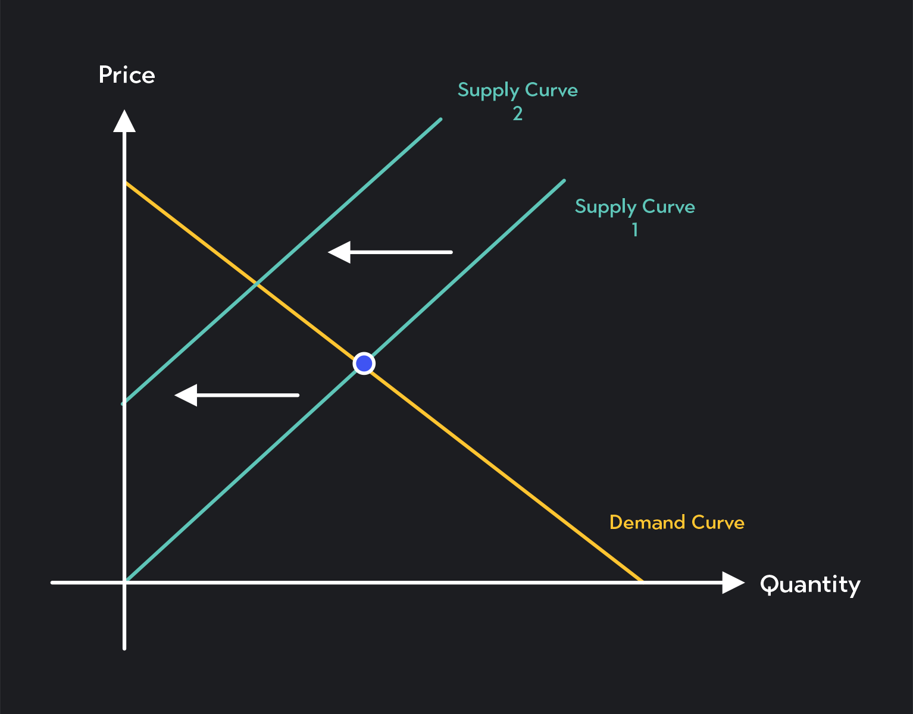

Price impact curves are a fundamental concept in algorithmic trading, serving as essential tools for understanding and anticipating how trades influence market prices. At their core, these curves depict the relationship between the size of an executed trade and the resultant movement in an asset's price. By analyzing these curves, traders can predict potential changes in market prices associated with various trade sizes, allowing for more strategic decision-making.

This article is dedicated to exploring the intricacies of price impact curves and their application in optimizing trading strategies. The significance of these curves in algorithmic trading is profound—understanding them enables traders to design strategies that minimize cost and maximize returns. A deep comprehension of price impact curves aids in recognizing the underlying market dynamics at play, providing a strategic edge.



Various elements influence the shape and nature of price impact curves, such as market liquidity, trade size, and prevailing market conditions. These factors determine how aggressively a trade might move the market and how quickly prices might revert to a mean after execution. Mastery of understanding these influences not only mitigates adverse price effects but also enhances algorithmic trading strategies to adapt to ever-changing market landscapes.

This article will also consider the practical implementation of price impact curves in algorithmic trading systems. By leveraging computational tools and statistical models, traders can simulate and measure potential impacts, refining their strategies for optimal execution. Ultimately, grasping the nuances of price impact curves is pivotal for traders looking to gain a competitive advantage in the financial markets.

## Table of Contents

## Understanding Price Impact Curves

Price impact curves represent a vital element in trading analysis, emphasizing the relationship between the size of trades and the corresponding movement in asset prices. These curves enable traders to estimate the extent to which a given trade will influence market prices, which is essential for executing informed and strategic trading decisions.

The fundamental principle underlying price impact curves is that trades of larger sizes generally induce more significant price movements. This relationship is often nonlinear, implying that as trade size increases, the resultant impact on price does not increase proportionally. Mathematically, the price impact $I$ can be described as a function of trade size $q$, and in its simplest linear form, it can be represented as:

$$
I(q) = \lambda \cdot q
$$

where $\lambda$ is the price impact coefficient that varies depending on market conditions and the liquidity of the asset. However, real-world scenarios often exhibit nonlinear characteristics, and more sophisticated models incorporate these complexities using power-law or exponential functions.

Understanding price impact curves is indispensable for traders because it allows them to predict how a specific trade size might affect the market. For example, executing a large trade in a market with low [liquidity](/wiki/liquidity-risk-premium) can cause substantial and potentially adverse price shifts, negatively impacting the trader's expected returns. By measuring and analyzing these curves, traders can anticipate these movements and plan their actions accordingly to minimize negative consequences.

Additionally, price impact curves serve in calibrating [algorithmic trading](/wiki/algorithmic-trading) strategies. Algorithms can be designed to break up substantial trades into smaller orders to avoid significant price disturbances, an approach known as order shredding. This strategy leverages the understanding of price impact curves to reduce the visibility of large trades to the market, maintaining price stability and potentially enhancing trading efficacy.

A thorough grasp of price impact curves not only aids in executing immediate trades but also facilitates broader strategic planning. By predicting how trades of various sizes influence asset prices, traders can tailor their strategies to optimize trade execution, manage market impact, and ultimately improve portfolio performance.

## Factors Influencing Price Impact

Several factors influence the shape and behavior of price impact curves, notably market liquidity, trade size, and prevailing market conditions. Understanding these factors is crucial for market participants aiming to execute trades with minimal cost and disturbance to asset prices.

Market liquidity is pivotal in determining the steepness or flatness of a price impact curve. Liquidity reflects the ability to buy or sell an asset without causing significant price movement. In highly liquid markets, a larger [volume](/wiki/volume-trading-strategy) of trade can occur with a minimal change in price, resulting in flatter price impact curves. Conversely, in less liquid markets, even small trades can lead to substantial price movements, producing steeper curves. A simple representation of liquidity could be expressed by the bid-ask spread; narrower spreads generally indicate a more liquid market.

Trade size is another critical [factor](/wiki/factor-investing) affecting price impact. Larger trades tend to have a greater impact on prices compared to smaller trades. This is because larger trades consume more of the available liquidity, thus exerting more pressure on the [order book](/wiki/order-book-trading-strategies), which often leads to a larger price movement. Traders aiming to execute large orders might break them into smaller portions to minimize their impact, a technique known as trade slicing.

Market conditions also play a significant role in shaping price impact curves. In volatile markets, price impact tends to be more pronounced as market participants adjust their positions quickly in response to new information, leading to frequent price changes. Furthermore, during economic releases or unexpected news events, liquidity may temporarily dry up, exacerbating the impact of trades on prices.

Strategically placing trades and timing them according to these factors can help in mitigating adverse price effects. For instance, understanding the typical liquidity patterns throughout the trading day can allow traders to execute orders when the market is most liquid, thus minimizing price impact. Advanced quantitative models and algorithms are often utilized to optimize trade execution based on continuously updated predictions of these factors, ultimately enhancing the effectiveness of trading strategies.

## Types of Price Impact

Price impact in trading is classified into two principal types: temporary and permanent. These impacts are pivotal in understanding how trade executions affect asset prices in different time frames.

Temporary price impact represents short-term price fluctuations that occur when a trade is executed. This impact is often a result of the liquidity constraints or the transient imbalance between supply and demand. In liquid markets, these fluctuations are generally minor and dissipate quickly as the market absorbs the trade volume and resumes equilibrium. This mean-reversion tendency is attributable to the market participants exploiting any short-term inefficiencies; hence, prices tend to revert to their fundamental values shortly after execution.

Mathematically, temporary impact can be modeled using the function:

$$
\Delta P_{\text{temp}} = T \times f(V)
$$

where $\Delta P_{\text{temp}}$ is the temporary price change, $T$ represents market immediacy costs, and $f(V)$ is a function of the trade volume $V$. The exact form of $f(V)$ can vary, commonly being proportional to the square root or some power less than one of the trade size, reflecting diminishing marginal price impact with increasing volume.

Permanent price impact, on the other hand, denotes lasting changes in the asset's price level following a trade execution. This type of impact emanates from the informational content or perceived changes in value that the trade conveys to the market participants. Large trades may signal new information or altered perceptions of the asset's fundamental value, thereby causing a shift in the supply-demand dynamics that persists beyond the initial transaction.

The permanent effect is often quantified as:

$$
\Delta P_{\text{perm}} = \lambda \times V
$$

where $\Delta P_{\text{perm}}$ is the permanent change in the price, $\lambda$ is a constant representing the market's responsiveness to trades, and $V$ is the trade volume. The key distinction between temporary and permanent impacts is their persistence; while temporary impacts are typically corrected by market forces, permanent impacts reflect an enduring adjustment to equilibrium prices.

In practice, discerning between these impacts is crucial for traders in minimizing trading costs. Effective strategies must account for these impacts, ensuring that short-term price movements do not erode the gains and that longer-term adjustments are anticipated in market strategies. Understanding these dynamics not only aids in optimizing individual trades but also contributes to improved strategy formulation for sustainable trading success.

## Measuring Price Impact

Accurately measuring price impact is a critical component of effective trade execution, involving both quantitative models and empirical data analysis. This process begins with the development and application of mathematical models that capture the dynamic relationship between trade size and consequent price movement. By leveraging historical trading data, traders can calibrate these models to reflect the specific characteristics of the asset class and market conditions, providing a basis for predicting how the market will respond to future trades.

One of the foundational approaches to measuring price impact involves the implementation of the linear price impact model. This model posits that the price change $\Delta P$ induced by a trade is proportional to the trade size $Q$. Mathematically, it can be represented as:

$$
\Delta P = \lambda Q
$$

where $\lambda$ is the liquidity parameter that encapsulates market depth and resilience. However, in more sophisticated and realistic settings, non-linear models may offer a better fitting, especially in less liquid markets where price impact does not scale linearly with trade size.

Traders must also consider both expected and unexpected impacts. The expected impact can be estimated using historical [volatility](/wiki/volatility-trading-strategies) and liquidity metrics, while unexpected impacts might arise from abrupt changes in market conditions or unforeseen events. These estimates, however, are best refined through the use of advanced simulation techniques that model various execution scenarios. For instance, simulations that incorporate Monte Carlo methods allow traders to account for the probabilistic nature of price movements, assessing a range of outcomes and their associated probabilities.

Python provides a robust platform for such analyses, equipped with libraries like NumPy and Pandas for data manipulation, as well as SciPy for complex mathematical functions. A simple Python function to simulate price impact using a linear model might look like:

```python
import numpy as np

def simulate_price_impact(trade_size, liquidity_parameter, iterations=1000):
    price_changes = []
    for _ in range(iterations):
        price_change = liquidity_parameter * trade_size * np.random.randn()
        price_changes.append(price_change)
    return np.mean(price_changes), np.std(price_changes)

# Example usage
trade_size = 1000
liquidity_parameter = 0.01
mean_impact, std_impact = simulate_price_impact(trade_size, liquidity_parameter)
print(f"Expected Price Impact: {mean_impact}, Impact Volatility: {std_impact}")
```

This function simulates the price impact by generating random deviations based on the liquidity parameter and trade size, providing insights into both the mean expected impact and the variability of impact outcomes.

By integrating these methodologies, traders can better anticipate and mitigate the adverse effects of their trades, leading to more effective and strategic decision-making in the financial markets. Effective measurement and management of price impact thus becomes an indispensable skill for traders seeking to optimize their algorithmic trading strategies.

## Controlling Price Impact

Controlling price impact is essential for optimizing trade execution and maintaining the effectiveness of trading strategies. By effectively managing price impact, traders can minimize the costs associated with executing large orders and prevent undesirable price movements that could affect their trading outcomes.

One effective technique for controlling price impact is strategy diversification. By diversifying trading strategies, traders can distribute their orders across a variety of financial instruments and trading signals, minimizing the concentration of large trades in a single market or asset. This approach helps to prevent significant disruptions in any single market, leading to a smoother execution of trades.

Adjusting execution speed is another method employed by traders to manage price impact. By tuning the speed at which orders are executed, traders can interact with the market more thoughtfully. For example, breaking a large order into smaller chunks and executing them over a longer period can minimize the immediate impact on the market price. This method, known as slicing, involves the strategic release of orders over time, thereby reducing the likelihood of drastic price changes.

Trade timing also plays a critical role in managing price impact. By carefully timing their trades, traders can take advantage of periods of high liquidity and lower volatility, which often results in less pronounced price impacts. Liquid markets, characterized by high trading volumes, are generally more capable of absorbing large orders without significant price deviations. Conversely, executing trades during periods of low liquidity can exacerbate price impact, making careful market analysis vital to determining optimal trade execution times.

Advanced trading platforms provide tools and features that assist traders in controlling price impact. These platforms often include algorithms designed to optimize order execution by automatically adjusting order sizes and execution speeds according to real-time market conditions. Sophisticated tools such as Volume Weighted Average Price (VWAP) and Time Weighted Average Price (TWAP) are commonly utilized to achieve favorable trade execution while minimizing price deviation.

Combining these techniques, traders can better manage the impact of their trades on market prices, optimizing their trade executions and ensuring their strategies remain effective in dynamic market conditions.

## Role in Algorithmic Trading Strategies

Price impact curves are essential for the development and refinement of algorithmic trading strategies. By illustrating the relationship between trade size and the resulting price movement, these curves play a pivotal role in the decision-making processes of traders aiming to optimize their trading strategies while minimizing market disruption.

Graphical representations of price impact curves provide traders with a visual tool for understanding the potential effects of trade executions. By plotting these curves, traders can anticipate how different sizes of trades may influence asset prices, enabling them to assess risk more effectively. For instance, a steeper curve indicates a higher price movement for a given trade size, suggesting that careful consideration is needed when executing large trades to avoid significant price alterations.

These insights are crucial for refining trading strategies, as they offer a predictive view of price impacts under various market conditions. Algorithmic traders can utilize this information to enhance their strategies, making adjustments to trade size, timing, and execution speed based upon the anticipated price impact. This process not only serves to optimize trading outcomes but also aids in managing risk more efficiently.

By analyzing price impact curves, traders can make informed decisions that align with current market dynamics. The integration of these curves into algorithmic models allows for the optimization of trading algorithms, ensuring that trades are executed in a manner that is both strategic and aligned with market liquidity conditions. This helps in adapting quickly to market changes, ultimately contributing to the success and resilience of algorithmic trading strategies.

## Conclusion

Price impact curves offer invaluable insights into trade execution impacts and market behavior. By understanding how the execution of trades influences asset prices, traders can optimize their strategies through precise anticipation of market reactions. This understanding aids in predicting potential price shifts that accompany large trade executions, enabling traders to mitigate risks associated with abrupt price changes. 

Effective management of price impacts is essential for enhancing trading strategies, contributing significantly to overall success in algorithmic trading. By integrating price impact analyses into algorithmic strategies, traders can refine their approach, balancing trade size and execution timing to minimize adverse price effects. This optimization not only maximizes trade efficiency but also strengthens risk management capabilities within highly volatile markets.

Continuous analysis and adaptation to price impact curves keep traders ahead in the dynamic world of financial markets. Regular updates to trading algorithms based on real-time data and historical price impact assessments ensure alignment with evolving market conditions. As financial markets continue to grow in complexity, leveraging price impact insights becomes increasingly crucial for maintaining competitive advantages. Investing in the development and fine-tuning of algorithmic models allows traders to remain agile, responsive, and profitable amidst shifting market landscapes.

## References & Further Reading

[1]: Almgren, R., & Chriss, N. (2000). ["Optimal Execution of Portfolio Transactions."](https://smallake.kr/wp-content/uploads/2016/03/optliq.pdf) The Journal of Risk, 3(2), 5-39.

[2]: Huberman, G., & Stanzl, W. (2004). ["Price Manipulation and Quasi-Arbitrage."](https://www.jstor.org/stable/pdf/3598784.pdf) Econometrica, 72(4), 1247-1275.

[3]: Bouchaud, J.-P., Gefen, Y., Potters, M., & Wyart, M. (2004). ["Fluctuations and Response in Financial Markets: The Subtle Nature of 'Random' Price Changes."](https://arxiv.org/abs/cond-mat/0307332) Quantitative Finance, 4(2), 176-190.

[4]: Gatheral, J. (2010). ["No-Dynamic-Arbitrage and Market Impact."](https://www.tandfonline.com/doi/full/10.1080/14697680903373692) Quantitative Finance, 10(7), 749-759.

[5]: Cartea, Á., Jaimungal, S., & Penalva, J. (2015). ["Algorithmic and High-Frequency Trading."](https://assets.cambridge.org/97811070/91146/frontmatter/9781107091146_frontmatter.pdf) Cambridge University Press.

[6]: Harris, L. (2003). ["Trading and Exchanges: Market Microstructure for Practitioners."](https://www.amazon.com/Trading-Exchanges-Market-Microstructure-Practitioners/dp/0195144708) Oxford University Press.

[7]: Cont, R., & Kukanov, A. (2017). ["Optimal Order Placement in Limit Order Markets."](https://hal.science/hal-00737491v2/document) SIAM Journal on Financial Mathematics, 8(1), 1-28.