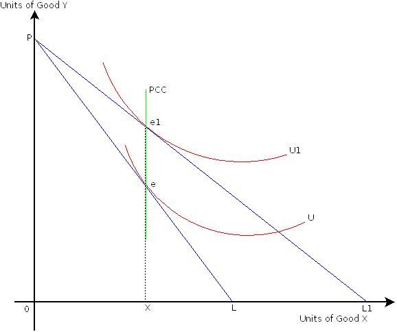

## Table of Contents

## What is a price impact curve?

A price impact curve is a graph that shows how the price of something changes when you buy or sell a lot of it. Imagine you want to buy many apples. If you buy just a few, the price might stay the same. But if you buy a lot, the price might go up because there are fewer apples left for others. This curve helps people see how their big buys or sells can change the price.

This curve is really useful in trading and finance. Traders use it to guess how much the price will move if they trade a large amount of a stock or another thing. By looking at the curve, they can plan their trades better and try to get the best price. It's like a map that helps them navigate the market without causing big price jumps.

## Why are price impact curves important in trading?

Price impact curves are important in trading because they help traders understand how their actions can change the price of what they're trading. If a trader wants to buy or sell a lot of something, like a stock, the price might move a lot. The curve shows how much the price might go up or down depending on how much is traded. This helps traders make smarter choices about when and how much to trade, so they don't accidentally cause big price jumps that could hurt their profits.

By using price impact curves, traders can plan their trades better. They can break up big trades into smaller ones to keep the price from moving too much. This way, they can get a better average price for their trades. Knowing about price impact is like having a map in the market. It guides traders to make moves that are less likely to shake up the market and more likely to help them reach their trading goals.

## How do price impact curves differ across various markets?

Price impact curves can look different depending on the market they're used in. In some markets, like stocks, the curve might be steeper. This means that buying or selling a lot can make the price change a lot. That's because there might not be as many people trading, so big trades can shake things up. In other markets, like big currency markets, the curve might be flatter. That's because there are a lot of people trading all the time, so big trades don't change the price as much.

The shape of the price impact curve also depends on how easy it is to trade in a market. In markets where it's hard to buy or sell quickly, like some real estate markets, the curve can be very steep. A big trade can really move the price because it's hard to find someone to trade with. But in markets where trading is easy and fast, like some futures markets, the curve is usually flatter. Here, big trades don't move the price as much because there are always people ready to trade.

## What factors influence the shape of a price impact curve?

The shape of a price impact curve is influenced by how much people are trading and how easy it is to trade in a market. If there are a lot of people buying and selling all the time, like in big currency markets, the curve is usually flat. This is because a big trade doesn't change the price much when there are many trades happening. But if there aren't many people trading, like in some stock markets, the curve can be steep. Here, a big trade can move the price a lot because there aren't many other trades to balance it out.

Another [factor](/wiki/factor-investing) is how quickly and easily you can buy or sell in a market. In markets where it's hard to find someone to trade with, like some real estate markets, the curve is steep. A big trade can really shake things up because it's not easy to trade. But in markets where trading is fast and easy, like some futures markets, the curve is flatter. Big trades don't move the price as much because there are always people ready to trade, making it easier to balance out the impact of any single trade.

## Can you explain the concept of liquidity in relation to price impact curves?

Liquidity is all about how easy it is to buy or sell something in a market without the price changing a lot. When a market is liquid, there are lots of people trading all the time. This means if you want to buy or sell a big amount, it's easier to find someone to trade with, and the price doesn't jump around too much. In a liquid market, the price impact curve is usually flat. This is because big trades don't change the price much when there are many trades happening all the time.

On the other hand, if a market is not very liquid, it's harder to find someone to trade with. When you try to buy or sell a big amount, it can really move the price because there aren't many other trades to balance it out. In these markets, the price impact curve is steep. This means that even small trades can make the price go up or down a lot. So, liquidity is a big deal when it comes to how the price impact curve looks in different markets.

## How can traders use price impact curves to optimize their trading strategies?

Traders can use price impact curves to plan their trades better and get the best prices. By looking at the curve, they can see how much the price might change if they buy or sell a lot of something. If the curve is steep, it means that a big trade could move the price a lot. So, traders might decide to break up their big trades into smaller ones. This way, they can buy or sell without causing a big price jump, which helps them get a better average price for their trades.

In markets where the price impact curve is flat, traders know that big trades won't change the price much. This means they can be more confident about making larger trades without worrying too much about the price moving against them. By understanding the shape of the price impact curve in different markets, traders can adjust their strategies to fit the market's liquidity. This helps them trade smarter and reach their goals without causing big waves in the market.

## What are the common mathematical models used to describe price impact curves?

One common model to describe price impact curves is the linear model. This model says that the price change is directly related to the size of the trade. If you trade more, the price goes up or down more, in a straight line. It's simple and works well for small trades in liquid markets. But it might not be as good for big trades or in markets where the price can jump around a lot.

Another model is the power law model. This one says that the price change grows faster than the size of the trade. It's like if you double the size of your trade, the price might change more than double. This model can be better for big trades and in markets where the price can move a lot. It helps traders see how their big trades can shake up the market more than they might expect with a simple straight line.

There's also the exponential model, which says that the price change can grow really fast as the trade size gets bigger. This model is good for markets where even small trades can cause big price jumps. It helps traders be careful about how much they trade at once, because the price can change a lot more than they might think. Each of these models helps traders understand and plan for how their trades might move the market.

## How do high-frequency trading strategies affect price impact curves?

High-frequency trading ([HFT](/wiki/high-frequency-trading-strategies)) can change the shape of price impact curves because these traders make lots of trades very quickly. When there are many HFT traders in a market, they can make the market more liquid. This means the price impact curve can become flatter. A flatter curve means that big trades don't change the price as much because there are always lots of other trades happening. HFT traders can quickly step in to buy or sell, which helps keep the price from jumping around too much.

But HFT can also make the price impact curve steeper in some cases. If HFT traders all decide to trade in the same direction at the same time, it can cause big price swings. This is because their quick trades can pile up and push the price up or down a lot. So, while HFT can make the market more liquid and flatten the curve, it can also lead to sudden price jumps, making the curve steeper when many traders move together.

## What empirical methods are used to estimate price impact curves?

To figure out what a price impact curve looks like, researchers often look at past trades. They check how much the price changed when someone bought or sold a lot of something. They might use a computer to go through lots of old trade data and see how the price moved with different trade sizes. This helps them draw a curve that shows how much the price might change if someone makes a big trade now.

Another way to estimate price impact curves is by doing experiments in the market. Traders might try making different sized trades and see how the price reacts. They can then use this information to guess how the price might change with future trades. Both of these methods help traders understand how their actions can affect the market and plan their trades better.

## How do market makers utilize price impact curves in their operations?

Market makers use price impact curves to help them set prices and manage risks. They know that when they buy or sell a lot of something, the price can change. By looking at the price impact curve, they can guess how much the price might go up or down if they trade a big amount. This helps them decide what price to offer buyers and sellers. If the curve is steep, they might be more careful about making big trades because the price could jump a lot. If the curve is flat, they might feel safer making bigger trades because the price won't change as much.

Market makers also use price impact curves to make sure they can always buy and sell things without losing too much money. They want to keep the market running smoothly, so they need to know how their trades can affect the price. By understanding the curve, they can plan their trades to keep the market stable. This helps them make money by buying low and selling high, while also making sure there's always someone to trade with in the market.

## What are the limitations and challenges in accurately modeling price impact curves?

One big challenge in making accurate price impact curves is that markets can change a lot. What worked yesterday might not work today because new people might start trading or big news might change how everyone feels about buying and selling. This makes it hard to use old data to guess what will happen next. Also, different markets can act in different ways. What's true for a stock market might not be true for a currency market. This means that a model that works well in one place might not work well in another.

Another limitation is that the models we use to guess price impact can be too simple. Real markets are very complicated, with lots of people making trades for different reasons. Simple models like the linear or power law models might miss some important details. They might work okay for small trades, but they can be off when it comes to big trades or when the market is acting in unexpected ways. This means traders have to be careful and use these models as just one part of their trading plan, not the whole thing.

## How have price impact curves evolved with the advent of electronic trading platforms?

The way we look at price impact curves has changed a lot since electronic trading platforms came along. Before, when trading happened on big trading floors, it was hard to see exactly how much a big trade could change the price. Now, with electronic platforms, we can see every trade and how it affects the price right away. This means we can make better guesses about how the price might move if someone buys or sells a lot of something. The data from these platforms helps us draw more accurate price impact curves, making it easier for traders to plan their trades.

Electronic trading has also made markets more liquid. There are more people trading all the time, which means big trades don't change the price as much as they used to. This can make the price impact curve flatter. But, it's not always that simple. Sometimes, if a lot of electronic traders all decide to buy or sell at the same time, it can cause big price jumps, making the curve steeper. So, while electronic trading has given us better tools to understand price impact, it has also made the market more complex and harder to predict.

## What are Price Impact Curves and how do we understand them?

Price impact curves represent a vital element in trading analysis, emphasizing the relationship between the size of trades and the corresponding movement in asset prices. These curves enable traders to estimate the extent to which a given trade will influence market prices, which is essential for executing informed and strategic trading decisions.

The fundamental principle underlying price impact curves is that trades of larger sizes generally induce more significant price movements. This relationship is often nonlinear, implying that as trade size increases, the resultant impact on price does not increase proportionally. Mathematically, the price impact $I$ can be described as a function of trade size $q$, and in its simplest linear form, it can be represented as:

$$
I(q) = \lambda \cdot q
$$

where $\lambda$ is the price impact coefficient that varies depending on market conditions and the liquidity of the asset. However, real-world scenarios often exhibit nonlinear characteristics, and more sophisticated models incorporate these complexities using power-law or exponential functions.

Understanding price impact curves is indispensable for traders because it allows them to predict how a specific trade size might affect the market. For example, executing a large trade in a market with low [liquidity](/wiki/liquidity-risk-premium) can cause substantial and potentially adverse price shifts, negatively impacting the trader's expected returns. By measuring and analyzing these curves, traders can anticipate these movements and plan their actions accordingly to minimize negative consequences.

Additionally, price impact curves serve in calibrating [algorithmic trading](/wiki/algorithmic-trading) strategies. Algorithms can be designed to break up substantial trades into smaller orders to avoid significant price disturbances, an approach known as order shredding. This strategy leverages the understanding of price impact curves to reduce the visibility of large trades to the market, maintaining price stability and potentially enhancing trading efficacy.

A thorough grasp of price impact curves not only aids in executing immediate trades but also facilitates broader strategic planning. By predicting how trades of various sizes influence asset prices, traders can tailor their strategies to optimize trade execution, manage market impact, and ultimately improve portfolio performance.

## What are the types of price impact?

Price impact in trading is classified into two principal types: temporary and permanent. These impacts are pivotal in understanding how trade executions affect asset prices in different time frames.

Temporary price impact represents short-term price fluctuations that occur when a trade is executed. This impact is often a result of the liquidity constraints or the transient imbalance between supply and demand. In liquid markets, these fluctuations are generally minor and dissipate quickly as the market absorbs the trade [volume](/wiki/volume-trading-strategy) and resumes equilibrium. This mean-reversion tendency is attributable to the market participants exploiting any short-term inefficiencies; hence, prices tend to revert to their fundamental values shortly after execution.

Mathematically, temporary impact can be modeled using the function:

$$
\Delta P_{\text{temp}} = T \times f(V)
$$

where $\Delta P_{\text{temp}}$ is the temporary price change, $T$ represents market immediacy costs, and $f(V)$ is a function of the trade volume $V$. The exact form of $f(V)$ can vary, commonly being proportional to the square root or some power less than one of the trade size, reflecting diminishing marginal price impact with increasing volume.

Permanent price impact, on the other hand, denotes lasting changes in the asset's price level following a trade execution. This type of impact emanates from the informational content or perceived changes in value that the trade conveys to the market participants. Large trades may signal new information or altered perceptions of the asset's fundamental value, thereby causing a shift in the supply-demand dynamics that persists beyond the initial transaction.

The permanent effect is often quantified as:

$$
\Delta P_{\text{perm}} = \lambda \times V
$$

where $\Delta P_{\text{perm}}$ is the permanent change in the price, $\lambda$ is a constant representing the market's responsiveness to trades, and $V$ is the trade volume. The key distinction between temporary and permanent impacts is their persistence; while temporary impacts are typically corrected by market forces, permanent impacts reflect an enduring adjustment to equilibrium prices.

In practice, discerning between these impacts is crucial for traders in minimizing trading costs. Effective strategies must account for these impacts, ensuring that short-term price movements do not erode the gains and that longer-term adjustments are anticipated in market strategies. Understanding these dynamics not only aids in optimizing individual trades but also contributes to improved strategy formulation for sustainable trading success.

## How can we measure price impact?

Accurately measuring price impact is a critical component of effective trade execution, involving both quantitative models and empirical data analysis. This process begins with the development and application of mathematical models that capture the dynamic relationship between trade size and consequent price movement. By leveraging historical trading data, traders can calibrate these models to reflect the specific characteristics of the asset class and market conditions, providing a basis for predicting how the market will respond to future trades.

One of the foundational approaches to measuring price impact involves the implementation of the linear price impact model. This model posits that the price change $\Delta P$ induced by a trade is proportional to the trade size $Q$. Mathematically, it can be represented as:

$$
\Delta P = \lambda Q
$$

where $\lambda$ is the liquidity parameter that encapsulates market depth and resilience. However, in more sophisticated and realistic settings, non-linear models may offer a better fitting, especially in less liquid markets where price impact does not scale linearly with trade size.

Traders must also consider both expected and unexpected impacts. The expected impact can be estimated using historical [volatility](/wiki/volatility-trading-strategies) and liquidity metrics, while unexpected impacts might arise from abrupt changes in market conditions or unforeseen events. These estimates, however, are best refined through the use of advanced simulation techniques that model various execution scenarios. For instance, simulations that incorporate Monte Carlo methods allow traders to account for the probabilistic nature of price movements, assessing a range of outcomes and their associated probabilities.

Python provides a robust platform for such analyses, equipped with libraries like NumPy and Pandas for data manipulation, as well as SciPy for complex mathematical functions. A simple Python function to simulate price impact using a linear model might look like:

```python
import numpy as np

def simulate_price_impact(trade_size, liquidity_parameter, iterations=1000):
    price_changes = []
    for _ in range(iterations):
        price_change = liquidity_parameter * trade_size * np.random.randn()
        price_changes.append(price_change)
    return np.mean(price_changes), np.std(price_changes)

# Example usage
trade_size = 1000
liquidity_parameter = 0.01
mean_impact, std_impact = simulate_price_impact(trade_size, liquidity_parameter)
print(f"Expected Price Impact: {mean_impact}, Impact Volatility: {std_impact}")
```

This function simulates the price impact by generating random deviations based on the liquidity parameter and trade size, providing insights into both the mean expected impact and the variability of impact outcomes.

By integrating these methodologies, traders can better anticipate and mitigate the adverse effects of their trades, leading to more effective and strategic decision-making in the financial markets. Effective measurement and management of price impact thus becomes an indispensable skill for traders seeking to optimize their algorithmic trading strategies.

## References & Further Reading

[1]: Almgren, R., & Chriss, N. (2000). ["Optimal Execution of Portfolio Transactions."](https://smallake.kr/wp-content/uploads/2016/03/optliq.pdf) The Journal of Risk, 3(2), 5-39.

[2]: Huberman, G., & Stanzl, W. (2004). ["Price Manipulation and Quasi-Arbitrage."](https://www.jstor.org/stable/pdf/3598784.pdf) Econometrica, 72(4), 1247-1275.

[3]: Bouchaud, J.-P., Gefen, Y., Potters, M., & Wyart, M. (2004). ["Fluctuations and Response in Financial Markets: The Subtle Nature of 'Random' Price Changes."](https://arxiv.org/abs/cond-mat/0307332) Quantitative Finance, 4(2), 176-190.

[4]: Gatheral, J. (2010). ["No-Dynamic-Arbitrage and Market Impact."](https://www.tandfonline.com/doi/full/10.1080/14697680903373692) Quantitative Finance, 10(7), 749-759.

[5]: Cartea, Á., Jaimungal, S., & Penalva, J. (2015). ["Algorithmic and High-Frequency Trading."](https://assets.cambridge.org/97811070/91146/frontmatter/9781107091146_frontmatter.pdf) Cambridge University Press.

[6]: Harris, L. (2003). ["Trading and Exchanges: Market Microstructure for Practitioners."](https://www.amazon.com/Trading-Exchanges-Market-Microstructure-Practitioners/dp/0195144708) Oxford University Press.

[7]: Cont, R., & Kukanov, A. (2017). ["Optimal Order Placement in Limit Order Markets."](https://hal.science/hal-00737491v2/document) SIAM Journal on Financial Mathematics, 8(1), 1-28.