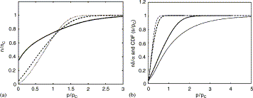

## Table of Contents

## What is a price impact function?

A price impact function is a way to understand how buying or selling something can change its price. When you buy a lot of something, the price might go up because more people want it. If you sell a lot, the price might go down because there's more of it available. This function helps people in finance and trading figure out how their trades will affect the price of what they're trading.

For example, if you're trading stocks, a price impact function can show you that buying 100 shares might make the price go up a little bit, but buying 1,000 shares could make it go up a lot more. Traders use this information to decide how much to buy or sell at one time, so they can get the best price possible. It's like a tool that helps them plan their moves in the market.

## Why are price impact functions important in financial markets?

Price impact functions are important in financial markets because they help traders understand how their trades will change the price of what they're buying or selling. When someone buys a lot of a stock, the price usually goes up because more people want it. If they sell a lot, the price can go down because there's more of it available. By knowing this, traders can plan their trades better. They can decide how much to buy or sell at one time to get the best price.

This knowledge is also important for keeping the market fair. If traders know how their actions affect prices, they can avoid making big trades that might unfairly move the market. This helps keep the market stable and makes sure everyone has a fair chance. Overall, price impact functions are a key tool for traders to make smart decisions and for keeping the financial markets working smoothly.

## How does a price impact function affect trading strategies?

A price impact function helps traders make better trading strategies by showing them how their trades can change prices. If a trader knows that buying a lot of a stock will make its price go up, they might decide to buy it slowly over time. This way, they can get a better average price and not push the price up too much all at once. It's like trying to fill a bucket with water without making waves - you do it slowly and carefully.

On the other hand, if a trader wants to sell a lot of a stock, they might use the price impact function to figure out the best way to do it without making the price drop too much. They might break up their sell order into smaller pieces, so the market doesn't get flooded with the stock all at once. This helps them sell at a better price and avoid causing big price swings that could hurt other traders. By understanding price impact, traders can create strategies that help them and the market stay balanced.

## What are the different types of price impact functions?

There are a few different types of price impact functions that traders use. One type is the linear price impact function. This means that if you buy or sell more of something, the price change will be bigger, but it grows at a steady rate. It's like if you add more weight to a scale, the needle moves more, but it moves in a straight line. Another type is the non-linear price impact function. This one is trickier because the price doesn't change at a steady rate. If you buy a lot of something, the price might jump up a lot more than if you just bought a little bit. It's like adding weight to a spring - at first, it might not move much, but then it can suddenly stretch a lot.

Another type of price impact function is the permanent price impact function. This means that when you buy or sell something, the price change sticks around for a long time. It's like if you paint a wall, the color stays there. On the other hand, there's the temporary price impact function. This means that the price change only lasts for a short time. It's like if you splash water on a wall - it might look wet for a bit, but then it dries up. Traders use these different types of functions to understand how their trades will affect prices over time and plan their strategies accordingly.

## Can you explain the mathematical formula for a basic price impact function?

A basic price impact function can be described using a simple mathematical formula. Let's say you're trading a stock, and you want to know how much the price will change if you buy or sell some shares. A common formula for a linear price impact function is: Price Change = Impact Coefficient × Trade Size. Here, the "Impact Coefficient" is a number that shows how sensitive the price is to trading. The "Trade Size" is how many shares you're buying or selling. So, if the Impact Coefficient is 0.01 and you're buying 1000 shares, the price will go up by 0.01 × 1000 = 10 units.

This formula helps traders predict what will happen to the price when they make a trade. If they want to buy a lot of shares but don't want to push the price up too much, they can use this formula to figure out the best way to do it. For example, instead of buying all the shares at once, they might split their order into smaller pieces. This way, each smaller trade will have a smaller impact on the price, and they can get a better overall price for their shares.

## How do market conditions influence the shape of a price impact function?

Market conditions play a big role in how a price impact function looks. When the market is calm and there's a lot of trading going on, the price impact function might be more gentle. This means that buying or selling a lot of something won't change the price as much because there are many other traders around to balance things out. It's like trying to make a wave in a big, calm lake - it's hard to do because the water is so still and big.

On the other hand, when the market is wild and there's not much trading happening, the price impact function can be much sharper. This means that even a small trade can make the price jump up or down a lot. It's like trying to make a wave in a small, stormy pond - even a little splash can cause big ripples because the water is already moving a lot. Traders need to pay attention to these market conditions to understand how their trades will affect prices and plan their strategies accordingly.

## What role does liquidity play in price impact functions?

Liquidity is like how easy it is to buy or sell something without changing its price a lot. When a market has high [liquidity](/wiki/liquidity-risk-premium), it means there are a lot of people buying and selling. This makes the price impact function smoother because even if you buy or sell a lot of something, the price won't change much. It's like trying to fill a big bucket with water - it takes a lot to make the water level go up.

When a market has low liquidity, it's harder to buy or sell things without moving the price a lot. This makes the price impact function sharper because even a small trade can push the price up or down a lot. It's like trying to fill a small cup with water - even a little bit can make the water level rise quickly. Traders need to think about liquidity when they use price impact functions to plan their trades, so they can buy or sell without causing big price changes.

## How can traders use price impact functions to minimize trading costs?

Traders can use price impact functions to minimize trading costs by understanding how their trades will change the price of what they're buying or selling. If a trader knows that buying a lot of a stock will make its price go up, they can choose to buy it in smaller amounts over time. This way, each small trade won't push the price up as much, and they can get a better average price for their shares. It's like trying to fill a bucket with water without making waves - you do it slowly and carefully.

On the other hand, if a trader wants to sell a lot of a stock, they can use the price impact function to figure out the best way to do it without making the price drop too much. By breaking up their sell order into smaller pieces, they can avoid flooding the market with the stock all at once. This helps them sell at a better price and keeps their trading costs lower. By understanding how their trades affect prices, traders can make smarter decisions and save money on their trades.

## What are some empirical methods to estimate price impact functions?

Traders often use data from past trades to figure out price impact functions. They look at how much the price changed when people bought or sold different amounts of a stock. By studying this data, they can see patterns and come up with a formula that shows how much the price will change for a certain trade size. This is like looking at old weather reports to guess what the weather might be like next week. Traders can use this information to plan their trades better and keep costs down.

Another way to estimate price impact functions is by using computer models. These models can simulate how the market might react to different trades. Traders can put in different trade sizes and see how the price changes in the model. This helps them test different strategies without actually trading in the real market. It's like playing a video game to practice before playing in a real game. By using these models, traders can get a good idea of how their trades will affect prices and make smarter decisions.

## How do high-frequency trading strategies incorporate price impact functions?

High-frequency trading strategies use price impact functions to make quick and smart trades. These traders often buy and sell a lot of stocks in a very short time, so they need to know how their trades will change prices right away. By using price impact functions, they can see how much the price will move if they buy or sell a lot of a stock. This helps them decide how big their trades should be and how fast they should make them. If they know that buying a lot will push the price up too much, they might choose to buy in smaller amounts spread out over time. This way, they can get a better price and make more money from their trades.

These traders also use special computer programs to help them with price impact functions. The programs can quickly look at past trades and figure out how the price might change in the future. This lets high-frequency traders make decisions in just a few seconds. They can change their trading plans on the fly to take advantage of small price changes. By understanding price impact, high-frequency traders can keep their trading costs low and make more profits from the tiny price movements that happen all the time in the market.

## What advanced models exist for predicting price impact in complex market environments?

In complex market environments, traders use advanced models like the Kyle model to predict price impact. The Kyle model looks at how much information traders have and how they use it to make trades. It says that if a trader knows something others don't, they might buy or sell a lot, which can move the price a lot. This model helps traders understand how their trades can affect prices when there's a lot of uncertainty in the market. It's like trying to guess what will happen in a game when you know some secret rules that others don't.

Another advanced model is the Almgren-Chriss model, which focuses on how traders can break up their big trades into smaller ones to get the best price. This model takes into account the cost of waiting to trade and the cost of moving the price. It helps traders figure out the best way to buy or sell a lot of something without making the price go up or down too much. By using this model, traders can plan their trades carefully and keep their costs low, even when the market is hard to predict. It's like planning a big trip by taking small steps to make sure you don't get lost or run out of energy.

## How can machine learning be applied to improve the accuracy of price impact functions?

Machine learning can help make price impact functions more accurate by looking at a lot of past trade data. It can find patterns that humans might miss. For example, machine learning can see how the price changed after different trades and use that information to predict what will happen next. This is like how a weather app uses past weather data to guess what the weather will be like tomorrow. By using machine learning, traders can get a better idea of how their trades will affect prices and make smarter decisions.

Another way machine learning can help is by updating the price impact function as the market changes. Markets can be different from one day to the next, and machine learning can quickly adjust to these changes. It can learn from new trades and keep the price impact function up to date. This means traders always have the most accurate information to plan their trades. It's like having a map that updates itself as you drive, so you always know the best route to take.

## What are the components of price impact functions?

Price impact functions are crucial for understanding how trades influence market prices. These functions encapsulate various components, including order size, liquidity, and market conditions, each playing a vital role in determining the extent and nature of price impacts.

### Order Size

Order size is a primary component affecting the price impact. Larger orders tend to have a more significant effect on market prices due to increased demand for liquidity. The relation between order size and price impact is generally nonlinear, often described by the square root law, which suggests that the price impact is proportional to the square root of the order size. Mathematically, this can be represented as:

$$
\Delta P = \kappa \cdot \sqrt{Q}
$$

where:
- $\Delta P$ is the price impact,
- $Q$ is the order size,
- $\kappa$ is a constant that represents the market conditions and the asset's liquidity.

### Liquidity

Liquidity directly influences price impact, with more liquid markets exhibiting less price impact for the same order size. Liquidity can be thought of as the market's ability to absorb trades without significant changes in price. High liquidity implies many buy and sell orders are present, allowing large trades to be executed with minimal price movement. Different liquidity measures such as the bid-ask spread and market depth are often considered when modeling price impact functions. A narrow bid-ask spread generally indicates a liquid market, reducing the price impact. 

### Market Conditions

Market conditions, encompassing [volatility](/wiki/volatility-trading-strategies) and overall market sentiment, play a critical role in shaping the price impact. High volatility typically results in increased price impact as market participants adjust quickly to new information, often leading to less predictable and more pronounced price movements. Additionally, market sentiment, whether bullish or bearish, can amplify or dampen the effects of trades on prices.

### Examples of Price Impact Function Models

Various models have been developed to better capture the nuances of price impacts. Here are some examples:

1. **Kyle's Lambda Model**

   Kyle's model posits that the price impact is linear, described by the equation $\Delta P = \lambda \cdot Q$, where $\lambda$ captures the market's resilience to trades. This model is foundational in financial economics, providing insights into how informed trading can affect market prices.

2. **Almgren-Chriss Model**

   Developed for optimal execution strategies, this model considers both temporary and permanent price impacts in its framework. The temporary impact is linked to immediate price changes due to order execution, whereas the permanent impact affects the fundamental value level of the asset. This model uses mathematical tools to minimize the expected cost of trading.

3. **Machine Learning Models**

   Recent advancements have introduced [machine learning](/wiki/machine-learning) techniques to capture complex, nonlinear relationships between order size, liquidity, and market conditions. For instance, regression trees and neural networks are employed to predict price impact by learning from large datasets, offering more adaptive and dynamic models than traditional approaches.

Each of these models has specific applications and is chosen based on the trading context and market characteristics. As trading environments evolve, there is a continuous need for innovation in modeling methods to precisely capture price impacts and enhance [algorithmic trading](/wiki/algorithmic-trading) strategies.

## What are the methods for modeling price impact functions?

Price impact functions are essential tools for understanding how trades affect market prices, and developing accurate models of these functions is crucial for effective algorithmic trading. Various models are employed to predict and analyze price impact functions, primarily categorized into linear, nonlinear, and machine learning models. Each model offers distinct strengths and limitations, and the choice of model often depends on the specific market conditions and the data available.

Linear models are the most straightforward approach to modeling price impacts and are typically depicted as a linear relationship between the executed order size and the resulting price change. The basic linear equation can be expressed as:

$$
\Delta P = \alpha + \beta \cdot V
$$

where $\Delta P$ is the change in price, $\alpha$ is the intercept, $\beta$ is the slope representing the sensitivity of the price to order volume $V$. Linear models are advantageous due to their simplicity and ease of interpretation. However, they may not accurately capture market complexities, particularly in dynamic environments where price impact is not proportionate across all order sizes and conditions.

Nonlinear models offer an enhancement over linear models by allowing for more complex relationships between trade size and price impact. These models can better accommodate scenarios where price impacts exhibit diminishing or increasing returns to scale. For instance, a common nonlinear model is the square-root impact model, which posits:

$$
\Delta P = \kappa \cdot V^{\frac{1}{2}}
$$

where $\kappa$ is a proportionality constant. This model accounts for the observations that larger trades tend to incur disproportionately higher impacts. Nonlinear models provide greater flexibility and can adjust better to varying market profiles, yet they often require more sophisticated estimation methods and comprehensive data.

The recent growth in computational power and availability of extensive datasets has paved the way for machine learning models to analyze price impact functions. Machine learning models such as regression trees, neural networks, and support vector machines can capture intricate patterns in vast datasets, offering high accuracy in predicting price impacts. These models do not require pre-specified functional forms, as they can learn complex relationships directly from the data. However, machine learning models may suffer from overfitting, especially if not properly validated, and they often lack transparency compared to simpler models.

Data analysis and machine learning play pivotal roles in improving model accuracy for price impact prediction. Large datasets, spanning various trading environments and market conditions, allow for more representative model training, enhancing generalizability. Advanced analytics enable the processing of high-dimensional data, uncovering latent variables that influence price impacts. Furthermore, techniques such as cross-validation and regularization are employed within machine learning to combat overfitting and ensure that models perform well on unseen data.

Developing robust price impact models is crucial for minimizing trading costs and maintaining market stability. Traders and quantitative researchers must select appropriate models by considering market conditions, data availability, and the specific objectives of the trading strategy. Ultimately, the ongoing advancement in data analytics and machine learning continues to refine these models, making them more effective and reliable in predicting market behavior.

## References & Further Reading

[1]: Almgren, R., & Chriss, N. (2000). ["Optimal Execution of Portfolio Transactions."](https://smallake.kr/wp-content/uploads/2016/03/optliq.pdf) Journal of Risk, 3(2), 5-39.

[2]: Gatheral, J. (2010). ["The Volatility Surface: A Practitioner's Guide."](https://onlinelibrary.wiley.com/doi/book/10.1002/9781119202073) Wiley.

[3]: Bouchaud, J.-P., Farmer, J. D., & Lillo, F. (2009). ["How Markets Slowly Digest Changes in Supply and Demand."](https://arxiv.org/abs/0809.0822) Handbook of Financial Markets: Dynamics and Evolution, 57-160.

[4]: Kyle, A. S. (1985). ["Continuous Auctions and Insider Trading."](https://personal.utdallas.edu/~nina.baranchuk/Fin7310/papers/Kyle1985.pdf) Econometrica, 53(6), 1315-1335.

[5]: Gatheral, J. (2009). ["No-Dynamic-Arbitrage and Market Impact."](https://papers.ssrn.com/sol3/papers.cfm?abstract_id=1292353) Quantitative Finance, 10(7), 749-759.

[6]: Lopez de Prado, M. (2018). ["Advances in Financial Machine Learning."](https://www.amazon.com/Advances-Financial-Machine-Learning-Marcos/dp/1119482089) Wiley.

[7]: Cartea, A., Jaimungal, S., & Penalva, J. (2015). ["Algorithmic and High-Frequency Trading."](https://assets.cambridge.org/97811070/91146/frontmatter/9781107091146_frontmatter.pdf) Cambridge University Press.

[8]: Kissell, R. (2013). ["The Science of Algorithmic Trading and Portfolio Management."](https://www.sciencedirect.com/book/9780124016897/the-science-of-algorithmic-trading-and-portfolio-management) Academic Press.