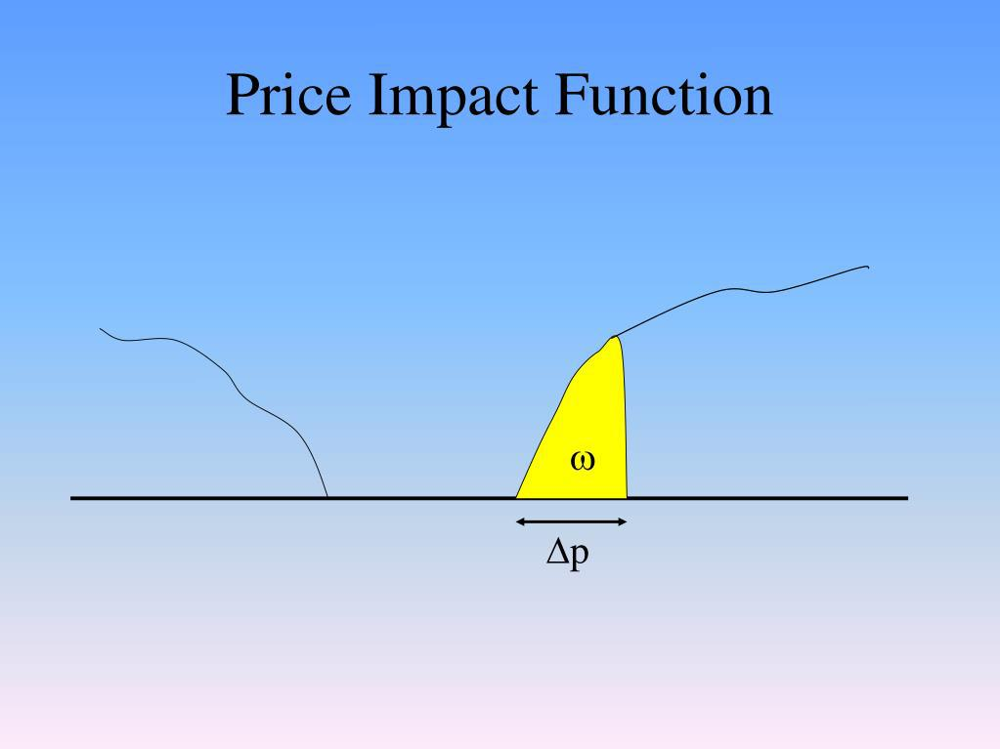

Algorithmic trading has transformed the landscape of financial markets over the past few decades. Initially introduced to streamline and automate investment processes, algo trading now plays a pivotal role in executing large orders with precision and speed. The evolution of this practice can be traced back to the late 20th century, marked by advancements in computer technology and the development of sophisticated quantitative models. As financial markets become more interconnected and complex, understanding market dynamics has become crucial for traders and investors alike. This involves analyzing factors such as liquidity, volatility, and market behavior, all of which influence trading outcomes.

One critical concept in algorithmic trading is the price impact function. This refers to the way a trade influences the market price of a security. Understanding price impact is vital for developing effective trading strategies because it reflects how order execution affects market dynamics and stability. Traders must consider both temporary and permanent price impacts when designing algorithms to minimize costs and maximize efficiency. Temporary impacts may cause short-term price fluctuations, whereas permanent impacts can alter the market price trajectory.

This article will explore the concept of price impact functions in detail, emphasizing their relevance in algorithmic trading. It begins with an examination of the significance of price impact and its effect on trading strategies. Next, the article will dissect the components of price impact functions, including order size, liquidity, and prevailing market conditions, to understand how these factors shape price impacts. Following that, various models for predicting and analyzing price impact functions will be reviewed, from linear to machine learning-based approaches, highlighting their respective strengths and limitations. Finally, the article will discuss strategies to mitigate adverse price impacts and the role of technology in refining these functions. Future trends and regulatory considerations will also be addressed, underscoring the ongoing evolution of this field. Through this exploration, readers will gain a comprehensive understanding of price impact functions and their critical role in the world of algorithmic trading.

## Table of Contents

## Understanding Price Impact in Algo Trading

Price impact refers to the change in the price of a financial asset resulting from a trade executed in the market. In algorithmic trading, understanding and managing price impact is crucial, as it directly influences the efficiency and cost-effectiveness of trading strategies. Price impact is a core component of market microstructure theory, which examines how various factors, including trading mechanisms and information dissemination, affect asset prices.

Price impact significantly affects trading strategies by potentially increasing the cost of large trades. When an algorithm places a large order, it can move the market price against the trader. For instance, a large buy order might push prices higher, thus increasing the cost for subsequent purchases. This phenomenon can destabilize markets, particularly if trades are executed rapidly without considering liquidity constraints. High price impact can also lead to a feedback loop where the market perceives large trades as new information, further exacerbating price changes.

There are two primary types of price impacts: temporary and permanent impacts. Temporary price impact describes the immediate, short-lived change in an asset's price due to a trade. This change typically reverses once the trade is absorbed by the market and liquidity conditions normalize. Permanent price impact, however, refers to the long-term shift in price resulting from the information conveyed by the trade itself. A trade perceived as informed can lead to a sustained change in the asset's price, as other market participants adjust their valuations based on the new information.

Understanding these types of price impacts is essential for developing effective [algorithmic trading](/wiki/algorithmic-trading) strategies. Traders seek to minimize price impact to reduce costs and avoid drawing unnecessary attention from other market participants. This involves optimizing order execution, considering market [liquidity](/wiki/liquidity-risk-premium), and employing advanced models to predict potential price changes. Ultimately, mastering price impact enhances the ability of algorithmic traders to execute efficient and low-cost trades, contributing to overall market stability.

## Components of Price Impact Functions

Price impact functions are crucial for understanding how trades influence market prices. These functions encapsulate various components, including order size, liquidity, and market conditions, each playing a vital role in determining the extent and nature of price impacts.

### Order Size

Order size is a primary component affecting the price impact. Larger orders tend to have a more significant effect on market prices due to increased demand for liquidity. The relation between order size and price impact is generally nonlinear, often described by the square root law, which suggests that the price impact is proportional to the square root of the order size. Mathematically, this can be represented as:

$$
\Delta P = \kappa \cdot \sqrt{Q}
$$

where:
- $\Delta P$ is the price impact,
- $Q$ is the order size,
- $\kappa$ is a constant that represents the market conditions and the asset's liquidity.

### Liquidity

Liquidity directly influences price impact, with more liquid markets exhibiting less price impact for the same order size. Liquidity can be thought of as the market's ability to absorb trades without significant changes in price. High liquidity implies many buy and sell orders are present, allowing large trades to be executed with minimal price movement. Different liquidity measures such as the bid-ask spread and market depth are often considered when modeling price impact functions. A narrow bid-ask spread generally indicates a liquid market, reducing the price impact. 

### Market Conditions

Market conditions, encompassing [volatility](/wiki/volatility-trading-strategies) and overall market sentiment, play a critical role in shaping the price impact. High volatility typically results in increased price impact as market participants adjust quickly to new information, often leading to less predictable and more pronounced price movements. Additionally, market sentiment, whether bullish or bearish, can amplify or dampen the effects of trades on prices.

### Examples of Price Impact Function Models

Various models have been developed to better capture the nuances of price impacts. Here are some examples:

1. **Kyle's Lambda Model**

   Kyle's model posits that the price impact is linear, described by the equation $\Delta P = \lambda \cdot Q$, where $\lambda$ captures the market's resilience to trades. This model is foundational in financial economics, providing insights into how informed trading can affect market prices.

2. **Almgren-Chriss Model**

   Developed for optimal execution strategies, this model considers both temporary and permanent price impacts in its framework. The temporary impact is linked to immediate price changes due to order execution, whereas the permanent impact affects the fundamental value level of the asset. This model uses mathematical tools to minimize the expected cost of trading.

3. **Machine Learning Models**

   Recent advancements have introduced [machine learning](/wiki/machine-learning) techniques to capture complex, nonlinear relationships between order size, liquidity, and market conditions. For instance, regression trees and neural networks are employed to predict price impact by learning from large datasets, offering more adaptive and dynamic models than traditional approaches.

Each of these models has specific applications and is chosen based on the trading context and market characteristics. As trading environments evolve, there is a continuous need for innovation in modeling methods to precisely capture price impacts and enhance algorithmic trading strategies.

## Modeling Price Impact Functions

Price impact functions are essential tools for understanding how trades affect market prices, and developing accurate models of these functions is crucial for effective algorithmic trading. Various models are employed to predict and analyze price impact functions, primarily categorized into linear, nonlinear, and machine learning models. Each model offers distinct strengths and limitations, and the choice of model often depends on the specific market conditions and the data available.

Linear models are the most straightforward approach to modeling price impacts and are typically depicted as a linear relationship between the executed order size and the resulting price change. The basic linear equation can be expressed as:

$$
\Delta P = \alpha + \beta \cdot V
$$

where $\Delta P$ is the change in price, $\alpha$ is the intercept, $\beta$ is the slope representing the sensitivity of the price to order volume $V$. Linear models are advantageous due to their simplicity and ease of interpretation. However, they may not accurately capture market complexities, particularly in dynamic environments where price impact is not proportionate across all order sizes and conditions.

Nonlinear models offer an enhancement over linear models by allowing for more complex relationships between trade size and price impact. These models can better accommodate scenarios where price impacts exhibit diminishing or increasing returns to scale. For instance, a common nonlinear model is the square-root impact model, which posits:

$$
\Delta P = \kappa \cdot V^{\frac{1}{2}}
$$

where $\kappa$ is a proportionality constant. This model accounts for the observations that larger trades tend to incur disproportionately higher impacts. Nonlinear models provide greater flexibility and can adjust better to varying market profiles, yet they often require more sophisticated estimation methods and comprehensive data.

The recent growth in computational power and availability of extensive datasets has paved the way for machine learning models to analyze price impact functions. Machine learning models such as regression trees, neural networks, and support vector machines can capture intricate patterns in vast datasets, offering high accuracy in predicting price impacts. These models do not require pre-specified functional forms, as they can learn complex relationships directly from the data. However, machine learning models may suffer from overfitting, especially if not properly validated, and they often lack transparency compared to simpler models.

Data analysis and machine learning play pivotal roles in improving model accuracy for price impact prediction. Large datasets, spanning various trading environments and market conditions, allow for more representative model training, enhancing generalizability. Advanced analytics enable the processing of high-dimensional data, uncovering latent variables that influence price impacts. Furthermore, techniques such as cross-validation and regularization are employed within machine learning to combat overfitting and ensure that models perform well on unseen data.

Developing robust price impact models is crucial for minimizing trading costs and maintaining market stability. Traders and quantitative researchers must select appropriate models by considering market conditions, data availability, and the specific objectives of the trading strategy. Ultimately, the ongoing advancement in data analytics and machine learning continues to refine these models, making them more effective and reliable in predicting market behavior.

## Strategies to Minimize Price Impact

To mitigate the adverse effects of price impact, traders and algorithms employ several strategies designed to enhance efficiency and optimize execution. One widely used method is order slicing, where large orders are divided into smaller pieces to minimize detection and reduce market impact. By executing smaller trades over time, traders can better align with prevailing market conditions, thus reducing the likelihood of significant price movements caused by a single large order. The execution of sliced orders is often done using algorithms that determine the optimal timing and size of each trade, taking into account factors such as liquidity and volatility.

Another strategy involves adjusting the execution speed of trades. Slower execution can be beneficial in markets with limited liquidity or highly volatile conditions, as it allows trades to be processed without overwhelming the market. By carefully managing execution speed, traders can reduce temporary price impacts that might arise from rapid buying or selling. Conversely, in highly liquid markets, faster execution might be preferable to capitalize on transient price opportunities without affecting the price adversely.

The use of dark pools is also a popular method to minimize price impact. Dark pools are private trading venues where orders are matched without pre-trade transparency. This anonymity can shield large orders from public view, preventing other market participants from reacting to the disclosed trading intentions. As a result, transactions completed in dark pools often experience reduced price impact compared to those executed on public exchanges.

Real-world examples of successful implementations of these strategies include large institutional investors using sophisticated algorithms to manage order slicing and execution velocity. For instance, many quantitative hedge funds employ proprietary algorithms to execute trades in a manner that minimizes market disruption. These algorithms can adjust to various market conditions in real-time, optimizing trade execution based on parameters like market depth and historical price data.

In the realm of dark pools, firms such as Goldman Sachs have operated their dark pools to facilitate large trades for institutional clients who require minimal market disturbance. By matching orders internally, these dark pools help in executing trades at desired prices without adverse price impacts.

In conclusion, minimizing price impact is crucial for maintaining market stability and achieving optimal trade execution. The use of order slicing, execution speed adjustments, and dark pools are vital strategies that traders utilize to achieve these goals effectively.

## The Role of Technology in Price Impact Functions

Algorithmic trading has significantly evolved with technological advancements, particularly in high-frequency trading ([HFT](/wiki/high-frequency-trading-strategies)) and advanced analytics. These technologies play a crucial role in managing price impacts, which are changes in the market price triggered by large trades. Understanding how these tools influence price impact functions aids traders in developing efficient strategies.

High-frequency trading, characterized by executing large volumes of trades within fractions of a second, can significantly affect price impact. By optimizing execution speeds and leveraging minimal latency, HFT aims to capitalize on small price discrepancies across markets. Advanced algorithms in HFT can effectively predict short-term price movements, thus enabling traders to minimize the adverse effects of price impacts. However, the aggressive nature of HFT can also exacerbate volatility, especially when inadequate liquidity exists.

Advanced analytics, including machine learning and data processing techniques, enhance the modeling of price impact functions. Machine learning models, such as neural networks and regression trees, process historical trade and market data to predict future price movements more accurately. These predictive capabilities improve the precision of trading strategies, thereby reducing temporary and permanent price impacts.

Recent technological advancements have further refined price impact management. For instance, cloud computing enables real-time data processing, while quantum computing holds the potential to solve complex optimization problems faster than classical computers. These innovations allow for more sophisticated modeling and analysis, enhancing the trader's ability to anticipate and respond to market dynamics effectively.

The integration of advanced analytics and high-speed execution raises several ethical and regulatory considerations. The potential for market manipulation, where entities use technology to exploit market inefficiencies, necessitates stringent oversight. Regulatory bodies, therefore, focus on ensuring market fairness and transparency, implementing rules to monitor and control the impact of these technologies. Ethical implications also stem from the accessibility of such technologies; smaller firms might be disadvantaged against larger entities with the resources to invest in cutting-edge systems.

In conclusion, technology profoundly impacts price impact functions within algorithmic trading. While advancements in high-frequency trading and analytics offer significant benefits, they also present challenges in terms of market stability and equity. As these technologies continue to evolve, ongoing scrutiny and regulation are crucial to maintaining a balanced trading environment.

## Future Trends and Developments

The future of price impact function modeling and algorithmic trading is poised to be shaped by advancements in technology and changing regulatory landscapes. As financial markets continue to evolve, these factors will play a critical role in determining the effectiveness and stability of trading strategies.

Emerging technologies like [artificial intelligence](/wiki/ai-artificial-intelligence) (AI) and blockchain hold significant promise in transforming price impact modeling. AI, with its ability to process and analyze large datasets swiftly, can enhance the accuracy of predictive models. Machine learning algorithms, in particular, can identify complex patterns and relationships within market data that traditional models might overlook. This can lead to more precise estimations of price impacts, enabling traders to make more informed decisions.

Blockchain technology is another burgeoning area with potential implications for algorithmic trading. By offering a transparent and immutable ledger, blockchain can facilitate higher security and integrity in trading transactions. This transparency can reduce information asymmetry among market participants, potentially leading to more efficient price discovery and lower price impact volatility.

However, the integration of these technologies into trading strategies presents challenges. AI models require vast amounts of high-quality data to train effectively, and their "black box" nature often makes interpretation difficult, raising concerns about accountability. Likewise, while blockchain offers enhanced transparency, it also demands significant computational resources and may face scalability issues as transaction volumes increase.

The regulatory environment is another vital [factor](/wiki/factor-investing) influencing future developments. As financial markets adopt more sophisticated technologies, regulators are increasingly scrutinizing the impacts on market stability and fairness. New regulations may emerge to address concerns related to high-frequency trading, data privacy, and the ethical implications of AI-driven decisions in markets. These regulatory measures are crucial in maintaining a balanced trading ecosystem and preventing systemic risks.

Moreover, there is a growing emphasis on developing models that not only minimize adverse price impacts but also adhere to ethical standards and promote market integrity. As algorithmic trading systems become more autonomous, ensuring that they operate within safe and fair parameters is paramount. 

In summary, the convergence of AI, blockchain, and regulatory evolution is set to redefine price impact functions and algorithmic trading. Staying informed and adaptable to these changes will be essential for market participants seeking to leverage these advancements successfully while mitigating associated risks.

## Conclusion

Algorithmic trading has revolutionized financial markets through its ability to execute complex strategies at speed, providing both opportunities and challenges. A key challenge, which this article has explored, is understanding and managing price impact. Price impact functions are critical for determining how trades affect market prices, and their modeling is essential for optimizing trading strategies and maintaining market stability.

A core aspect highlighted is the diversity of price impacts—both temporary and permanent—and how they can affect trading outcomes. Components such as order size, liquidity, and market conditions play crucial roles, with each influencing price impacts differently. Various models, including linear, nonlinear, and machine learning approaches, offer insights into predicting these impacts. However, each model has its strengths and limitations, particularly in varying market scenarios, stressing the importance of selecting the appropriate model based on the context.

The article also underscores strategies that traders can employ to mitigate adverse price impacts, such as order slicing, execution speed adjustments, and utilizing dark pools. Successful real-world applications of these strategies demonstrate their effectiveness.

Moreover, technology is pivotal in advancing price impact functions. High-frequency trading, advanced analytics, and robust data analysis have significantly improved the precision of price impact models, although they also introduce ethical and regulatory challenges. The continued evolution of technology, particularly AI and blockchain, indicates that price impact modeling will not remain static. Emerging technologies offer promising tools for future developments, but they also necessitate ongoing research and adaptation.

As the landscape of algorithmic trading and price impact functions evolves, continuous research and development remain imperative. Understanding and integrating new technologies will be crucial for effective trading strategies. Stakeholders must remain proactive in monitoring and adapting to technological advancements and regulatory changes, ensuring both competitive edge and compliance in this dynamic field.

## References & Further Reading

[1]: Almgren, R., & Chriss, N. (2000). ["Optimal Execution of Portfolio Transactions."](https://smallake.kr/wp-content/uploads/2016/03/optliq.pdf) Journal of Risk, 3(2), 5-39.

[2]: Gatheral, J. (2010). ["The Volatility Surface: A Practitioner's Guide."](https://onlinelibrary.wiley.com/doi/book/10.1002/9781119202073) Wiley.

[3]: Bouchaud, J.-P., Farmer, J. D., & Lillo, F. (2009). ["How Markets Slowly Digest Changes in Supply and Demand."](https://arxiv.org/abs/0809.0822) Handbook of Financial Markets: Dynamics and Evolution, 57-160.

[4]: Kyle, A. S. (1985). ["Continuous Auctions and Insider Trading."](https://personal.utdallas.edu/~nina.baranchuk/Fin7310/papers/Kyle1985.pdf) Econometrica, 53(6), 1315-1335.

[5]: Gatheral, J. (2009). ["No-Dynamic-Arbitrage and Market Impact."](https://papers.ssrn.com/sol3/papers.cfm?abstract_id=1292353) Quantitative Finance, 10(7), 749-759.

[6]: Lopez de Prado, M. (2018). ["Advances in Financial Machine Learning."](https://www.amazon.com/Advances-Financial-Machine-Learning-Marcos/dp/1119482089) Wiley.

[7]: Cartea, A., Jaimungal, S., & Penalva, J. (2015). ["Algorithmic and High-Frequency Trading."](https://assets.cambridge.org/97811070/91146/frontmatter/9781107091146_frontmatter.pdf) Cambridge University Press.

[8]: Kissell, R. (2013). ["The Science of Algorithmic Trading and Portfolio Management."](https://www.sciencedirect.com/book/9780124016897/the-science-of-algorithmic-trading-and-portfolio-management) Academic Press.