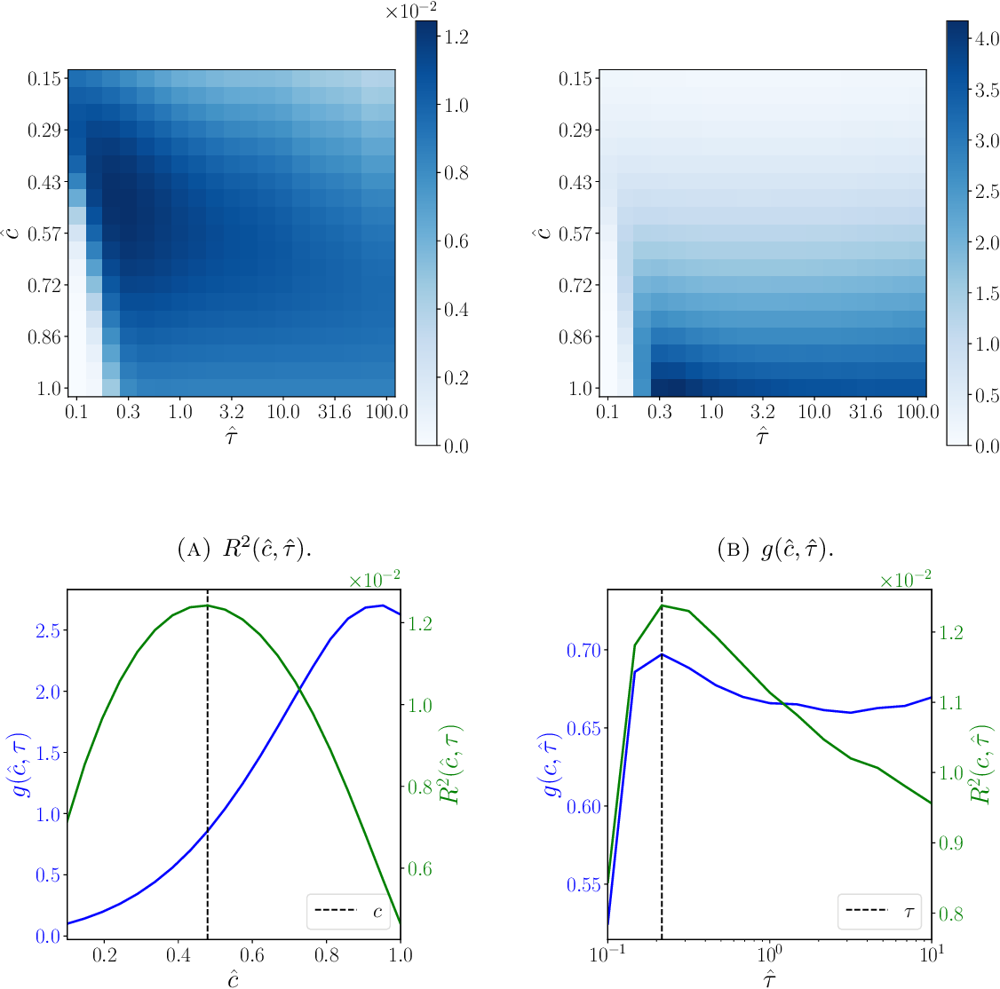

In the world of algorithmic trading, understanding price dynamics is crucial. Price impact models play a pivotal role in predicting how large trades affect market prices. These models are essential tools for traders, helping them optimize trade execution to minimize costs. By accurately assessing the potential impact of their trades, traders can more effectively strategize on timing and size to reduce negative influences on market price and liquidity.

Price impact models offer a structured way to anticipate the changes in market prices resulting from large trade orders. These predictive models incorporate various factors, such as trade size, liquidity, market volatility, and the presence of other market participants, to forecast the likely outcomes on market prices. By integrating these models within their trading strategies, traders are better equipped to achieve cost-efficiency and maintain profitability, ensuring that trades are executed with minimal disruption to market stability.



In this article, we will explore the many price impact models utilized in algorithmic trading. Our focus will center on the principle mechanisms by which these models work and their practical applications in optimizing trade execution. As we examine these models, we will also consider the technological advancements driving their development and their potential to adapt to evolving market conditions. Join us as we explore how these models function and their practical applications.

## Table of Contents

## What Are Price Impact Models?

Price impact models are mathematical frameworks used to forecast the influence of trades on the prevailing market prices. These models are invaluable for traders seeking to optimize the execution of their trades, primarily by providing critical insights into market behavior and liquidity. By doing so, they allow traders to strategically plan their transactions to minimize costs associated with price changes.

The core principle of price impact models is the relationship between trade size and its resulting effect on the market price. Larger trades tend to have a more substantial impact on prices due to their interaction with the available market liquidity. When a significant trade is executed, it may consume the available liquidity at the top of the order book, thereby pushing the price either upwards or downwards depending on the nature of the trade – buy or sell.

Mathematically, price impact can often be modeled as a function of trade size. Simple linear models define the price impact $I$ as:

$$
I = \lambda \times V
$$

where $\lambda$ denotes the price impact coefficient and $V$ is the volume of the trade. However, linear models might be too simplistic as they assume a proportional relationship between trade size and price impact.

Non-linear models introduce more complexity and realism by considering quadratic or other higher-order relationships. In these models, impact might be modeled as:

$$
I = \lambda_1 \times V + \lambda_2 \times V^2
$$

where $\lambda_1$ and $\lambda_2$ are coefficients that describe the linear and quadratic impacts, respectively.

Understanding price impact models is crucial for achieving cost-efficient trading, as they allow traders to anticipate how their trades will influence market prices. By leveraging these models, traders can adjust their strategies to mitigate adverse market movements, ensure smoother execution, and ultimately enhance profitability.

The utility of price impact models extends to providing insights into market behaviors and [liquidity](/wiki/liquidity-risk-premium) characteristics. By analyzing the interaction between trade size and price movement, traders and quantitative analysts can infer the liquidity of the market – an essential [factor](/wiki/factor-investing) in determining how easily a security can be traded without affecting its price.

Overall, price impact models serve as essential tools in modern financial markets, enabling traders to understand and navigate complex market dynamics effectively.

## Types of Price Impact Models

Price impact models are essential tools in [algorithmic trading](/wiki/algorithmic-trading), allowing traders to predict how their trades will influence market prices. Understanding the different types of price impact models can enable traders to effectively minimize costs and optimize trade executions.

### Temporary Impact Models

Temporary impact models are designed to forecast the short-term effects of trades on market prices. These models primarily focus on the immediate aftermath of a trade, capturing how a trade can create temporary price disturbances, which typically revert over time. The temporary price movement is often quantified by the [volume](/wiki/volume-trading-strategy) of the trade and its immediate effect on the [order book](/wiki/order-book-trading-strategies). The temporary impact $I_{\text{temp}}$ can be represented as:

$$

I_{\text{temp}} = \lambda \cdot V 
$$

where $\lambda$ is a temporary impact coefficient reflecting liquidity, and $V$ is the trade volume. These models are integral for traders looking to execute large trades with minimal short-term disturbance.

### Permanent Impact Models

In contrast, permanent impact models consider the long-lasting effects of trades on market prices. These impacts do not dissipate over time and often reflect changes in market perception or structural shifts post-trade. Permanent impacts are typically less significant than temporary impacts but crucial for understanding long-term market trends. The permanent impact $I_{\text{perm}}$ can be modeled as:

$$

I_{\text{perm}} = \gamma \cdot V 
$$

where $\gamma$ is a permanent impact coefficient that encapsulates how market assumptions integrate the information from the trade.

### Combined Models

Combined models offer a holistic approach by integrating both temporary and permanent impacts to provide a full-spectrum view of price effects post-trade. This integration allows traders to adjust their strategies not just based on immediate market reactions but also considering long-term ramifications. A simple combined impact model might be expressed as:

$$

I_{\text{combined}} = I_{\text{temp}} + I_{\text{perm}} = (\lambda + \gamma) \cdot V 
$$

These models are useful for traders who need to manage both short- and long-term impacts simultaneously.

### Historical and Empirical Models

Historical and empirical models leverage past data to predict the price impact of trades. These models analyze historical trade data to derive patterns and build statistical frameworks that can apply these insights to future trades. The reliance on actual market data makes these models particularly robust, as they can adapt learned behaviors to new scenarios. A basic empirical model might use regression analysis to determine impact:

```python
import numpy as np
from sklearn.linear_model import LinearRegression

# Sample historical trade data
volume = np.array([100, 200, 300, 400, 500])
impact = np.array([1, 2.1, 3.2, 4.1, 5.1])

# Create the model
model = LinearRegression().fit(volume.reshape(-1, 1), impact)

# Coefficients
slope = model.coef_[0]
intercept = model.intercept_

print(f"Slope (Impact per Volume): {slope}, Intercept: {intercept}")
```

These historical approaches are valuable for their empirical basis, offering insights drawn directly from market experiences, thus adapting price impact estimations based on real-world trading environments.

In summary, the choice among these price impact models depends on the trader's strategy and the contextual demands of the trades they are executing. Each model type provides unique insights and benefits to algorithmic trading.

## How Price Impact Models Are Used in Algo Trading

In algorithmic trading, price impact models are essential for executing trades effectively by determining the best way to execute transactions. These models predict how prices will respond to trades, allowing traders to minimize transaction costs. By forecasting price movements, traders can strategically plan their trades to reduce the adverse effects of large market orders. 

Minimizing transaction costs is crucial in high-frequency trading where small inefficiencies can accumulate into significant expenses. Price impact models offer insights into expected price changes, helping traders to time their market entries and exits. For instance, if a model predicts a significant price drop following a large order, traders can split the order into smaller parts, executing these incrementally to avoid abrupt price changes. This strategy reduces the market impact, preserving the asset’s market value.

Furthermore, these models play a role in trade scheduling. By understanding when markets are most liquid or volatile, traders can make decisions that mitigate potential disruptions. For example, trades can be scheduled during periods of high liquidity to ensure smoother execution and reduced impact on prices. This aspect of scheduling is particularly valuable for large institutional trades where even minor price shifts could lead to substantial financial implications.

Integration with algorithmic strategies is a significant consideration. In automated trading environments, these models need to be seamlessly embedded within the broader trading algorithms. This integration enables real-time decision-making, where the models feed live data into the system to adjust trading strategies dynamically. For instance, using Python, traders can leverage libraries such as NumPy and Pandas to process and analyze trading data effectively. Algorithms can be programmed to trigger actions based on model predictions, optimizing buying and selling decisions on-the-fly. Here's a simple Python example illustrating how traders might use a price impact model algorithmically:

```python
import numpy as np
import pandas as pd

# Sample data: predicted price impacts and current market price
predicted_impacts = np.array([-0.02, -0.01, 0.00, 0.01, 0.02])  # Percentage impact
market_price = 100.00  # Current market price

# Calculate expected prices post-impact
expected_prices = market_price * (1 + predicted_impacts)

# Optimal decision: buy/sell based on the smallest price impact
optimal_action = np.argmin(expected_prices)  
```

In this example, the algorithm computes expected prices after accounting for predicted impacts and then identifies the optimal action that would result in the lowest price impact. Such real-time adaptability enhances trading efficiency and effectiveness, aligning with the dynamic nature of financial markets. This integration exemplifies the practical application of price impact models, highlighting their role as a cornerstone of modern algorithmic trading strategies.

## Challenges in Building Price Impact Models

Building effective price impact models in algorithmic trading presents several challenges, primarily due to data quality, market dynamics, model complexity, and adaptability to changing market conditions.

Data Quality: The cornerstone of any effective price impact model is high-quality data. Poor data inputs can lead to inaccurate predictions, which may result in suboptimal trade executions. Data inaccuracies can emerge from outdated information, incomplete datasets, or erroneous entries. To mitigate this, traders and analysts often need to implement rigorous data validation processes, use sophisticated data cleaning techniques, and rely on high-frequency data sources to ensure their models are fed with reliable and up-to-date information.

Market Dynamics: The fast-paced nature of financial markets means that trading conditions can change rapidly. Market behaviors, such as [volatility](/wiki/volatility-trading-strategies) and liquidity, can fluctuate throughout the day or in response to external economic events. These dynamic conditions pose significant challenges in accurately capturing and predicting price impacts through any static or pre-defined model. Consequently, models need to be frequently updated to reflect current market conditions, possibly incorporating real-time data analytics.

Complexity: Accurately modeling the price impact involves balancing model complexity with computational feasibility. A model needs to be sophisticated enough to capture the nuanced relationships between various market variables but also efficient enough to process large datasets and provide timely predictions. Complicated models might offer high precision but could be computationally expensive and less practical for high-frequency trading environments. Algorithms that use simplified assumptions or heuristics can enhance computational efficiency, although potentially at the expense of accuracy.

Adaptability: Financial markets are influenced by a plethora of factors, including economic indicators, geopolitical events, and investor sentiment, which can evolve over time. Models must be adaptable to these changes to maintain their predictive accuracy. This adaptability can be achieved through [machine learning](/wiki/machine-learning) techniques that allow models to learn and adjust from new data continuously, ensuring they remain relevant in the face of changing market conditions. Reinforcement learning and adaptive algorithms are some of the emerging tools being explored to address this challenge. 

In summary, the development of price impact models in algorithmic trading demands careful consideration of data quality, responsiveness to market dynamics, the balance of complexity against feasibility, and the capacity for continuous adaptation. These challenges necessitate ongoing advancement in data science techniques and computational technologies.

## The Future of Price Impact Models in Algo Trading

The future of price impact models in algorithmic trading is poised for significant evolution, driven by advancements in machine learning, real-time adaptability, the integration of [alternative data](/wiki/best-alternative-data), and regulatory influences.

Machine learning, particularly [artificial intelligence](/wiki/ai-artificial-intelligence) (AI), is providing novel avenues to enhance the precision of price impact models. Machine learning algorithms, such as neural networks and [reinforcement learning](/wiki/reinforcement-learning), can process vast amounts of data at unprecedented speeds. This capability allows models to improve in accuracy and predictive ability. For instance, reinforced learning can be employed to optimize trading strategies by continually learning from new data inputs and adjusting predictions on-the-fly. 

Python Example:
```python
from sklearn.ensemble import RandomForestRegressor

# Sample dataset
X_train = [[150], [160], [170], [180]]
y_train = [155, 165, 175, 185]

# Create a RandomForest model
model = RandomForestRegressor(n_estimators=100, random_state=42)
model.fit(X_train, y_train)

# Predict future impacts
X_test = [[190], [200]]
predictions = model.predict(X_test)
```
This code snippet demonstrates using a random forest regression model to predict price impacts based on historical data.

Real-time adaptability is another progression expected in future models. The capability for models to alter in real-time according to live market conditions would result in more accurate predictions and optimized trade executions. This adaptability addresses the dynamic nature of financial markets, where conditions can change rapidly within milliseconds.

The incorporation of alternative data sources marks another frontier. Non-traditional data, such as satellite imagery, social media sentiment, and transaction data, can provide additional insights into market behaviors and liquidity, transcending what was previously conceivable using only market data. By integrating these varied data sets into price impact models, traders can achieve a more nuanced understanding of market dynamics, leading to better trading strategies.

Regulatory changes also play a critical role in shaping the development of price impact models. Governments and financial authorities are progressively tightening oversight in algorithmic trading to ensure fair and transparent markets. Future regulations may necessitate that models include specific compliance features to adhere to new standards, which could influence how models are structured and implemented. Anticipating these regulatory shifts will be crucial for developers to ensure that their models remain viable and compliant.

Overall, the combination of enhanced machine learning techniques, real-time adaptability, alternative data integration, and regulatory influences is set to advance the efficacy and reliability of price impact models in algorithmic trading. These innovations are expected to offer traders more effective tools to execute trades with greater cost-efficiency and precision in increasingly complex market environments.

## Conclusion

Price impact models play a critical role in algorithmic trading by allowing traders to anticipate how their transactions will affect market prices and, consequently, enabling them to execute trades more cost-effectively. These models are fundamental in optimizing trade execution strategies, minimizing transaction costs, and managing the risks associated with large orders in financial markets.

However, understanding and developing price impact models present notable challenges. Market complexities, such as non-linear relationships, varying liquidity conditions, and the influence of high-frequency trading, add layers of difficulty to accurately modeling price impacts. Additionally, market dynamics are not static; they evolve with time, necessitating models that can adapt to these changes quickly and efficiently.

Technological advancements offer promising solutions to these challenges. Improved computational methods and machine learning techniques can enhance model accuracy and adaptability. For instance, incorporating real-time data analytics and artificial intelligence can help models adjust instantaneously to shifting market conditions. Furthermore, integrating alternative data sources, such as social media sentiment or geopolitical news, could refine predictions by providing context beyond traditional financial metrics.

Looking ahead, the continued evolution of technology will likely yield more robust price impact models. These improvements are expected to increase the efficacy and reliability of predictions, thereby providing traders with more precise tools for navigating the complexities of financial markets. As regulations evolve, models will also need to align with new compliance standards, ensuring they remain both practical and lawful. Consequently, while challenges persist, advancements in technology and methodology promise significant enhancements in the utility of price impact models in algorithmic trading.

## References & Further Reading

[1]: Gatheral, J. (2010). ["The Volatility Surface: A Practitioner's Guide"](https://onlinelibrary.wiley.com/doi/book/10.1002/9781119202073). Wiley.

[2]: Almgren, R., & Chriss, N. (1999). ["Value Under Liquidation"](https://www.scirp.org/reference/ReferencesPapers?ReferenceID=1275392) Risk.

[3]: Bouchaud, J-P., Farmer, J. D., & Lillo, F. (2008). ["How Markets Slowly Digest Changes in Supply and Demand"](https://arxiv.org/abs/0809.0822). In *Handbook of Financial Markets: Dynamics and Evolution*, Elsevier.

[4]: Lopez de Prado, M. (2018). ["Advances in Financial Machine Learning"](https://www.amazon.com/Advances-Financial-Machine-Learning-Marcos/dp/1119482089). Wiley.

[5]: Hasbrouck, J. (2007). ["Empirical Market Microstructure: The Institutions, Economics, and Econometrics of Securities Trading"](https://academic.oup.com/book/52241). Oxford University Press.

[6]: Kissell, R. (2013). ["The Science of Algorithmic Trading and Portfolio Management"](https://www.sciencedirect.com/book/9780124016897/the-science-of-algorithmic-trading-and-portfolio-management). Academic Press.

[7]: Guéant, O. (2016). ["The Financial Mathematics of Market Liquidity: From Optimal Execution to Market Making"](https://www.taylorfrancis.com/books/mono/10.1201/b21350/financial-mathematics-market-liquidity-olivier-gueant). CRC Press.