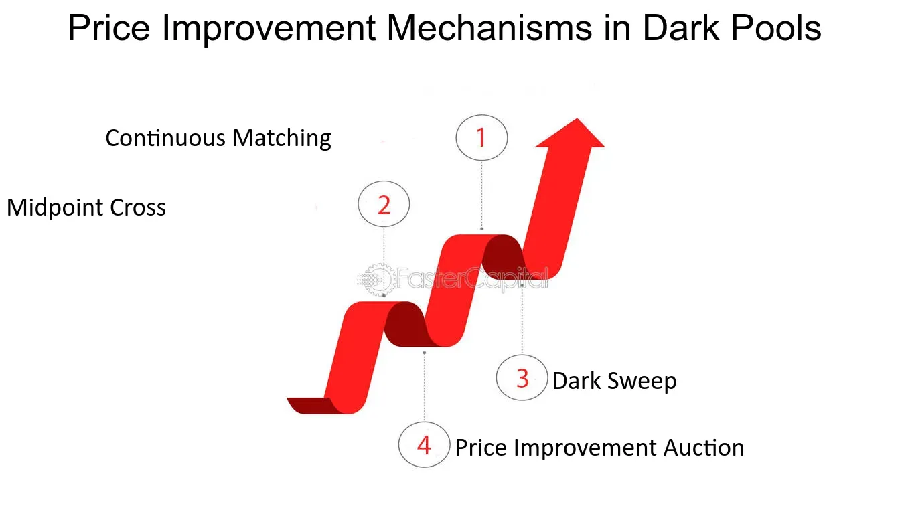

## Table of Contents

## What is a price improvement mechanism?

A price improvement mechanism is a way to get a better price when you buy or sell something, usually in the stock market. It helps traders get a price that is better than the current best price available. For example, if you want to buy a stock and the best price is $10, a price improvement mechanism might let you buy it for $9.95 instead.

These mechanisms are often used in electronic trading systems. They work by matching buyers and sellers at prices that are better than the public quotes. This can happen very quickly, thanks to computers. The goal is to make trading more efficient and to give traders a better deal.

## Why are price improvement mechanisms important in trading?

Price improvement mechanisms are important in trading because they help traders get better prices for their trades. When you're buying or selling something, getting even a tiny bit better price can save you money or make you more money. In the stock market, where lots of trades happen every day, these small savings can add up to a lot over time. This makes trading more efficient and can attract more people to trade because they know they might get a better deal.

These mechanisms also help make the market fairer. Without them, everyone would have to trade at the best public prices, which might not always be the best possible price. By using computers to quickly match buyers and sellers at better prices, price improvement mechanisms can make sure that more people get a fair chance at a good deal. This can make the market work better for everyone involved.

## Can you explain the basic types of price improvement mechanisms?

There are two main types of price improvement mechanisms: midpoint pricing and price improvement auctions. Midpoint pricing works by matching a buyer and a seller at a price that is halfway between the best bid and the best offer. For example, if the best bid is $10 and the best offer is $10.10, the midpoint price would be $10.05. This gives both the buyer and the seller a better price than they would get at the public quotes.

Price improvement auctions, on the other hand, are like mini-competitions that happen within the trading system. When someone wants to buy or sell, the system can hold a quick auction where other traders can offer better prices. If someone offers a better price than the current best, the trade happens at that better price. This can help both the buyer and the seller get a better deal than they would have otherwise.

## How do price improvement mechanisms benefit retail investors?

Price improvement mechanisms help retail investors by giving them better prices when they buy or sell stocks. Instead of having to pay the highest price or sell at the lowest price shown on the market, these mechanisms can find a better deal. For example, if a stock's best price to buy is $50, a price improvement mechanism might let a retail investor buy it for $49.95. This small difference can save money, and over time, these savings can add up to a lot.

These mechanisms also make the market fairer for retail investors. Big traders and institutions often have more resources and can get better prices, but price improvement mechanisms help level the playing field. By using computers to quickly find the best possible prices, these mechanisms give retail investors a chance to get deals that are just as good as those that big traders get. This makes trading more efficient and helps everyone get a fair shot at a good price.

## What is the difference between price improvement and best execution?

Price improvement and best execution are two important ideas in trading, but they are different. Price improvement happens when a trader gets a better price than the best price shown in the market. For example, if the best price to buy a stock is $10, but a trader gets it for $9.95, that's price improvement. It's like getting a discount on your trade.

Best execution is a bit broader. It means that a broker or trading platform must do everything they can to get the best possible price for their clients. This includes looking for price improvement, but also other things like trading costs, speed, and the likelihood of the trade going through. So, while price improvement is one way to get a better price, best execution is about making sure the whole trading process is as good as it can be.

## How do exchanges implement price improvement mechanisms?

Exchanges use computers to quickly find the best prices for traders. When someone wants to buy or sell a stock, the exchange's system checks if there's a better price available than the best price shown to everyone. If it finds a better price, it matches the buyer and seller at that better price. This is called price improvement. For example, if the best price to buy a stock is $10, but the system finds someone willing to sell it for $9.95, it will make the trade happen at $9.95.

Exchanges use two main ways to do this. One way is called midpoint pricing. This means the system matches the buyer and seller at a price that is right in the middle of the best buy and sell prices. If the best buy price is $10 and the best sell price is $10.10, the midpoint would be $10.05. The other way is through price improvement auctions. These are quick competitions where traders can offer better prices. If someone offers a better price than what's shown, the trade happens at that better price. Both ways help traders get a better deal.

## What role do dark pools play in price improvement?

Dark pools are private trading systems where big traders can buy and sell stocks without everyone seeing what they're doing. These places help with price improvement because they can match buyers and sellers at better prices than what's shown on public exchanges. Since dark pools keep trades hidden, big traders can avoid moving the market price too much with their big orders. This means they can often get a better deal than they would on a public exchange.

For example, if the best price to buy a stock on a public exchange is $10, a dark pool might find someone willing to sell it for $9.95. This gives the buyer a better price. Dark pools use computers to quickly match these orders at better prices, which helps with price improvement. By keeping trades secret and matching at better prices, dark pools can make trading more efficient and help both buyers and sellers get a better deal.

## How can price improvement mechanisms affect market liquidity?

Price improvement mechanisms can make the market more liquid. Liquidity means how easy it is to buy or sell something without changing its price too much. When traders know they can get a better price through price improvement, they are more likely to trade. This means more people are buying and selling, which makes the market more active and easier to trade in. More trades happening can help keep the market moving smoothly.

However, there can be a downside. If too many trades happen in dark pools or other places where they are not public, it can make the main market less liquid. This is because some of the buying and selling is happening away from the main market, so there are fewer trades happening there. This can make it harder for people to buy and sell on the main market because there are fewer people trading there. So, while price improvement can help with [liquidity](/wiki/liquidity-risk-premium) in some ways, it can also make it worse in others if not managed carefully.

## What are some common challenges or limitations of price improvement mechanisms?

One big challenge with price improvement mechanisms is that they can make the main market less liquid. When lots of trades happen in dark pools or other private places, fewer trades happen on the main market. This can make it harder for people to buy and sell on the main market because there are fewer people trading there. So, while price improvement can help traders get better prices, it can also make the main market less active if too many trades happen away from it.

Another limitation is that not all traders can use price improvement mechanisms. Big traders and institutions often have better access to these mechanisms because they have more resources and technology. This can make it harder for smaller retail investors to get the same good deals. So, while price improvement can help make trading fairer, it can also create a gap between big and small traders if not everyone can use it equally.

## How do regulatory frameworks influence the use of price improvement mechanisms?

Regulatory frameworks play a big role in how price improvement mechanisms are used. Rules made by governments and financial authorities decide what traders can and can't do when they use these mechanisms. For example, regulations might say that all trades need to be fair and open, which can limit how much trading can happen in dark pools. This is because dark pools keep trades secret, and regulators want to make sure that everyone has a fair chance at good prices. So, rules can make it harder for price improvement to happen in some places, but they also help make sure that the market stays fair and works well for everyone.

Regulators also care about how price improvement affects the whole market. They want to make sure that these mechanisms don't make the main market less liquid. If too many trades happen away from the main market, it can be harder for people to buy and sell there. So, regulators might set rules to balance the use of price improvement mechanisms. They want to let traders get better prices, but they also want to keep the main market active and easy to trade in. This means that while price improvement can help traders, it has to follow rules that keep the whole market working well.

## Can you discuss advanced strategies for maximizing price improvement?

One advanced strategy for maximizing price improvement is to use smart order routing. This means using computer programs to send your trade to the place where you are most likely to get the best price. These programs look at lots of different places where stocks are traded, like public exchanges and dark pools, and pick the one that will give you the best deal. By using smart order routing, you can increase your chances of getting a better price than what's shown on the main market.

Another strategy is to use algorithms that break up big orders into smaller ones. When you want to buy or sell a lot of stocks, doing it all at once can move the market price against you. But if you use an algorithm to split your order into smaller pieces and send them to different places, you can get better prices for each piece. This way, you can slowly build up your position without making the price go up or down too much. Both of these strategies help you take advantage of price improvement mechanisms and get the best possible price for your trades.

## What future developments might we see in price improvement mechanisms?

In the future, we might see more advanced computer programs that help traders get even better prices. These programs could use [artificial intelligence](/wiki/ai-artificial-intelligence) to look at lots of data and find the best places to trade. They might be able to predict when and where price improvements are most likely to happen. This could make trading even more efficient and help traders save more money. Also, as technology gets better, more people might be able to use these advanced tools, not just big traders. This could make the market fairer for everyone.

Another thing we might see is more rules about how price improvement works. Governments and regulators might make new laws to make sure that price improvement helps everyone, not just big traders. They might want to make sure that the main market stays active and easy to use, even if lots of trades happen in other places. This could mean more rules about dark pools and other private trading systems. By balancing these rules with new technology, the future of price improvement could help make trading better and fairer for everyone.

## References & Further Reading

[1]: Bergstra, J., Bardenet, R., Bengio, Y., & Kégl, B. (2011). ["Algorithms for Hyper-Parameter Optimization."](https://dl.acm.org/doi/10.5555/2986459.2986743) Advances in Neural Information Processing Systems 24.

[2]: ["Advances in Financial Machine Learning"](https://www.amazon.com/Advances-Financial-Machine-Learning-Marcos/dp/1119482089) by Marcos Lopez de Prado

[3]: ["Evidence-Based Technical Analysis: Applying the Scientific Method and Statistical Inference to Trading Signals"](https://www.amazon.com/Evidence-Based-Technical-Analysis-Scientific-Statistical/dp/0470008741) by David Aronson

[4]: ["Machine Learning for Algorithmic Trading"](https://github.com/stefan-jansen/machine-learning-for-trading) by Stefan Jansen

[5]: ["Quantitative Trading: How to Build Your Own Algorithmic Trading Business"](https://www.amazon.com/Quantitative-Trading-Build-Algorithmic-Business/dp/1119800064) by Ernest P. Chan