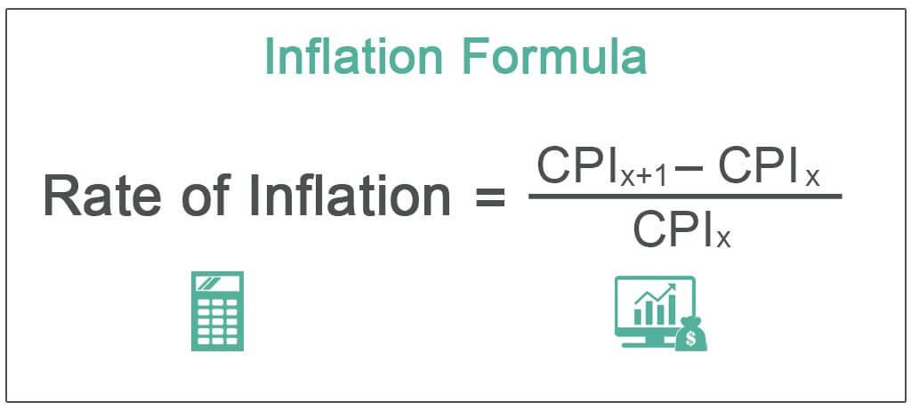

The interplay between economic metrics and trading strategies is integral to financial success. Understanding how these elements interact is crucial for traders seeking to optimize their strategies and enhance decision-making processes. At the core of this interaction is price measurement and inflation, which serve as pivotal factors in economic analysis. Inflation and the methods used to measure it, such as the Consumer Price Index (CPI), provide insights into economic trends that significantly impact trading decisions. 

Algorithmic trading, or algo trading, is reshaping market participation by using computational algorithms to execute trades based on various economic data, including inflation indices. By rapidly processing large volumes of information, algorithmic trading systems can recognize patterns and respond to economic metric changes in ways that human traders cannot match in terms of speed and accuracy.



This article examines the connection between price measurement, inflation, economic metrics, and algo trading. By grasping these relationships, traders can gain an edge in the market, making more informed decisions and refining their trading strategies to capitalize on economic shifts. Understanding this intricate network not only enables traders to align their strategies with underlying economic conditions but also positions them to anticipate future market movements with greater precision. Thus, the insights gained from analyzing these components can significantly enhance a trader's ability to navigate and succeed in the financial markets.

## Table of Contents

## Understanding Price Measurement and Inflation

Price measurement, as captured by inflation indices such as the Consumer Price Index (CPI), plays a vital role in reflecting changes in the cost of a basket of goods and services over time. The CPI is a key indicator used to gauge inflation by measuring the average change in prices paid by consumers for goods and services. It impacts how individuals experience changes in their cost of living and serves as a crucial tool for financial analysts and traders.

Understanding price inflation is essential as it significantly influences central bank policies and market dynamics. Central banks, such as the Federal Reserve in the United States or the European Central Bank in Europe, monitor inflation closely to set monetary policy aimed at stabilizing the economy. Controlling inflation is critical to maintaining purchasing power, which refers to the quantity of goods or services that one unit of currency can buy. When inflation is high, purchasing power is eroded, leading to a decrease in living standards.

Inflation also affects interest rates and economic growth. Central banks may raise interest rates to curb high inflation, making borrowing more expensive and slowing down economic activity. Conversely, lower inflation may prompt central banks to reduce interest rates to stimulate growth. Therefore, monitoring inflation is crucial for investors and traders to anticipate potential shifts in economic policy and adjust their strategies accordingly.

Several metrics, apart from the CPI, offer insights into different facets of inflation. The Producer Price Index (PPI), for instance, measures the average change over time in the selling prices received by domestic producers for their output. Unlike the CPI, which focuses on consumer spending, the PPI provides insights into the cost pressure faced by producers, which can eventually pass through to consumer prices.

Both CPI and PPI are instrumental in gauging the economic health of a country. They help investors and policymakers understand the landscape of price changes and are critical in guiding decisions related to investments and managing inflation expectations. By analyzing these indices, traders and financial professionals gain valuable insights into the broader economic environment, enabling them to make more informed investment decisions.

In summary, the measurement of price inflation through indices like CPI and PPI is indispensable for assessing economic health and stability. These indices influence central bank policymaking and market movements, making them essential for traders seeking to understand and predict economic trends.

## Economic Metrics and Their Impact on Markets

Economic metrics play a vital role in shaping market behavior and guiding trading strategies. These indicators, including Gross Domestic Product (GDP), employment rates, and inflation indices, provide essential insights into the economic landscape. They affect both short-term trading decisions and long-term investment strategies.

GDP is a comprehensive measure of a nation's overall economic activity and is crucial for assessing economic growth. A rising GDP typically signals economic expansion, prompting investors to consider growth-oriented investments. Conversely, a declining GDP may indicate economic contraction, leading to more cautious trading approaches. The formula for GDP can be expressed as:

$$
\text{GDP} = C + I + G + (X - M)
$$

where $C$ represents consumption, $I$ is investment, $G$ stands for government spending, and $(X - M)$ is net exports.

Employment rates also impact market conditions significantly. High employment rates can lead to increased consumer spending, bolstering economic growth and positively affecting asset prices. On the other hand, rising unemployment often signals economic distress, potentially driving market downturns as businesses face reduced demand.

Inflation indices, such as the Consumer Price Index (CPI) and the Producer Price Index (PPI), are also key indicators. Higher inflation often leads to higher interest rates as central banks aim to control price levels through monetary policy adjustments. This dynamic affects currency valuations and market [liquidity](/wiki/liquidity-risk-premium), making inflation indices crucial for traders.

Central banks often rely on these metrics to calibrate monetary policy. For example, the Federal Reserve in the United States monitors inflation and employment rates to set interest rates, which in turn, influences borrowing costs and investment behavior. Traders keep a close watch on these indicators, adjusting their strategies to preempt shifts in policy. A sudden rise in CPI might prompt tighter monetary policies, resulting in higher interest rates that could strengthen the local currency and impact stocks and bonds.

In financial markets, these economic metrics serve as barometers of market sentiment. Positive economic indicators generally lead to bullish market sentiment, driving assets' prices up. Conversely, negative economic data can lead to bearish sentiment, resulting in price drops. The timely interpretation of these metrics can provide traders with critical insights, guiding effective decision-making.

Hence, economic metrics significantly impact market expectations and the valuation of financial instruments. Successful traders analyze these indicators to anticipate policy shifts and adjust their positions, ensuring their strategies align with prevailing economic conditions. By doing so, they maintain an informed perspective on market direction and potential investment opportunities.

## Incorporating CPI Data into Algo Trading Strategies

Algorithmic trading utilizes advanced computational algorithms to exploit opportunities resulting from economic indicator releases, such as those of the Consumer Price Index (CPI). This approach offers traders the speed and accuracy necessary to react to fluctuations in economic data swiftly.

To effectively leverage CPI data, traders often develop algorithms designed to anticipate how markets will respond when this information is disclosed. Strategies can be bifurcated into several approaches:

1. **Pre-Release Positioning**: Traders may use historical CPI trends and market data to predict the outcome of future releases. By analyzing previous CPI announcements and market reactions, algorithms can establish positions in anticipation of potential market movements. For instance, a trader may backtest a hypothesis that positive CPI surprises often lead to a consistent pattern of forex appreciation.

2. **Immediate Execution Post-Announcement**: In the moments following a CPI release, there may be a short-lived window of market inefficiency that algorithms seek to exploit. By executing trades within milliseconds of the announcement, traders can capitalize on rapid price movements before the broader market adjusts. This method is reliant on low-latency trading infrastructure and real-time data feeds.

3. **Risk Management Adjustments Based on CPI Surprises**: Depending on whether the CPI data aligns with, exceeds, or falls short of market expectations, traders may need to make swift adjustments to manage risk. Implementing stop-loss orders or hedging positions are common practices to protect against adverse movements.

The effective use of CPI data in [algorithmic trading](/wiki/algorithmic-trading) hinges on the ability to capture both price inefficiencies and [volatility](/wiki/volatility-trading-strategies) spikes. By identifying scenarios where market reactions deviate from expected norms, traders can significantly enhance their profitability. This is often achieved by implementing strategies that are primed to execute during anticipated volatility surges tied to CPI reports.

Continuous [backtesting](/wiki/backtesting) and refinement of CPI-based strategies are essential to remain adaptable in the face of an ever-evolving economic environment. Backtesting involves simulating a strategy's performance using historical data, allowing traders to evaluate its efficacy and optimize parameters. The following is a sample Python code snippet illustrating how one might backtest a basic strategy using a library like `Backtrader`:

```python
import backtrader as bt

class CPIStrategy(bt.Strategy):
    def __init__(self):
        self.cpi = self.data  # Assumes CPI data has been loaded as a data feed

    def next(self):
        if self.cpi[0] > self.cpi[-1]:  # Check if current CPI is greater than the previous one
            self.buy(size=100)
        elif self.cpi[0] < self.cpi[-1]:
            self.sell(size=100)

cerebro = bt.Cerebro()
cerebro.addstrategy(CPIStrategy)
data = bt.feeds.YahooFinanceData(dataname='SPY')  # Example using SPY ETF as a proxy
cerebro.adddata(data)
cerebro.run()
```

Traders must also consider factors such as transaction costs and potential overfitting when developing these strategies. Overfitting occurs when a model is highly tailored to historical data but performs poorly with new data. Avoiding this pitfall requires vigilance in model validation and testing across diverse datasets.

As economic landscapes shift, traders need to continually update their models to reflect current market conditions and economic realities. This proactive approach ensures that trading strategies remain robust and capable of navigating market movements triggered by CPI announcements.

## Backtesting and Risk Management

Backtesting CPI-based algo trading strategies is essential for assessing potential performance and refining execution parameters. By utilizing historical Consumer Price Index (CPI) data, traders can simulate strategy outcomes, providing valuable insights into patterns or correlations with market movements. This process allows traders to evaluate how strategies might perform under various market conditions, helping to refine and optimize algorithms before deploying them in live trading environments.

Effective backtesting involves several key components. First, traders must collect comprehensive historical CPI data, ensuring that the dataset is accurate and relevant to the timeframe being analyzed. This data serves as the foundation for simulating past market conditions and evaluating strategy performance.

One critical aspect of backtesting is the identification of patterns or correlations that relate to market movements following CPI releases. These patterns can help traders anticipate market reactions to future CPI announcements. Analyzing historical data may reveal recurring price movements or volatility spikes that follow CPI updates, which can be strategically exploited through algorithmic trading.

Risk management techniques play a crucial role in managing the inherent volatility during CPI releases. Diversification, hedging, and stop-loss orders are fundamental techniques that help mitigate risks associated with algorithmic trading. Diversification allows traders to spread risk across various assets or strategies, reducing the impact of a single adverse event. Hedging can provide protection against unfavorable price movements, while stop-loss orders enable traders to set predefined [exit](/wiki/exit-strategy) points to limit potential losses.

Numerous tools and platforms facilitate the backtesting process. Software solutions like MetaTrader and NinjaTrader offer robust environments for developing and testing trading algorithms. Additionally, Python libraries such as Backtrader provide extensive functionality for simulating trading strategies and analyzing performance metrics. These tools enable traders to efficiently iterate on their strategies, incorporating new data and refining parameters based on backtesting results.

When backtesting, it's crucial to address common pitfalls such as overfitting and transaction costs. Overfitting occurs when a strategy is excessively tailored to historical data, leading to poor performance in live markets. To mitigate overfitting, traders should employ validation techniques like cross-validation or walk-forward analysis, ensuring that strategies are robust and generalizable. Additionally, accounting for transaction costs, such as bid-ask spreads and commissions, ensures that backtested results more accurately reflect real-world trading conditions, providing a clearer picture of expected risk-adjusted returns.

## Case Studies and Real-World Examples

Real-world examples of Consumer Price Index (CPI)-based algorithmic trading strategies provide valuable insights into the practical integration of economic data into trading frameworks. These strategies harness the information released in CPI announcements to inform trading decisions. The following examples illustrate various approaches and their effectiveness in market scenarios.

**Trend-Following Strategies**  
Trend-following strategies that incorporate CPI data are designed to exploit persistent movements in market prices following inflation announcements. For instance, consider an algorithm that automatically enters a position in equities or commodities anticipated to benefit from inflationary pressures immediately after a CPI announcement. Such strategies often yield high win rates during unexpected CPI releases, as they capture the [momentum](/wiki/momentum) that follows significant inflation data surprises.

**Pairs Trading**  
Pairs trading strategies focus on exploiting relative performance within correlated asset pairs after a CPI announcement. A typical approach involves identifying sectors or companies that react differently to inflation changes, potentially due to differing cost structures or pricing power. For example, an algorithm might short a consumer goods company that faces rising input costs due to inflation while simultaneously going long on a tech company less affected by such changes. This strategy underscores the importance of correlation analysis and diversification based on sector-specific CPI impacts.

**Mean Reversion Strategies**  
Mean reversion strategies leverage the tendency of asset prices to revert to their historical average following overreactions to CPI announcements. An algorithm might be developed to buy and sell futures or ETFs that experience sharp price deviations post-CPI release. By statistically modeling the expected range of price movements, the strategy can identify favorable entry and exit points once the market stabilizes. As CPI surprises often lead to temporary market volatility, these strategies can capitalize on price inefficiencies.

Each of these case studies highlights the need for adaptability and ongoing refinement in CPI-based trading strategies. Traders must consider factors such as market volatility, liquidity, and regulatory changes, continuously adjusting their algorithms to maintain efficacy. Additionally, backtesting strategies on historical CPI data is crucial, allowing traders to validate their models and optimize parameters before deploying them in live markets. This adaptive refinement process ensures robust performance in evolving economic landscapes.

## Conclusion

Incorporating Consumer Price Index (CPI) data into algorithmic trading frameworks offers traders a strategic edge by utilizing timely economic insights. By integrating these price-based indicators, traders enhance their ability to anticipate market movements, optimize trading decisions, and improve profitability. Employing CPI data enables algorithmic systems to respond to market dynamics efficiently, capturing price inefficiencies and exploiting volatility spikes post-economic announcements.

To maintain a competitive advantage in dynamic markets, continual learning, innovation, and strategy refinement are essential. Algorithmic traders must adapt to evolving economic patterns and unexpected CPI fluctuations by updating and recalibrating their models regularly. This iterative process ensures resilience against market uncertainties and enhances the robustness of trading strategies.

Traders should remain vigilant in monitoring economic conditions and adjusting their algo trading models accordingly. The adaptability to integrate new data points and adjust strategies based on refreshed insights is crucial for maintaining effectiveness and achieving consistent returns. For instance, incorporating feedback loops in algorithmic models allows traders to dynamically adjust parameters based on past performance and current economic conditions.

By effectively leveraging economic indicators such as the CPI, traders can navigate financial markets with greater confidence and precision. This approach not only optimizes decision-making processes but also provides an informed basis for executing trades that are aligned with prevailing economic trends. Consequently, a well-constructed CPI-based trading framework is instrumental in improving market predictions and achieving superior financial outcomes.

## Further Resources

Traders looking to expand their expertise in working with the Consumer Price Index (CPI) and algorithmic trading have numerous resources at their disposal. For foundational data on the Consumer Price Index, the U.S. Bureau of Labor Statistics (BLS) is an invaluable source. Their website provides comprehensive CPI datasets, methodology, and reports that are essential for accurate analysis and strategy development.

When it comes to building and validating trading algorithms, backtesting platforms and tools such as QuantConnect, TradingView, and Python's extensive suite of libraries offer robust infrastructure. These platforms enable traders to simulate trading strategies against historical data, facilitating the identification of viable strategies before live deployment. Python libraries like Backtrader and Pandas offer powerful modules for data manipulation and backtesting, ideal for quantifying and improving trading strategies centered around CPI data.

For those interested in gaining deeper insights into algorithmic trading strategies, [books](/wiki/algo-trading-books) such as "Algorithmic Trading: Winning Strategies and Their Rationale" by Ernie Chan provide a thorough exploration of various approaches used in algo trading. This publication covers a range of topics from basic to complex strategies, blending theoretical knowledge with practical applications, suitable for both beginners and seasoned traders.

Additionally, online platforms such as Coursera offer courses that cover both the fundamental and advanced aspects of algorithmic trading and data analysis. These courses often combine theoretical frameworks with practical exercises, offering learners a well-rounded education. Meanwhile, ResearchGate and similar repositories contain a wealth of academic papers and studies that provide insights into emerging trends and advanced strategies within the field.

Continuous education and adaptation are crucial for success in financial markets. By staying informed through these resources, traders can effectively integrate economic indicators like the CPI into their algorithmic trading strategies, enhancing both their analytical capabilities and their potential for improved trading outcomes.

## References & Further Reading

[1]: ["Consumer Price Index (CPI) Data"](https://www.bls.gov/cpi/) - U.S. Bureau of Labor Statistics

[2]: Chan, E. P. (2009). ["Quantitative Trading: How to Build Your Own Algorithmic Trading Business"](https://github.com/ftvision/quant_trading_echan_book). Wiley.

[3]: Jansen, S. (2020). ["Machine Learning for Algorithmic Trading: Predictive models to extract signals from market and alternative data for systematic trading strategies with Python"](https://www.amazon.com/Machine-Learning-Algorithmic-Trading-alternative/dp/1839217715). Packt Publishing.

[4]: Aronson, D. R. (2006). ["Evidence-Based Technical Analysis: Applying the Scientific Method and Statistical Inference to Trading Signals"](https://www.amazon.com/Evidence-Based-Technical-Analysis-Scientific-Statistical/dp/0470008741). Wiley.

[5]: Lopez de Prado, M. (2018). ["Advances in Financial Machine Learning"](https://www.amazon.com/Advances-Financial-Machine-Learning-Marcos/dp/1119482089). Wiley.

[6]: ["Algorithmic Trading: Winning Strategies and Their Rationale"](https://books.google.com/books/about/Algorithmic_Trading.html?id=CIwCTVqEj4oC) by Ernest P. Chan