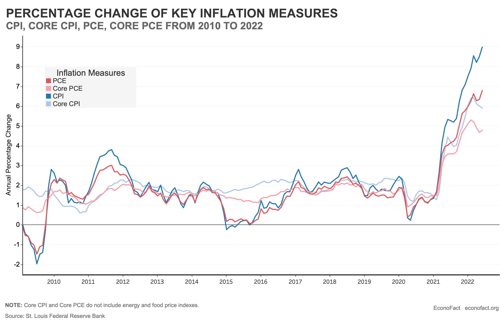

## Table of Contents

## What is price inflation?

Price inflation is when the prices of things we buy, like food, clothes, and gas, go up over time. It means that the same amount of money can buy less stuff than it could before. For example, if a candy bar cost $1 last year and now it costs $1.20, that's inflation. Inflation happens because the amount of money in the economy grows faster than the number of goods and services available.

Inflation can be caused by many things. Sometimes, it happens when people have more money to spend, so they buy more, and this can push prices up. Other times, it can be because it costs more to make things, like if the price of oil goes up, which makes it more expensive to transport goods. Governments and central banks try to keep inflation at a level that is not too high or too low, usually around 2% a year, to help keep the economy stable.

## How is inflation typically measured?

Inflation is typically measured by looking at the prices of a big group of things that people buy regularly, like food, clothes, and services. This group is called a "basket of goods and services." The most common way to measure inflation is by using the Consumer Price Index (CPI). The CPI tracks the average change over time in the prices paid by urban consumers for this basket of goods and services. Economists collect price data from many places, like stores and online, and then calculate how much the average price has gone up or down compared to last year.

Another way to measure inflation is by using the Producer Price Index (PPI). The PPI looks at the prices that businesses pay for goods and services they need to make their products. This can give an early warning about inflation because if the costs for businesses go up, they might raise their prices too. Both the CPI and PPI are important because they help governments and central banks understand how fast prices are changing and make decisions about economic policies to keep inflation in check.

## What are the common indices used to measure inflation?

The most common index used to measure inflation is the Consumer Price Index (CPI). The CPI looks at the average change over time in the prices that people pay for a big group of things they buy every day, like food, clothes, and services. This group is called a "basket of goods and services." Economists collect price data from many places, like stores and online, and then figure out how much the average price has gone up or down compared to last year. The CPI is important because it helps governments and central banks understand how fast prices are changing and make decisions about economic policies.

Another common index is the Producer Price Index (PPI). The PPI looks at the prices that businesses pay for goods and services they need to make their products. This can give an early warning about inflation because if the costs for businesses go up, they might raise their prices too. The PPI is useful because it can show what might happen to consumer prices in the future. Both the CPI and PPI are key tools for keeping track of inflation and helping to manage the economy.

## What is the difference between CPI and PPI?

The Consumer Price Index (CPI) and the Producer Price Index (PPI) are both used to measure inflation, but they look at different parts of the economy. The CPI measures the average change over time in the prices that people pay for a big group of things they buy every day, like food, clothes, and services. This group is called a "basket of goods and services." Economists collect price data from many places, like stores and online, and then figure out how much the average price has gone up or down compared to last year. The CPI is important because it helps governments and central banks understand how fast prices are changing and make decisions about economic policies.

The Producer Price Index (PPI), on the other hand, looks at the prices that businesses pay for goods and services they need to make their products. This can give an early warning about inflation because if the costs for businesses go up, they might raise their prices too. The PPI is useful because it can show what might happen to consumer prices in the future. While the CPI focuses on what consumers pay, the PPI focuses on what businesses pay, making it a helpful tool for predicting future inflation trends.

## How does inflation affect everyday consumers?

Inflation affects everyday consumers by making things they buy every day, like food and gas, more expensive. When prices go up, the same amount of money can buy less stuff than before. For example, if you used to buy a loaf of bread for $2 and now it costs $2.50, you need more money to get the same thing. This means people might have to spend more money just to keep up with their usual spending, which can be tough if their income doesn't go up at the same time.

If inflation is high, it can also make people feel less sure about their money. They might worry that prices will keep going up and that their savings will be worth less in the future. This can make people change how they spend and save. For example, they might decide to buy things now instead of waiting, or they might put their money into things that can grow faster than inflation, like stocks or real estate. Overall, inflation can make life more expensive and cause people to think differently about their money.

## What causes inflation to occur?

Inflation happens when the prices of things we buy, like food, clothes, and gas, go up over time. One big reason for inflation is when there's too much money chasing too few goods. This can happen when people have more money to spend, maybe because they got raises or the government gave out more money. When everyone tries to buy more stuff, but there isn't enough to go around, sellers can raise their prices because people are willing to pay more.

Another reason for inflation is when it costs more to make things. For example, if the price of oil goes up, it can make it more expensive to transport goods, and businesses might raise their prices to cover these higher costs. Sometimes, inflation can also happen because of expectations. If people think prices will go up in the future, they might buy things now, which can push prices up even more. Governments and central banks try to keep inflation in check by adjusting interest rates and other policies to make sure the economy stays balanced.

## What are the different types of inflation?

There are a few different types of inflation, and each one happens for different reasons. Demand-pull inflation happens when people want to buy more things than there are available. It's like too many people trying to buy a limited number of toys, so the price goes up. This can happen when people have more money to spend, maybe because they got raises or the government gave out more money. Cost-push inflation is different. It happens when it costs more to make things. For example, if the price of oil goes up, it can make it more expensive to transport goods, and businesses might raise their prices to cover these higher costs.

Another type of inflation is built-in inflation, also called wage-price inflation. This happens when workers want higher wages because prices are going up, and then businesses raise prices to cover the higher wages, which makes prices go up even more. It's like a circle that keeps going around. Sometimes, inflation can also be caused by too much money being printed by the government, which is called monetary inflation. When there's more money around, but not more stuff to buy, prices can go up. Each type of inflation has its own causes, but they all make things more expensive for people.

## How do governments and central banks respond to inflation?

Governments and central banks try to control inflation by using different tools. One big tool they use is changing interest rates. If inflation is too high, they might raise interest rates to make borrowing money more expensive. This can slow down spending because people and businesses might not want to borrow as much. When people spend less, prices might not go up as fast. Governments can also change taxes and spending to help control inflation. If they think inflation is too high, they might raise taxes or spend less money to cool down the economy.

Another way central banks fight inflation is by controlling the amount of money in the economy. They can do this by buying or selling government bonds. If they want to slow down inflation, they might sell bonds to take money out of the economy. This can help keep prices from going up too fast. Governments can also work with businesses to keep prices stable, like setting price controls or making deals to keep costs down. All these actions help keep inflation at a level that's not too high or too low, usually around 2% a year, to keep the economy stable.

## What are the economic theories behind inflation?

One main economic theory about inflation is called the Quantity Theory of Money. This theory says that inflation happens when there's too much money in the economy compared to the stuff people can buy. It's like if everyone suddenly had more money, but there weren't more things to spend it on. So, prices go up because everyone is trying to buy the same things with more money. This theory is often linked to how central banks control the money supply. If they print too much money, it can lead to inflation.

Another theory is called the Demand-Pull Theory. This one says that inflation happens when people want to buy more things than there are available. It's like too many people trying to buy a limited number of toys, so the price goes up. This can happen when people have more money to spend, maybe because they got raises or the government gave out more money. When everyone tries to buy more stuff, but there isn't enough to go around, sellers can raise their prices because people are willing to pay more.

There's also the Cost-Push Theory, which says inflation can happen when it costs more to make things. For example, if the price of oil goes up, it can make it more expensive to transport goods, and businesses might raise their prices to cover these higher costs. This can lead to inflation because the higher costs get passed on to consumers. Each of these theories helps explain why prices might go up, and they show how different parts of the economy can affect inflation.

## How can inflation be predicted or forecasted?

Inflation can be predicted by looking at many things that might make prices go up. Economists use models that look at how much money people are spending, how much businesses are charging for their goods, and how much it costs to make things. They also pay attention to things like the price of oil, because if it goes up, it can make everything more expensive to move around. By watching these things, economists can guess if prices will go up in the future. They also look at what people think will happen with prices. If everyone thinks prices will go up, they might start buying things now, which can push prices up even more.

Another way to forecast inflation is by using the Consumer Price Index (CPI) and the Producer Price Index (PPI). The CPI looks at the prices of things people buy every day, like food and clothes, and sees how much they change over time. The PPI looks at what businesses pay for the stuff they need to make their products. If the PPI goes up a lot, it might mean that businesses will raise their prices soon, which can lead to higher inflation. By keeping an eye on these indices, economists can get an idea of where inflation might be headed. Governments and central banks use all this information to make plans to keep inflation from getting too high or too low.

## What are the global impacts of inflation?

Inflation can affect the whole world in big ways. When prices go up in one country, it can make things more expensive everywhere. For example, if the price of oil goes up in one place, it can make it more expensive to move things around the world. This means that the cost of goods can go up in other countries too. Also, if one country has a lot of inflation, its money might not be worth as much compared to other countries' money. This can make it harder for that country to buy things from other places, and it can change how much they trade with each other.

Inflation can also make it harder for countries to work together on big projects. If prices are going up a lot in different countries, it can be tough to plan and pay for things like building roads or helping each other with food. Sometimes, when inflation is high in many places at the same time, it can make the whole world's economy less stable. This can lead to more people being out of work and having a harder time making ends meet. Governments and big banks around the world try to work together to keep inflation from getting too high and causing these problems.

## How do advanced statistical methods improve inflation measurement?

Advanced statistical methods help measure inflation better by looking at more data and finding patterns that might be hard to see otherwise. For example, economists can use something called "hedonic regression" to understand how changes in the quality of products affect their prices. If a new phone has better features than last year's model, it might cost more, but not because of inflation. By using these methods, economists can take out the part of the price change that's just because the product got better. This makes the inflation numbers more accurate and helps people understand how much prices are really going up.

Another way advanced statistics help is by using something called "seasonal adjustment." Prices can go up and down at certain times of the year, like during holidays or when the weather changes. By using math to take out these regular changes, economists can see the true trend of inflation. This makes it easier to predict what might happen next and helps governments and central banks make better decisions. Overall, these advanced methods make inflation numbers more reliable, which is important for keeping the economy stable and helping people plan for the future.

## How do economic metrics impact markets?

Economic metrics play a vital role in shaping market behavior and guiding trading strategies. These indicators, including Gross Domestic Product (GDP), employment rates, and inflation indices, provide essential insights into the economic landscape. They affect both short-term trading decisions and long-term investment strategies.

GDP is a comprehensive measure of a nation's overall economic activity and is crucial for assessing economic growth. A rising GDP typically signals economic expansion, prompting investors to consider growth-oriented investments. Conversely, a declining GDP may indicate economic contraction, leading to more cautious trading approaches. The formula for GDP can be expressed as:

$$
\text{GDP} = C + I + G + (X - M)
$$

where $C$ represents consumption, $I$ is investment, $G$ stands for government spending, and $(X - M)$ is net exports.

Employment rates also impact market conditions significantly. High employment rates can lead to increased consumer spending, bolstering economic growth and positively affecting asset prices. On the other hand, rising unemployment often signals economic distress, potentially driving market downturns as businesses face reduced demand.

Inflation indices, such as the Consumer Price Index (CPI) and the Producer Price Index (PPI), are also key indicators. Higher inflation often leads to higher interest rates as central banks aim to control price levels through monetary policy adjustments. This dynamic affects currency valuations and market [liquidity](/wiki/liquidity-risk-premium), making inflation indices crucial for traders.

Central banks often rely on these metrics to calibrate monetary policy. For example, the Federal Reserve in the United States monitors inflation and employment rates to set interest rates, which in turn, influences borrowing costs and investment behavior. Traders keep a close watch on these indicators, adjusting their strategies to preempt shifts in policy. A sudden rise in CPI might prompt tighter monetary policies, resulting in higher interest rates that could strengthen the local currency and impact stocks and bonds.

In financial markets, these economic metrics serve as barometers of market sentiment. Positive economic indicators generally lead to bullish market sentiment, driving assets' prices up. Conversely, negative economic data can lead to bearish sentiment, resulting in price drops. The timely interpretation of these metrics can provide traders with critical insights, guiding effective decision-making.

Hence, economic metrics significantly impact market expectations and the valuation of financial instruments. Successful traders analyze these indicators to anticipate policy shifts and adjust their positions, ensuring their strategies align with prevailing economic conditions. By doing so, they maintain an informed perspective on market direction and potential investment opportunities.

## References & Further Reading

[1]: ["Consumer Price Index (CPI) Data"](https://www.bls.gov/cpi/) - U.S. Bureau of Labor Statistics

[2]: Chan, E. P. (2009). ["Quantitative Trading: How to Build Your Own Algorithmic Trading Business"](https://github.com/ftvision/quant_trading_echan_book). Wiley.

[3]: Jansen, S. (2020). ["Machine Learning for Algorithmic Trading: Predictive models to extract signals from market and alternative data for systematic trading strategies with Python"](https://www.amazon.com/Machine-Learning-Algorithmic-Trading-alternative/dp/1839217715). Packt Publishing.

[4]: Aronson, D. R. (2006). ["Evidence-Based Technical Analysis: Applying the Scientific Method and Statistical Inference to Trading Signals"](https://www.amazon.com/Evidence-Based-Technical-Analysis-Scientific-Statistical/dp/0470008741). Wiley.

[5]: Lopez de Prado, M. (2018). ["Advances in Financial Machine Learning"](https://www.amazon.com/Advances-Financial-Machine-Learning-Marcos/dp/1119482089). Wiley.

[6]: ["Algorithmic Trading: Winning Strategies and Their Rationale"](https://books.google.com/books/about/Algorithmic_Trading.html?id=CIwCTVqEj4oC) by Ernest P. Chan