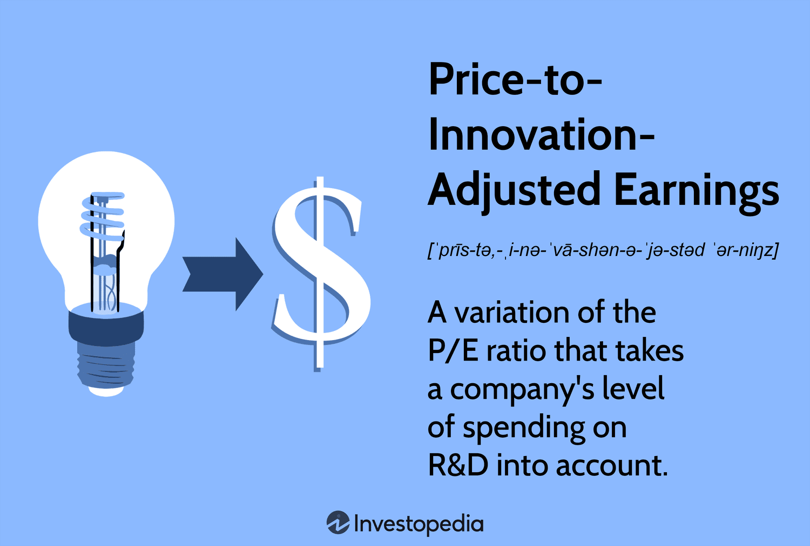

## Table of Contents

## What is Price Innovation Adjusted Earnings (PIAE)?

Price Innovation Adjusted Earnings (PIAE) is a way to measure how much money a company makes, but it takes into account how the company's prices and new ideas affect its earnings. It's different from regular earnings because it tries to show a clearer picture by considering things like inflation and new products or services that the company introduces.

For example, if a company raises its prices because of inflation, its regular earnings might look higher. But PIAE would adjust for this, so it shows what the earnings would be if prices hadn't changed. Also, if a company comes up with a new product that boosts its sales, PIAE would consider how much of the earnings come from this innovation. This helps investors see a more accurate view of the company's performance over time.

## Why is PIAE important for investors?

PIAE is important for investors because it gives them a clearer picture of a company's true earnings. Regular earnings can be affected by things like inflation or price changes, which might make a company look more profitable than it really is. PIAE adjusts for these factors, so investors can see what the company's earnings would be if prices hadn't changed. This helps investors make better decisions about whether a company is a good investment.

Also, PIAE takes into account the impact of new products or services that a company introduces. If a company comes up with a new product that boosts its sales, PIAE shows how much of the earnings come from this innovation. This is helpful for investors because it shows how well a company is doing at coming up with new ideas and staying competitive. By looking at PIAE, investors can get a better sense of a company's long-term health and growth potential.

## How does PIAE differ from traditional earnings metrics?

PIAE, or Price Innovation Adjusted Earnings, is different from traditional earnings metrics because it makes adjustments for changes in prices and new products. Traditional earnings just show how much money a company makes without considering if those earnings are because of higher prices due to inflation or new products that boost sales. PIAE takes these things into account to give a clearer picture of a company's true earnings.

For example, if a company raises its prices because everything is getting more expensive, its traditional earnings might look higher. But PIAE would adjust for this, showing what the earnings would be if prices hadn't changed. This helps investors see if the company is really doing better or if it's just because of inflation. Also, if a company comes up with a new product that sells well, PIAE would show how much of the earnings come from this innovation, which traditional earnings don't do.

## What are the key components of PIAE?

The key components of Price Innovation Adjusted Earnings (PIAE) are adjustments for price changes and the impact of new products or services. When calculating PIAE, it's important to look at how much a company's prices have changed. If prices go up because of inflation, PIAE adjusts the earnings to show what they would be if prices hadn't changed. This helps investors understand if the company is really making more money or if it's just because everything is more expensive.

Another important part of PIAE is considering the effect of new products or services that a company introduces. If a company comes up with something new that boosts its sales, PIAE shows how much of the earnings come from this innovation. This way, investors can see how well the company is doing at coming up with new ideas and staying competitive. By looking at both price changes and new products, PIAE gives a clearer picture of a company's true earnings.

## How is PIAE calculated?

To calculate PIAE, you start with the company's regular earnings. Then, you adjust these earnings for any changes in prices. If prices have gone up because of inflation, you take away the extra money the company made just because of higher prices. This shows what the earnings would be if prices hadn't changed. It's like looking at how much the company made without the effect of everything getting more expensive.

Next, you look at the impact of any new products or services the company has introduced. If a new product has boosted sales, you figure out how much of the earnings come from this innovation. You add this part to the earnings after they've been adjusted for price changes. This way, PIAE shows how much the company made, taking into account both the effect of inflation and the success of new ideas. It helps investors see a clearer picture of the company's true earnings.

## What industries benefit most from using PIAE?

Industries that are always coming up with new things, like technology and pharmaceuticals, really benefit from using PIAE. These industries often introduce new products that can make their earnings look higher. PIAE helps investors see how much of those earnings come from new ideas, not just from selling more of the same old stuff. This is important because it shows if a company is really innovating and staying ahead in a fast-changing world.

Also, industries where prices change a lot, like energy and commodities, can use PIAE to get a clearer picture of their earnings. If oil prices go up, a company's regular earnings might look better, but that's just because oil costs more, not because the company is doing better at its job. PIAE adjusts for these price changes, so investors can see the real performance of the company, without being fooled by changes in the market.

## Can PIAE be applied to all types of companies?

PIAE can be used for many different types of companies, but it works best for some more than others. Companies that are always coming up with new things, like tech or drug companies, really benefit from PIAE. It helps show how much of their earnings come from new ideas, not just from selling more of what they already have. This is important because it tells investors if a company is really innovating and staying ahead in a fast-changing world.

Also, PIAE is useful for companies in industries where prices change a lot, like energy or commodities. If oil prices go up, a company's regular earnings might look better, but that's just because oil costs more, not because the company is doing better at its job. PIAE adjusts for these price changes, so investors can see the real performance of the company, without being fooled by changes in the market. While PIAE can be applied to all types of companies, it's most helpful for those in industries with a lot of innovation or price [volatility](/wiki/volatility-trading-strategies).

## What are the limitations of using PIAE?

One limitation of using PIAE is that it can be hard to figure out exactly how much of a company's earnings come from new products or services. Sometimes, it's not easy to separate the earnings from new ideas from the earnings from old products. This means the PIAE numbers might not be completely accurate, and investors need to be careful when using them to make decisions.

Another limitation is that PIAE needs a lot of information to work right. To adjust for price changes, you need to know a lot about inflation and how prices are changing in the industry. To figure out the impact of new products, you need detailed data about sales and costs. If a company doesn't have this information or if it's hard to get, PIAE might not give a clear picture of the company's true earnings.

## How has PIAE been used in financial analysis historically?

Historically, PIAE has been used in financial analysis to give investors a better understanding of a company's performance, especially in industries that see a lot of innovation and price changes. For example, in the tech industry, where new products are constantly being introduced, PIAE helps analysts see how much of a company's earnings are due to these new ideas. This way, investors can tell if a company is really doing well because of innovation or if it's just selling more of the same old products.

In industries like energy and commodities, where prices can go up and down a lot, PIAE has been useful for adjusting earnings to account for these changes. If oil prices go up, a company's regular earnings might look better, but PIAE helps show what the earnings would be if oil prices hadn't changed. This gives investors a clearer picture of the company's true performance, without being misled by market fluctuations. Over time, PIAE has become a valuable tool for analysts trying to get a more accurate view of a company's financial health.

## What are some case studies where PIAE significantly impacted investment decisions?

In the tech industry, a well-known case where PIAE made a big difference was with a company that launched a new smartphone. The regular earnings showed a big jump because of the new product, but PIAE helped investors see that a lot of the earnings came from this one new phone. This made investors think more carefully about whether the company was really doing well overall or if it was just because of one successful product. Some investors decided to wait and see if the company could keep coming up with new ideas before they put more money into it.

Another case was in the energy sector, where a company's earnings went up a lot because oil prices went up. Regular earnings made it look like the company was doing much better, but PIAE adjusted for the higher oil prices and showed that the company's true earnings hadn't changed much. This helped investors realize that the company wasn't really doing better at its job; it was just because oil was more expensive. Some investors chose to invest in other companies that were doing well even without the help of higher oil prices.

## How do analysts forecast future PIAE?

Analysts forecast future PIAE by looking at what they think will happen with prices and new products. They try to guess how much prices might change because of inflation or other things. They also think about what new products a company might come up with and how well these products might sell. By putting all this together, they can make a guess about what the company's earnings will look like after adjusting for price changes and new ideas.

To do this, analysts use a lot of information. They look at past data to see how prices and new products have affected earnings before. They also use reports from the company and news about the industry to make their guesses. It's not easy to predict the future, so their forecasts are just their best guesses. But by using PIAE, they can give investors a clearer idea of what a company's earnings might be like, taking into account things like inflation and innovation.

## What advanced statistical methods can enhance the accuracy of PIAE calculations?

To make PIAE calculations more accurate, analysts can use advanced statistical methods like regression analysis. This method helps them see how much prices and new products affect earnings. By looking at past data, they can figure out patterns and use these patterns to adjust earnings more accurately. For example, they might use regression to see how much of a company's earnings come from inflation and how much comes from new products. This helps them make better guesses about what the earnings would be without these changes.

Another method is time series analysis, which looks at how earnings change over time. This can help analysts predict future price changes and the impact of new products. By understanding these trends, they can adjust earnings to show what they would be if prices hadn't changed and if new products hadn't been introduced. These advanced methods help give a clearer picture of a company's true earnings, making PIAE a more useful tool for investors.

## What is Understanding Adjusted Earnings?

Adjusted earnings provide a more precise estimation of a company's profitability by excluding items that are not part of its regular operations. This refinement is achieved by adjusting the net income reported by a company to remove non-recurring items such as restructuring costs, asset impairments, and other one-time expenses or gains. The aim is to reflect the company's core financial performance, thereby offering a more reliable measure for investors who wish to evaluate the ongoing performance of a business.

Incorporating adjustments is particularly significant for companies with intricate financial structures or substantial non-operating expenses. These complexities can skew traditional financial metrics, such as net income, thereby misleading stakeholders regarding a company’s true economic health. By filtering out these irregularities, adjusted earnings can highlight the sustainability of earnings and offer a clearer view of a company’s operational efficiency.

For instance, consider a company that reports a one-time gain from the sale of a subsidiary. While this boosts the company's earnings for the period, it does not accurately reflect its operational success. Adjusted earnings address this by excluding such items, ensuring that the profitability measure remains focused on regular business activities.

Mathematically, adjusted earnings can be expressed as:

$$
\text{Adjusted Earnings} = \text{Net Income} - \text{Non-recurring Items}
$$

where non-recurring items include unusual gains or losses that are not expected to occur regularly.

Investors often rely on this metric to compare companies across different industries and financial structures. It allows for a more apples-to-apples comparison by removing the noise created by items not directly tied to core business operations. Consequently, adjusted earnings are instrumental in forming a nuanced understanding of a company's financial trajectory, providing a foundation on which more informed investment decisions can be based.

## What are the key financial metrics in trading?

Financial metrics play a critical role in evaluating a company's performance and guiding investment decisions. Among the various metrics utilized by investors, Return on Investment (ROI), Earnings Per Share (EPS), and Price-to-Earnings (P/E) ratios are particularly significant.

### Return on Investment (ROI)

ROI is a widely used metric for assessing the efficiency of an investment. It measures the gain or loss generated on an investment relative to its cost. The formula for calculating ROI is as follows:

$$

\text{ROI} = \left( \frac{\text{Net Profit}}{\text{Investment Cost}} \right) \times 100
$$

This metric is invaluable for comparing the profitability of several investments. A higher ROI indicates a more profitable investment, making it a key determiner for investment strategies.

### Earnings Per Share (EPS)

EPS represents the portion of a company's profit allocated to each outstanding share of common stock. It is calculated as follows:

$$
\text{EPS} = \frac{\text{Net Income} - \text{Dividends on Preferred Stock}}{\text{Average Outstanding Shares}}
$$

EPS is an indicator of a company's profitability on a per-share basis, making it crucial for investors looking to understand an entity's financial health. It provides a basis for comparing earnings performance against similar firms or across different periods.

### Price-to-Earnings (P/E) Ratio

The P/E ratio is a valuation metric that compares a company's current share price to its earnings per share. It is computed using the formula:

$$
\text{P/E Ratio} = \frac{\text{Market Value per Share}}{\text{Earnings per Share (EPS)}}
$$

This ratio helps investors determine the market's valuation of a company relative to its earnings. A higher P/E ratio might suggest that the market expects future growth, while a lower P/E suggests the stock might be undervalued.

#### Practical Application

These financial metrics serve as essential tools for traders and investors to determine a company’s market position. By incorporating these metrics into their analysis, investors can make better-informed decisions regarding the valuation and potential investment opportunity of a company. Understanding these metrics helps investors to discern whether a company's stock is a worthwhile investment or if alternative strategies should be considered. 

Overall, mastering the interpretation and application of financial metrics like ROI, EPS, and P/E ratios is vital for any investor seeking to optimize their investment strategy and achieve better financial outcomes.

## What is Price-to-Innovation-Adjusted Earnings?

The Price-to-Innovation-Adjusted Earnings (PIAE) metric is a sophisticated tool designed to evaluate a company's true market value by integrating its investment in research and development (R&D). By considering R&D expenditures, this metric provides a refined assessment of a company's commitment to innovation, essential for understanding the long-term growth prospects, especially in technology-driven industries. Traditional Price-to-Earnings (P/E) ratios may not adequately reflect the innovative potential of companies that invest heavily in R&D, as these expenses are typically deducted from earnings, potentially skewing the perceived profitability.

To calculate the Price-to-Innovation-Adjusted Earnings, the traditional earnings component of the P/E ratio is adjusted by adding back the R&D expenses. The formula can be expressed as follows:

$$
\text{PIAE} = \frac{\text{Market Capitalization}}{\text{Adjusted Earnings}}
$$

where:

$$
\text{Adjusted Earnings} = \text{Net Income} + \text{R&D Expenses}
$$

This adjustment ensures that the valuation reflects the strategic investments made towards future growth, rather than penalizing the company for short-term reductions in net income due to R&D spending. In technology-focused sectors, where innovation is a significant driver of competitive advantage, the PIAE metric plays a crucial role in portraying a more accurate financial and strategic picture.

The utilization of the Price-to-Innovation-Adjusted Earnings ratio allows investors to differentiate between companies that are sustaining innovation-led growth and those that might be lagging in technological advancements. By emphasizing R&D as a core component of value assessment, this metric assists investors in identifying firms with robust growth potential rooted in innovative capabilities. Consequently, PIAE offers a more plausible valuation framework for evaluating enterprises in sectors where traditional financial metrics may not fully capture the dynamism and prospects of innovative initiatives.

## What is the relationship between Algorithmic Trading and Innovation?

Algorithmic trading employs sophisticated computer algorithms to execute trades efficiently and consistently based on predefined criteria. The primary advantage of this approach lies in its speed and precision, which surpass human capabilities, thus facilitating high-frequency trading and efficient market exploitation. 

Innovation plays a critical role in the advancement of [algorithmic trading](/wiki/algorithmic-trading), as algorithms are continuously enhanced to improve predictive accuracy and operational efficiency. Practitioners in this field actively refine algorithms by incorporating advanced statistical models, [machine learning](/wiki/machine-learning) techniques, and real-time data analytics to adapt to market fluctuations and optimize trading strategies.

Key metrics used to evaluate algorithmic trading performance include the Sharpe ratio and maximum drawdown. The Sharpe ratio measures the risk-adjusted return of an investment portfolio. It is calculated using the formula:

$$

\text{Sharpe Ratio} = \frac{E[R_p - R_f]}{\sigma_p}
$$

where $E[R_p - R_f]$ represents the expected return of the portfolio minus the risk-free rate, and $\sigma_p$ denotes the standard deviation of the portfolio's excess return. A higher Sharpe ratio indicates a more favorable risk-reward profile.

Maximum drawdown is another vital metric, quantifying the largest peak-to-trough decline in the portfolio's value over a specific period. This metric is essential for understanding an algorithm's exposure to risk, enabling traders to evaluate and adjust their strategies to mitigate potential losses.

The integration of innovative approaches and rigorous performance metrics underpins algorithmic trading's contribution to enhancing trading efficiency and effectiveness. Continuous improvements and the application of cutting-edge technologies ensure that algorithmic trading remains adaptive and responsive to evolving financial landscapes.

## How can we evaluate financial health through metrics?

In contemporary finance, understanding the potential for growth within a company is pivotal for making informed investment decisions. The utilization of advanced financial metrics, such as the price-to-innovation-adjusted ratio, provides significant insights into a company’s future prospects. This metric particularly highlights a firm's emphasis on research and development (R&D), which is crucial for companies within innovation-driven sectors.

The price-to-innovation-adjusted ratio is an extension of the traditional price-to-earnings (P/E) ratio, integrating a company’s R&D expenditure to offer a more comprehensive view of its valuation. By adjusting earnings for innovation efforts, investors can perceive the intrinsic value of companies investing heavily in technological advancements or product development. This is paramount for sectors such as technology and pharmaceuticals where R&D investment can directly influence long-term growth and market leadership.

Investors leverage this metric to differentiate between companies with robust growth strategies and those with potentially speculative prospects. A higher focus on R&D can imply a forward-thinking approach, potentially leading to disruptive innovations and new market opportunities. However, it is also essential to consider the relative efficiency of R&D spending, as excessive expenditure without commensurate returns can indicate misallocated resources.

To calculate the price-to-innovation-adjusted ratio, one might adjust net earnings by incorporating R&D costs, as follows:

$$
\text{Adjusted Earnings} = \text{Net Earnings} + \text{R&D Expenses}
$$

$$
\text{Price-to-Innovation-Adjusted Ratio} = \frac{\text{Market Capitalization}}{\text{Adjusted Earnings}}
$$

This formula allows investors to align traditional financial assessment with innovation potential, providing a measure to evaluate whether growth anticipates the future trajectory of a company’s market value. Thus, metrics like this enable a more nuanced understanding of financial health, guiding investors in distinguishing between stable investments and those carrying higher risks.

By adopting these innovative metrics, investors are better equipped to decipher complex financial landscapes and make strategic decisions that align with their long-term investment goals. These calculations reveal underlying growth potential, thereby reducing the ambiguity associated with valuing forward-thinking enterprises in dynamically evolving industries.

## References & Further Reading

[1]: ["Principles of Financial Modelling: Model Design and Best Practices Using Excel and VBA"](https://www.wiley.com/en-us/Principles+of+Financial+Modelling%3A+Model+Design+and+Best+Practices+Using+Excel+and+VBA-p-9781118904015) by Michael Rees

[2]: ["Financial Analytics with R: Building a Laptop Laboratory for Data Science"](https://www.amazon.com/Financial-Analytics-Building-Laboratory-Science/dp/1107150752) by Mark J. Bennett & Dirk L. Hugen

[3]: Ince, O. S., & Porter, R. B. (2006). ["Individual equity return data from Thomson Datastream: Handle with care!"](https://papers.ssrn.com/sol3/papers.cfm?abstract_id=486523) Journal of Financial Research.

[4]: Bartram, S. M., & Grinblatt, M. (2018). ["A survey of tailored investment strategies."](https://papers.ssrn.com/sol3/Papers.cfm?abstract_id=2670839) Journal of Financial Economics.

[5]: ["Algorithmic and High-Frequency Trading" (Quantitative Finance)](https://www.cambridge.org/us/universitypress/subjects/mathematics/mathematical-finance/algorithmic-and-high-frequency-trading) by Álvaro Cartea, Sebastian Jaimungal, & José Penalva