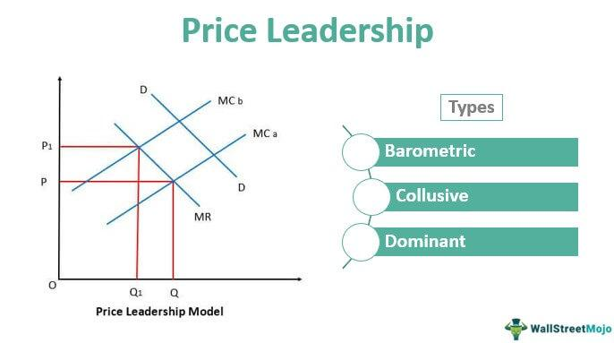

## Table of Contents

## What is a price leadership mechanism?

A price leadership mechanism is a way that companies in the same industry set their prices by following the lead of one main company. This main company, called the price leader, usually has the biggest share of the market or is the most respected. When the price leader changes its prices, other companies often change their prices to match. This helps keep prices stable in the industry and can make it easier for companies to predict what their competitors will do.

This mechanism can happen in different ways. Sometimes, the price leader might be a big company that sets the price and others follow because they don't want to lose customers. Other times, companies might agree informally to follow the leader's prices to avoid price wars, which can hurt everyone's profits. Price leadership can be good for keeping the market calm, but it can also be a problem if it leads to less competition and higher prices for customers.

## How does price leadership work in a market?

Price leadership in a market happens when one big company sets the price for a product, and other companies in the same market follow that price. This big company, called the price leader, might be the biggest in the market or just very respected. When the price leader changes its prices, other companies usually change their prices to match. This helps keep prices stable and makes it easier for everyone to predict what will happen next. For example, if the price leader raises the price of a product, other companies might raise their prices too, so they don't lose customers to the leader.

This system can work in different ways. Sometimes, the price leader might be a dominant company that everyone else follows because they don't want to start a price war. Other times, companies might quietly agree to follow the leader's prices to keep the market calm and avoid hurting their profits. While price leadership can help keep the market stable, it can also be a problem. If everyone follows the leader too closely, it can lead to less competition and higher prices for customers. This might make it harder for new companies to enter the market and offer lower prices.

## What are the different types of price leadership?

There are mainly three types of price leadership: dominant firm price leadership, barometric price leadership, and collusive price leadership. Dominant firm price leadership happens when one big company in the market sets the price and others follow because the big company has a lot of power. This big company is called the dominant firm. For example, if a big oil company changes its prices, smaller oil companies might change their prices too, so they don't lose customers.

Barometric price leadership is different. Here, one company is seen as good at predicting market changes. This company, called the barometric firm, changes its prices based on what it thinks will happen in the market, and other companies follow because they trust the barometric firm's predictions. For example, if a company is good at guessing when the cost of materials will go up, other companies might follow its price changes.

Collusive price leadership happens when companies in the market secretly agree to follow one company's prices. This is often done to avoid price wars and keep profits high. For example, if all the airlines in a region agree to follow the price changes of one airline, they can keep their prices stable and avoid competing too hard on price. This type of price leadership can be illegal because it can hurt customers by keeping prices high.

## Can you explain dominant firm price leadership?

Dominant firm price leadership happens when one big company in the market sets the price and other companies follow. This big company is called the dominant firm because it has a lot of power in the market. It might be the biggest company or just very important. When the dominant firm changes its prices, other companies usually change their prices too. They do this because they don't want to lose customers to the big company. For example, if a big oil company raises the price of gas, smaller oil companies might raise their prices too, so they don't lose customers.

This type of price leadership helps keep the market stable. When the dominant firm sets a price, it makes it easier for other companies to know what to do. They can predict what will happen next and plan their business around it. But it can also be a problem. If everyone follows the dominant firm too closely, it can lead to less competition and higher prices for customers. This might make it hard for new companies to enter the market and offer lower prices.

## What is barometric price leadership and how does it function?

Barometric price leadership is when one company in the market is really good at guessing what will happen next. This company is called the barometric firm because it acts like a weather forecast for the market. When this company changes its prices, other companies follow because they trust the barometric firm's predictions. For example, if a company is good at guessing when the cost of materials will go up, other companies might follow its price changes.

This type of price leadership helps other companies feel more sure about the future. They can see what the barometric firm is doing and then plan their own prices. It makes the market more stable because everyone is following a leader who is good at predicting changes. But it can also be a problem if everyone relies too much on one company's guesses. If the barometric firm makes a wrong guess, it can lead to big problems for everyone else in the market.

## How does collusive price leadership differ from other types?

Collusive price leadership is different from other types because it involves companies secretly agreeing to follow one company's prices. This secret agreement is called collusion. The goal is to avoid price wars and keep profits high for everyone involved. For example, if all the airlines in a region agree to follow the price changes of one airline, they can keep their prices stable and avoid competing too hard on price. This type of price leadership can be illegal because it can hurt customers by keeping prices high.

In contrast, dominant firm price leadership happens when one big company sets the price and others follow because the big company has a lot of power. There's no secret agreement; smaller companies just go along with the big company's prices to avoid losing customers. Barometric price leadership is different too. Here, one company is good at predicting market changes, and others follow its prices because they trust its predictions. There's no secret agreement in barometric price leadership either; it's just about following a good guesser.

## What are the advantages of price leadership for the leading firm?

Price leadership gives the leading firm a lot of power in the market. When the leading firm sets the price, other companies usually follow. This means the leading firm can control how much money it makes. If it wants to make more money, it can raise its prices, and other companies will likely do the same. This helps the leading firm keep its profits high without worrying too much about losing customers to other companies.

Another advantage is that price leadership makes the market more stable. When the leading firm changes its prices, everyone knows what to expect. This makes it easier for the leading firm to plan its business. It doesn't have to worry about sudden price wars or big changes in the market. This stability can help the leading firm grow and stay strong in the market.

## What are the potential disadvantages of price leadership for other firms in the market?

Price leadership can make it hard for other firms in the market. When one big company sets the price, smaller firms have to follow. If they don't, they might lose customers to the big company. This can make it tough for smaller firms to make their own decisions about prices. They have to go along with what the leading firm does, even if it's not the best for them.

Another problem is that price leadership can make the market less competitive. When all firms follow the leading firm's prices, it can lead to higher prices for customers. This can make it hard for new companies to enter the market. They might want to offer lower prices to attract customers, but if everyone is following the leading firm, it's hard to compete. This can keep the market from changing and growing, which is bad for other firms trying to find their place.

## How can price leadership impact market competition?

Price leadership can make the market less competitive. When one big company sets the price and others follow, it can lead to higher prices for customers. This happens because smaller companies don't want to lose customers to the big company, so they go along with the price changes. This can make it hard for new companies to enter the market. They might want to offer lower prices to attract customers, but if everyone is following the leading firm, it's tough to compete. This can keep the market from changing and growing, which is bad for competition.

On the other hand, price leadership can also help keep the market stable. When the leading firm changes its prices, everyone knows what to expect. This makes it easier for companies to plan their business without worrying about sudden price wars or big changes in the market. But this stability can also mean less competition. If all companies are following the leading firm's prices, they might not try as hard to offer better products or services. This can make the market less exciting and less competitive over time.

## What role does government regulation play in price leadership?

Government regulation can help keep price leadership fair. If companies secretly agree to follow one company's prices, it's called collusion. This can be bad for customers because it can keep prices high. Governments have rules against this kind of secret agreement. They watch the market to make sure companies are not working together to set prices. If they find out about collusion, they can punish the companies with fines or other penalties. This helps keep the market competitive and protects customers from high prices.

Sometimes, government regulation can also affect how price leadership works in other ways. For example, if a government sets rules about how much companies can charge for certain products, it can change how the leading firm sets its prices. Other companies might still follow the leading firm, but they have to do it within the rules set by the government. This can help make sure that price leadership doesn't lead to prices that are too high or unfair to customers. By setting these rules, the government can help keep the market balanced and make sure that competition stays healthy.

## How do firms signal price changes in a price leadership model?

In a price leadership model, the leading firm signals price changes by adjusting its own prices first. This could be through announcing a new price list, changing prices on their website, or even using media to let everyone know about the new prices. Other firms in the market watch these signals closely. When they see the leading firm change its prices, they usually follow suit to stay competitive and not lose customers.

This signaling can happen in different ways depending on the type of price leadership. For example, in dominant firm price leadership, the big company might just change its prices and expect others to follow because it has a lot of power. In barometric price leadership, the leading firm might change its prices based on what it thinks will happen in the market, and others follow because they trust its predictions. In collusive price leadership, firms might use subtle signals like price announcements or even secret meetings to agree on following the leading firm's prices.

## What are some real-world examples of price leadership in different industries?

In the oil industry, big companies like ExxonMobil or Saudi Aramco often act as price leaders. When these companies change the price of oil, smaller companies usually follow. This happens because the big companies have a lot of power in the market. If a smaller company doesn't follow the price change, it might lose customers to the big company. This type of price leadership helps keep the oil market stable, but it can also make it hard for new companies to enter and offer lower prices.

In the airline industry, sometimes one airline will change its prices and others will follow. For example, if a big airline like Delta raises its ticket prices, other airlines might do the same to avoid a price war. This can happen because airlines want to keep their profits high and avoid losing money by competing too hard on price. But if airlines secretly agree to follow one company's prices, it can be a problem. This kind of agreement is called collusion, and it can lead to higher prices for customers.

## References & Further Reading

[1]: Fudenberg, D., & Tirole, J. (1991). ["Game Theory."](https://mitpress.mit.edu/9780262061414/game-theory/) MIT Press.

[2]: Varian, H. R. (1992). ["Microeconomic Analysis."](https://wwnorton.com/books/Microeconomic-Analysis/) W. W. Norton & Company.

[3]: Dixit, A., & Nalebuff, B. (1991). ["Thinking Strategically: The Competitive Edge in Business, Politics, and Everyday Life."](https://www.amazon.com/Thinking-Strategically-Competitive-Business-Paperback/dp/0393310353) W. W. Norton & Company.

[4]: López de Prado, M. (2018). ["Advances in Financial Machine Learning."](https://www.amazon.com/Advances-Financial-Machine-Learning-Marcos/dp/1119482089) Wiley.

[5]: Stoll, H. R. (2006). ["Electronic Trading in Stock Markets."](https://pubs.aeaweb.org/doi/pdfplus/10.1257/089533006776526067) *Journal of Economic Perspectives, 20*(1), 153-174.

[6]: Chlistalla, M. (2011). ["High Frequency Trading: Better Than Its Reputation?"](https://www.finextra.com/finextra-downloads/featuredocs/prod0000000000269468.pdf) Deutsche Bank Research. 

[7]: Harris, L. (2003). ["Trading and Exchanges: Market Microstructure for Practitioners."](https://academic.oup.com/book/52292) Oxford University Press.

[8]: Scharfstein, D. S., & Stein, J. C. (1990). ["Herd Behavior and Investment."](https://scholar.harvard.edu/stein/publications/herd-behavior-and-investment) *The Quarterly Journal of Economics, 105*(3), 465-479.