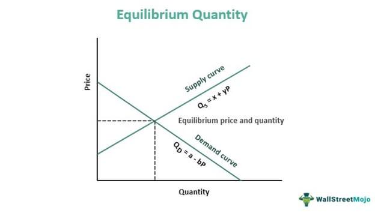

In today's fast-paced financial world, understanding the interplay between investing, economics, and technological advancements like algorithmic trading is crucial. Markets across the globe are increasingly driven by complex financial systems where decision-making relies heavily on data analysis and computational models. A fundamental aspect of these systems is the concept of price levels, which play a significant role in analysing economic trends and informing investment strategies. Price levels can indicate inflationary or deflationary trends and thus help determine the purchasing power within an economy. Their movements have far-reaching implications, influencing everything from consumer behavior to central bank policies.

This article explores the relationship between price levels in economics and their significance in the investment world, particularly when utilizing algorithmic trading. As investments are often a reflection of economic conditions, understanding price levels can help investors anticipate market trends and adjust their portfolios strategically. Algorithmic trading, a technological advancement in the financial sector, provides a platform to exploit these economic indicators efficiently, allowing for faster and more accurate decision-making. Algorithms are designed to process vast amounts of data in real-time, responding to market movements with precision and agility—a capability that is particularly beneficial in dynamic trading environments.



We will explore how economic indicators like price levels influence investment decisions and how algorithms can enhance trading strategies. As markets become more digitized, integrating economic understanding with technological tools not only offers competitive advantages but also mitigates the risks associated with manual trading. This synthesis of economic insight and technology forms the bedrock of informed investment decision-making in the modern financial landscape.

## Table of Contents

## Understanding Price Level: An Economic Perspective

Price level is a fundamental economic concept representing the average of current prices across the entire spectrum of goods and services within an economy. It serves as a critical indicator for understanding inflationary and deflationary trends. These trends reflect changes in purchasing power and can significantly impact monetary policy and economic planning.

Inflation occurs when there is a sustained increase in the price level, leading to a decrease in the purchasing power of money. Conversely, deflation is characterized by a sustained decrease in the price level, which can increase the real value of money. Both phenomena have profound effects on economic stability, influencing spending, investment, and saving behaviors.

Various indices are employed to measure changes in price levels. A prominent example is the Consumer Price Index (CPI), which tracks the average change over time in the prices paid by urban consumers for a market basket of consumer goods and services. Mathematically, the CPI can be expressed as follows:

$$
\text{CPI} = \left( \frac{\Sigma (P_t \cdot Q_0)}{\Sigma (P_0 \cdot Q_0)} \right) \times 100
$$

where $P_t$ and $P_0$ represent the prices of goods and services in the current and base periods, respectively, and $Q_0$ denotes the quantity in the base period.

Changes in the CPI provide insights into the inflation rate, calculated as:

$$
\text{Inflation Rate} = \left( \frac{\text{CPI}_{t} - \text{CPI}_{t-1}}{\text{CPI}_{t-1}} \right) \times 100
$$

Monitoring these changes is crucial for policymakers, investors, and businesses as it influences interest rates, wage agreements, and financial forecasting. The CPI is not the only index used; others like the Producer Price Index (PPI) and the Gross Domestic Product (GDP) deflator serve similar purposes, catering to different sectors of the economy.

The significance of price levels extends beyond mere [statistics](/wiki/bayesian-statistics). Understanding them equips individuals and institutions with the knowledge to navigate economic conditions effectively, adjusting strategies to mitigate potential adverse effects arising from economic [volatility](/wiki/volatility-trading-strategies).

## Impact of Price Levels on Investing

Price levels in the investment environment serve as critical indicators for identifying support and resistance zones in stock prices, aiding investors in defining strategic points for entering and exiting trades. Support and resistance levels are price points on the chart where the probability of a price reversal is higher. A support level is where a stock price tends to stop falling and may reverse, as buying interest overcomes selling pressure. Conversely, a resistance level is where the stock price tends to stop rising due to selling interest overcoming buying pressure.

Investors and traders examine these price levels to forecast economic conditions and make informed portfolio adjustments. A detailed analysis of historical price levels can guide investors in anticipating future trends. For example, a clear breach of a resistance level could signal the start of a significant upward trend, suggesting potential buying opportunities. Conversely, if a stock continues to decline beyond a support level, it may indicate a bearish trend, prompting strategic sell-offs to minimize losses.

Rising price levels typically indicate inflationary pressures within an economy. Inflation reduces the purchasing power of money, necessitating strategic adjustments in investment approaches. For investors, inflation erodes the real returns on investments, making it essential to track inflation indicators closely. In response to increasing inflation, central banks may alter monetary policies, such as raising interest rates to curb inflationary pressure. Such policy changes can influence asset prices significantly, affecting bond yields, stock market valuations, and currency exchange rates.

Understanding these dynamics is crucial for investors as monetary policy adjustments can have wide-ranging impacts across various asset classes. An increase in interest rates can lead to higher borrowing costs, potentially slowing down economic growth and impacting corporate earnings. This, in turn, may cause stock prices to decline, particularly in interest-sensitive sectors such as real estate and utilities.

Therefore, by monitoring price levels and corresponding economic indicators, investors can better position their portfolios against inflationary trends and central bank policy shifts. Implemented with careful analysis, this understanding enables investors to optimize returns while effectively managing risk in an ever-changing market landscape.

## Algorithmic Trading: Enhancing Investment Decisions

Algorithmic trading employs computer programs to execute trades by adhering to a predefined set of rules, which can significantly enhance both speed and accuracy of trade execution. By automating the trading process, [algorithmic trading](/wiki/algorithmic-trading) minimizes the influence of human emotions, leading to more systematic and disciplined trading practices. This systematic approach becomes particularly advantageous in volatile markets where emotional decision-making can lead to suboptimal trading outcomes.

One of the most common strategies in algorithmic trading is [trend following](/wiki/trend-following), which aims to capitalize on the movement of asset prices in a specific direction over time. This strategy involves identifying and following established trends until evidence of a reversal is apparent. For instance, moving averages, a common tool in trend following, allow traders to filter out noise and identify the general direction of a price movement.

Arbitrage opportunities represent another core strategy, where algorithms exploit price discrepancies of equivalent assets across different markets. Given the rapid pace at which these discrepancies can vanish, algorithms offer the precision and speed necessary to capitalize on [arbitrage](/wiki/arbitrage) opportunities before they dissipate.

The Volume-Weighted Average Price (VWAP) strategy, another prevalent method in algorithmic trading, allows traders to execute large orders without significantly impacting the market price. By distributing trades throughout the day, the VWAP strategy seeks to execute orders at a price close to the average of the day's trading [volume](/wiki/volume-trading-strategy) price. This strategy is beneficial for minimizing market impact and improving trade execution efficiency.

The integration of algorithms allows for dynamic adaptation to fluctuating price levels, thereby offering agility and precision that traditional human trading cannot match. Implementing algorithms can transform decision-making processes, enabling traders to efficiently respond to real-time market conditions and economic indicators.

## Integrating Economic Indicators in Algo-Trading

Algorithmic trading systems have the capability to incorporate economic indicators, such as price levels, into their decision-making processes. This integration enhances the flexibility and responsiveness of trading strategies by allowing algorithms to analyze real-time economic data and dynamically adjust their strategies in response to economic shifts. For instance, algorithms can be tailored to monitor changes in key indicators like the Consumer Price Index (CPI), Gross Domestic Product (GDP), or interest rates, using these insights to optimize buy or sell decisions.

Incorporating economic indicators involves utilizing historical data and predictive analytics to forecast potential market movements. An algorithm might utilize linear regression models to predict the future trajectory of price levels based on historical data. Consider a simple linear regression model:

$$

y = \beta_0 + \beta_1 x + \epsilon 
$$

where $y$ is the predicted price level, $x$ is the economic indicator (e.g., CPI), $\beta_0$ is the intercept, $\beta_1$ is the slope coefficient, and $\epsilon$ represents the error term.

By continuously updating the coefficients with new data, algorithms can generate accurate predictions, identifying potential trading opportunities and risks. This systematic approach allows traders to exploit market inefficiencies more effectively than traditional methods, which often rely on slower, human-driven analysis.

In practice, the integration of economic indicators within an algorithmic trading framework can be achieved through programming languages like Python. Below is a simple example of how one might employ linear regression using Python's `scikit-learn` library to predict future price levels:

```python
from sklearn.linear_model import LinearRegression
import numpy as np

# Hypothetical economic data
X = np.array([[1], [2], [3], [4], [5]])  # Example indicator values, e.g., CPI changes
y = np.array([100, 110, 115, 120, 130])  # Corresponding price levels

# Creating and fitting the linear regression model
model = LinearRegression()
model.fit(X, y)

# Predicting future price level
future_indicator_value = np.array([[6]])  # Projected future indicator value
predicted_price_level = model.predict(future_indicator_value)

print(f"Predicted Price Level: {predicted_price_level[0]}")
```

This code demonstrates how an algorithm can leverage statistical models to adapt to economic changes, providing traders with actionable insights. Such integration is instrumental in leveraging market opportunities, reducing reliance on manual intervention, and capitalizing on economic data-driven insights for strategic trading decisions.

## Advantages and Challenges of Algorithmic Trading

Algorithmic trading offers several advantages, primarily characterized by its ability to execute trades at a rapid pace, which is crucial for capitalizing on ephemeral market opportunities. The automation inherent in algorithmic systems enables reduced transaction costs as trades can be executed with minimal human intervention, lowering the impact of human error and operational expenses. Furthermore, these systems allow for comprehensive [backtesting](/wiki/backtesting) of trading strategies. By simulating trading strategies using historical data, traders can evaluate the viability and potential performance of these strategies before deploying them in real-time trading environments.

However, algorithmic trading also presents distinct challenges. One of the primary concerns is the risk of technological failures. System outages, software bugs, or latency issues can lead to missed trades or incorrect execution, potentially resulting in significant financial loss. Another challenge is the reliance on historical data to develop trading algorithms. While backtesting can reveal potential strategy success, historical data may not always accurately predict future market conditions, especially during unprecedented events or market disruptions.

The regulatory landscape adds an additional layer of complexity to algorithmic trading. Different jurisdictions may have varied regulations governing how algorithmic trading can be conducted, which algorithms can pose challenges for compliance and may require adjustments to strategies to meet regulatory standards.

Moreover, traders must remain vigilant of 'black swan' events—rare and unpredictable occurrences with severe consequences—that algorithms may not be designed to anticipate. A classic example is the 2010 Flash Crash, a sudden market drop followed by swift recovery, largely attributed to high-frequency trading algorithms reacting to unforeseen market conditions. This situation highlights the need for robust risk management measures, such as circuit breakers or kill switches, to mitigate potential losses and stabilize trading systems.

In summary, while algorithmic trading provides significant enhancements in terms of efficiency and systematic execution, these benefits must be weighed against potential risks and the need for constant monitoring and adaptation to new market dynamics and regulatory developments.

## Conclusion

Understanding price levels is paramount for making informed investment decisions. Price levels serve as critical indicators of economic health, influencing investor sentiment and guiding the allocation of resources. They help investors anticipate market trends, react to inflation or deflation, and make strategic choices in asset management.

Algorithmic trading provides a sophisticated framework that enhances investment strategies by incorporating economic indicators, such as price levels, into automated trading decisions. By relying on pre-defined sets of rules, algorithms can quickly and accurately analyze market data, reducing human error and emotional bias. This capability allows for the execution of complex trading strategies that can adapt to market fluctuations in real-time.

For instance, by programming algorithms to respond to economic indicators, such as shifts in price levels, investors can automate entry and [exit](/wiki/exit-strategy) strategies, optimizing their portfolios in the face of changing economic landscapes. This integration enables traders to exploit market inefficiencies more effectively than traditional methods would allow.

Nevertheless, the success of algorithmic trading relies on a balanced approach that combines technological prowess with human oversight. While algorithms optimize the technical aspects of trading, human intuition and oversight are essential to navigate unpredictable market events, such as 'black swan' scenarios, that algorithms might not anticipate.

By harmonizing the advantages of algorithmic trading with the insights derived from understanding economic indicators, investors can effectively enhance their market performance, achieving a well-rounded strategy that accounts for both quantitative precision and qualitative judgment.

## References & Further Reading

[1]: "Advances in Financial Machine Learning" by Marcos Lopez de Prado. [Link](https://www.amazon.com/Advances-Financial-Machine-Learning-Marcos/dp/1119482089)

[2]: Aronson, D. R. (2006). "Evidence-Based Technical Analysis: Applying the Scientific Method and Statistical Inference to Trading Signals." Hoboken, NJ: John Wiley & Sons. [Link](https://onlinelibrary.wiley.com/doi/book/10.1002/9781118268315)

[3]: "Machine Learning for Algorithmic Trading" by Stefan Jansen. [Link](https://github.com/stefan-jansen/machine-learning-for-trading)

[4]: Chan, E. P. (2009). "Quantitative Trading: How to Build Your Own Algorithmic Trading Business." Hoboken, NJ: John Wiley & Sons. [Link](https://onlinelibrary.wiley.com/doi/pdf/10.1002/9781119203377.fmatter)

[5]: Bergstra, J., Bardenet, R., Bengio, Y., & Kégl, B. (2011). "Algorithms for Hyper-Parameter Optimization." Advances in Neural Information Processing Systems 24. [Link](https://dl.acm.org/doi/10.5555/2986459.2986743)