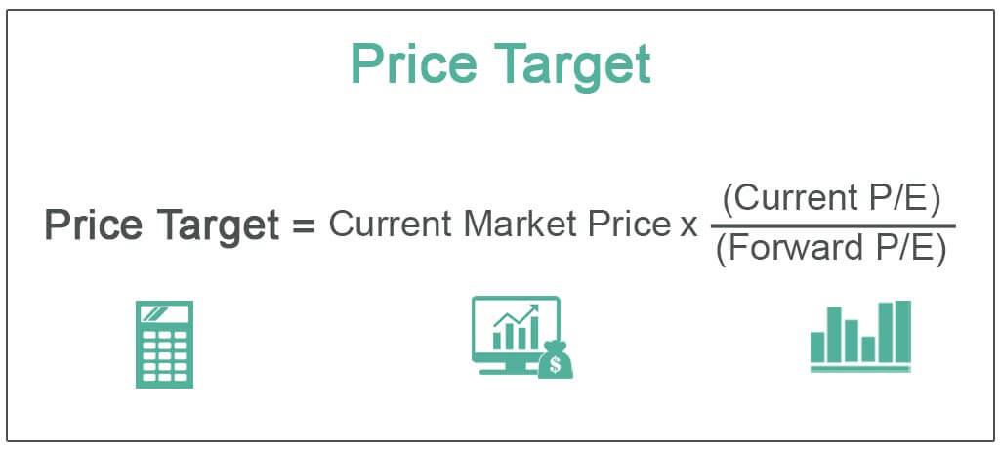

In the constantly evolving financial landscape, factors such as monetary policies, economic strategies, and technological advancements significantly influence the global economy. Understanding the interplay among these components is essential for investors, policymakers, and economists as they navigate through economic challenges and opportunities. This article examines the intricate relationship between economic strategy, monetary policy, price level targeting, and algorithmic trading, highlighting their interactions and impact on financial markets.

Monetary policies, implemented by central banks, play a fundamental role in controlling inflation, stabilizing currency, and achieving economic objectives like full employment. Economic strategy encompasses diverse plans employed by governments or financial institutions to foster economic growth and stability. The strategic decisions undertaken in these domains directly affect market dynamics, dictating interest rates, liquidity, and price levels.



Technological advancements, particularly in algorithmic trading, have transformed the financial markets by enhancing trading efficiency and increasing market liquidity. Algorithmic trading uses computer programs to make high-speed trade decisions, juxtaposing traditional trading methods. This advancement not only offers opportunities but also presents challenges such as potential market manipulations and flash crashes.

The global economy's intricate web is further complicated by emerging monetary policy frameworks like price level targeting. This approach aims to stabilize price levels over time and offers potential advantages, including increased economic predictability. Understanding these emerging trends and the interconnectedness of economic strategies is crucial for navigating modern financial systems effectively.

This introduction sets the stage for a comprehensive examination of these vital economic components, exploring how they interact with each other and shape the financial markets. Through this exploration, the article aims to offer insights necessary for effectively navigating the complexities of the contemporary economic environment.

## Table of Contents

## Understanding Economic Strategy and Monetary Policy

Economic strategies are frameworks devised by governments or financial institutions designed to guide economic growth and ensure stability. Central to these strategies is monetary policy, which primarily involves the manipulation of a country's money supply and interest rates to affect economic activity. This approach aims to achieve macroeconomic objectives like controlling inflation, stabilizing the national currency, and attaining full employment. 

Central banks are instrumental in implementing monetary policies. Their role includes setting benchmark interest rates, which influence borrowing costs throughout the economy. For instance, lowering interest rates generally encourages borrowing and investment, stimulating economic growth. Conversely, increasing rates tend to restrain economic activity by making borrowing more expensive, ultimately cooling inflationary pressures. 

One prevalent method of monetary policy is inflation targeting. This approach focuses on keeping inflation within a specified range, usually declared as a target by the central bank. By anchoring expectations about future inflation, central banks can provide certainty to markets and help guide economic decisions of businesses and consumers. The formula for the Consumer Price Index (CPI), frequently used to measure inflation, is expressed as:

$$
\text{CPI} = \left( \frac{\sum \left( \text{Price of current basket of goods and services} \right)}{\sum \left( \text{Price of basket in base year} \right)} \right) \times 100
$$

Interest rate manipulation is another crucial tool. By influencing short-term interest rates, central banks affect economic activities such as consumption, savings, and investment, thereby impacting overall economic output. 

Understanding these policies and their mechanisms is essential for grasping their broad economic implications and influence on market dynamics. Through their decisions, central banks have the power to shape economic environments, stabilize financial systems, and ensure sustainable economic growth. As a dynamic and adaptable tool, monetary policy remains pivotal in addressing various economic challenges.

## Price Level Targeting: A New Frontier in Policy Framework

Price level targeting is an innovative monetary policy approach where a central bank aims to stabilize the price level rather than focusing solely on the rate of inflation. This involves targeting a specific trajectory for a price index, such as the Consumer Price Index (CPI), and adjusting monetary policy to maintain this target over a specified period.

### Price Level Targeting vs. Inflation Targeting

The primary distinction between price level targeting and inflation targeting lies in their respective goals. Inflation targeting centers around stabilizing the inflation rate, which measures how quickly prices increase over time. In contrast, price level targeting aims to ensure that the overall price level remains on a predetermined path, correcting for past deviations. For instance, if the price level undershoots the target in one period, the central bank would allow for higher inflation temporarily to bring the price level back to the targeted path, and vice versa.

### Long-term Stability and Short-term Volatility

The chief advantage of price level targeting is enhanced long-term stability, as it assures economic [agents](/wiki/agents) (consumers, businesses, and investors) that the purchasing power of money will be preserved over time. By correcting for past inflation deviations, price level targeting reduces the uncertainty around future price levels, which can facilitate more predictable economic planning.

However, this approach may induce short-term [volatility](/wiki/volatility-trading-strategies). In periods where the price level deviates significantly from the target due to economic shocks, the necessary corrections can lead to more substantial short-term fluctuations in inflation and output. This volatility arises because the central bank might need to implement aggressive monetary policy adjustments to steer the price level back to its targeted path.

### Theoretical Benefits

The theoretical benefits of price level targeting include:
- **Increased Economic Predictability**: By adhering to a consistent price level trajectory, economic agents can make more informed long-term decisions, potentially leading to enhanced economic growth and investment stability.
- **Reduced Long-term Inflation Variability**: Unlike inflation targeting, where deviations can compound over time, price level targeting inherently corrects for past discrepancies, thus stabilizing the path of the price level.

### Challenges and Calibration Complexities

Despite its potential advantages, price level targeting presents several challenges:
- **Policy Missteps**: The requirement for precise and timely interventions increases the risk of policy errors, which can exacerbate economic volatility rather than mitigate it.
- **Complex Calibration**: Establishing and maintaining a target price level demands sophisticated modeling and forecasting capabilities. These include assessing potential output and the natural rate of interest, which are inherently uncertain and subject to change.

In summary, price level targeting offers a promising framework for achieving long-term price stability. However, it requires careful orchestration and robust economic analysis to manage the trade-off between short-term volatility and long-term stability. As such, it presents both challenges and opportunities for modern monetary policymakers seeking to enhance the efficacy of their economic strategies.

## Algorithmic Trading and its Influence on Financial Markets

Algorithmic trading utilizes sophisticated computer algorithms to conduct trades at speeds and frequencies beyond human capability. By automating the decision-making process, [algorithmic trading](/wiki/algorithmic-trading) enhances both the efficiency and [liquidity](/wiki/liquidity-risk-premium) of financial markets. This technology-driven approach relies on predefined criteria and statistical models to execute trades, contributing to reduced transaction costs and rapid order execution.

Despite these advantages, algorithmic trading introduces notable challenges. Flash crashes, such as the one that occurred on May 6, 2010, underscore the potential for extreme volatility precipitated by automated systems. These sudden price swings are often caused by feedback loops where algorithms react to anomalies in trading patterns, exacerbating market fluctuations. Moreover, the opacity of some algorithmic strategies raises concerns about market manipulation, where trading algorithms may unduly sway prices through rapid, large-[volume](/wiki/volume-trading-strategy) trades.

Regulatory bodies are increasingly focusing on the implications of algorithmic trading to ensure market stability and fairness. Agencies like the U.S. Securities and Exchange Commission (SEC) and the European Securities and Markets Authority (ESMA) have implemented guidelines to curb excessive risk-taking and enhance transparency. These efforts include requiring firms to register their algorithms and maintain robust risk controls.

The interaction between monetary policies and algorithmic trading is also significant. Changes in interest rates or central bank announcements can trigger immediate algorithmic responses, influencing asset prices and trading volumes. This synchronization showcases the profound impact of algorithmic trading on market movements and monetary policy effectiveness. Traders and policymakers must therefore continuously adapt to the evolving landscape, balancing technological advancements with regulatory measures to maintain orderly financial markets.

## Interplay Between Monetary Policy and Algo Trading in Modern Economies

The interaction between monetary policy and algorithmic trading is pivotal in shaping contemporary financial systems. Central banks, through their monetary policies, set the tone for economic environments by adjusting interest rates and controlling money supply. These policies fundamentally influence market conditions, impacting investment decisions and risk assessments. As a result, algorithmic trading strategies, which rely heavily on market data and trends, are significantly affected.

Algorithmic trading systems have the capability to process information and execute trades at speeds far beyond human capabilities. This enables them to respond almost instantaneously to policy changes announced by central banks. For instance, a sudden [interest rate](/wiki/interest-rate-trading-strategies) cut by a central bank can trigger a flurry of algorithmic trades designed to capitalize on expected market movements, such as the rapid buying of stocks anticipated to benefit from lower borrowing costs.

This immediacy of response underscores the influence of technology on the effectiveness of monetary policy. If central banks implement a policy like price level targeting, which adjusts economic variables to maintain a consistent price level, algorithmic trading systems must evolve to interpret new signals and incorporate them into trading models. This could involve recalibrating algorithms to account for changes in inflation expectations or adjusting position sizes in response to anticipated shifts in consumer prices.

Python, a programming language commonly used in algorithmic trading, provides tools for such adaptations. Here is a simple Python code snippet demonstrating how an algorithm might adjust its parameters in response to a change in monetary policy:

```python
def adjust_trading_strategy(policy_change):
    if policy_change == "interest rate cut":
        # Increase purchase of interest-sensitive assets
        return {"buy": "assets", "quantity": "increase"}
    elif policy_change == "price level targeting implemented":
        # Rebalance portfolio to mitigate inflation risk
        return {"rebalance": "portfolio", "risk": "influence"}

policy = "price level targeting implemented"
strategy_adjustment = adjust_trading_strategy(policy)
print(strategy_adjustment)
```

As monetary policies evolve, algorithmic systems are required to adjust dynamically, leading to a complex interplay where policy developments can lead to significant shifts in market behavior driven by algorithmic trades. This fluid relationship highlights both the opportunities for enhanced efficiency in trading and the challenges in maintaining market stability amidst rapidly adapting strategies.

## Challenges and Opportunities Ahead

As financial systems and technologies become increasingly intertwined, both challenges and opportunities arise for the implementation of economic strategy and policy. The integration of algorithmic trading and other technological advancements necessitates effective regulation to optimize efficiency while mitigating associated risks. Effective regulatory frameworks are crucial to prevent issues such as market manipulation and volatility spikes, often exemplified by flash crashes. Regulatory bodies need to adapt to the rapid pace of technological advancement to ensure fairness and transparency in financial markets.

Policymakers face a critical task in balancing the drive for innovation with economic stability. As they contemplate adopting advanced frameworks like price level targeting, they must weigh the potential benefits of achieving long-term price stability against the risks of short-term economic disturbances. Implementing price level targeting requires rigorous calibration and monitoring to avoid policy missteps that could destabilize markets. 

Furthermore, the integration of [machine learning](/wiki/machine-learning) and [artificial intelligence](/wiki/ai-artificial-intelligence) into economic analysis and policy formulation is expected to become more prevalent. These technologies can enhance predictive accuracy in economic modeling and potentially provide real-time analysis of policy impacts, offering deeper insights into economic dynamics. The use of machine learning algorithms in processing vast financial data can help policymakers make more informed decisions, tailoring strategies to suit evolving economic conditions.

The future of economic strategy and algorithmic influence may witness pathways that include a tighter coupling of data science with monetary policy, enabling more responsive and resilient economic frameworks. Policymakers must consider potential pitfalls such as algorithm biases, data security, and the ethical implications of AI-driven decisions. As these technologies evolve, continuous research and adaptation will be vital to harness their potential fully, ensuring that economic strategies remain robust and adaptive in an ever-changing financial landscape.

## Conclusion

Economic strategy, monetary policy, price level targeting, and algorithmic trading are integral forces shaping the modern financial ecosystem. Their interactions are pivotal for managing economic growth and stability. By understanding these interconnections, stakeholders can better assess risks and opportunities, leading to more informed decision-making processes.

Embracing technological advancements is essential for the future of monetary policy. This includes leveraging digital tools, such as data analytics and algorithmic models, to enhance the precision and effectiveness of policy interventions. As the financial landscape evolves, so does the necessity for robust economic frameworks that accommodate these innovations without compromising stability.

Ongoing research and adaptation are crucial in our rapidly changing economic environment. As new challenges emerge, it is vital for policymakers, investors, and economists to continuously update strategies and policies. This dynamic approach ensures resilience against potential disruptions while capitalizing on new opportunities.

The importance of continued exploration and adaptation in monetary management cannot be overstated. By fostering an environment conducive to innovation and rigorous analysis, economic stakeholders can better navigate the complexities of the global economy, ensuring sustainable growth and stability for future generations.

## References & Further Reading

[1]: Svensson, L. E. O. (1999). ["Price-Level Targeting vs. Inflation Targeting: A Free Lunch?"](https://www.nber.org/papers/w5719) National Bureau of Economic Research Working Paper No. 5719.

[2]: Merton, R. C., & Bodie, Z. (2005). ["Design of Financial Systems: Towards a Synthesis of Function and Structure."](https://www.nber.org/papers/w10620) Journal of Investment Management, 3(1).

[3]: Carney, M. (2010). ["The Brave New World of Central Banking."](https://www.elibrary.imf.org/display/book/9781484323014/ch01.xml) Remarks by Mark Carney, Governor of the Bank of Canada, to the 9th BIS Annual Conference.

[4]: Bernanke, B. S., & Mishkin, F. S. (1997). ["Inflation Targeting: A New Framework for Monetary Policy?"](https://www.jstor.org/stable/2138238) Journal of Economic Perspectives, 11(2), 97-116.

[5]: Gomber, P., Arndt, B., Lutat, M., & Uhle, T. (2011). ["High-Frequency Trading."](https://papers.ssrn.com/sol3/papers.cfm?abstract_id=1858626) SSRN Electronic Journal.

[6]: Lopez de Prado, M. (2018). ["Advances in Financial Machine Learning."](https://www.amazon.com/Advances-Financial-Machine-Learning-Marcos/dp/1119482089) Wiley.

[7]: Jarrow, R. A., & Protter, P. (2012). ["A Dysfunctional Role of High-Frequency Trading in Electronic Markets."](https://papers.ssrn.com/sol3/papers.cfm?abstract_id=1781124) Mathematics and Financial Economics, 6(4), 311-346.