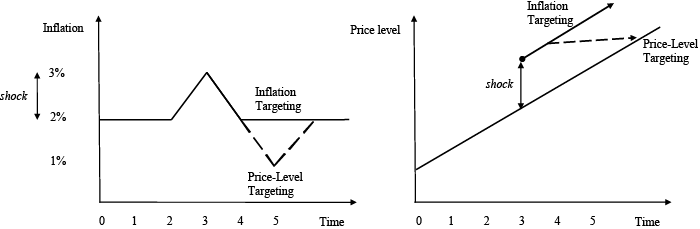

## Table of Contents

## What is price level targeting?

Price level targeting is a monetary policy strategy where a central bank aims to keep the overall price level stable over time. Instead of focusing on inflation rates, which measure the rate of price increases, price level targeting looks at the actual level of prices. If prices go up one year, the central bank might aim to bring them down the next year to keep the average price level steady.

This approach can help keep the value of money more predictable. For example, if a loaf of bread costs $2 this year, the central bank would try to make sure that over time, the average price of bread stays around $2. This can make it easier for people to plan their spending and saving, because they know what their money will be worth in the future. However, it can be challenging to implement because it requires the central bank to sometimes raise or lower interest rates more aggressively than with traditional inflation targeting.

## How does price level targeting differ from inflation targeting?

Price level targeting and inflation targeting are two different ways central banks try to control the economy. With inflation targeting, the central bank focuses on keeping the rate at which prices increase steady, usually around a specific target like 2% per year. If prices go up too fast, the bank might raise interest rates to slow things down. If prices aren't rising enough, it might lower rates to encourage spending. The goal is to keep the economy growing smoothly without prices shooting up too quickly.

On the other hand, price level targeting looks at the actual level of prices, not just how fast they're changing. The central bank tries to keep the average price level the same over time. So, if prices go up one year, the bank might try to bring them back down the next year to balance things out. This can help keep the value of money more predictable, making it easier for people to plan their finances. But it can be trickier to do because it might require bigger changes in interest rates than inflation targeting.

## What are the main objectives of implementing price level targeting?

The main goal of price level targeting is to keep the value of money stable over time. When a central bank uses this method, it tries to make sure that the average price of things stays about the same. This means if prices go up one year, the bank might try to bring them back down the next year. This can help people plan their spending and saving better because they know what their money will be worth in the future. It makes the economy more predictable and can help people feel more secure about their financial plans.

Another important objective is to fight against inflation and deflation in a more balanced way. With inflation targeting, the focus is just on keeping price increases steady. But with price level targeting, the central bank can also work to correct past changes in prices. If prices have gone up too much in the past, the bank can try to lower them to get back to the target level. This can prevent long periods of high inflation or deflation, which can be harmful to the economy. By keeping the price level steady, the central bank can help create a more stable economic environment.

## What are the potential benefits of price level targeting for an economy?

Price level targeting can make the economy more stable. When a central bank uses this method, it aims to keep the average price of things the same over time. This means if prices go up one year, the bank will try to bring them back down the next year. This can help people know what their money will be worth in the future, making it easier for them to plan their spending and saving. When people feel more sure about their money, they might spend and invest more, which can help the economy grow.

Another benefit is that price level targeting can fight against both inflation and deflation better than other methods. With inflation targeting, the focus is just on keeping price increases steady. But with price level targeting, the central bank can correct past changes in prices. If prices went up too much before, the bank can try to lower them to get back to the target level. This can prevent long periods of high inflation or deflation, which can hurt the economy. By keeping the price level steady, the central bank can create a more balanced economic environment.

## What challenges might a central bank face when implementing price level targeting?

Implementing price level targeting can be tricky for a central bank. One big challenge is that it might need to make bigger changes to interest rates than with other methods. If prices go up one year, the bank might have to raise rates a lot the next year to bring prices back down. This can be hard to do without causing other problems in the economy, like slowing down growth too much.

Another challenge is that people might not understand or trust price level targeting as much as other methods. If prices go up one year, people might worry about why the bank is trying to lower them the next year. It can be hard to explain to the public why this is a good thing, and if people don't trust the bank's plan, they might not spend or invest as much. This can make it harder for the bank to reach its goals and keep the economy stable.

## Can you explain the mechanism of price level targeting with an example?

Let's say a central bank wants to keep the price of a loaf of bread at around $2 over time. In Year 1, the price of bread goes up to $2.20. With price level targeting, the central bank would not just try to stop prices from going up more in Year 2. Instead, it would try to bring the price back down to $2. To do this, the bank might raise interest rates to slow down spending and bring prices down. If it works, by Year 2, the price of bread might be back at $2.

This approach can help people know what their money will be worth in the future. If they see that the central bank is trying to keep the price of bread at $2, they can plan their spending better. But it's not easy for the bank. If it raises interest rates too much to bring prices down, it might slow down the economy too much. And if people don't understand why the bank is trying to lower prices after they went up, they might not trust the bank's plan.

## How does price level targeting affect long-term economic planning for businesses?

Price level targeting can help businesses plan for the future by making the value of money more predictable. If a central bank is using price level targeting, it tries to keep the average price of things the same over time. This means if prices go up one year, the bank will try to bring them back down the next year. For a business, this can make it easier to predict costs and set prices for their products. If they know that the price of their raw materials will stay about the same over time, they can make better long-term plans for production and sales.

However, there are challenges too. If the central bank has to make big changes to interest rates to keep prices steady, it can affect how much businesses want to borrow and invest. If interest rates go up a lot to bring prices down, businesses might decide to wait before starting new projects or expanding. This can make it harder for them to plan for the long term because they might not know if the cost of borrowing will go up or down. So, while price level targeting can help with predictability, it can also make things more uncertain if the central bank has to make big moves to keep prices in check.

## What role do expectations play in the success of price level targeting?

Expectations are really important for price level targeting to work well. When people believe that the central bank will keep prices steady over time, they can plan their spending and saving better. If everyone thinks prices will stay the same, they won't rush to buy things just because they think prices will go up. This helps the central bank keep prices stable because people's behavior matches what the bank is trying to do.

But if people don't trust the central bank's plan, it can be hard to keep prices steady. If they think prices will go up a lot one year and then come back down the next year, they might not understand why the bank is doing this. They might start buying more when they think prices will go up, which can make it harder for the bank to bring prices back down later. So, for price level targeting to work, the central bank needs to make sure people understand and believe in what they're trying to do.

## How can price level targeting be integrated with other monetary policy tools?

Price level targeting can work well with other tools that central banks use to manage the economy. One common tool is interest rates. When prices go up, the central bank might raise interest rates to slow down spending and bring prices back down. This can help keep the price level steady over time. Another tool is open market operations, where the bank buys or sells government bonds to control how much money is in the economy. If prices are too high, the bank might sell bonds to take money out of circulation, which can help lower prices.

Another way to integrate price level targeting is by using communication strategies. The central bank can explain to the public why it's trying to keep prices steady and what it's doing to achieve that. Clear communication can help people understand and trust the bank's plan, which makes it easier to keep prices stable. By combining price level targeting with these other tools, the central bank can create a more balanced approach to managing the economy and keeping prices in check.

## What historical precedents or case studies illustrate the use of price level targeting?

One historical example of price level targeting is Sweden in the 1930s. During this time, the Swedish central bank tried to keep the overall price level steady. They did this by adjusting interest rates to control how much people spent. If prices went up, they would raise interest rates to slow down spending and bring prices back down. This helped keep the economy stable during a tough time, but it was hard to do because they had to make big changes to interest rates.

Another case study is the idea of price level targeting in New Zealand in the 1990s. The central bank there thought about using this method but decided to stick with inflation targeting instead. They worried that price level targeting might be too hard to explain to people and could cause bigger changes in interest rates. Even though they didn't use it, this example shows how central banks think about different ways to keep the economy stable and what challenges they face when considering price level targeting.

## How do different economic models predict the outcomes of price level targeting?

Different economic models have different ideas about how price level targeting might work. Some models think it's a good idea because it can make the economy more predictable. If people know that the central bank is trying to keep prices steady over time, they can plan their spending and saving better. This can help the economy grow more smoothly because people aren't worried about prices going up or down a lot. These models say that price level targeting can stop long periods of high inflation or deflation, which can be bad for the economy.

Other models think price level targeting can be hard to do. They say that the central bank might have to make big changes to interest rates to keep prices steady. If they raise interest rates a lot to bring prices down, it might slow down the economy too much. Also, people might not understand or trust the central bank's plan. If they don't believe that the bank can keep prices steady, they might not spend or invest as much. This can make it harder for the central bank to reach its goals and keep the economy stable.

## What advanced strategies can central banks employ to fine-tune price level targeting?

Central banks can use a few smart tricks to make price level targeting work better. One way is to use something called forward guidance. This means the bank tells everyone what it plans to do with interest rates in the future. If people know what to expect, they can plan their spending and saving better. This can help the bank keep prices steady because people's behavior matches what the bank wants. Another trick is to use different tools at the same time. For example, the bank can change interest rates and also buy or sell government bonds. Using these tools together can help the bank control how much money is in the economy and keep prices in check.

Another strategy is to keep a close eye on what people expect prices to do. If the bank sees that people think prices will go up a lot, it can act quickly to stop that from happening. This can help stop big price changes before they start. The bank can also talk to the public a lot about what it's doing and why. If people understand and trust the bank's plan, they're more likely to help keep prices steady. By using these smart strategies, the central bank can make price level targeting work better and keep the economy stable.

## What is the understanding of Economic Strategy and Monetary Policy?

Economic strategies are frameworks devised by governments or financial institutions designed to guide economic growth and ensure stability. Central to these strategies is monetary policy, which primarily involves the manipulation of a country's money supply and interest rates to affect economic activity. This approach aims to achieve macroeconomic objectives like controlling inflation, stabilizing the national currency, and attaining full employment. 

Central banks are instrumental in implementing monetary policies. Their role includes setting benchmark interest rates, which influence borrowing costs throughout the economy. For instance, lowering interest rates generally encourages borrowing and investment, stimulating economic growth. Conversely, increasing rates tend to restrain economic activity by making borrowing more expensive, ultimately cooling inflationary pressures. 

One prevalent method of monetary policy is inflation targeting. This approach focuses on keeping inflation within a specified range, usually declared as a target by the central bank. By anchoring expectations about future inflation, central banks can provide certainty to markets and help guide economic decisions of businesses and consumers. The formula for the Consumer Price Index (CPI), frequently used to measure inflation, is expressed as:

$$
\text{CPI} = \left( \frac{\sum \left( \text{Price of current basket of goods and services} \right)}{\sum \left( \text{Price of basket in base year} \right)} \right) \times 100
$$

Interest rate manipulation is another crucial tool. By influencing short-term interest rates, central banks affect economic activities such as consumption, savings, and investment, thereby impacting overall economic output. 

Understanding these policies and their mechanisms is essential for grasping their broad economic implications and influence on market dynamics. Through their decisions, central banks have the power to shape economic environments, stabilize financial systems, and ensure sustainable economic growth. As a dynamic and adaptable tool, monetary policy remains pivotal in addressing various economic challenges.

## References & Further Reading

[1]: Svensson, L. E. O. (1999). ["Price-Level Targeting vs. Inflation Targeting: A Free Lunch?"](https://www.nber.org/papers/w5719) National Bureau of Economic Research Working Paper No. 5719.

[2]: Merton, R. C., & Bodie, Z. (2005). ["Design of Financial Systems: Towards a Synthesis of Function and Structure."](https://www.nber.org/papers/w10620) Journal of Investment Management, 3(1).

[3]: Carney, M. (2010). ["The Brave New World of Central Banking."](https://www.elibrary.imf.org/display/book/9781484323014/ch01.xml) Remarks by Mark Carney, Governor of the Bank of Canada, to the 9th BIS Annual Conference.

[4]: Bernanke, B. S., & Mishkin, F. S. (1997). ["Inflation Targeting: A New Framework for Monetary Policy?"](https://www.jstor.org/stable/2138238) Journal of Economic Perspectives, 11(2), 97-116.

[5]: Gomber, P., Arndt, B., Lutat, M., & Uhle, T. (2011). ["High-Frequency Trading."](https://papers.ssrn.com/sol3/papers.cfm?abstract_id=1858626) SSRN Electronic Journal.

[6]: Lopez de Prado, M. (2018). ["Advances in Financial Machine Learning."](https://www.amazon.com/Advances-Financial-Machine-Learning-Marcos/dp/1119482089) Wiley.

[7]: Jarrow, R. A., & Protter, P. (2012). ["A Dysfunctional Role of High-Frequency Trading in Electronic Markets."](https://papers.ssrn.com/sol3/papers.cfm?abstract_id=1781124) Mathematics and Financial Economics, 6(4), 311-346.