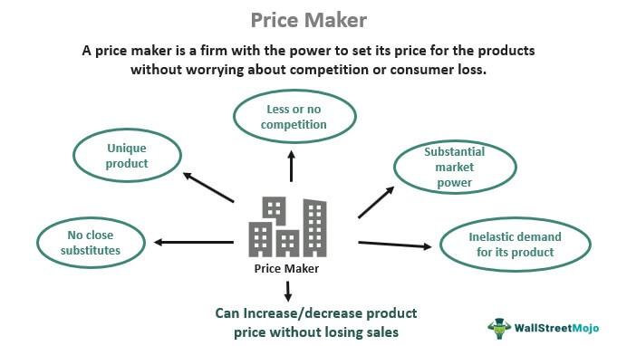

Economics is characterized by the interplay of various forces, with market power, price-making capabilities, and algorithmic trading standing out as pivotal elements. Market power, the ability of a firm to influence the prices of goods and services, directly impacts competitive dynamics and market equilibria. Companies capable of making pricing decisions possess an advantage, often leading to greater profits and market control, which in turn shapes entire industries' competitive landscapes.

Price-making capabilities relate to how firms determine prices based on various internal and external factors, including production costs, consumer demand, and competitive pressures. The ability to set prices above the competitive equilibrium without losing a substantial market share grants firms significant influence over economic outcomes. Such strategic pricing is crucial for industries where differentiation and brand strength are vital, as demonstrated by technology giants like Apple and resource-centric sectors like the oil industry.



Algorithmic trading, leveraging sophisticated algorithms for executing trades, revolutionizes financial markets by enhancing efficiency and liquidity. By minimizing human error and reducing transaction costs, algorithmic trading contributes to more streamlined market operations. However, it also introduces new challenges, such as potential increases in market volatility due to rapid, automated decision-making processes.

This article aims to examine the interactions of market power, price-making capabilities, and algorithmic trading, shedding light on their collective impact on market dynamics and pricing strategies. Understanding these relationships is essential for both policymakers and market participants seeking to navigate and influence the ever-evolving economic landscape.

## Table of Contents

## Understanding Market Power

Market power is a fundamental concept in economics, reflecting the ability of a firm to influence the price and output of goods or services in the market. It deviates from the ideal of perfect competition, where many small firms compete, none having any control over the market price. A firm with significant market power can set prices above marginal cost, thereby increasing its profit margins. This capability can profoundly shape competitive landscapes and economic strategies across various industries.

Market power arises from several factors, including brand loyalty, economies of scale, control over essential resources, or proprietary technology. It allows a company not only to influence prices but also to dictate terms to suppliers and customers. As a result, firms with market power can act as price makers rather than price takers.

Apple Inc. serves as a prominent example of market power within the technology sector. Through innovation, brand strength, and a robust ecosystem connecting its hardware, software, and services, Apple has developed a strong competitive position. The company's ability to command premium prices for its products highlights its significant pricing power, underpinning its sustained profitability and market influence. For instance, despite offering higher-priced products compared to competitors, Apple's loyal customer base continues to drive substantial sales volumes, reflecting its effective leverage of market power.

In summary, market power plays a crucial role in defining competitive landscapes and influencing economic outcomes. It allows firms to deviate from competitive pricing structures, often resulting in higher profits and stronger market positions. Understanding the mechanisms and implications of market power is essential for analyzing industry dynamics and competition.

## Economic Influence and Pricing Power

Pricing power is a critical aspect of economic influence, enabling firms to set prices above the competitive market equilibrium without losing their market share. This ability often hinges on a combination of factors, including resource scarcity, consumer demand, brand loyalty, and market structure. Companies endowed with significant pricing power can influence their industry's competitive dynamics by setting prices that optimize their profitability while maintaining or even enhancing their market position.

Resource scarcity plays a pivotal role in determining pricing power. In markets where the availability of essential inputs is limited, firms controlling these resources can exercise considerable pricing leverage. For example, the oil industry exemplifies how scarcity can be converted into economic influence. Oil companies, often operating as part of a broader oligopoly, can manipulate production levels to influence global oil prices. The Organization of the Petroleum Exporting Countries (OPEC) regularly adjusts member countries' output, thereby impacting supply and driving prices. This strategic manipulation underscores how resource control translates into pricing power.

Consumer demand is another crucial determinant of pricing power. Companies that cultivate strong brand loyalty and create high consumer demand for their products can sustain higher prices without significant reductions in sales [volume](/wiki/volume-trading-strategy). Apple Inc. serves as a prime example in this context. Through innovative product design, a robust brand image, and a loyal customer base, Apple has positioned itself to charge premium prices for its products, such as the iPhone, while maintaining a substantial market share. The company's ability to do so lies in its strong brand equity, effectively insulating it from the competitive pressures that might otherwise force prices to decline.

Mathematically, pricing power can be understood as the firm's ability to maintain a markup over its marginal cost, a concept captured by the Lerner Index:

$$
\text{Lerner Index} = \frac{P - MC}{P}
$$

where $P$ is the price set by the firm and $MC$ is the marginal cost of production. A higher Lerner Index indicates greater pricing power, as the firm can impose a higher markup above its costs.

In conclusion, economic influence, manifesting through pricing power, allows firms to transcend typical competitive constraints, securing advantageous pricing strategies that drive sustained profitability. By effectively leveraging factors such as resource scarcity and consumer demand, companies in industries like technology and oil continue to dominate their respective markets, illustrating the substantial impact of pricing power in shaping economic landscapes.

## Algorithmic Trading and Market Dynamics

Algorithmic trading involves the use of complex algorithms to automate the process of executing trades across financial markets. These algorithms are designed to analyze an array of market variables, such as price movements, trading volumes, and time intervals, to make decisions about buying or selling financial instruments. One of the primary advantages of [algorithmic trading](/wiki/algorithmic-trading) is its ability to enhance market efficiency by executing trades at speeds and frequencies that are impossible for human traders.

The implementation of algorithmic trading significantly reduces human error since decisions are made based on predetermined criteria and computational precision. This method also lowers transaction costs by minimizing the need for manual intervention and optimizing trade execution. Furthermore, algorithmic trading contributes to improved [liquidity](/wiki/liquidity-risk-premium) within financial markets, as it facilitates a higher volume of trades, ensuring that buyers and sellers can transact assets more quickly and at pricing closer to their ideal conditions.

Despite its benefits, algorithmic trading does introduce challenges, particularly concerning increased market [volatility](/wiki/volatility-trading-strategies). The very nature of automated trading systems, with their rapid response times, can contribute to substantial short-term fluctuations in asset prices. For instance, the quick execution of large orders by algorithms can lead to significant swings in market prices, sometimes causing a cascade of automated transactions that exacerbate volatility. A notable example of this phenomenon is the "flash crash" of May 6, 2010, when major U.S. stock indices experienced a rapid decline followed by a quick recovery within minutes, partly attributed to high-frequency trading algorithms.

Moreover, the competitive landscape of algorithmic trading demands that firms continually refine their algorithms to account for ever-evolving market conditions. This necessity drives the development of increasingly sophisticated models that incorporate advanced [machine learning](/wiki/machine-learning) techniques and real-time data analytics. As a result, firms in this space regularly invest in technological infrastructure and expertise to maintain their competitive edge.

Algorithmic trading's role in market dynamics exemplifies the intersection of technology and financial strategy, balancing the advantages of efficiency and liquidity with the potential for increased volatility. This balance challenges financial firms and regulators alike to adapt and evolve with the rapidly changing technological landscape.

## Integrating Concepts: Market Power and Algorithmic Trading

The integration of market power and algorithmic trading underscores a transformative phase in financial markets where technology plays a pivotal role in pricing strategies. Dominant firms leverage algorithmic trading to sustain and enhance their market authority. By deploying sophisticated algorithms, these firms can automate trading strategies, rapidly respond to market changes, and optimize decision-making processes to their advantage. This technological edge enables them to manage and manipulate pricing structures efficiently, maintaining a competitive position.

Algorithmic trading operates by executing trades at high speed and frequency based on predefined conditions. For example, a firm might use a machine learning model to predict stock price movements and trade accordingly. Below is a simple Python example illustrating how a firm might use a basic algorithm to determine trading actions based on historical data:

```python
import pandas as pd
from sklearn.linear_model import LinearRegression

# Load historical stock data
data = pd.read_csv('stock_prices.csv')
features = data[['feature1', 'feature2']]  # Assume these are relevant indicators
target = data['stock_price']

# Train a linear regression model
model = LinearRegression()
model.fit(features, target)

# Predict the next price movement
next_features = [[value1, value2]]  # Example new data
predicted_price = model.predict(next_features)

# Decide trading action
if predicted_price > target.iloc[-1]:
    action = "Buy"
else:
    action = "Sell"

print(f"Predicted Price: {predicted_price}, Action: {action}")
```

For dominant firms, algorithmic trading amplifies their pricing power due to their ability to process and analyze vast amounts of data swiftly. This creates an environment where they can effectively anticipate and influence market trends, a luxury smaller firms may not afford. As a result, smaller firms face significant challenges when competing against larger entities with substantial resources invested in algorithmic trading.

To remain competitive, smaller firms must adopt strategic adaptations. These include investing in technology to enhance their trading systems, forming partnerships, or focusing on niche markets where they can leverage unique insights unappreciated by larger competitors. Furthermore, regulatory policies may need to evolve to ensure fair trading practices and prevent market manipulation by powerful firms using algorithmic strategies.

In summary, the intersection of market power and algorithmic trading significantly impacts how firms operate within financial markets. Dominant firms exploit these tools to fortify their market positions, while smaller competitors must innovate and adapt to survive in an increasingly technology-driven trading environment.

## Conclusion

Economic influence, market power, pricing power, and algorithmic trading collectively drive the dynamics within modern financial markets. These elements, intertwined and mutually reinforcing, have significant implications for how markets function and how firms compete within them.

Technological advancement continues to be a pivotal [factor](/wiki/factor-investing) shaping these dynamics. The rise of algorithmic trading exemplifies how technology can enhance market efficiency by reducing human error and transaction costs, while also impacting liquidity [Hendershott et al., 2011]. However, this technology-driven market evolution does not come without challenges. Algorithmic trading, for instance, can increase market volatility, posing risks that stakeholders must navigate effectively.

Regulatory frameworks also play an essential role in moderating these interactions to ensure fair competition and market stability. As companies like Apple demonstrate considerable market power, regulatory bodies must ensure competitive landscapes are not distorted to the detriment of consumers and smaller market participants. Regulations are crucial in curbing any excessive pricing power that can arise when firms leverage algorithmic strategies to strengthen their market positions.

In light of these evolving dynamics, stakeholders—including businesses, investors, and regulators—must remain vigilant and informed. Businesses need to adapt by developing strategic innovations and competitive intelligence to harness market power effectively. For investors, understanding these elements can lead to more informed decision-making, while regulators must balance fostering innovation with protecting market integrity.

Leveraging these interrelated factors strategically can yield competitive advantages, enabling stakeholders to navigate the complex and ever-changing landscape of financial markets. As technology and regulation evolve, the ability to adapt will be critical for sustaining competitive strength in a rapidly shifting economic environment.

## References & Further Reading

- Posner, R. A. (2001). *Antitrust Law, Second Edition*. University of Chicago Press. This book offers a comprehensive analysis of antitrust laws, exploring the balance between competitive practices and legal regulations that prevent market dominance tactics that might harm consumer interests. Posner’s work is critical for understanding how legal frameworks are designed to control market power.

- Stigler, G. J. (1964). "A Theory of Oligopoly." *The Quarterly Journal of Economics*. Stigler’s influential work on oligopoly theory provides insights into how market power can be concentrated among a few firms, which impacts pricing and competitive strategies. This paper lays the foundation for understanding the dynamics within industries where few firms hold significant influence.

- Hendershott, T., Jones, C. M., & Menkveld, A. J. (2011). "Does Algorithmic Trading Improve Liquidity?" *The Review of Financial Studies*. This study examines the effects of algorithmic trading on market liquidity, offering empirical evidence on its benefits and challenges. It explores how such trading strategies can reduce transaction costs and improve market efficiency, while also presenting risks related to market stability.