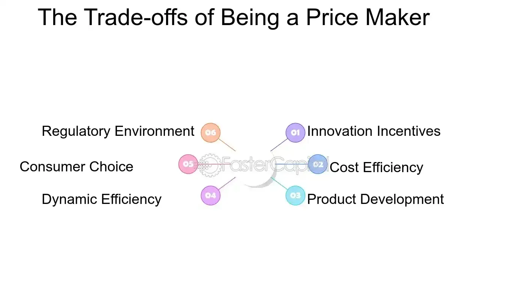

## Table of Contents

## What is a price maker?

A price maker is a company or business that has the power to set the price of its products or services. This means they can decide how much to charge without being influenced too much by what other companies are doing. Usually, a price maker has a strong position in the market, maybe because they offer something unique or because they are well-known and trusted by customers.

Being a price maker can be good for a business because it lets them control their profits. If they think their product is special or if people really want it, they can charge more and make more money. However, being a price maker also means they need to keep making good products or services. If they don't, people might stop buying from them, and then they could lose their power to set prices.

## How does a price maker differ from a price taker?

A price maker is a business that can decide how much to charge for its products or services. They have the power to set prices because they might have something special that others don't, or because people really like and trust them. This means they can make more money if they think their product is worth more. But, they need to keep making good things because if they don't, people might stop buying from them.

On the other hand, a price taker is a business that has to go along with the prices that are already set in the market. They don't have the power to change prices because there are many other businesses selling similar things. If a price taker tries to charge more, people will just buy from someone else. So, they have to accept the market price and can't make as much money as a price maker.

In simple terms, a price maker can choose its prices and has more control over its profits, while a price taker has to follow the market and has less control over how much money it makes.

## What are the basic characteristics of a price maker?

A price maker is a business that can decide how much to charge for what it sells. They have this power because they might have something special that others don't, or because people really like and trust them. This means they can make more money if they think their product is worth more. For example, if a company makes a unique phone that everyone wants, they can set a high price because people will still buy it.

However, being a price maker comes with responsibilities. They need to keep making good products or services because if they don't, people might stop buying from them. If a price maker starts to lose its special place in the market, it might turn into a price taker, which means they'll have to follow the market prices instead of setting their own. So, a price maker needs to always be on top of their game to keep their power to set prices.

## In which market structures can price makers operate?

Price makers can operate in market structures where they have a lot of control over prices. The main types of these markets are monopolies and oligopolies. In a monopoly, there's only one company selling a product or service, so they can set the price because people have no other choice. An example is a local utility company that's the only one providing electricity in an area. In an oligopoly, there are just a few big companies that control most of the market. They can also act as price makers because they are big and powerful, and they might work together to keep prices high. Car manufacturers are often in an oligopoly.

In these market structures, price makers have the advantage because they can decide how much to charge. This means they can make more money if they think their product is special or if people really want it. But they have to be careful. If they set prices too high, or if a new company comes in with a better product, they might lose their power to set prices. So, being a price maker is good, but it also means they need to keep making good products and watching the market closely.

## What are the advantages of being a price maker?

Being a price maker has some big advantages. One of the main ones is that price makers can decide how much to charge for their products or services. This means they can make more money if they think their product is special or if people really want it. For example, if a company makes a unique phone that everyone wants, they can set a high price because people will still buy it. This control over pricing lets them plan their profits better and keep their business strong.

Another advantage is that price makers can shape how people see their products. By setting higher prices, they can make people think their product is better quality or more special. This can help them build a strong brand that people trust and like. It also means they don't have to compete as much on price with other companies, which can be a big relief. They can focus more on making their products even better instead of always trying to be the cheapest.

## What are the potential challenges faced by price makers?

One challenge for price makers is keeping their special place in the market. If they start to lose what makes them unique, or if other companies come up with better products, people might stop buying from them. This can happen if they don't keep making good things or if they set prices too high and people decide it's not worth it. So, price makers need to always be on top of their game and keep an eye on what other companies are doing.

Another challenge is dealing with regulations. Sometimes, the government might step in and say a price maker can't charge too much, especially if they think it's not fair to customers. This can make it harder for price makers to keep their profits high. They might also have to deal with people complaining about high prices or even other companies trying to break into their market and take some of their customers. So, even though being a price maker has advantages, it also comes with a lot of responsibility and challenges.

## How does the legal framework affect price makers?

The legal framework can have a big impact on price makers. Governments might set rules to stop price makers from charging too much, especially if they think it's not fair to customers. These rules are meant to protect people from being overcharged and to keep the market fair. For example, a government might say that a company can't raise prices too quickly or too much, or they might even set a maximum price for certain products. This can make it harder for price makers to keep their profits high because they have to follow these rules.

Price makers also have to deal with laws about competition. If a price maker is too powerful and starts to hurt other businesses, the government might step in to stop them. They might do things like breaking up a big company into smaller ones or making sure that price makers don't work together to keep prices high. This can make it tough for price makers because they have to be careful not to break any laws while still trying to make money. So, the legal framework can limit what price makers can do and how much they can charge.

## What are the key regulations that price makers must comply with?

Price makers have to follow rules set by the government to make sure they don't charge too much or hurt other businesses. One big rule is about price controls. This means the government might set a highest price that a price maker can charge for something. They do this to protect people from being overcharged and to keep the market fair. For example, if a price maker tries to raise the price of a medicine too much, the government might step in and say they can't do that.

Another important rule is about competition. Governments want to make sure that no one company gets too powerful and starts to hurt smaller businesses. So, they might make laws to stop price makers from working together to keep prices high. They might also break up a big company into smaller ones if they think it's too powerful. This can make it hard for price makers because they have to be careful not to break any rules while still trying to make money.

## How do antitrust laws impact the operations of price makers?

Antitrust laws are rules that stop companies from getting too powerful and hurting other businesses or customers. For price makers, these laws can make it hard to keep their high prices and control over the market. If a price maker tries to work with other companies to keep prices high, antitrust laws might stop them. The government can also break up a big company into smaller ones if they think it's too powerful. This means price makers have to be careful not to break these rules while still trying to make money.

These laws also make sure that price makers don't use their power to stop new companies from coming into the market. If a price maker tries to do things like buying up all the suppliers or making deals that keep other companies out, antitrust laws can step in. This can limit what price makers can do and how they can grow their business. So, while being a price maker has advantages, they have to follow these rules to keep the market fair for everyone.

## What are some examples of legal cases involving price makers?

One famous example of a legal case involving a price maker is the United States vs. Microsoft Corporation in the late 1990s. Microsoft was a big company that made the Windows operating system, and they were accused of using their power to hurt other companies. The government said Microsoft was making deals that stopped other companies from selling their products. In the end, the court decided that Microsoft had to change how they did business to make the market fairer.

Another example is the case against De Beers, a company that controlled most of the world's diamond supply. For a long time, De Beers was able to set high prices for diamonds because they were the only ones selling them. But, in the early 2000s, the U.S. government said De Beers was breaking antitrust laws by working with other companies to keep diamond prices high. De Beers had to pay a big fine and change how they sold diamonds to follow the rules.

These cases show how the law can stop price makers from using their power in ways that hurt other businesses or customers. Governments want to make sure that the market is fair for everyone, so they use laws to make sure price makers don't get too powerful.

## How can price makers strategically use pricing to maintain market power?

Price makers can use pricing in smart ways to keep their power in the market. One way is by setting prices that show their product is special or of high quality. If people think a product is worth more because it costs more, they might be willing to pay a higher price. This can help the price maker keep their profits high and make it hard for other companies to compete. Another way is by using discounts and promotions carefully. By offering special deals at the right times, a price maker can keep customers happy and coming back, but they can also keep their prices high most of the time to show that their product is still valuable.

Another strategy is to use pricing to keep new companies out of the market. If a price maker sets their prices low enough to make it hard for new companies to make money, it can stop them from coming in. This way, the price maker can keep their control over the market. But, they have to be careful not to set prices too low for too long, or they might lose money. So, price makers need to balance keeping their prices high to show their product's value with setting prices low enough to stop new competition. This careful use of pricing can help them stay strong in the market.

## What advanced economic theories explain the behavior of price makers in different market conditions?

One advanced economic theory that helps explain the behavior of price makers is the theory of monopolistic competition. This theory says that even if there are many companies in a market, each one can still be a price maker if they offer something a little different from others. For example, think of different brands of shampoo. Each brand might be a bit different, so they can set their own prices based on what makes them special. In this kind of market, price makers need to keep making their products better and different to keep their power to set prices. If they don't, other companies might take their customers away.

Another theory is the theory of oligopoly, which looks at markets where just a few big companies control most of the market. In an oligopoly, price makers can work together to keep prices high, but they have to be careful not to break any laws. They also need to watch what the other big companies are doing because if one company lowers its prices, the others might have to do the same to keep their customers. This can make the market tricky for price makers because they have to balance keeping their prices high with staying competitive. Both theories show that being a price maker means always having to think about how to keep your special place in the market.

## How do economic influence and pricing power impact each other?

Pricing power is a critical aspect of economic influence, enabling firms to set prices above the competitive market equilibrium without losing their market share. This ability often hinges on a combination of factors, including resource scarcity, consumer demand, brand loyalty, and market structure. Companies endowed with significant pricing power can influence their industry's competitive dynamics by setting prices that optimize their profitability while maintaining or even enhancing their market position.

Resource scarcity plays a pivotal role in determining pricing power. In markets where the availability of essential inputs is limited, firms controlling these resources can exercise considerable pricing leverage. For example, the oil industry exemplifies how scarcity can be converted into economic influence. Oil companies, often operating as part of a broader oligopoly, can manipulate production levels to influence global oil prices. The Organization of the Petroleum Exporting Countries (OPEC) regularly adjusts member countries' output, thereby impacting supply and driving prices. This strategic manipulation underscores how resource control translates into pricing power.

Consumer demand is another crucial determinant of pricing power. Companies that cultivate strong brand loyalty and create high consumer demand for their products can sustain higher prices without significant reductions in sales [volume](/wiki/volume-trading-strategy). Apple Inc. serves as a prime example in this context. Through innovative product design, a robust brand image, and a loyal customer base, Apple has positioned itself to charge premium prices for its products, such as the iPhone, while maintaining a substantial market share. The company's ability to do so lies in its strong brand equity, effectively insulating it from the competitive pressures that might otherwise force prices to decline.

Mathematically, pricing power can be understood as the firm's ability to maintain a markup over its marginal cost, a concept captured by the Lerner Index:

$$
\text{Lerner Index} = \frac{P - MC}{P}
$$

where $P$ is the price set by the firm and $MC$ is the marginal cost of production. A higher Lerner Index indicates greater pricing power, as the firm can impose a higher markup above its costs.

In conclusion, economic influence, manifesting through pricing power, allows firms to transcend typical competitive constraints, securing advantageous pricing strategies that drive sustained profitability. By effectively leveraging factors such as resource scarcity and consumer demand, companies in industries like technology and oil continue to dominate their respective markets, illustrating the substantial impact of pricing power in shaping economic landscapes.

## References & Further Reading

- Posner, R. A. (2001). *Antitrust Law, Second Edition*. University of Chicago Press. This book offers a comprehensive analysis of antitrust laws, exploring the balance between competitive practices and legal regulations that prevent market dominance tactics that might harm consumer interests. Posner’s work is critical for understanding how legal frameworks are designed to control market power.

- Stigler, G. J. (1964). "A Theory of Oligopoly." *The Quarterly Journal of Economics*. Stigler’s influential work on oligopoly theory provides insights into how market power can be concentrated among a few firms, which impacts pricing and competitive strategies. This paper lays the foundation for understanding the dynamics within industries where few firms hold significant influence.

- Hendershott, T., Jones, C. M., & Menkveld, A. J. (2011). "Does Algorithmic Trading Improve Liquidity?" *The Review of Financial Studies*. This study examines the effects of algorithmic trading on market liquidity, offering empirical evidence on its benefits and challenges. It explores how such trading strategies can reduce transaction costs and improve market efficiency, while also presenting risks related to market stability.

