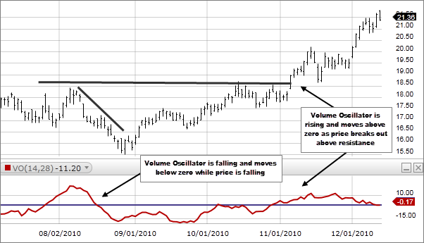

## Table of Contents

## What is a price movement in financial markets?

A price movement in financial markets refers to the change in the price of a financial asset, such as a stock, bond, or commodity, over a period of time. This can happen in short time frames, like seconds or minutes, or over longer periods like days, weeks, or even years. Price movements are influenced by many factors, including supply and demand, economic reports, company news, and overall market sentiment.

These movements are important because they help investors and traders make decisions about buying or selling assets. For example, if the price of a stock goes up, it might be a good time to sell if you think the price will soon go down. On the other hand, if the price is going down, it might be a good time to buy if you believe the price will eventually go back up. Understanding price movements can help people make more informed choices and potentially earn more money in the financial markets.

## How does volume relate to price movements?

Volume is the number of shares or contracts traded in a market during a given time. It's important because it shows how many people are interested in buying or selling a certain asset. When the volume is high, it means a lot of people are trading, and this can make price movements bigger and faster. If a stock's price goes up and the volume is high, it suggests that many people believe the price will keep going up, so they are buying more.

On the other hand, if the volume is low, price movements might be smaller and slower. A small change in price with low volume might not mean much because not many people are trading. But if a big price change happens with low volume, it could be a sign that the market might change direction soon. So, volume helps us understand if a price movement is strong or if it might not last long.

## What is a volume oscillator and how is it calculated?

A volume oscillator is a tool that traders use to see how the trading volume is changing over time. It helps them understand if more people are buying or selling compared to before. The volume oscillator does this by comparing the volume from the most recent trading days to the volume from a longer period. If the recent volume is higher, it might mean more people are interested in the stock, and if it's lower, it could mean fewer people are interested.

To calculate a volume oscillator, you need to pick two time periods: a short one and a longer one. You then find the average volume for each of these periods. The short period could be something like the last 5 days, and the long period could be the last 20 days. Once you have these averages, you subtract the long period average from the short period average. This difference is the volume oscillator value. If it's positive, it means the recent volume is higher than the longer-term average, and if it's negative, the recent volume is lower.

## Can you explain the basic concept of using volume oscillators to analyze price movements?

Volume oscillators help traders understand how people are feeling about a stock by looking at how much it's being traded. If the volume oscillator is positive, it means more people are trading the stock recently than they were over a longer time. This can be a sign that more people are interested in the stock, and it might make the price go up. On the other hand, if the volume oscillator is negative, it means fewer people are trading the stock recently, which could mean less interest and might make the price go down.

By watching the volume oscillator, traders can get clues about what might happen to the price next. For example, if the volume oscillator starts going up and the price is also going up, it could mean the price will keep going up because more people are buying. But if the volume oscillator goes down while the price is still going up, it might mean the price increase won't last long because fewer people are trading. So, volume oscillators are a helpful tool to see if a price movement is strong or if it might change soon.

## What are the most common types of volume oscillators used by traders?

The most common types of volume oscillators that traders use are the Volume Rate of Change (VROC) and the On-Balance Volume (OBV). The VROC measures how much the trading volume has changed over a certain time. It does this by taking the volume from a recent period and comparing it to the volume from an earlier period. If the VROC is going up, it means the volume is increasing, which could mean more people are interested in the stock. If it's going down, it means the volume is decreasing, and fewer people might be interested.

The On-Balance Volume (OBV) is another popular volume oscillator. It adds up the volume on days when the price goes up and subtracts the volume on days when the price goes down. If the OBV is going up, it means that more volume is happening on days when the price is going up, which can be a sign that the price might keep going up. If the OBV is going down, it means more volume is happening on days when the price is going down, which could mean the price might keep going down. Both the VROC and OBV help traders see if the volume is supporting the price movement or if it might change soon.

## How can beginners interpret the signals from volume oscillators?

For beginners, interpreting signals from volume oscillators can seem tricky at first, but it gets easier with practice. A volume oscillator like the Volume Rate of Change (VROC) shows how much trading volume has changed recently. If the VROC line is going up, it means more people are trading the stock than before. This can be a good sign if the stock's price is also going up, because it might mean the price will keep going up. But if the VROC is going down, it means fewer people are trading, which could be a warning sign if the price is still going up, as it might not last long.

Another common volume oscillator is the On-Balance Volume (OBV). The OBV adds up the volume on days when the stock price goes up and subtracts it on days when the price goes down. If the OBV line is going up, it's a good sign because it means more volume is happening on days when the price is going up. This can suggest that the price might keep going up. On the other hand, if the OBV line is going down, it means more volume is happening on days when the price is going down, which could mean the price might keep going down. By watching these volume oscillators, beginners can start to see if the volume is supporting the price movement or if it might change soon.

## What are the limitations of using volume oscillators in trading?

Volume oscillators can be useful tools for traders, but they have some limitations. One big problem is that they can give false signals. Sometimes, the volume oscillator might show that the volume is going up or down a lot, but the price might not move the way you expect. This can make traders make bad decisions if they only use the volume oscillator without looking at other things like the stock's price or news about the company.

Another limitation is that volume oscillators don't work the same way for every stock or market. What works well for one stock might not work for another. For example, a volume oscillator might be very helpful for a stock that a lot of people trade, but it might not be as useful for a stock that fewer people trade. So, traders need to be careful and not rely only on volume oscillators to make their trading decisions. They should use them along with other tools and information to get a better picture of what might happen to the price.

## How do volume oscillators help in identifying trend reversals?

Volume oscillators can help traders spot when a trend might be about to change direction, which is called a trend reversal. If the price of a stock has been going up, but the volume oscillator starts to go down, it could mean that fewer people are interested in buying the stock. This drop in volume might be a warning sign that the price increase won't last, and the trend could soon reverse and start going down. On the other hand, if the price has been going down and the volume oscillator starts to go up, it could mean more people are starting to buy the stock. This increase in volume might be a sign that the price could soon start going up, showing a possible trend reversal.

Using volume oscillators to find trend reversals isn't always easy because they can give false signals sometimes. Traders need to be careful and not just rely on the volume oscillator alone. They should also look at other things like the stock's price movements, news about the company, and other trading tools to get a better idea of what might happen next. By combining the signals from the volume oscillator with other information, traders can make smarter decisions about when a trend might be about to change direction.

## Can you discuss the integration of volume oscillators with other technical indicators?

Volume oscillators work well when used with other technical indicators to help traders understand what might happen to a stock's price. One common way to use volume oscillators is with moving averages. A moving average is a line that shows the average price of a stock over a certain time. If the volume oscillator starts to go up and the price is above the moving average, it could be a strong sign that the price might keep going up. But if the volume oscillator goes down and the price is below the moving average, it might mean the price could keep going down.

Another useful combination is using volume oscillators with the Relative Strength Index (RSI). The RSI is a tool that shows if a stock is being bought or sold too much, which can help traders know if the price might change soon. If the volume oscillator and the RSI are both going up, it could mean the stock's price might keep going up because more people are buying it. But if the volume oscillator is going down and the RSI is high, it might mean the price could soon go down because the stock might be overbought. By looking at both the volume oscillator and other indicators, traders can get a better idea of what might happen next with the stock's price.

## What advanced strategies involve the use of volume oscillators for expert traders?

Expert traders often use volume oscillators in more advanced ways to get a better understanding of the market. One strategy is to use volume oscillators to confirm or question other signals they see. For example, if a trader sees a [breakout](/wiki/breakout-trading) in the stock's price, they might look at the volume oscillator to see if the volume is also going up. If it is, it can make them more confident that the breakout is real and the price might keep going up. But if the volume oscillator is going down during the breakout, it might make them think the breakout won't last long and the price could go back down.

Another advanced strategy is to use volume oscillators to find divergences. A divergence happens when the price of a stock is moving one way, but the volume oscillator is moving the other way. For example, if the stock's price is going up but the volume oscillator is going down, it could be a sign that the price increase might not last. Expert traders might use this information to sell the stock before the price goes down. They might also look for the opposite situation, where the price is going down but the volume oscillator is going up, which could be a sign that the price might soon start going up again. By combining these strategies with other tools and their own experience, expert traders can make smarter decisions about when to buy and sell stocks.

## How do different market conditions affect the reliability of volume oscillators?

Different market conditions can change how well volume oscillators work. In a strong bull market, where prices are going up a lot, volume oscillators can be very helpful. When the volume oscillator goes up along with the price, it can mean that the price will keep going up because more people are buying. But in a bear market, where prices are going down, the volume oscillator might not be as useful. If the volume oscillator goes up but the price keeps going down, it might just mean more people are selling, not that the price will go back up soon.

In a sideways market, where the price isn't going up or down much, volume oscillators can be tricky. Sometimes, the volume oscillator might go up or down a lot, but the price doesn't change much. This can make it hard to know what the volume oscillator is trying to say. In these markets, it's really important for traders to use the volume oscillator with other tools, like looking at the stock's price or news about the company, to get a better idea of what might happen next.

## What are some real-world examples where volume oscillators significantly predicted price movements?

In early 2020, when the stock market was going through a lot of ups and downs because of the start of the COVID-19 pandemic, volume oscillators helped traders see what might happen next. For example, in March 2020, the S&P 500 was going down a lot, but then the volume oscillator for the index started going up. This showed that more people were starting to buy the stocks in the index even though the price was still going down. Traders who saw this might have guessed that the price would soon start going back up, and they were right. By the end of March, the S&P 500 started to go up again, and it kept going up for a while after that.

Another example happened with Tesla stock in late 2021. The stock's price had been going up a lot, but then the volume oscillator started to go down. This was a sign that fewer people were buying Tesla stock even though the price was still going up. Traders who noticed this might have decided to sell their Tesla stock before the price went down. Sure enough, in early 2022, Tesla's stock price started to drop. By using the volume oscillator, traders could see that the big price increase might not last and could make smart choices about when to sell.

## What are Volume Oscillators and how do they work?

Volume oscillators are technical indicators used in stock trading to evaluate the behavior of trading volume over time. They are constructed by calculating the difference between two moving averages of trade volume over a defined period. This method helps in highlighting volume trends that might not be immediately apparent when only raw volume data is used. 

The primary function of volume oscillators is to provide insights into the shifts in buying and selling pressure, which can either confirm ongoing trends or indicate potential trend reversals. This capability makes them valuable tools for traders looking to understand market sentiment and [momentum](/wiki/momentum).

### Calculation and Interpretation

Volume oscillators are typically calculated using two moving averages of [volume](/wiki/volume-trading-strategy): a short-term and a long-term. The difference between these two moving averages represents the value of the oscillator:

$$

\text{Volume Oscillator} = \left(\frac{\text{Short-term Moving Average} - \text{Long-term Moving Average}}{\text{Long-term Moving Average}}\right) \times 100
$$

This formula presents the oscillator as a percentage, facilitating its interpretation across different stocks and timeframes.

### Plotting on a Chart

When plotted as a line on a chart beneath the price action, volume oscillators fluctuate above and below a zero line. Positive values suggest that the short-term volume is stronger than the long-term volume, typically interpreted as buying pressure. Conversely, negative values indicate stronger long-term volume, often considered a sign of selling pressure. 

Fluctuations around the zero line can reveal market strength or weakness: 

- **Above Zero**: Indicates potential bullish momentum as recent volume surpasses the historical average.
- **Below Zero**: Signals potential bearish sentiment with volume diminishing relative to the long-term average.

### Differences from Simple Volume Indicators

While simple volume indicators only reflect the total number of shares traded over a specific period, volume oscillators provide a comparative view of recent volume activity against a historical benchmark. This differentiation helps traders to not only observe volume magnitude but also understand its placement within a historical context.

### Advantages of Using Volume Oscillators

The main advantage of volume oscillators lies in their ability to smooth out erratic volume spikes that might obscure longer-term trends. By focusing on the difference in moving averages, traders can better discern genuine changes in market conditions from noise.

Moreover, volume oscillators can serve as a complementary tool alongside other indicators, such as price charts or the Relative Strength Index (RSI), enhancing overall analysis by adding a volume-based dimension to market sentiment insights. This integration allows for a more robust trading strategy, leading to informed decision-making and potentially better trading outcomes.

## References & Further Reading

[1]: Bergstra, J., Bardenet, R., Bengio, Y., & Kégl, B. (2011). ["Algorithms for Hyper-Parameter Optimization."](https://dl.acm.org/doi/10.5555/2986459.2986743) Advances in Neural Information Processing Systems 24.

[2]: ["Advances in Financial Machine Learning"](https://www.amazon.com/Advances-Financial-Machine-Learning-Marcos/dp/1119482089) by Marcos Lopez de Prado

[3]: ["Evidence-Based Technical Analysis: Applying the Scientific Method and Statistical Inference to Trading Signals"](https://www.amazon.com/Evidence-Based-Technical-Analysis-Scientific-Statistical/dp/0470008741) by David Aronson

[4]: ["Machine Learning for Algorithmic Trading"](https://github.com/stefan-jansen/machine-learning-for-trading) by Stefan Jansen

[5]: ["Quantitative Trading: How to Build Your Own Algorithmic Trading Business"](https://www.amazon.com/Quantitative-Trading-Build-Algorithmic-Business/dp/1119800064) by Ernest P. Chan