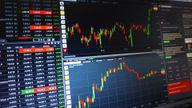

In stock market trading, understanding the interplay between volume and price movements is crucial for making informed trading decisions. Volume oscillators serve as a vital tool in analyzing these interactions, providing traders with valuable insights into market momentum and potential reversals. By focusing on the differences between two moving averages of trade volume over a specified period, volume oscillators highlight shifts in buying and selling pressures that can confirm or suggest trend reversals.

Volume oscillators are relevant not only for seasoned traders but also for novices seeking to enhance their market analysis techniques. These indicators help bridge the gap between theoretical knowledge and practical application, making them indispensable in algorithmic trading where speed and precision are paramount.



The use of volume oscillators can reveal significant insights into market behavior, offering traders a deeper understanding of the forces driving price changes. Whether forecasting potential market trends or confirming existing ones, integrating volume oscillators into a trading strategy can greatly improve decision-making processes. As we explore further, one will discover how volume oscillators function within stock trading and the advantages they offer in augmenting traditional trading strategies.

## Table of Contents

## Understanding Volume Oscillators

Volume oscillators are technical indicators used in stock trading to evaluate the behavior of trading volume over time. They are constructed by calculating the difference between two moving averages of trade volume over a defined period. This method helps in highlighting volume trends that might not be immediately apparent when only raw volume data is used. 

The primary function of volume oscillators is to provide insights into the shifts in buying and selling pressure, which can either confirm ongoing trends or indicate potential trend reversals. This capability makes them valuable tools for traders looking to understand market sentiment and momentum.

### Calculation and Interpretation

Volume oscillators are typically calculated using two moving averages of [volume](/wiki/volume-trading-strategy): a short-term and a long-term. The difference between these two moving averages represents the value of the oscillator:

$$

\text{Volume Oscillator} = \left(\frac{\text{Short-term Moving Average} - \text{Long-term Moving Average}}{\text{Long-term Moving Average}}\right) \times 100
$$

This formula presents the oscillator as a percentage, facilitating its interpretation across different stocks and timeframes.

### Plotting on a Chart

When plotted as a line on a chart beneath the price action, volume oscillators fluctuate above and below a zero line. Positive values suggest that the short-term volume is stronger than the long-term volume, typically interpreted as buying pressure. Conversely, negative values indicate stronger long-term volume, often considered a sign of selling pressure. 

Fluctuations around the zero line can reveal market strength or weakness: 

- **Above Zero**: Indicates potential bullish momentum as recent volume surpasses the historical average.
- **Below Zero**: Signals potential bearish sentiment with volume diminishing relative to the long-term average.

### Differences from Simple Volume Indicators

While simple volume indicators only reflect the total number of shares traded over a specific period, volume oscillators provide a comparative view of recent volume activity against a historical benchmark. This differentiation helps traders to not only observe volume magnitude but also understand its placement within a historical context.

### Advantages of Using Volume Oscillators

The main advantage of volume oscillators lies in their ability to smooth out erratic volume spikes that might obscure longer-term trends. By focusing on the difference in moving averages, traders can better discern genuine changes in market conditions from noise.

Moreover, volume oscillators can serve as a complementary tool alongside other indicators, such as price charts or the Relative Strength Index (RSI), enhancing overall analysis by adding a volume-based dimension to market sentiment insights. This integration allows for a more robust trading strategy, leading to informed decision-making and potentially better trading outcomes.

## Analyzing Price Movements with Volume Oscillators

In the intricate relationship between volume and price, volume oscillators serve as a vital tool for validating price movements and uncovering false trends. These oscillators help traders confirm market directions and assess the authenticity of a price trend, making them an integral part of technical analysis. By analyzing the variations in volume, traders gain insights into market [momentum](/wiki/momentum) and potential reversals, thereby enhancing their decision-making process.

Volume oscillators operate by evaluating the changes in buying and selling pressure, often revealed through the expansion and contraction of volume. In a trending market, a rising volume oscillator can confirm the strength of a price trend, while a declining one may suggest weakening momentum. Conversely, in a range-bound market, volume oscillators can help identify the likelihood of a [breakout](/wiki/breakout-trading) or breakdown. For instance, an increase in volume accompanied by a volume oscillator reaching a high point could indicate a forthcoming breakout, signaling traders to anticipate a potential shift in market dynamics.

Practical examples illustrate how volume oscillators signal key changes in market behavior. Consider a stock chart where the price is rising, yet the volume oscillator exhibits a downward trend. This divergence might indicate a weakening trend, suggesting that the price increase might not be sustainable. Such an analysis can prompt traders to be cautious, avoiding potential false trends.

In another scenario, if a stock experiences a sudden increase in volume alongside a rising volume oscillator, this aligns both volume and price, confirming the strength of the move. This alignment often indicates a genuine trend, giving traders confidence in their positioning. The significance of context cannot be overstated; analyzing volume oscillators requires considering broader market conditions and other technical indicators to derive accurate conclusions.

Real-world stock market charts further demonstrate the application of volume oscillators. For instance, during earnings announcements, significant volume changes often occur. A well-timed analysis using volume oscillators reveals whether these changes reflect genuine market interest or are merely speculative. Traders can integrate these insights into their strategies, refining their entry and [exit](/wiki/exit-strategy) points based on confirmed trends rather than mere conjecture.

Incorporating volume oscillators into trading strategies ensures a more rounded approach to market analysis. Understanding the dynamics between volume and price enhances a trader's ability to dissect market movements critically, leading to more informed and potentially successful trading decisions.

## Algorithmic Trading and Volume Oscillators

In [algorithmic trading](/wiki/algorithmic-trading), volume oscillators play an essential role in providing automated insights that enhance trading strategies' speed and efficiency. These oscillators are particularly useful for algorithms because they can quantify trading volume trends, enabling automated systems to identify potential buy or sell signals with greater assurance. Volume oscillators measure the difference between two moving averages of volume, thus capturing shifts in market sentiment that are not always visible through price data alone.

Algorithms integrate volume oscillators to improve decision-making by automatically interpreting their signals to execute trades. For example, a sudden surge in volume can indicate increased investor interest that may precede a significant price movement. By incorporating volume oscillators into their frameworks, trading algorithms can either reinforce the current trading strategy or alert the system to potential adjustments, thereby optimizing trade entries or exits.

The integration of volume oscillators into trading algorithms can be particularly beneficial when aligned with [machine learning](/wiki/machine-learning) models. These models can be trained to recognize complex patterns in the data, thus refining the oscillator signals into predictive tools for market trends. However, one of the primary challenges lies in the algorithm's ability to discern genuine signals from noise. Overfitting, where a model becomes too tailored to historical data and loses generality in application, is a common pitfall. To mitigate such challenges, robust model validation and [backtesting](/wiki/backtesting) are crucial.

To illustrate the efficacy of volume oscillators in algorithmic trading, various case studies have demonstrated their impact. For instance, an algorithmic trading system might utilize a volume oscillator to anticipate breakout movements in equity markets. By setting predefined thresholds, the system could automatically buy or sell stocks when the oscillator indicates a significant volume increase, combined with other confirming technical indicators, leading to enhanced predictive accuracy and trading performance.

In Python, integrating volume oscillators might look like this:

```python
import numpy as np

def volume_oscillator(volume_data, short_window, long_window):
    short_avg = np.convolve(volume_data, np.ones(short_window) / short_window, mode='valid')
    long_avg = np.convolve(volume_data, np.ones(long_window) / long_window, mode='valid')
    volume_osc = short_avg[-len(long_avg):] - long_avg
    return volume_osc

# Example usage
volume_data = np.array([100, 120, 140, 160, 180, 200]) # hypothetical volume data
short_window = 2
long_window = 4
vo = volume_oscillator(volume_data, short_window, long_window)
print(vo)
```

This code snippet demonstrates the calculation of a volume oscillator using simple moving averages to identify shifting market dynamics. The presented approach exemplifies how algorithms can operationalize this data to inform trading decisions, accommodate rapid responses to market changes, and ultimately enhance algorithmic trading efficacy.

## Common Strategies Using Volume Oscillators

Traders employ various strategies using volume oscillators to enhance their market analysis and trading decisions. One common approach is divergence trading, where traders look for discrepancies between the price movement of a security and its accompanying volume oscillator. A divergence occurs when the price of a security moves in the opposite direction of the volume oscillator. For example, a bullish divergence is observed when the price makes a new low, but the volume oscillator forms a higher low, suggesting a potential market reversal to the upside. Conversely, a bearish divergence occurs when the price reaches a new high, but the volume oscillator forms a lower high, indicating a possible downward reversal. These divergence signals can be critical for identifying potential turning points in the market.

Volume oscillators are also used in conjunction with other technical indicators such as moving averages and the Relative Strength Index (RSI) to confirm trends and refine entry and exit points. For instance, when a moving average crossover coincides with a significant change in the volume oscillator, it may confirm a trend's direction. Similarly, an overbought or oversold RSI reading validated by corresponding volume oscillator signals can bolster the decision-making process. The synergy of these indicators provides traders with a multi-dimensional view of market conditions.

In breakout trading strategies, volume spikes as indicated by volume oscillators play a crucial role. When a security's price breaks through significant resistance or support levels, a concurrent spike in the volume oscillator can confirm the breakout's legitimacy. A valid breakout typically requires increased trading activity, and the volume oscillator helps in gauging this intensity. Traders might set conditions where a breakout signal is only considered valid if accompanied by a predetermined increase in the volume oscillator.

To integrate volume oscillators effectively into a trading arsenal, traders need to develop a nuanced understanding of their function and limitations. Backtesting strategies using historical data can help determine the optimal parameters for the volume oscillator and its integration with other indicators. By carefully constructing a comprehensive trading plan that includes volume oscillators, traders can improve their ability to anticipate market movements and make informed trading decisions.

## Benefits and Limitations of Volume Oscillators

Volume oscillators are instrumental tools in the analysis of stock market trends. They offer several benefits, making them a valuable resource for traders aiming to enhance their understanding of market movements. One primary advantage is their ability to improve trend analysis by providing insights into the underlying momentum of price movements. By analyzing the divergence between volume and price trends, traders can identify potential trading opportunities that might not be obvious through price data alone.

For instance, a key benefit of using volume oscillators is in trend confirmation. When a price trend is accompanied by a corresponding trend in volume oscillators, it often signifies the strength of the trend, implying that the ongoing movement is supported by substantive market activity. This correlation aids traders in making informed decisions about entering or exiting trades, potentially increasing the accuracy of trading signals.

However, volume oscillators are not without limitations. One significant drawback is that they can produce lagging signals. Since volume oscillators are often based on moving averages of trading volume, they may react slowly to sudden market changes, potentially causing traders to enter or exit positions late. This lag can result in missed opportunities or increased exposure to market risk.

Additionally, volume oscillators are susceptible to generating false positives, particularly in volatile or thinly traded markets. In such conditions, volume spikes or anomalies may lead to misleading signals, prompting traders to make ill-timed or erroneous trading decisions. The erratic nature of these markets can thus exaggerate the limitations of volume oscillators.

To mitigate these challenges, traders are advised to integrate volume oscillators with other technical indicators. Utilizing tools like moving averages, the Relative Strength Index (RSI), or trend lines can help validate the signals provided by volume oscillators, thereby reducing the likelihood of false signals. Traders can also customize the periods of moving averages used in the oscillators to better fit the specific market conditions, enhancing the responsiveness and accuracy of their analyses.

In conclusion, the effective use of volume oscillators requires a balanced approach. While they offer significant insights into market momentum and trend validation, it is crucial for traders to be aware of their limitations and employ them in conjunction with other analytical tools. By adopting a comprehensive strategy that accounts for these variables, traders can better harness the power of volume oscillators, leading to more proficient and successful trading outcomes.

## Conclusion

Volume oscillators offer powerful insights into market dynamics and serve as invaluable tools for both manual and algorithmic traders. By measuring changes in trading volume relative to historical averages, they provide a clear picture of market sentiment which can be crucial for making informed trading decisions. Integrating volume oscillators into your trading strategy allows you to enhance both your market analysis and trading outcomes. 

When utilized effectively, volume oscillators can validate trends, highlight potential reversals, and assist in the identification of trading opportunities. It is important to recognize, however, that while volume oscillators add significant value, their effectiveness is maximized when used in conjunction with other technical indicators. Combining oscillators with indicators such as moving averages or the Relative Strength Index (RSI) can provide a broader context and improve the reliability of trading signals.

Continual refinement in the understanding and application of volume oscillators is essential to remaining competitive in the evolving trading landscape. This involves not only a thorough grasp of how these indicators function but also staying updated with changes in market conditions and incorporating advanced algorithmic strategies as needed.

Invest wisely by leveraging the insights provided by volume oscillators to become a more proficient and successful trader. Emphasizing a balanced approach, where volume oscillators are one part of a comprehensive trading strategy, will contribute to achieving sustained success in the trading arena.

## References & Further Reading

[1]: Bergstra, J., Bardenet, R., Bengio, Y., & Kégl, B. (2011). ["Algorithms for Hyper-Parameter Optimization."](https://dl.acm.org/doi/10.5555/2986459.2986743) Advances in Neural Information Processing Systems 24.

[2]: ["Advances in Financial Machine Learning"](https://www.amazon.com/Advances-Financial-Machine-Learning-Marcos/dp/1119482089) by Marcos Lopez de Prado

[3]: ["Evidence-Based Technical Analysis: Applying the Scientific Method and Statistical Inference to Trading Signals"](https://www.amazon.com/Evidence-Based-Technical-Analysis-Scientific-Statistical/dp/0470008741) by David Aronson

[4]: ["Machine Learning for Algorithmic Trading"](https://github.com/stefan-jansen/machine-learning-for-trading) by Stefan Jansen

[5]: ["Quantitative Trading: How to Build Your Own Algorithmic Trading Business"](https://www.amazon.com/Quantitative-Trading-Build-Algorithmic-Business/dp/1119800064) by Ernest P. Chan