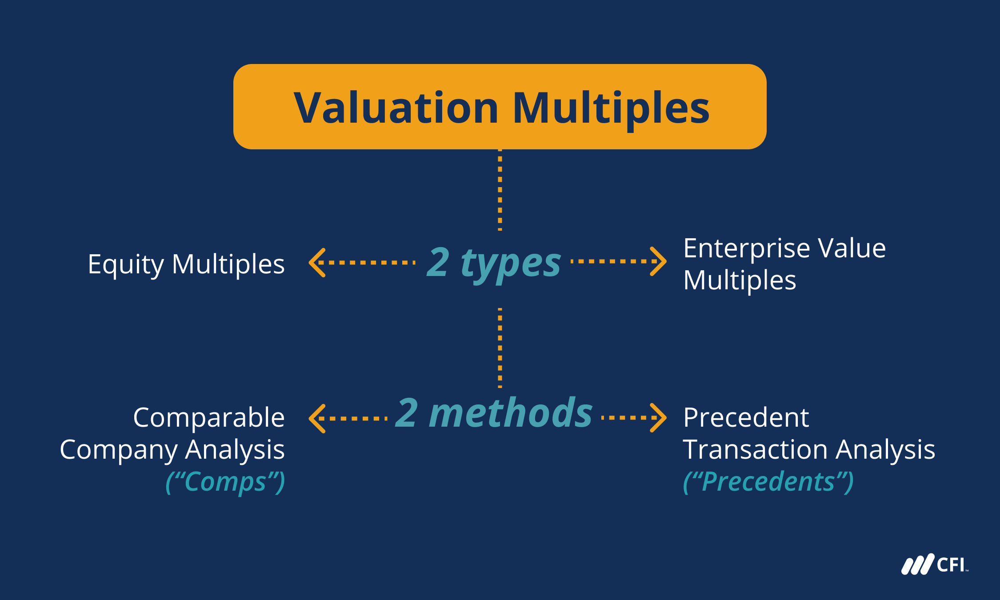

## Table of Contents

## What are price multiples and why are they important in financial analysis?

Price multiples are financial ratios that compare a company's stock price to a specific financial metric, like earnings or sales. Common examples include the price-to-earnings (P/E) ratio and the price-to-sales (P/S) ratio. These multiples help investors understand how expensive or cheap a stock is compared to its financial performance. For example, a high P/E ratio might suggest that a stock is overvalued, while a low P/E ratio could indicate that it's undervalued.

Price multiples are important in financial analysis because they provide a quick and easy way to compare different companies or the same company over time. By looking at multiples, investors can get a sense of whether a stock is priced fairly in relation to its earnings, sales, or other financial measures. This can be especially useful when comparing companies within the same industry, as it helps to see which ones might be better investment opportunities. Overall, price multiples are a key tool for making informed investment decisions.

## Can you explain the difference between price multiples and other valuation metrics?

Price multiples and other valuation metrics are both used to figure out if a company's stock is a good buy, but they do this in different ways. Price multiples compare the stock price directly to a financial measure like earnings or sales. For example, the price-to-earnings (P/E) ratio compares the stock price to the company's earnings per share. This gives investors a quick way to see if a stock might be overpriced or underpriced compared to its financial performance.

Other valuation metrics, on the other hand, might look at more complex aspects of a company's value. For instance, discounted cash flow (DCF) analysis tries to estimate the value of a company based on its future cash flows, adjusted for the time value of money. Another metric, like the book value, compares the company's market value to its net assets. These methods can give a more detailed picture of a company's worth but often require more data and calculations than price multiples.

In simple terms, price multiples give a fast snapshot of a stock's value based on current financial data, while other valuation metrics might offer a deeper, but more complex, analysis of a company's overall worth. Both types of metrics are useful, but they serve different purposes in helping investors make decisions.

## What is the Price-to-Earnings (P/E) ratio and how is it calculated?

The Price-to-Earnings (P/E) ratio is a way to see how much investors are willing to pay for each dollar of a company's earnings. It's one of the most popular price multiples used in financial analysis. The P/E ratio helps investors figure out if a stock is a good deal or if it's priced too high compared to the money the company is making.

To calculate the P/E ratio, you take the current stock price and divide it by the company's earnings per share (EPS). For example, if a company's stock is trading at $50 and its earnings per share are $5, the P/E ratio would be 10. This means investors are paying $10 for every $1 of earnings. The P/E ratio can be based on past earnings (trailing P/E) or future expected earnings (forward P/E), depending on what data you use.

## How does the Price-to-Book (P/B) ratio work, and what does it indicate about a company?

The Price-to-Book (P/B) ratio is another way to see if a company's stock is a good buy. It compares the market value of a company's stock to its book value, which is the total value of its assets minus its liabilities. To find the P/B ratio, you take the current stock price and divide it by the book value per share. For example, if a company's stock is trading at $20 and its book value per share is $10, the P/B ratio would be 2. This means investors are paying twice the book value for the stock.

The P/B ratio can tell you a lot about a company. A low P/B ratio might mean the stock is undervalued, which could be a good sign for investors looking for a bargain. On the other hand, a high P/B ratio could mean the stock is overvalued, or it might show that investors think the company has a lot of growth potential. The P/B ratio is especially useful for companies that have a lot of physical assets, like banks or manufacturing companies, because it gives a clear picture of what the company is worth based on its balance sheet.

## What is the Price-to-Sales (P/S) ratio and when is it most useful?

The Price-to-Sales (P/S) ratio is a way to see how much investors are paying for each dollar of a company's sales. You find it by dividing the company's stock price by its sales per share. For example, if a company's stock price is $10 and its sales per share are $2, the P/S ratio would be 5. This means investors are paying $5 for every $1 of sales the company makes. The P/S ratio is useful because it doesn't depend on earnings, which can be affected by a lot of accounting tricks or losses.

The P/S ratio is most useful when looking at companies that are not making profits yet, like new tech startups or companies in growth phases. These companies might have high costs and low or no earnings, so their P/E ratio wouldn't be helpful. By using the P/S ratio, investors can still get a sense of the company's value based on its sales. It's also good for comparing companies in the same industry, to see which ones might be better deals based on their sales performance.

## Can you describe the Price-to-Cash Flow (P/CF) ratio and its significance?

The Price-to-Cash Flow (P/CF) ratio is a way to see how much investors are paying for each dollar of a company's cash flow. You find it by dividing the company's stock price by its cash flow per share. For example, if a company's stock is $20 and its cash flow per share is $4, the P/CF ratio would be 5. This means investors are paying $5 for every $1 of cash flow the company makes. The P/CF ratio is useful because it looks at the actual cash a company brings in, which can be a more reliable measure than earnings since it's harder to manipulate cash flow numbers.

The P/CF ratio is significant because it helps investors understand if a stock is priced fairly compared to the cash the company is generating. A low P/CF ratio might mean the stock is undervalued, which could be a good sign for investors looking for a deal. On the other hand, a high P/CF ratio could mean the stock is overvalued, or it might show that investors think the company has a lot of growth potential. The P/CF ratio is especially useful for companies in industries where cash flow is more important than earnings, like oil and gas or real estate. It gives a clear picture of a company's financial health by focusing on the cash it's actually bringing in.

## How do you calculate the Dividend Yield, and what does it tell investors?

The Dividend Yield is a way to see how much money you get back from a stock in dividends compared to what you paid for it. To calculate it, you take the annual dividend per share and divide it by the stock's current price per share. Then, you multiply by 100 to get a percentage. For example, if a company pays an annual dividend of $2 per share and the stock price is $40, the Dividend Yield would be (2 / 40) * 100 = 5%. This means for every $40 you invest, you get $2 back each year in dividends, which is a 5% return just from the dividends.

The Dividend Yield tells investors a lot about a stock. A high Dividend Yield might mean the stock is a good choice if you're looking for regular income from your investments. It can also show that a company is stable and has enough money to pay out dividends. But be careful, because a very high yield might mean the stock price has dropped a lot, which could be a warning sign. On the other hand, a low Dividend Yield might mean the company is keeping more money to grow the business, which could be good if you're looking for the stock price to go up over time.

## What are some common pitfalls when using price multiples for valuation?

Using price multiples for valuation can be tricky because they don't tell the whole story about a company. One common pitfall is that price multiples are based on just a few numbers, like earnings or sales, and they don't consider other important things like a company's debt, how fast it's growing, or what's happening in the industry. For example, two companies might have the same P/E ratio, but one might have a lot of debt and be growing slowly, while the other is debt-free and growing quickly. If you only look at the P/E ratio, you might think they're the same, but they're really very different.

Another problem is that price multiples can be affected by short-term changes that don't really show what a company is worth in the long run. For instance, a company's earnings might go up or down because of something that won't last, like a one-time cost or a temporary boost in sales. If you use a price multiple based on those earnings, you might think the company is worth more or less than it really is. It's important to look at more than just the price multiples and think about the bigger picture to get a better idea of a company's true value.

## How can price multiples be used to compare companies within the same industry?

Price multiples are a great way to compare companies within the same industry because they help you see how much investors are willing to pay for different parts of a company's business, like earnings or sales. For example, if you want to compare two tech companies, you can look at their P/E ratios. If one company has a P/E ratio of 20 and the other has a P/E ratio of 30, it means investors are paying more for each dollar of earnings from the second company. This might mean they think the second company will grow faster or be more profitable in the future. By looking at these multiples, you can get a quick idea of which company might be a better deal.

But it's important to remember that price multiples are just one piece of the puzzle. They don't tell you everything about a company, like how much debt it has or how fast it's growing. So, when you're comparing companies, you should also look at other things, like their financial health and what's happening in their industry. For instance, if one company has a lower P/E ratio but a lot of debt, it might not be as good a deal as it seems. By using price multiples along with other information, you can make smarter choices about which companies to invest in.

## What advanced techniques can be applied to adjust price multiples for more accurate valuations?

To get a more accurate valuation using price multiples, you can use something called "normalization." This means you adjust the numbers you use in the multiples to make them more fair and realistic. For example, if a company had a one-time big expense that made its earnings look lower than usual, you could add that expense back to the earnings to see what the company's earnings would be without it. This helps you get a better idea of what the company is really worth. You can also look at the average earnings over a few years instead of just one year to smooth out any ups and downs.

Another technique is to use "sector-specific adjustments." This means you change the multiples based on what's normal for the industry the company is in. For instance, tech companies often have higher P/E ratios than utility companies because they're expected to grow faster. So, if you're comparing a tech company to a utility company, you might need to adjust the multiples to account for these differences. By doing this, you can make sure you're comparing apples to apples and get a clearer picture of which company might be a better investment.

## How do macroeconomic factors influence the interpretation of price multiples?

Macroeconomic factors like interest rates, inflation, and economic growth can really change how we look at price multiples. When interest rates are low, it's cheaper for companies to borrow money, so they might grow faster and their stock prices could go up. This can make their price multiples, like the P/E ratio, look higher because investors are willing to pay more for each dollar of earnings. On the other hand, if inflation is high, the money companies make might not be worth as much in the future, so investors might not want to pay as much for the stock, making the price multiples lower.

Also, the overall state of the economy matters a lot. In good times, when the economy is growing, companies usually make more money, and their stock prices can go up, making their price multiples look higher. But in bad times, like a recession, companies might make less money, and their stock prices could drop, making the price multiples lower. So, when you're looking at price multiples, it's important to think about what's going on in the bigger picture of the economy to understand if a company's stock is really a good deal or not.

## Can you discuss the limitations of price multiples in different market conditions?

Price multiples can be tricky to use because they don't always work the same way in different market conditions. In a booming market, when everyone is feeling good about the economy, price multiples like the P/E ratio might look high because investors are willing to pay more for stocks. They think the good times will keep going and companies will keep making more money. But this can be risky because if the market turns around, those high price multiples might drop fast, and the stocks could lose value.

On the other hand, in a down market, like during a recession, price multiples might look low because investors are scared and don't want to pay much for stocks. They think companies will make less money, so they're not willing to pay as much for each dollar of earnings. But even low price multiples in a down market don't always mean a stock is a good deal. The company might still be struggling, and its earnings could keep going down. So, it's important to think about the bigger picture of the market when using price multiples to value stocks.

## What are Valuation Ratios and Price Multiples and how can we understand them?

Valuation ratios are essential tools in financial analysis, providing insights into a company's market worth relative to its financial performance. These ratios help investors and analysts evaluate whether a company's stock is fairly valued, overvalued, or undervalued. Price multiples, a specific category within valuation ratios, are particularly significant for assessing a company's market valuation.

Price multiples involve the relationship between a company's share price and another per-share metric. This approach offers a direct method of comparing the valuation across different companies or industries, irrespective of scale. Key examples of price multiples include the Price-to-Earnings (P/E) ratio, Price-to-Sales (P/S) ratio, and Price-to-Book Value (P/B) ratio.

1. **Price-to-Earnings (P/E) Ratio**: This ratio is perhaps the most recognized price multiple. It is calculated by dividing the market value per share by the earnings per share (EPS):
$$
   \text{P/E Ratio} = \frac{\text{Market Value per Share}}{\text{Earnings per Share (EPS)}}

$$

   The P/E ratio indicates how much investors are willing to pay for each dollar of earnings. A high P/E might suggest that a company’s stock is overvalued, or investors are expecting high growth rates in the future.

2. **Price-to-Sales (P/S) Ratio**: This ratio measures a company's stock price against its sales per share. It is especially useful for evaluating companies that do not yet have positive earnings:
$$
   \text{P/S Ratio} = \frac{\text{Market Capitalization}}{\text{Total Sales}}

$$

   A lower P/S ratio might indicate that the stock is undervalued relative to its sales levels, whereas a higher ratio might suggest overvaluation.

3. **Price-to-Book Value (P/B) Ratio**: This ratio compares a company's market capitalization with its book value. The formula for this ratio is:
$$
   \text{P/B Ratio} = \frac{\text{Market Price per Share}}{\text{Book Value per Share}}

$$

   The P/B ratio helps determine how much shareholders are paying for the net assets of a company. A P/B ratio less than one could indicate that the stock is undervalued.

These metrics are valuable as they provide insights into how a company is assessed compared to its peers and industry benchmarks. By considering these ratios, investors can gain a better understanding of a company's valuation dynamics and make informed decisions. Understanding these tools is critical for evaluating investment opportunities and assessing relative market positions.

## What are the key types of price multiples and their formulas?

Valuation ratios and price multiples are fundamental components of financial analysis, providing insights into a company's valuation relative to its financial metrics. Among these, the Price-to-Earnings (P/E) ratio is one of the most prominent. The P/E ratio is calculated by dividing the current share price by the earnings per share (EPS). The formula can be expressed as: 

$$
\text{P/E Ratio} = \frac{\text{Share Price}}{\text{Earnings Per Share (EPS)}}
$$

This ratio offers investors a quick way to gauge how much they are willing to pay for each dollar of a company’s earnings, helping them assess whether a stock might be overvalued or undervalued compared to industry peers.

Another useful multiple is the Price-to-Sales (P/S) ratio, which measures a company’s stock price against its sales per share. This multiple is particularly beneficial for evaluating companies that may not yet be profitable, as it focuses on revenue generation rather than earnings. The P/S ratio is calculated as follows:

$$
\text{P/S Ratio} = \frac{\text{Share Price}}{\text{Sales Per Share}}
$$

This formula helps investors assess how a company’s revenue is valued by the market, providing insights into whether a stock could offer potential growth opportunities or is overpriced relative to its sales.

The Price-to-Book Value (P/B) ratio is also essential, comparing a firm's market capitalization to its book value. The P/B ratio is expressed by the formula:

$$
\text{P/B Ratio} = \frac{\text{Market Capitalization}}{\text{Book Value}}
$$

This calculation gives investors an indication of how much shareholders are paying for a company's net assets. A lower P/B ratio might suggest that a stock is undervalued, whereas a higher ratio might indicate overvaluation relative to the intrinsic value of the assets.

Understanding these formulas empowers investors to make informed decisions about stock valuations. By employing these price multiples, investors can better evaluate investment opportunities and determine whether stocks are fairly priced within the market context.

## What are the benefits and limitations of using price multiples?

Price multiples offer a useful method for comparing the valuation of companies within the same industry or across different sectors. These metrics, such as the Price-to-Earnings (P/E) ratio, Price-to-Sales (P/S) ratio, and Price-to-Book Value (P/B) ratio, are essential tools in the investor's toolkit due to their widespread acceptance and ease of use. The P/E ratio, for instance, is computed as:

$$
\text{P/E Ratio} = \frac{\text{Market Price per Share}}{\text{Earnings per Share (EPS)}}
$$

Meanwhile, the P/S ratio is calculated by:

$$
\text{P/S Ratio} = \frac{\text{Market Capitalization}}{\text{Total Sales or Revenue}}
$$

And the P/B ratio is expressed as:

$$
\text{P/B Ratio} = \frac{\text{Market Price per Share}}{\text{Book Value per Share}}
$$

Despite their popularity, price multiples have limitations. One primary drawback is their inability to capture short-term anomalies or sector-specific nuances. For instance, cyclical industries might show misleadingly high or low ratios due to seasonal variations that these metrics fail to accommodate. Furthermore, the uniqueness of certain sectors can lead to discrepancies that misrepresent a firm's actual value. For example, companies in asset-heavy industries might appear undervalued when applying the P/B ratio due to significant book assets, whereas tech companies with fewer tangible assets may seem overvalued.

To address these limitations, investors should consider supplementing price multiples with other valuation techniques. Methods such as discounted cash flow (DCF) analysis provide a more detailed perspective by considering future cash flow projections and present value calculations. Integrating qualitative assessments, such as management quality or brand strength, can also provide context that pure numerical data cannot.

In conclusion, while price multiples serve as a convenient shorthand for evaluating investment opportunities, relying solely on them may lead to incomplete or skewed assessments. A balanced approach combining these ratios with other analytical tools and qualitative insights will yield a more comprehensive evaluation of potential investments.

## References & Further Reading

[1]: ["Valuation: Measuring and Managing the Value of Companies"](https://www.amazon.com/Valuation-Measuring-Managing-Companies-Finance/dp/1119610885) by McKinsey & Company Inc.

[2]: Damodaran, A. (2012). ["Investment Valuation: Tools and Techniques for Determining the Value of Any Asset."](https://books.google.com/books/about/Investment_Valuation.html?id=5SRHAAAAQBAJ) John Wiley & Sons.

[3]: ["Financial Modeling and Valuation: A Practical Guide to Investment Banking and Private Equity"](https://books.google.com/books/about/Financial_Modeling_and_Valuation.html?id=Bet3zgEACAAJ) by Paul Pignataro

[4]: ["Algorithmic Trading and DMA: An Introduction to Direct Access Trading Strategies"](https://www.amazon.com/Algorithmic-Trading-DMA-introduction-strategies/dp/0956399207) by Barry Johnson

[5]: Bodie, Z., Kane, A., & Marcus, A. J. (2013). ["Investments and Portfolio Management."](https://www.amazon.com/Investments-Portfolio-Management-Zvi-Bodie/dp/0071289143) McGraw-Hill Education.