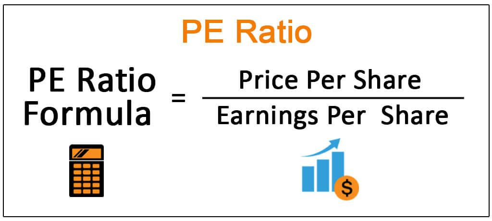

In the modern financial landscape, valuation ratios and price multiples play a crucial role in assessing a company's financial health and investment potential. These metrics serve as fundamental tools for investors looking to evaluate the relative value of different firms and make informed decisions about buying, holding, or selling stocks. Valuation ratios are crucial for understanding how a company performs financially compared to its peers, and they help investors gauge whether a company's stock is overvalued, undervalued, or fairly priced.

With the advent of algorithmic trading, the significance of understanding these financial formulas has increased even further. Algorithmic trading systems utilize complex mathematical models and algorithms to execute trades at speeds and efficiencies far beyond human capabilities. These systems often incorporate valuation ratios and price multiples to automate decision-making processes, enabling traders to exploit market opportunities based on real-time data and enhancing the potential for increased returns. By integrating these metrics into their trading strategies, investors can develop more sophisticated approaches that leverage both historical data and predictive analytics.



This article explores the core concepts of valuation ratios, various types of price multiples, and their application in algorithmic trading strategies. It aims to offer a comprehensive overview that serves as a valuable resource for both novice and seasoned investors. By providing insights into how these financial measurements function within the broader market and their implementation in contemporary trading strategies, readers can enhance their understanding of the intricate dynamics of modern financial markets. Whether you're an individual investor seeking to bolster your financial knowledge or a professional trader looking to optimize your trading algorithms, this exploration into valuation ratios and price multiples provides essential insights and practical applications.

## Table of Contents

## Understanding Valuation Ratios and Price Multiples

Valuation ratios are essential tools in financial analysis, providing insights into a company's market worth relative to its financial performance. These ratios help investors and analysts evaluate whether a company's stock is fairly valued, overvalued, or undervalued. Price multiples, a specific category within valuation ratios, are particularly significant for assessing a company's market valuation.

Price multiples involve the relationship between a company's share price and another per-share metric. This approach offers a direct method of comparing the valuation across different companies or industries, irrespective of scale. Key examples of price multiples include the Price-to-Earnings (P/E) ratio, Price-to-Sales (P/S) ratio, and Price-to-Book Value (P/B) ratio.

1. **Price-to-Earnings (P/E) Ratio**: This ratio is perhaps the most recognized price multiple. It is calculated by dividing the market value per share by the earnings per share (EPS):
$$
   \text{P/E Ratio} = \frac{\text{Market Value per Share}}{\text{Earnings per Share (EPS)}}

$$

   The P/E ratio indicates how much investors are willing to pay for each dollar of earnings. A high P/E might suggest that a company’s stock is overvalued, or investors are expecting high growth rates in the future.

2. **Price-to-Sales (P/S) Ratio**: This ratio measures a company's stock price against its sales per share. It is especially useful for evaluating companies that do not yet have positive earnings:
$$
   \text{P/S Ratio} = \frac{\text{Market Capitalization}}{\text{Total Sales}}

$$

   A lower P/S ratio might indicate that the stock is undervalued relative to its sales levels, whereas a higher ratio might suggest overvaluation.

3. **Price-to-Book Value (P/B) Ratio**: This ratio compares a company's market capitalization with its book value. The formula for this ratio is:
$$
   \text{P/B Ratio} = \frac{\text{Market Price per Share}}{\text{Book Value per Share}}

$$

   The P/B ratio helps determine how much shareholders are paying for the net assets of a company. A P/B ratio less than one could indicate that the stock is undervalued.

These metrics are valuable as they provide insights into how a company is assessed compared to its peers and industry benchmarks. By considering these ratios, investors can gain a better understanding of a company's valuation dynamics and make informed decisions. Understanding these tools is critical for evaluating investment opportunities and assessing relative market positions.

## Key Types of Price Multiples and Their Formulas

Valuation ratios and price multiples are fundamental components of financial analysis, providing insights into a company's valuation relative to its financial metrics. Among these, the Price-to-Earnings (P/E) ratio is one of the most prominent. The P/E ratio is calculated by dividing the current share price by the earnings per share (EPS). The formula can be expressed as: 

$$
\text{P/E Ratio} = \frac{\text{Share Price}}{\text{Earnings Per Share (EPS)}}
$$

This ratio offers investors a quick way to gauge how much they are willing to pay for each dollar of a company’s earnings, helping them assess whether a stock might be overvalued or undervalued compared to industry peers.

Another useful multiple is the Price-to-Sales (P/S) ratio, which measures a company’s stock price against its sales per share. This multiple is particularly beneficial for evaluating companies that may not yet be profitable, as it focuses on revenue generation rather than earnings. The P/S ratio is calculated as follows:

$$
\text{P/S Ratio} = \frac{\text{Share Price}}{\text{Sales Per Share}}
$$

This formula helps investors assess how a company’s revenue is valued by the market, providing insights into whether a stock could offer potential growth opportunities or is overpriced relative to its sales.

The Price-to-Book Value (P/B) ratio is also essential, comparing a firm's market capitalization to its book value. The P/B ratio is expressed by the formula:

$$
\text{P/B Ratio} = \frac{\text{Market Capitalization}}{\text{Book Value}}
$$

This calculation gives investors an indication of how much shareholders are paying for a company's net assets. A lower P/B ratio might suggest that a stock is undervalued, whereas a higher ratio might indicate overvaluation relative to the intrinsic value of the assets.

Understanding these formulas empowers investors to make informed decisions about stock valuations. By employing these price multiples, investors can better evaluate investment opportunities and determine whether stocks are fairly priced within the market context.

## Algorithmic Trading and Valuation Ratios

Algorithmic trading has significantly transformed financial markets by implementing automated systems to [carry](/wiki/carry-trading) out trades. These systems are powered by quantitative data, where valuation ratios play a critical role. Valuation ratios, such as the Price-to-Earnings (P/E) ratio, Price-to-Sales (P/S) ratio, and Price-to-Book Value (P/B) ratio, become integral components of trading algorithms. By integrating these price multiples into algorithms, traders leverage [fundamental analysis](/wiki/fundamental-analysis) to enhance decision-making processes.

In [algorithmic trading](/wiki/algorithmic-trading), valuation ratios can be employed to assess the relative value of stocks in real-time. For instance, an algorithm might be programmed to trigger buy orders when a stock's P/E ratio falls below a certain threshold relative to industry peers, signaling potential undervaluation. Similarly, a P/B ratio below market norms might indicate an opportunity to invest in a stock with attractive net assets compared to its market price.

Python, widely used in algorithmic trading, provides robust libraries, such as Pandas and NumPy, facilitating the manipulation and analysis of financial data. Here’s a simple example of how Python code can be used to compare P/E ratios and make trading decisions:

```python
import pandas as pd

# Sample data for demonstration
data = {'Company': ['A', 'B', 'C'],
        'Share Price': [100, 150, 200],
        'Earnings Per Share': [10, 15, 20]}

# Create a DataFrame
df = pd.DataFrame(data)

# Calculate P/E ratio
df['P/E Ratio'] = df['Share Price'] / df['Earnings Per Share']

# Define a threshold for investment decision
pe_threshold = 12

# Identify potential investment opportunities
investment_opportunities = df[df['P/E Ratio'] < pe_threshold]

print(investment_opportunities)
```

In this example, stocks with a P/E ratio below the threshold are considered potential buys. Such implementations allow for quick investment decisions based on quantitative parameters.

The adoption of these techniques enables trading systems to continuously analyze and act on up-to-date data, thereby enhancing the efficiency of market operations and potentially increasing returns. The ability to process large datasets and make split-second decisions based on valuation ratios ensures that algorithmic trading remains a formidable tool in the modern financial landscape. As the sophistication of algorithms and real-time data processing continues to advance, the role of valuation ratios in trading strategies is expected to expand further.

## Benefits and Limitations of Using Price Multiples

Price multiples offer a useful method for comparing the valuation of companies within the same industry or across different sectors. These metrics, such as the Price-to-Earnings (P/E) ratio, Price-to-Sales (P/S) ratio, and Price-to-Book Value (P/B) ratio, are essential tools in the investor's toolkit due to their widespread acceptance and ease of use. The P/E ratio, for instance, is computed as:

$$
\text{P/E Ratio} = \frac{\text{Market Price per Share}}{\text{Earnings per Share (EPS)}}
$$

Meanwhile, the P/S ratio is calculated by:

$$
\text{P/S Ratio} = \frac{\text{Market Capitalization}}{\text{Total Sales or Revenue}}
$$

And the P/B ratio is expressed as:

$$
\text{P/B Ratio} = \frac{\text{Market Price per Share}}{\text{Book Value per Share}}
$$

Despite their popularity, price multiples have limitations. One primary drawback is their inability to capture short-term anomalies or sector-specific nuances. For instance, cyclical industries might show misleadingly high or low ratios due to seasonal variations that these metrics fail to accommodate. Furthermore, the uniqueness of certain sectors can lead to discrepancies that misrepresent a firm's actual value. For example, companies in asset-heavy industries might appear undervalued when applying the P/B ratio due to significant book assets, whereas tech companies with fewer tangible assets may seem overvalued.

To address these limitations, investors should consider supplementing price multiples with other valuation techniques. Methods such as discounted cash flow (DCF) analysis provide a more detailed perspective by considering future cash flow projections and present value calculations. Integrating qualitative assessments, such as management quality or brand strength, can also provide context that pure numerical data cannot.

In conclusion, while price multiples serve as a convenient shorthand for evaluating investment opportunities, relying solely on them may lead to incomplete or skewed assessments. A balanced approach combining these ratios with other analytical tools and qualitative insights will yield a more comprehensive evaluation of potential investments.

## Practical Applications in Investment Strategies

In investment strategies, price multiples serve as critical tools for evaluating potential investment opportunities by comparing a company's market valuation against industry benchmarks. By examining ratios such as the Price-to-Earnings (P/E) ratio, investors can gain insights into whether a stock is undervalued or overvalued relative to its peers. For instance, if a company's P/E ratio is significantly lower than the industry average, it might indicate that the stock is undervalued, presenting a potential buying opportunity for value investors.

Incorporating valuation ratios into value investing strategies allows investors to identify stocks that may offer attractive long-term returns. This process involves analyzing various price multiples to assess a stock's intrinsic value compared to its current market price. The goal is to find stocks that are priced below their intrinsic value, thereby providing a margin of safety and the potential for appreciation as the market recognizes the stock's true worth.

Algorithmic trading systems further enhance the application of valuation ratios by automating the screening and sorting of stocks based on these metrics. Traders can program algorithms to monitor a wide array of financial indicators, including valuation ratios, to make rapid, data-driven investment decisions. For example, a Python script could automatically scan a database of stocks and filter those that meet specific criteria for P/E, P/B, and P/S ratios, flagging potential investment opportunities:

```python
import pandas as pd

# Sample data frame containing stock data
stocks_data = pd.DataFrame({
    'Company': ['A', 'B', 'C', 'D'],
    'Price': [150, 75, 120, 230],
    'Earnings': [10, 5, 15, 20],
    'BookValue': [50, 30, 100, 90]
})

# Calculating P/E and P/B ratios
stocks_data['P/E'] = stocks_data['Price'] / stocks_data['Earnings']
stocks_data['P/B'] = stocks_data['Price'] / stocks_data['BookValue']

# Industry benchmark criteria
pe_threshold = 15
pb_threshold = 1.5

# Filtering undervalued stocks
undervalued_stocks = stocks_data[(stocks_data['P/E'] < pe_threshold) & (stocks_data['P/B'] < pb_threshold)]

print(undervalued_stocks)
```

Such automated systems streamline the investment analysis process, allowing traders to react quickly to market changes and take advantage of undervalued or overvalued stocks. However, it's crucial to combine these quantitative techniques with qualitative assessments to ensure a comprehensive evaluation of potential investments. By doing so, investors can better navigate the complexities of the financial markets and align their strategies with their risk tolerance and investment objectives.

## Conclusion

Valuation ratios and price multiples are integral tools for investors and traders, providing essential insights into company valuations and financial health. These financial formulas, such as the Price-to-Earnings (P/E) ratio, Price-to-Sales (P/S) ratio, and Price-to-Book Value (P/B) ratio, offer a quantitative basis for comparing companies and making informed investment decisions. By applying these metrics, investors can identify whether a stock appears overvalued or undervalued relative to its peers and industry standards.

Combining these valuation metrics with algorithmic trading techniques enhances decision-making processes. Algorithmic trading utilizes automated systems and real-time data to execute trades efficiently, taking advantage of quantitative data such as valuation ratios. This integration allows for swift investment decisions based on empirical evidence, potentially enhancing returns and reducing the emotional biases often associated with traditional trading methods.

Looking ahead, the evolution of market conditions and advancements in technology are expected to further expand the utility of valuation ratios and price multiples. These metrics will likely remain a crucial part of the investment toolkit, and their relevance is set to grow as financial markets become increasingly complex. Enhanced computational power and sophisticated algorithmic models will enable more precise analyses and strategies, reinforcing the importance of mastering these tools for anyone involved in financial markets. Understanding and applying valuation ratios will not only empower investors today but also prepare them for the future dynamics of investing.

## References & Further Reading

[1]: ["Valuation: Measuring and Managing the Value of Companies"](https://www.amazon.com/Valuation-Measuring-Managing-Companies-Finance/dp/1119610885) by McKinsey & Company Inc.

[2]: Damodaran, A. (2012). ["Investment Valuation: Tools and Techniques for Determining the Value of Any Asset."](https://books.google.com/books/about/Investment_Valuation.html?id=5SRHAAAAQBAJ) John Wiley & Sons.

[3]: ["Financial Modeling and Valuation: A Practical Guide to Investment Banking and Private Equity"](https://books.google.com/books/about/Financial_Modeling_and_Valuation.html?id=Bet3zgEACAAJ) by Paul Pignataro

[4]: ["Algorithmic Trading and DMA: An Introduction to Direct Access Trading Strategies"](https://www.amazon.com/Algorithmic-Trading-DMA-introduction-strategies/dp/0956399207) by Barry Johnson

[5]: Bodie, Z., Kane, A., & Marcus, A. J. (2013). ["Investments and Portfolio Management."](https://www.amazon.com/Investments-Portfolio-Management-Zvi-Bodie/dp/0071289143) McGraw-Hill Education.