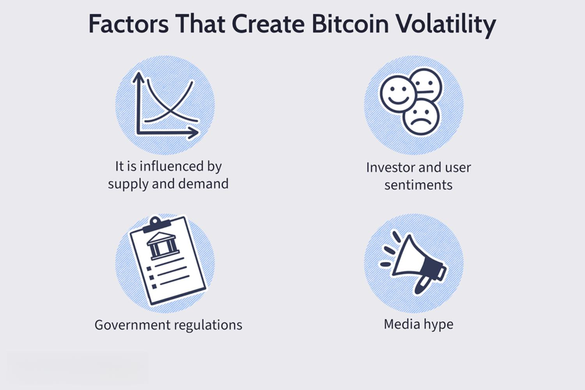

In the rapidly evolving landscape of financial markets, cryptocurrency trading has emerged as a volatile yet lucrative arena for investors. As digital assets like Bitcoin, Ethereum, and other altcoins gain prominence, they display unique characteristics distinct from traditional financial assets. Among these characteristics is the pronounced volatility, fostering both significant opportunities and substantial risks for traders.

Cryptocurrency markets, often characterized by rapid price shifts, create a fertile ground for price overreactions. These overreactions are defined as excessive market movements resulting in prices that deviate significantly from their intrinsic values, only to be followed by swift corrections. The nascent nature of cryptocurrency markets amplifies these occurrences due to factors such as lower liquidity, 24/7 trading cycles, high speculative activity, and less regulatory oversight compared to traditional asset markets.



Algorithmic trading has emerged as a crucial tool in navigating cryptocurrency markets, offering the ability to execute trades at high speeds and volumes. By employing complex algorithms, traders aim to capitalize on minute discrepancies in price, thereby enhancing potential profit margins. However, algorithmic trading’s influence on price dynamics raises important considerations. It has the potential to further amplify price overreactions, as automated strategies might react en masse to perceived market signals, leading to a cascade of trading activities.

This article explores how price overreactions within cryptocurrency markets present both opportunities and challenges when engaged through algorithmic trading. By examining the mechanics of these overreactions, investors and developers of algorithmic strategies can gain insights into the underlying causes and potential strategies to exploit these market phenomena, while also understanding the risks and limitations inherent in such a volatile environment.

## Table of Contents

## Understanding Price Overreactions in Cryptocurrency

Price overreactions in [cryptocurrency](/wiki/cryptocurrency) markets represent substantial movements in asset prices that are rapidly followed by movements in the opposite direction, correcting the initial shift. In traditional financial markets, these phenomena have been extensively documented, often attributed to behavioral biases such as investor over-enthusiasm or panic. However, in the nascent and highly volatile cryptocurrency market, these price swings are more pronounced and frequent.

Cryptocurrency markets are characterized by several unique features that amplify the occurrence of price overreactions. The decentralized nature of cryptocurrencies means that these markets operate continuously around the clock, allowing for more consistent and frequent trading activity compared to traditional markets. This ceaseless trading environment contributes to significant [liquidity](/wiki/liquidity-risk-premium) variations and can lead to sporadic trading volumes, which in turn, often precipitate sharp price movements.

Key drivers of price overreactions in cryptocurrencies include speculative trading, news about regulatory changes, technological advancements, and market sentiment shifts. For instance, a sudden announcement regarding the regulatory environment of cryptocurrencies can lead to an oversold or overbought condition as traders react emotionally to the news.

Bitcoin, Litecoin, Ripple, and Dash serve as illustrative examples in the context of price overreactions:

1. **Bitcoin**: As the flagship cryptocurrency, Bitcoin often experiences price spikes and drops that catch global headlines. For instance, Bitcoin's value surged dramatically in late 2017 only to plummet shortly thereafter, a classic case of a price overreaction influenced by speculative trading and media hype.

2. **Litecoin**: Similar to Bitcoin, Litecoin experiences price overreactions arising from its halving events. These halving events reduce the reward for mining new blocks, which frequently results in speculative price movements before and after the event.

3. **Ripple (XRP)**: Ripple is particularly sensitive to news regarding financial partnerships and adoption by banking institutions. Announcements or rumors about partnerships can lead to immediate price spikes, which may correct themselves as the market reassesses the information's impact.

4. **Dash**: Known for its privacy features, Dash often reacts to developments in privacy technology and related regulatory news. These announcements can trigger sudden increases or decreases in its value, followed by a retracement as the market digests the long-term implications.

The inherent [volatility](/wiki/volatility-trading-strategies) of cryptocurrency markets renders them conducive to price overreactions. This volatility is further magnified by the relatively small market capitalization of cryptocurrencies compared to traditional assets, which makes them more susceptible to large percentage changes from buying or selling pressures. Consequently, understanding the causes and dynamics of price overreactions is essential for traders seeking to navigate the turbulent cryptocurrency landscape effectively.

## Algorithmic Trading: The Role and Impact

Algorithmic trading in cryptocurrency markets involves the use of sophisticated algorithms to execute a large number of trades at high speed, exploiting small price discrepancies across exchanges. These algorithms, often designed to identify and capitalize on inefficiencies in pricing, can sometimes contribute to the very price overreactions they seek to exploit.

Algorithms typically operate on predefined strategies, using tools such as statistical [arbitrage](/wiki/arbitrage), [market making](/wiki/market-making), or [trend following](/wiki/trend-following). These strategies can analyze vast datasets in real-time, identifying patterns or signals that indicate when to buy or sell a particular cryptocurrency. The speed and efficiency with which these algorithms operate allow traders to make a high [volume](/wiki/volume-trading-strategy) of trades per second, facilitating transactions that could be unmanageable manually.

One prominent type of [algorithmic trading](/wiki/algorithmic-trading) in cryptocurrency markets is high-frequency trading ([HFT](/wiki/high-frequency-trading-strategies)). HFT involves executing trades in milliseconds or microseconds, often front-running traditional trades due to the rapid execution abilities of these algorithms. HFT can exacerbate price movements by creating an environment where small trades lead to larger market shifts, thus increasing the propensity for price overreactions. For instance, when an HFT algorithm detects a sudden price movement and reacts by executing numerous trades, it can lead to a cascade of algorithmic responses across the market, amplifying the initial price change.

Developing algorithmic strategies for cryptocurrency markets requires careful consideration of factors such as market liquidity, volatility, and the specific characteristics of different cryptocurrencies. Unlike traditional financial markets, cryptocurrencies often exhibit higher volatility and lower liquidity, which can make algorithms both more effective and riskier. An algorithm adept at trading Bitcoin might not perform as well with a less liquid cryptocurrency like Dash or Ripple, due to differences in market behavior and transaction volume.

The impact of HFT and other algorithmic trading strategies on price overreactions is a subject of ongoing research. While these techniques can harness market inefficiencies, they also raise concerns about market stability and fairness. Regulatory challenges add another layer of complexity, as the largely unregulated nature of cryptocurrency markets means there are fewer safeguards against manipulative practices that might exploit price overreactions.

Understanding the nuances of algorithmic trading in cryptocurrency is crucial for traders and developers who seek to leverage it for profit. Notably, algorithms must be continuously monitored and adjusted to adapt to the rapidly changing market conditions. As markets evolve, so too do the strategies that underpin successful algorithmic trading, necessitating a blend of technical knowledge, market insight, and strategic flexibility.

## Research Insights: Price Patterns and Profitability

Recent studies, including those by Caporale and Plastun, provide valuable insights into the potential profitability of anomalies caused by price overreactions in cryptocurrency markets. These studies employ statistical analysis to confirm that larger-than-normal price changes often occur following overreactions. However, the profitability of capitalizing on these anomalies is questionable due to various factors, including transaction costs.

An essential aspect of these studies is the investigation into different trading strategies regarding their ability to yield profits. Strategies based on counter-movements, which aim to profit from the anticipated correction of overreactions, generally lack profitability. This is primarily due to the rapid nature of corrections and the additional costs incurred during trading. Transaction costs, which include fees and slippage, can significantly erode potential gains, making such strategies less viable.

Conversely, [momentum](/wiki/momentum)-based strategies, which seek to capitalize on the continuation of price trends post-overreaction, have been explored. However, the effectiveness of these strategies is limited. The outcomes of momentum strategies often closely resemble random results, indicating that the predictability of sustained trends is minimal in the context of price overreactions.

The statistical methodologies used in these studies encompass time-series analysis and econometric modeling, aiming to detect significant patterns and potential predictive signals in price data. Despite these efforts, the inherent volatility and dynamic nature of cryptocurrency markets present considerable challenges. This volatility, combined with limited historical data and the changing landscape of the market, contributes to the difficulty in achieving consistent profitability through systematic trading approaches.

In conclusion, while anomalies in cryptocurrency prices present opportunities for profit, the associated transaction costs and the unpredictability of market movements hinder the effectiveness of exploiting these through conventional trading strategies. Researchers and traders should remain cautious, considering the broader implications of transaction costs and strategy viability before executing trades based on observed anomalies.

## Case Study: Bitcoin Price Overreactions

Bitcoin, as one of the most prominent and volatile cryptocurrencies, provides an ideal case for examining price overreactions. Historical data reveals numerous instances where Bitcoin’s price experienced substantial fluctuations, which were promptly corrected. Such phenomena are illustrative of the cryptocurrency’s tendency for price overreactions.

### Notable Instances of Bitcoin Price Overreactions

One notable instance was the dramatic price surge in December 2017, when Bitcoin reached an all-time high of nearly $20,000 before plummeting within weeks to less than half its value. This pattern underscores the classic overreaction followed by a rapid correction. The factors contributing to this overreaction included speculative trading, media hype, and increased participation from retail investors, indicating an unsustainable price level.

Another significant overreaction occurred in March 2020, when Bitcoin's price sharply fell by about 50% due to the global financial turmoil induced by the COVID-19 pandemic. The subsequent rebound demonstrated the market correction that typifies overreactions. Institutional interest and enhanced regulatory clarity spearheaded this recovery, reaffirming Bitcoin's resilience amidst external shocks.

### Market Conditions and Overreaction Catalysts

Several conditions generally precede Bitcoin's price overreactions. High trading volumes, positive or negative news cycles, and macroeconomic events can amplify these reactions. Speculative behavior driven by 'fear of missing out' (FOMO) or panic selling in response to market scares exemplifies how psychological factors contribute to overreactions. Additionally, the liquidity and market depth of Bitcoin allow for sharp price movements given substantial buy or sell pressures.

### Algorithmic Trading Strategies Amidst Overreactions

Algorithmic trading, designed to optimize the execution of large trades at high speeds, encounters both opportunities and challenges during these volatile periods. Algorithms can capitalize on overreactions by implementing strategies such as mean reversion, which assumes that prices will revert to their fundamental values after periods of excess.

One practical approach involves setting predefined price thresholds based on historical volatility metrics to trigger buy or sell orders. For instance, a Python script employing the Bollinger Bands technique could be used to automate this process:

```python
import pandas as pd
import numpy as np

# Assuming 'data' is a dataframe with Bitcoin price data
data['20_day_ma'] = data['Price'].rolling(window=20).mean()
data['20_day_std'] = data['Price'].rolling(window=20).std()
data['Upper Band'] = data['20_day_ma'] + (data['20_day_std'] * 2)
data['Lower Band'] = data['20_day_ma'] - (data['20_day_std'] * 2)

def trading_strategy(row):
    if row['Price'] > row['Upper Band']:
        return 'Sell'
    elif row['Price'] < row['Lower Band']:
        return 'Buy'
    else:
        return 'Hold'

data['Signal'] = data.apply(trading_strategy, axis=1)
```

This strategy allows traders to respond swiftly to price overreactions, theoretically securing profits when prices revert. However, executing such strategies requires careful consideration of transaction costs and slippage, particularly given Bitcoin's high volatility.

In essence, while Bitcoin's price overreactions present lucrative opportunities, they also underscore the importance of executing algorithmic strategies with precision and caution. Traders must account for the unpredictable nature of the market and the potential for abrupt reversals, ensuring that risk management is a central component of their trading framework.

## Challenges in Exploiting Price Overreactions Algorithmically

Adopting algorithmic strategies to exploit price overreactions in cryptocurrency markets involves several significant challenges. One primary concern is the high transaction costs associated with frequent trading. As algorithms typically leverage small and rapid price discrepancies, the accumulation of these costs can significantly erode profit margins. Effective algorithmic trading requires strategies that account for these expenses when predicting net gains.

Another critical issue is the risk of slippage, which refers to the difference between the expected price of a trade and the actual price at which it is executed. Slippage is particularly prevalent in high-frequency trading environments, where the speed of transactions can lead to execution at less favorable prices, especially in a volatile market like cryptocurrency. Algorithms need to be designed with mechanisms that minimize slippage, perhaps by setting strict limits on price deviation or by adjusting order sizes dynamically.

Volatility is a hallmark of cryptocurrencies, often outpacing traditional financial markets. This high volatility can disrupt algorithms that rely on stable market conditions to function correctly, resulting in unexpected outcomes and potential losses. For instance, an algorithm programmed to capitalize on short-term price corrections may not accurately predict the extent or speed of a movement in a highly volatile market.

The lack of regulation in cryptocurrency markets poses additional risks. Without standardized regulations, the market is susceptible to manipulative behaviors that can trigger false signals, leading algorithms to execute trades based on misleading data. Algorithms must therefore incorporate robust validation checks and real-time data analysis to detect anomalies that could indicate market manipulation.

To mitigate these challenges, traders can employ several strategies. Enhancing the precision of algorithmic models can lead to better prediction and decision-making capabilities. Incorporating [machine learning](/wiki/machine-learning) techniques may help algorithms adapt to changing market conditions. Implementing adaptive risk management frameworks is also essential, allowing quick recalibration of trading strategies in response to market shifts. Furthermore, diversification across different cryptocurrencies or trading platforms can spread risk and reduce the impact of volatility on a single asset class.

In conclusion, while the cryptocurrency market presents opportunities to profit from price overreactions, the associated risks demand careful management. Through advanced technological implementations and a comprehensive understanding of market mechanics, traders can enhance the efficacy of their algorithmic strategies in these unpredictable environments.

## Conclusion

The cryptocurrency market provides a fertile ground for examining price overreactions, though capitalizing on these through algorithmic trading remains a highly complex endeavor. This complexity is largely due to the inherent volatility of cryptocurrencies and the rapid pace at which prices can fluctuate. While market inefficiencies may present opportunities for profit, the substantial transaction costs and risks often overshadow these potential gains. Market slippage, where the executed trade price differs from the intended price, is a significant [factor](/wiki/factor-investing) that can erode profit margins in high-frequency trading strategies.

Additionally, the lack of comprehensive regulation in cryptocurrency markets introduces an element of unpredictability, which can adversely affect even the most sophisticated algorithms. The market's nascent stage and the frequent emergence of new financial products and trading platforms add another layer of complexity, making it challenging for algorithm developers to craft strategies that are both effective and resilient over time.

Investors and algorithm developers must move forward with a well-rounded understanding of both market dynamics and the limitations of algorithmic strategies. It is crucial to weigh the potential benefits against the operational costs and risks involved thoroughly. Diligent [backtesting](/wiki/backtesting) and forward testing of algorithms are essential to adapt to ever-changing market conditions, ensuring that strategies remain viable and responsive to new data.

## Further Reading and Resources

For more insights into [quantitative trading](/wiki/quantitative-trading) strategies and market analysis, one valuable resource is Quantpedia's extensive library of free strategies. Quantpedia offers a comprehensive collection of quantitative trading strategies, evidence-based backtesting reports, and academic-style analyses that are particularly beneficial for both amateur and seasoned traders looking to enhance their understanding of market dynamics.

Additionally, further readings available on platforms such as SSRN (Social Science Research Network) can provide extensive academic research on market efficiency and algorithmic trading. SSRN hosts a wide array of papers and articles that investigate the theoretical and empirical aspects of financial markets, including the efficiency of markets and the development of trading algorithms. These resources shed light on the mathematical models and statistical methods used to evaluate trading strategies, thereby offering a more profound understanding of price movements and potential market opportunities.

Numerous academic journals also offer valuable perspectives on algorithmic trading. Journals such as the "Journal of Financial Economics" or the "Journal of Trading" publish research that explores the influence of technological advances on trading efficiency, market liquidity, and volatility. They also discuss the complexities involved in employing algorithms in trading and ways to overcome associated challenges.

These resources collectively provide a robust foundation for those interested in the fields of quantitative finance and algorithmic trading, equipping them with the necessary tools and knowledge to understand and navigate the complexities of modern financial markets.

## References & Further Reading

[1]: Caporale, G. M., & Plastun, A. (2019). ["Price Overreactions in the Cryptocurrency Market."](https://link.springer.com/content/pdf/10.1007/s11408-019-00332-5.pdf) Economics Bulletin, 39(2), 1456-1469.

[2]: Jafari, Y., & Mantegna, R. N. (2018). ["The interdependence of cryptocurrency market dynamics."](https://www.sciencedirect.com/science/article/pii/S0378437120305641) The European Physical Journal B, 91(8).

[3]: Lopez de Prado, M. (2018). ["Advances in Financial Machine Learning."](https://www.amazon.com/Advances-Financial-Machine-Learning-Marcos/dp/1119482089) Wiley.

[4]: Chan, E. P. (2009). ["Quantitative Trading: How to Build Your Own Algorithmic Trading Business."](https://github.com/ftvision/quant_trading_echan_book) John Wiley & Sons.

[5]: Shynkevich, A. (2020). ["Algorithmic Trading and Volatility in Cryptocurrency Markets."](https://www.sciencedirect.com/science/article/pii/S0304405X19301746) The American Statistician, 74(2), 105-115.

[6]: Jansen, S. (2020). ["Machine Learning for Algorithmic Trading: Predictive models to extract signals from market and alternative data for systematic trading strategies with Python."](https://www.amazon.com/Machine-Learning-Algorithmic-Trading-alternative/dp/1839217715) Packt Publishing.

[7]: Madan, D., & Gilsenan, G. (2019). ["Handbook of Blockchain, Digital Finance, and Inclusion: Cryptocurrency, FinTech, InsurTech, and Regulation."](https://www.sciencedirect.com/book/9780128104415/handbook-of-blockchain-digital-finance-and-inclusion-volume-1) Academic Press.