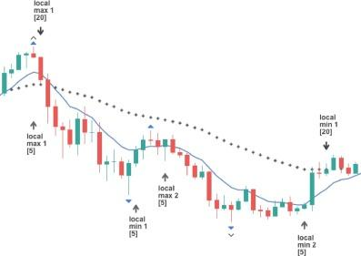

## Table of Contents

## What is a price overreaction in the context of financial markets?

A price overreaction in financial markets happens when the price of a stock or other asset changes a lot more than it should because of new information. This can happen when people get too excited or too worried about news, like a company's earnings report or a big event in the world. For example, if a company does better than expected, people might buy a lot of its stock, pushing the price up too high, too fast.

On the other hand, if bad news comes out, people might sell a lot of the stock, causing the price to drop too low. Over time, the price usually comes back to a more normal level as people calm down and look at the information more carefully. Understanding price overreactions can help investors make better decisions by buying when prices are too low and selling when they are too high.

## How can price overreactions be identified in the cryptocurrency market?

In the cryptocurrency market, price overreactions can be spotted by watching how prices move after big news or events. If a crypto coin's price jumps up or drops down a lot more than usual right after some news, like a new law about cryptocurrencies or a big company saying they will use the coin, it might be an overreaction. People might be getting too excited or too scared and not thinking carefully about what the news really means for the coin's future.

To figure out if it's really an overreaction, you can look at the coin's price history and see if the big move is much bigger than normal ups and downs. You can also compare the coin's price to other similar cryptocurrencies to see if they are moving in the same way. If the coin's price is moving a lot more than others, it could be a sign that people are overreacting. Over time, as people think more about the news, the price often goes back to a more normal level.

## What are some common causes of price overreactions in cryptocurrencies?

Price overreactions in cryptocurrencies often happen because of news or events that make people feel very excited or very worried. For example, if a famous person says they like a certain [cryptocurrency](/wiki/cryptocurrency), a lot of people might rush to buy it, pushing the price up quickly. On the other hand, if there's bad news like a hack or a new rule that makes it harder to use cryptocurrencies, people might sell their coins fast, causing the price to drop a lot. These quick reactions can make prices move more than they should based on the real value of the cryptocurrency.

Another reason for price overreactions is how people feel about the market in general. If everyone is feeling good and thinks that cryptocurrency prices will keep going up, even small good news can make prices jump a lot. But if everyone is feeling worried and thinks prices will go down, even small bad news can make prices fall a lot. This is called market sentiment, and it can make prices move in big ways that don't always match what's really happening with the cryptocurrency.

## Can you explain the impact of news and social media on cryptocurrency price overreactions?

News and social media can make cryptocurrency prices move a lot because they can spread information really fast. When big news comes out, like a famous person saying they like a certain cryptocurrency, a lot of people might see it on social media and rush to buy it. This can make the price go up quickly, even if the news isn't that important in the long run. On the other hand, if there's bad news, like a hack or new rules that make it harder to use cryptocurrencies, people might see it on social media and start selling their coins fast, making the price drop a lot.

Social media also makes it easy for rumors and hype to spread, which can cause even bigger price overreactions. If a lot of people start talking about a cryptocurrency and saying it's going to be the next big thing, more and more people might want to buy it, pushing the price up even if there's no real reason for it. But if the hype dies down or if people start talking about the risks, the price can fall just as fast. So, news and social media can make cryptocurrency prices move a lot more than they should, based on what's really happening with the cryptocurrency.

## How do market sentiment and investor psychology contribute to price overreactions?

Market sentiment and investor psychology play a big role in causing price overreactions in cryptocurrencies. Market sentiment is how people feel about the market overall. If everyone is feeling happy and thinks that cryptocurrency prices will keep going up, even small good news can make prices jump a lot. This is because people get excited and want to buy more, pushing the price up higher than it should go. On the other hand, if everyone is feeling worried and thinks prices will go down, even small bad news can make prices fall a lot. People start selling their coins quickly out of fear, making the price drop lower than it should.

Investor psychology also adds to price overreactions. People often make decisions based on emotions like fear and greed rather than careful thinking. When they see prices going up, they might get greedy and buy more, hoping to make a lot of money quickly. This can make the price go up even more. But when they see prices going down, they might get scared and sell their coins fast to avoid losing money. This can make the price drop even more. So, the way people feel and think can make cryptocurrency prices move a lot more than they should, causing big overreactions.

## What are the differences between price overreactions in traditional stock markets versus cryptocurrency markets?

Price overreactions in traditional stock markets and cryptocurrency markets happen for similar reasons, like big news or changes in how people feel about the market. But there are some key differences. In stock markets, there are usually more rules and more information available about companies, which can help keep prices from moving too much. Also, stock markets have been around for a long time, so people might be less likely to get too excited or scared about news because they've seen it happen before.

In cryptocurrency markets, things can be a lot more wild. Cryptocurrencies are newer and there are fewer rules, so prices can move a lot more because of rumors or hype on social media. People might not know as much about cryptocurrencies, so they can get really excited or worried about news, making prices go up or down a lot more than in stock markets. This means that overreactions in cryptocurrency markets can be bigger and happen more often than in traditional stock markets.

## How can technical analysis help in predicting and understanding price overreactions in cryptocurrencies?

Technical analysis can help in predicting and understanding price overreactions in cryptocurrencies by looking at past price and [volume](/wiki/volume-trading-strategy) data. Traders use charts and different tools to spot patterns that show when prices might be moving too much because of news or hype. For example, if a cryptocurrency's price goes up a lot more than usual in a short time, technical analysis can help see if this is a normal move or if it's an overreaction. By watching things like moving averages and other indicators, traders can get a better idea of when prices might be too high or too low and likely to come back to a more normal level.

Another way technical analysis helps is by looking at how much a cryptocurrency is being traded. If there's a big spike in trading volume along with a big price move, it might mean that a lot of people are reacting to news or rumors, causing an overreaction. Technical analysis tools can help traders see these spikes and understand if the price move is likely to last or if it's just a short-term reaction. By using these tools, traders can make better decisions about when to buy or sell, trying to take advantage of price overreactions in the cryptocurrency market.

## What are some historical examples of significant price overreactions in the cryptocurrency market?

One big example of a price overreaction in the cryptocurrency market happened with Bitcoin in December 2017. Bitcoin's price shot up to almost $20,000 because a lot of people got excited about it. They thought it was going to keep going up and up. But then, the price fell a lot, dropping to around $3,000 by the end of 2018. People got too excited and bought too much, pushing the price higher than it should have gone. When the excitement went away, the price came back down to a more normal level.

Another example was with Dogecoin in early 2021. Dogecoin's price went up a lot because famous people like Elon Musk talked about it on social media. It went from just a few cents to over 70 cents in a few months. A lot of people bought it because they thought it would keep going up. But then, the price fell back down to a few cents again. This shows how social media and hype can make prices move a lot more than they should, causing big overreactions in the cryptocurrency market.

## How can investors protect their portfolios from the risks associated with price overreactions?

Investors can protect their portfolios from the risks of price overreactions by staying calm and not making quick decisions based on news or social media. Instead of jumping to buy or sell when prices move a lot, it's better to take a step back and think about the long-term value of the cryptocurrency. By doing research and understanding the basics of the cryptocurrency, investors can make better choices and avoid getting caught up in the excitement or fear that causes overreactions.

Another way to protect a portfolio is by spreading out investments, which is called diversification. Instead of putting all money into one cryptocurrency, investors can put money into different cryptocurrencies or even other types of investments like stocks or bonds. This way, if one cryptocurrency's price goes down a lot because of an overreaction, the whole portfolio won't be hurt as much. By staying calm, doing research, and spreading out investments, investors can better handle the ups and downs caused by price overreactions in the cryptocurrency market.

## What role do trading algorithms and high-frequency trading play in exacerbating price overreactions?

Trading algorithms and high-frequency trading can make price overreactions in the cryptocurrency market even bigger. These computer programs can buy and sell cryptocurrencies very quickly, often in just a few seconds. When big news comes out, these algorithms can spot the news and start trading right away. If a lot of algorithms start buying at the same time because they see prices going up, it can push the price up even more than it would if only people were trading. This can make the overreaction bigger because the computers can trade so fast and in such big amounts.

On the other hand, if bad news comes out, these algorithms can start selling very quickly, making the price drop even more than it would if only people were trading. Because these programs can react so fast, they can make the ups and downs in the market happen faster and be bigger. This means that price overreactions can be more extreme and happen more often when trading algorithms and high-frequency trading are involved.

## How can regulatory changes influence price overreactions in the cryptocurrency market?

Regulatory changes can have a big impact on price overreactions in the cryptocurrency market. When a new rule or law comes out, it can make people feel very excited or very worried. For example, if a country says it will make it easier to use cryptocurrencies, a lot of people might rush to buy them, pushing the prices up quickly. This can cause a big overreaction because people might think the new rule means cryptocurrencies will be worth a lot more in the future. But if the excitement goes away, the prices might come back down to a more normal level.

On the other hand, if a new rule makes it harder to use cryptocurrencies, people might get scared and start selling them fast. This can make the prices drop a lot more than they should, causing a big overreaction in the other direction. People might think the new rule means cryptocurrencies will be worth less in the future, so they want to get rid of them quickly. But once the fear goes away, the prices might go back up to a more normal level. So, regulatory changes can make prices move a lot more than they should, causing big overreactions in the cryptocurrency market.

## What advanced statistical models are used to study and forecast price overreactions in cryptocurrencies?

Advanced statistical models help people understand and predict price overreactions in cryptocurrencies by looking at a lot of data and finding patterns. One common model is called the autoregressive integrated moving average (ARIMA). This model looks at how prices have moved in the past to guess how they might move in the future. It can help show if a big price move is normal or if it's an overreaction. Another model is called GARCH, which stands for generalized autoregressive conditional heteroskedasticity. This model looks at how much prices go up and down and can help predict if a big price move is likely to happen again soon.

Machine learning models are also used to study price overreactions. These models can look at a lot of different things at the same time, like news, social media, and trading data, to find patterns that might cause big price moves. For example, a [machine learning](/wiki/machine-learning) model might find that when a certain type of news comes out, prices often go up a lot more than they should. By using these models, people can get a better idea of when prices might be moving too much and make better decisions about buying or selling cryptocurrencies.

## References & Further Reading

[1]: Caporale, G. M., & Plastun, A. (2019). ["Price Overreactions in the Cryptocurrency Market."](https://link.springer.com/content/pdf/10.1007/s11408-019-00332-5.pdf) Economics Bulletin, 39(2), 1456-1469.

[2]: Jafari, Y., & Mantegna, R. N. (2018). ["The interdependence of cryptocurrency market dynamics."](https://www.sciencedirect.com/science/article/pii/S0378437120305641) The European Physical Journal B, 91(8).

[3]: Lopez de Prado, M. (2018). ["Advances in Financial Machine Learning."](https://www.amazon.com/Advances-Financial-Machine-Learning-Marcos/dp/1119482089) Wiley.

[4]: Chan, E. P. (2009). ["Quantitative Trading: How to Build Your Own Algorithmic Trading Business."](https://github.com/ftvision/quant_trading_echan_book) John Wiley & Sons.

[5]: Shynkevich, A. (2020). ["Algorithmic Trading and Volatility in Cryptocurrency Markets."](https://www.sciencedirect.com/science/article/pii/S0304405X19301746) The American Statistician, 74(2), 105-115.

[6]: Jansen, S. (2020). ["Machine Learning for Algorithmic Trading: Predictive models to extract signals from market and alternative data for systematic trading strategies with Python."](https://www.amazon.com/Machine-Learning-Algorithmic-Trading-alternative/dp/1839217715) Packt Publishing.

[7]: Madan, D., & Gilsenan, G. (2019). ["Handbook of Blockchain, Digital Finance, and Inclusion: Cryptocurrency, FinTech, InsurTech, and Regulation."](https://www.sciencedirect.com/book/9780128104415/handbook-of-blockchain-digital-finance-and-inclusion-volume-1) Academic Press.