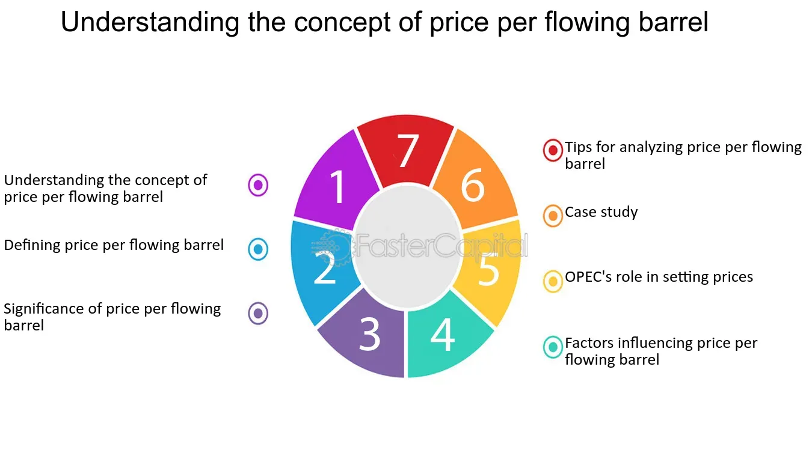

## Table of Contents

## What is the basic definition of Price Per Flowing Barrel (PPFB)?

Price Per Flowing Barrel (PPFB) is a way to measure how much it costs to produce oil from a well. It helps oil companies understand the cost of keeping a well running and producing oil. To find the PPFB, you take the total costs of operating the well and divide it by the number of barrels of oil the well produces each day.

This measure is important because it helps companies decide if a well is worth keeping open. If the PPFB is low, it means the well is cheap to operate and likely profitable. But if the PPFB is high, the well might be too expensive to keep running, and the company might choose to close it. This helps oil companies manage their resources better and make smarter decisions about their operations.

## How is Price Per Flowing Barrel calculated?

To calculate the Price Per Flowing Barrel (PPFB), you need to know two main things: the total operating costs of the well and the number of barrels of oil the well produces each day. The total operating costs include expenses like labor, maintenance, and any other costs needed to keep the well running. The number of barrels produced each day is simply how much oil the well is pumping out daily.

Once you have these numbers, you divide the total operating costs by the number of barrels produced each day. For example, if the total operating costs are $10,000 per day and the well produces 1,000 barrels of oil each day, the PPFB would be $10,000 divided by 1,000, which equals $10 per barrel. This calculation helps oil companies understand how much it costs to produce each barrel of oil and make decisions about whether to keep the well operating or not.

## Why is Price Per Flowing Barrel important in the oil and gas industry?

Price Per Flowing Barrel (PPFB) is important in the oil and gas industry because it helps companies figure out if it's worth keeping a well open. By knowing how much it costs to produce each barrel of oil, companies can decide if the well is making them money or losing it. If the PPFB is low, it means the well is cheap to run and probably making a profit. But if the PPFB is high, the well might be too expensive to keep going, and the company might choose to shut it down.

This measure also helps companies compare different wells and make smart choices about where to spend their money. For example, if one well has a much lower PPFB than another, the company might decide to focus more resources on the cheaper well. This way, they can use their money more efficiently and increase their overall profits. Understanding PPFB helps oil and gas companies manage their operations better and make decisions that keep their business running smoothly.

## Can you explain the difference between Price Per Flowing Barrel and other pricing metrics in the oil industry?

Price Per Flowing Barrel (PPFB) is a specific measure used to understand how much it costs to produce oil from a well. It takes the total daily operating costs of a well and divides it by the number of barrels of oil the well produces each day. This helps companies see if a well is worth keeping open because it shows how much money they're spending to get each barrel of oil out of the ground.

Other pricing metrics in the oil industry might look at different things. For example, the "Breakeven Price" is the price per barrel of oil that a company needs to cover all its costs, including operating costs and the costs of finding and setting up the well. Another metric is the "Finding and Development Costs" which looks at how much it costs to find new oil and get it ready to be pumped out. These metrics give a broader view of the costs involved in the oil business, not just the day-to-day costs of keeping a well running like PPFB does.

In simple terms, PPFB focuses on the ongoing costs of a specific well, while other metrics like Breakeven Price and Finding and Development Costs consider a wider range of expenses over the life of an oil project. This makes PPFB a useful tool for day-to-day management of existing wells, while the other metrics help with bigger decisions like whether to start new projects or if oil prices are high enough to make money.

## What factors influence the Price Per Flowing Barrel?

The Price Per Flowing Barrel (PPFB) is influenced by several factors. One big [factor](/wiki/factor-investing) is the operating costs of the well, which includes things like the cost of labor, equipment maintenance, and other expenses needed to keep the well running. If these costs go up, the PPFB will also go up because it costs more to produce each barrel of oil. Another factor is how much oil the well produces each day. If the well starts producing less oil, the PPFB will go up because the same costs are spread over fewer barrels.

Other factors that can affect PPFB include the age of the well and the technology used. Older wells might need more maintenance, which can increase operating costs and raise the PPFB. Newer technology can sometimes help lower costs by making wells more efficient, which can bring the PPFB down. The location of the well can also play a role, as wells in hard-to-reach places might cost more to operate, leading to a higher PPFB. All these factors together determine how much it costs to produce each barrel of oil from a well.

## How does Price Per Flowing Barrel affect investment decisions in the oil sector?

Price Per Flowing Barrel (PPFB) plays a big role in helping oil companies decide where to put their money. When a company looks at the PPFB of different wells, they can see which ones are cheaper to run. If a well has a low PPFB, it means it's not costing much to get each barrel of oil out of the ground. This makes the well a good place to invest more money because it's likely to make a profit. On the other hand, if a well has a high PPFB, it might not be worth putting more money into it because it's too expensive to keep running.

These decisions are important because they help companies use their money wisely. By focusing on wells with a lower PPFB, a company can make more money overall. It's like choosing to buy things that are on sale instead of things that are too expensive. This way, the company can keep its costs down and make sure it's getting the most out of its investments. Understanding PPFB helps oil companies make smart choices about where to spend their money and how to keep their business running smoothly.

## What are some common applications of Price Per Flowing Barrel in financial analysis?

Price Per Flowing Barrel (PPFB) is often used in financial analysis to help oil companies figure out how profitable their wells are. By calculating the PPFB, analysts can see how much it costs to produce each barrel of oil from a well. This information is important because it helps companies decide if a well is making them money or if it's too expensive to keep running. If the PPFB is low, it means the well is cheap to operate and likely to be profitable. On the other hand, if the PPFB is high, the well might not be worth keeping open because it costs too much to get the oil out.

Financial analysts also use PPFB to compare different wells and make investment decisions. If one well has a much lower PPFB than another, the company might choose to invest more money in the cheaper well. This helps the company use its resources more efficiently and increase its overall profits. By focusing on wells with a lower PPFB, the company can manage its costs better and make sure it's getting the most out of its investments. Understanding PPFB helps companies make smart choices about where to spend their money and how to keep their business running smoothly.

## How has the Price Per Flowing Barrel metric evolved over time?

The Price Per Flowing Barrel (PPFB) metric has changed a lot over time as the oil industry has grown and new technology has come along. In the past, when oil companies started using PPFB, it was a simple way to see how much it cost to keep a well running each day. They would look at things like the cost of workers, fixing equipment, and other daily expenses, then divide that by how many barrels of oil the well was making each day. This helped them decide if a well was worth keeping open or if it was too expensive to run.

As time went on and technology got better, companies started using more advanced tools to measure and lower their PPFB. They used new machines and computers to make wells more efficient and cut down on costs. This meant they could make more oil for less money, which made the PPFB go down. Also, as the oil industry learned more about how to run wells better, they started using PPFB not just to look at one well at a time, but to compare lots of wells and make big decisions about where to spend their money. This helped them manage their business better and make smarter choices about their investments.

## What are the limitations or criticisms of using Price Per Flowing Barrel as a metric?

One big problem with using Price Per Flowing Barrel (PPFB) is that it only looks at the day-to-day costs of running a well. It doesn't include other important costs like finding the oil in the first place or setting up the well. These costs can be huge, and if a company only looks at PPFB, they might think a well is doing great when really, it's not making enough money to cover all the costs. Also, PPFB can change a lot from day to day because of things like oil prices going up and down or unexpected problems with the well. This can make it hard to use PPFB to plan for the future because it's always changing.

Another criticism is that PPFB doesn't tell the whole story about how good a well is. For example, a well with a low PPFB might not be the best choice if it's going to run out of oil soon. Companies need to think about how long a well will keep producing oil, not just how cheap it is to run right now. Also, PPFB can be different for wells in different places, so comparing wells from different areas might not be fair. If one well is in a hard-to-reach place, it might have a higher PPFB, but that doesn't mean it's a bad well. It just means it costs more to run because of where it is.

## Can you discuss a case study where Price Per Flowing Barrel was a key factor in decision-making?

In the early 2000s, a major oil company, let's call it BigOil, was facing a tough decision about whether to keep a well in Texas running or to shut it down. The well had been producing oil for a long time, but the costs to keep it going were getting higher. BigOil used the Price Per Flowing Barrel (PPFB) to help them decide. They found out that the PPFB for this well was $12, which was higher than the average for their other wells. This meant it was costing more to get each barrel of oil out of the ground from this well compared to others. Because the PPFB was so high, BigOil decided it wasn't worth keeping the well open anymore and chose to close it down. This saved them money and let them focus on wells that were cheaper to run.

After shutting down the well in Texas, BigOil looked at their other wells to see where they should invest more money. They used PPFB again to compare different wells and found one in Oklahoma with a PPFB of just $8. This was much lower than the Texas well, meaning it was cheaper to produce each barrel of oil. BigOil decided to put more money into this well, knowing it would likely make more profit. By using PPFB, BigOil was able to make smart choices about where to spend their money. They closed down expensive wells and focused on cheaper ones, which helped them manage their business better and make more money in the long run.

## How do fluctuations in Price Per Flowing Barrel impact the broader energy market?

Fluctuations in the Price Per Flowing Barrel (PPFB) can have a big effect on the whole energy market. When the PPFB goes up, it means it's costing oil companies more money to get each barrel of oil out of the ground. This can make them think twice about keeping wells open or starting new ones. If a lot of companies decide to close wells because the PPFB is too high, there might be less oil on the market. When there's less oil, the price of oil can go up because people still need it but there's not as much to go around. This can make gas prices go up too, which affects everyone who drives a car or uses oil for other things.

On the other hand, when the PPFB goes down, it's good news for oil companies. It means they can make oil cheaper, so they might decide to keep more wells open or start new projects. This can lead to more oil being available on the market. When there's more oil, the price of oil might go down because there's plenty to go around. Lower oil prices can make gas cheaper, which is good for people who need to fill up their cars. So, changes in the PPFB can shake up the energy market by changing how much oil is available and what it costs.

## What advanced analytical methods can be used to forecast changes in Price Per Flowing Barrel?

To forecast changes in Price Per Flowing Barrel (PPFB), oil companies can use advanced analytical methods like [machine learning](/wiki/machine-learning) and predictive analytics. These methods look at a lot of data from the past, like how much it cost to run wells before and how much oil they produced. They also look at things that might change in the future, like new technology that could make wells cheaper to run or changes in oil prices. By using this data, machine learning can find patterns and make guesses about what the PPFB might be in the future. This helps companies plan better and make smart choices about their wells.

Another way to forecast PPFB is by using simulation models. These models create a pretend world where you can change things like the cost of running a well or how much oil it makes. By playing around with these pretend numbers, companies can see how different things might affect the PPFB. For example, they might see what happens if oil prices go up or if they use new technology to make wells more efficient. This helps them understand what could happen to the PPFB and make plans for different situations. Using these advanced methods helps oil companies be ready for changes and manage their business better.

## What are the key metrics to understand for oil investments?

In the oil industry, investment metrics provide crucial insights that aid in the evaluation of companies and projects, offering investors a concrete basis for their decisions. These metrics ensure that stakeholders can assess performance, value, and potential returns accurately. Among the most significant metrics is the Enterprise Value (EV), which offers a holistic view of a company's market valuation.

Enterprise Value (EV) is a comprehensive measure calculated as:

$$

EV = \text{Market Capitalization} + \text{Total Debt} - \text{Cash and Cash Equivalents}
$$

This metric serves as a proxy for the total cost of acquiring a company by including debt, thus providing a more accurate reflection of a firm's value than market capitalization alone. EV is particularly valuable in comparing companies with different capital structures since it encompasses a broader spectrum of financial obligations and resources.

A critical financial ratio that builds upon EV is the EV/EBITDA multiple. This ratio is defined as:

$$

\text{EV/EBITDA} = \frac{\text{Enterprise Value}}{\text{Earnings Before Interest, Taxes, Depreciation, and Amortization}}
$$

The EV/EBITDA ratio is instrumental in oil sector analysis because it measures a company's valuation in relation to its operational profitability, irrespective of its debt or equity structure. This characteristic makes it a favored metric for comparing companies within the oil industry, where debt levels and asset depreciation can vary significantly.

Another essential metric is the Price/Cash Flow Per Share, which assesses a company's valuation based on its cash generation capabilities. It is calculated as:

$$

\text{Price/Cash Flow Per Share} = \frac{\text{Share Price}}{\text{Operating Cash Flow per Share}}
$$

This metric is particularly relevant to oil sector analysis due to its focus on the actual cash a company generates, discounting non-cash expenses like depreciation. For oil companies, which often experience significant fluctuations in reported earnings due to volatile commodity prices, this metric provides a more stable and reliable indicator of financial health. It allows investors to gauge how well a company can maintain its operations and fund future growth, independent of accounting measures that might obfuscate underlying cash performance.

These investment metrics collectively form a robust framework for evaluating oil companies, providing insights into value, efficiency, and cash-generating abilities. They enable investors to navigate the complexities of the oil market, ensuring informed investment decisions that align with long-term financial objectives.

## What is the Price Per Flowing Barrel and why is it a key valuation metric?

The Price Per Flowing Barrel (PPFB) is a critical valuation metric in the oil industry that helps investors and analysts determine the value of an oil company based on its production capabilities. This metric provides a straightforward valuation approach by linking the company's market valuation directly to its oil or gas production levels.

To define, the Price Per Flowing Barrel is calculated as the company's Enterprise Value (EV) divided by its daily oil production, measured in barrels per day (bpd). The formula is as follows:

$$
\text{PPFB} = \frac{\text{Enterprise Value (EV)}}{\text{Daily Production in Barrels (bpd)}}
$$

Where:
- **Enterprise Value (EV)** combines the market capitalization of the company, its debt, and subtracts cash, thus reflecting the total market value of the company.
- **Daily Production** refers to the average daily output of oil barrels.

For example, consider an oil company with an enterprise value of $5 billion and a daily production of 100,000 barrels. The Price Per Flowing Barrel would be:

$$
\text{PPFB} = \frac{5,000,000,000}{100,000} = \$50,000
$$

This means that the market currently values each barrel that the company produces daily at $50,000.

The PPFB metric is often compared to other valuation metrics like Enterprise Value per Barrel of Oil Equivalent per Day (EV/BOE/D). While PPFB focuses solely on oil production, EV/BOE/D takes into account all hydrocarbon production (including natural gas and other related substances), standardizing them to a common oil equivalent basis. This broader metric enables a more comprehensive comparison, especially for integrated companies dealing with diverse energy products.

Despite its narrower focus, PPFB is crucial for analyzing the financial health of pure oil-producing companies. It highlights the market's perception of a company's operational efficiency in extracting and delivering oil. A lower PPFB could indicate undervaluation or potential operational challenges, while a higher PPFB suggests robust production capabilities and perceived higher profitability.

However, investors should use PPFB in conjunction with other metrics to obtain a more nuanced understanding. Sole reliance on PPFB might overlook aspects like political risks, environmental considerations, and operational costs, which significantly affect production capabilities and overall valuation. The metric serves as a valuable tool, providing insights through its simplicity and directness in linking production with valuation, essential for strategic decision-making in oil investments.

## What are some real-world case studies?

Successful oil companies and projects have often utilized the Price Per Flowing Barrel (PPFB) metric to make informed investment and operational decisions. This metric provides valuable insight into the efficiency and profitability of oil extraction operations, enabling companies to strategically allocate capital and optimize production processes. Here, we analyze several case studies to illustrate the practical application of the PPFB metric and its integration with [algorithmic trading](/wiki/algorithmic-trading) strategies in the oil markets.

### Examination of Successful Oil Companies

1. **ExxonMobil**: ExxonMobil, a global leader in the oil and gas industry, effectively employs the PPFB metric to assess the financial viability of its projects. By calculating PPFB, ExxonMobil can determine which assets offer the most favorable return on investment. For instance, in its offshore drilling operations, ExxonMobil analyzes the cost per barrel produced to prioritize investments in fields with lower PPFB, thereby maximizing profitability.

   The formula for PPFB is as follows:
$$
   \text{PPFB} = \frac{\text{Market Capitalization} + \text{Debt} - \text{Cash}}{\text{Barrels of Oil Produced Daily}}

$$

2. **Chevron**: Chevron Corporation uses the PPFB metric to compare its performance against competitors. By maintaining a PPFB lower than the industry average, Chevron ensures that it remains competitive and attractive to investors. Chevron strategically invests in technology and infrastructure to enhance productivity and reduce per-barrel costs, ensuring a sustained low PPFB and long-term competitive advantage.

### Impact of Algorithmic Trading in Oil Markets

Algorithmic trading has transformed oil market dynamics, providing enhanced efficiency and the ability to swiftly react to market changes. Two noteworthy examples illustrate the impact of algorithmic trading in oil markets:

1. **Virtu Financial**: Virtu Financial, known for its high-frequency trading strategies, leverages algorithms to capitalize on minute price fluctuations in oil futures markets. By using real-time data and advanced algorithms, Virtu can execute trades at lightning speed, reducing transaction costs and increasing profitability. The integration of PPFB metrics into these algorithms allows Virtu to incorporate fundamental data, refining their trading strategies further.

2. **AlgoTrader**: This Swiss-based company specializes in algorithmic trading software for various financial markets, including oil. The platform enables traders to design, test, and deploy custom trading algorithms that incorporate PPFB analysis. By using PPFB as an indicator, AlgoTrader's clients can identify undervalued stocks or future contracts, improving trading decisions and potentially achieving higher returns.

### Analysis of Companies with Differing Metrics

Different oil companies prioritize varying metrics based on their strategic goals and market positions, impacting their investment and trading outcomes:

- **BP vs. TotalEnergies**: BP and TotalEnergies, both major players in the oil industry, display contrasting approaches to valuing their assets. BP prioritizes a combination of PPFB and Environmental, Social, and Governance (ESG) criteria, reflecting its commitment to sustainable practices. Conversely, TotalEnergies focuses on maintaining a consistent PPFB to emphasize profitability. These strategic differences result in varying investor perceptions and market valuations.

- **Shell**: Shell's strategic focus on integrating advanced data analytics with PPFB and other financial ratios provides a comprehensive view of its asset portfolio. This holistic approach allows Shell to deploy capital more efficiently, reflecting positively on its share price performance compared to competitors with a sole focus on traditional metrics.

By adopting algorithmic trading strategies informed by investment metrics such as PPFB, oil companies can achieve a more refined approach to investment and trading decisions. The integration of these methodologies holds significant potential for optimizing returns and sustaining competitive advantage in the volatile oil market landscape.

## References & Further Reading

[1]: Damodaran, A. (2012). ["Investment Valuation: Tools and Techniques for Determining the Value of Any Asset."](https://books.google.com/books/about/Investment_Valuation.html?id=5SRHAAAAQBAJ) John Wiley & Sons.

[2]: Geman, H. (2005). ["Commodities and Commodity Derivatives: Modeling and Pricing for Agriculturals, Metals and Energy."](https://download.e-bookshelf.de/download/0000/5675/90/L-G-0000567590-0015270354.pdf) John Wiley & Sons.

[3]: Lopez de Prado, M. (2018). ["Advances in Financial Machine Learning."](https://www.amazon.com/Advances-Financial-Machine-Learning-Marcos/dp/1119482089) Wiley.

[4]: Jansen, S. (2020). ["Machine Learning for Algorithmic Trading: Predictive models to extract signals from market and alternative data for systematic trading strategies with Python."](https://github.com/stefan-jansen/machine-learning-for-trading) Packt Publishing.

[5]: Chan, E. P. (2013). ["Algorithmic Trading: Winning Strategies and Their Rationale."](https://github.com/ftvision/quant_trading_echan_book) Wiley Trading.