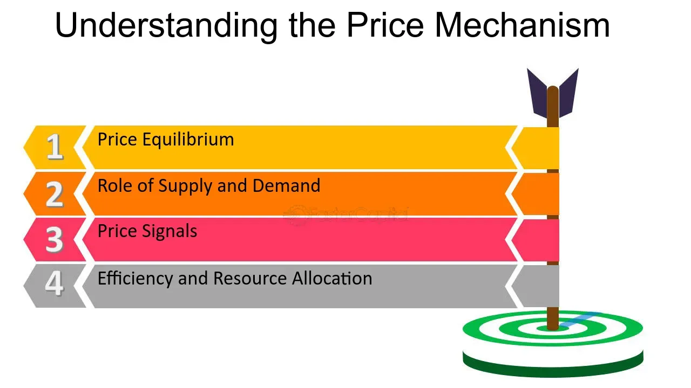

## Table of Contents

## What is price persistence?

Price persistence refers to how long a price change lasts in the market. When a product's price goes up or down, price persistence shows if that new price stays the same for a long time or if it changes back quickly. It is important for businesses and economists because it helps them understand how prices behave over time and how they affect the economy.

For example, if a store raises the price of a popular toy and the price stays high for months, that shows high price persistence. But if the price goes back to normal after a short time, it shows low price persistence. Understanding price persistence helps companies decide how to set prices and helps economists predict inflation and other economic trends.

## Why is price persistence important in economics?

Price persistence is important in economics because it helps us understand how prices change over time and what those changes mean for the economy. When prices change, economists want to know if the new prices will stick around for a long time or if they will go back to normal soon. This information is crucial because it affects how businesses set their prices and how people spend their money. If prices are very persistent, it might mean that inflation, which is when prices keep going up, will be a bigger problem. On the other hand, if prices are not very persistent, it might be easier to control inflation.

Understanding price persistence also helps economists make better predictions about the economy. For example, if prices are very persistent, it might take longer for the economy to recover from a shock, like a sudden increase in oil prices. This can influence decisions made by governments and central banks about things like interest rates and economic policies. By knowing how persistent prices are, policymakers can make more informed choices to help keep the economy stable and growing.

## How does price persistence affect inflation?

Price persistence can make inflation worse. When prices go up and stay up for a long time, it means that inflation is more likely to keep going up too. If a store raises the price of something and the new price sticks around, other stores might do the same thing. This can make the overall level of prices in the economy go up and up, which is what we call inflation.

On the other hand, if prices don't stay high for very long, it can help keep inflation under control. When prices go back to normal quickly, it means that the economy can adjust better to changes. This makes it easier for the government and the central bank to manage inflation and keep prices stable. So, understanding how persistent prices are is really important for dealing with inflation.

## What are the main factors contributing to price persistence?

One main factor that contributes to price persistence is how people expect prices to behave. If people think that prices will keep going up, they might accept higher prices without complaining too much. This can make businesses feel okay about keeping their prices high, which makes price persistence stronger. On the other hand, if people expect prices to go back to normal soon, they might push back against high prices, which can make businesses lower their prices again.

Another factor is how much competition there is in the market. In a market with lots of competition, businesses might not be able to keep their prices high for very long because other businesses will offer lower prices to attract customers. But in a market with less competition, businesses can keep their prices high without worrying about losing too many customers, which leads to higher price persistence.

Lastly, the overall state of the economy can affect price persistence too. When the economy is doing well and people have more money to spend, businesses might find it easier to keep their prices high. But if the economy is struggling and people are careful with their money, businesses might need to lower their prices to keep selling their products, which can reduce price persistence.

## Can you explain the mechanism behind price persistence?

Price persistence happens because of how people think and act in the market. When a business changes the price of something, people's reactions can make that new price stick around. If people think prices will keep going up, they might not mind paying more now. This makes businesses feel okay about keeping their prices high because they know people will still buy their products. On the other hand, if people expect prices to go back to normal soon, they might complain or stop buying until prices drop, which can make businesses lower their prices again.

Another part of price persistence is how much competition there is in the market. If there are lots of businesses selling the same thing, they might have to lower their prices to keep customers. This means price changes don't last long because other businesses will offer lower prices to attract people. But if there aren't many businesses competing, a business can keep its prices high without losing too many customers, making price persistence stronger. 

The overall health of the economy also plays a role. When the economy is doing well and people have more money, businesses can keep their prices high because people are willing to pay. But if the economy is not doing well, people might not have as much money to spend, so businesses might need to lower their prices to keep selling their products. This can make price persistence weaker because prices don't stay high for very long.

## How do economists measure price persistence?

Economists measure price persistence by looking at how long price changes last over time. They use data on prices from different products and services to see if a price change sticks around or goes back to normal quickly. One common way to do this is by using something called the "autocorrelation" of price changes. This means they check if a price change today is related to price changes in the past. If there's a strong connection, it means prices are persistent. If not, prices might go back to normal quickly.

Another way economists measure price persistence is by looking at how long it takes for prices to go back to their old levels after a change. They might use a "half-life" measure, which tells them how long it takes for half of a price change to disappear. If the half-life is long, it means prices are very persistent. If it's short, prices don't stay changed for very long. By using these methods, economists can understand how prices behave and make better predictions about the economy.

## What are some common models used to analyze price persistence?

Economists use different models to understand how long prices stay changed. One common model is the autoregressive (AR) model. This model looks at how today's prices are related to prices from the past. If today's prices are strongly connected to past prices, it means prices are persistent. The AR model helps economists see patterns in price changes over time and predict if a price change will last.

Another model is the vector autoregression (VAR) model. This model is a bit more complicated because it looks at how many different things, like prices, interest rates, and income, affect each other over time. By studying these relationships, economists can understand how changes in one part of the economy, like a price increase, might affect other parts, like how much people spend. This helps them see if a price change will stick around or go away quickly.

A third model is the Phillips curve model, which looks at the relationship between inflation and unemployment. This model helps economists understand how changes in the economy, like unemployment rates, can affect how long prices stay changed. If unemployment is low, prices might be more persistent because people have more money to spend. By using these models, economists can make better guesses about how prices will behave in the future.

## How does price persistence vary across different sectors of the economy?

Price persistence can be different in different parts of the economy. In some sectors, like technology, prices might not stay high for very long. This is because new gadgets and software come out all the time, and companies have to lower their prices to stay competitive. On the other hand, in sectors like healthcare, prices might be more persistent. Medicines and treatments can be very expensive, and people need them no matter what, so companies might not lower their prices quickly.

In the food and beverage sector, price persistence can also vary. For example, if the price of coffee goes up because of a bad harvest, it might stay high for a while because it takes time for new coffee to be grown. But if a new type of snack comes out and the price is high, it might not stay that way for long if people don't like it or if other snacks are cheaper. So, understanding how prices behave in different sectors helps businesses and economists make better decisions.

## What role do expectations play in price persistence?

Expectations are a big deal when it comes to how long prices stay the same after they change. If people think prices will keep going up, they might be okay with paying more right now. This makes businesses feel good about keeping their prices high because they know people will still buy their stuff. On the other hand, if people expect prices to go back to normal soon, they might complain or stop buying until prices drop. This can make businesses lower their prices again because they don't want to lose customers.

The way people expect prices to behave can really change how the economy works. If everyone thinks prices will stay high, it can make inflation worse because businesses will keep their prices up, and other businesses might do the same. But if people think prices will go back to normal quickly, it can help keep inflation under control. This is because businesses will be more likely to lower their prices if they know people are waiting for them to do so. So, what people think about prices can make a big difference in how long a price change lasts.

## How can monetary policy influence price persistence?

Monetary policy, which is what the central bank does to control the money supply and interest rates, can change how long prices stay the same after they change. If the central bank raises interest rates, it can make borrowing money more expensive. This can slow down the economy because people and businesses might spend less money. When people spend less, businesses might have to lower their prices to keep selling their stuff, which can make price changes not last very long. On the other hand, if the central bank lowers interest rates, it can make borrowing cheaper and encourage people to spend more. This can help prices stay high for a longer time because businesses might not need to lower their prices as much.

The central bank can also use other tools, like buying or selling government bonds, to influence how much money is in the economy. If the central bank buys bonds, it puts more money into the economy, which can make prices go up and stay up for a while. But if the central bank sells bonds, it takes money out of the economy, which can make prices go down or not stay high for very long. By using these tools, the central bank can help control how persistent prices are and keep the economy stable.

## What are the implications of high price persistence for economic policy?

High price persistence means that when prices go up, they stay up for a long time. This can be a big problem for people who make economic policy. If prices keep staying high, it can make inflation worse. Inflation is when prices keep going up, and it can make life harder for everyone because things cost more money. When prices are very persistent, it can be harder for the government and the central bank to control inflation. They might need to raise interest rates a lot to slow down the economy and make prices go down, but this can also make it harder for people to borrow money and spend.

Because of this, policymakers need to be very careful when prices are very persistent. They might need to use different tools to try to keep prices from staying high for too long. For example, they might need to change how much money is in the economy or make rules to stop businesses from keeping their prices too high. By understanding how persistent prices are, policymakers can make better choices to help keep the economy stable and make sure that prices don't keep going up and up.

## Can you provide a real-world example of price persistence in action?

A good example of price persistence happened in the oil market a few years ago. When there was a big problem in oil-producing countries, like wars or natural disasters, the price of oil would go up a lot. Because oil is so important for everything, from driving cars to making plastic, people had to keep buying it even when the price was high. This meant that the high prices stuck around for a long time, sometimes even for years. Businesses and people got used to paying more for oil, and this made the high prices last even longer.

Another example is with housing prices in some big cities. When a lot of people want to live in a city, the demand for houses goes up, and so do the prices. In places like San Francisco or New York, even when the economy slowed down a bit, housing prices didn't drop much. People still wanted to live there, so they were willing to pay high prices. This made the high housing prices very persistent, and they stayed high for a long time. It shows how, when people expect prices to stay high and there's a lot of demand, prices can be very persistent.

## What is the Concept of Price Persistence?

Price persistence refers to the tendency of asset prices to continue moving in the same direction for a certain period due to various underlying factors. This phenomenon is particularly significant as it often provides valuable insights into market trends and can serve as an early indicator of potential price movements. Understanding price persistence is crucial for traders and investors aiming to capitalize on or hedge against future price changes.

At its core, price persistence is driven by behavioral and structural factors in financial markets. Behavioral factors include the herd behavior of investors, where widespread sentiment or belief in a trend leads to [momentum](/wiki/momentum). Structural factors involve elements like market [liquidity](/wiki/liquidity-risk-premium), transaction costs, and delays in information dissemination, which can affect how rapidly prices adjust to new information.

### Mechanics of Price Persistence

The mechanics of price persistence can vary across different trading instruments. In equity markets, for instance, price persistence might manifest through continued buying or selling pressure, often fueled by news events or macroeconomic data releases. In the foreign exchange market, currency pairs may exhibit persistence when central banks announce monetary policy decisions that align with market expectations.

In mathematical terms, price persistence can often be modeled using time-series analysis. One common approach is to use an autoregressive model, expressed in its simplest form as:

$$
P_t = \alpha + \beta P_{t-1} + \epsilon_t
$$

where $P_t$ is the current price, $P_{t-1}$ is the previous price, $\alpha$ is a constant, $\beta$ represents the degree of persistence, and $\epsilon_t$ is a random error term. A high value of $\beta$ indicates significant persistence, showing that past prices are strong predictors of current prices.

In Python, such a model can be constructed using the statsmodels library:

```python
import statsmodels.api as sm

# Assume `prices` is a Pandas series of the historical prices
model = sm.tsa.AR(prices)
result = model.fit()

# Summary of the model provides information on price persistence
print(result.summary())
```

### Importance for Potential Market Movement

Price persistence provides valuable signals for potential market movement. By analyzing historical price trends and the current persistence level, traders can predict future price changes. For instance, in bullish markets, a high degree of persistence may suggest continued upward momentum, while in bearish markets, it may indicate ongoing downward pressure.

Furthermore, price persistence helps identify potential reversals when there is a declining pattern of persistence. A decrease in persistence, combined with other technical indicators, might signal an upcoming trend reversal. Hence, traders often incorporate price persistence analysis into their broader trend analysis strategies to enhance their decision-making process.

Understanding the nuances of price persistence is essential for navigating the complexities of modern financial markets. By recognizing persisting trends and potential reversals, informed traders can better manage risk and execute profitable trading strategies.

## References & Further Reading

[1]: Bergstra, J., Bardenet, R., Bengio, Y., & Kégl, B. (2011). ["Algorithms for Hyper-Parameter Optimization."](https://dl.acm.org/doi/10.5555/2986459.2986743) Advances in Neural Information Processing Systems 24.

[2]: ["Advances in Financial Machine Learning"](https://www.amazon.com/Advances-Financial-Machine-Learning-Marcos/dp/1119482089) by Marcos Lopez de Prado

[3]: ["Evidence-Based Technical Analysis: Applying the Scientific Method and Statistical Inference to Trading Signals"](https://www.amazon.com/Evidence-Based-Technical-Analysis-Scientific-Statistical/dp/0470008741) by David Aronson

[4]: ["Machine Learning for Algorithmic Trading"](https://github.com/stefan-jansen/machine-learning-for-trading) by Stefan Jansen

[5]: ["Quantitative Trading: How to Build Your Own Algorithmic Trading Business"](https://www.amazon.com/Quantitative-Trading-Build-Algorithmic-Business/dp/1119800064) by Ernest P. Chan